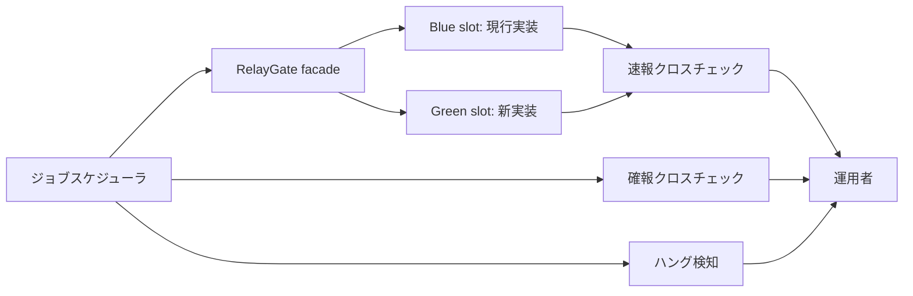

# RelayGate

既存実装(blue)と新実装(green)を、ジョブスケジューラの同じジョブ定義から並行稼働させ、クロスチェックで検証しながら段階的に切り替えるためのストラングラーファサード型実行基盤。

[](LICENSE)

[English README](README.md)

> **ステータス**: 仕様策定フェーズ完了(要件 → NFR → アーキテクチャ → インフラ → デザイン → 仕様)。実装は未着手です。

## 概要

バッチシステムの新実装への移行は、「新実装が現行と同じ振る舞いをする」ことを証明できないままでは切り替えられません。RelayGate は、ジョブスケジューラには従来どおり 1 つのジョブ定義を呼ばせたまま、feature flag 付きファサードが現行(blue)と新(green)の両実装を並行起動します。スケジューラへは foreground 側の結果だけを返し、ジョブ単位の速報クロスチェックと日次全量の確報クロスチェックが両系の出力を比較することで、運用者は根拠を持って切り替えを判断できます。

エアーギャップ環境のオンプレミス Linux を対象とし、シェルスクリプト・SSH・RDB(ジョブキュー兼管理DB)だけで構成します。インターネット接続やクラウドサービスは不要です。

## 特徴

- **設定だけで切り替え** — 並行稼働と単独本番を feature flag(`BLUE_MODE` / `GREEN_MODE`)の変更だけで切り替えられ、ジョブ定義は変更不要
- **スケジューラ契約の維持** — foreground slot の stdout・stderr・終了コードをそのままジョブスケジューラへ中継
- **二段階の検証** — 原因調査用のジョブ単位速報クロスチェックと、リリース判断の正本となる日次全量確報クロスチェック
- **副作用のないハング検知** — 定期検知がbackground実行の異常を通知するだけで、自動中止・自動リランは一切しない
- **追跡可能なリラン** — リランは元の `execution-spec.json` を正本として再現し、`run_id` → `parent_run_id` の連鎖で実行系譜を追跡できる

## アーキテクチャ



facade は feature flag で slot を選択し、foreground の結果だけを中継します。クロスチェック worker は RDB のジョブキューを lease / claim の排他制御で poll します。全体モデル(C1〜C4・データモデル・状態遷移)は `docs/README.md` を参照してください。

## Getting Started

ランタイムは未実装です。現時点では、仕様一式と運用者向け UI カタログを確認できます:

```bash
git clone https://github.com/suwa-sh/relay-gate.git
cd relay-gate/docs/design/latest/storybook-app
npm install
npm run storybook   # CLI 出力デザインカタログ(23 ユースケース画面)を表示
```

仕様は [`docs/README.md`](docs/README.md) から読み始めてください。

## ドキュメント

| ドキュメント | 要約 |
|---|---|
| [`docs/README.md`](docs/README.md) | 全仕様成果物(USDM / RDRA / NFR / アーキテクチャ / インフラ / デザイン / 仕様)の自動生成ナビゲーション |
| [`docs/specs/latest/`](docs/specs/latest/) | 実装の正本: 23 ユースケース仕様、CLI コマンド契約(24 コマンド)、RDB スキーマ |
| [`docs/todo.md`](docs/todo.md) | 保留判断の記録(保守的な既定値で確定済み。実運用値の判明時に見直し) |
| [Issues](https://github.com/suwa-sh/relay-gate/issues) | ヘルプ・問い合わせ |
| [`CONTRIBUTING.md`](CONTRIBUTING.md) | コントリビュート方法 |
