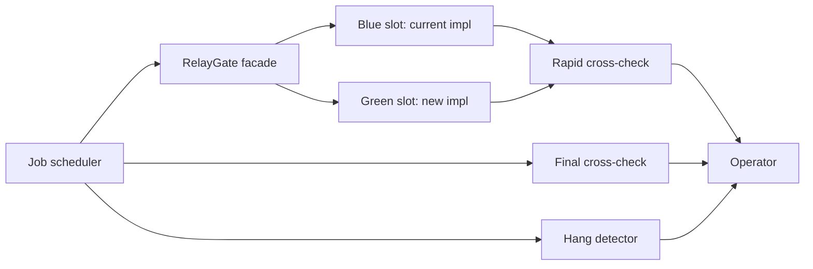

# RelayGate

A strangler-facade execution gateway for running a legacy (blue) and a new (green) implementation side by side from the same job scheduler definition, with automated cross-checking.

[](LICENSE)

[日本語 README](README.ja.md) — Internal documentation (`docs/`, code comments) is written in Japanese.

> **Status**: Specification phase complete (requirements → NFR → architecture → infrastructure → design → specs). Implementation has not started yet.

## Overview

Migrating a batch system to a new implementation is risky when you cannot prove the new one behaves identically. RelayGate lets a job scheduler keep calling one job definition, while a feature-flagged facade launches both the current (blue) and the new (green) implementation in parallel. Only the foreground result is returned to the scheduler; per-job rapid cross-checks and daily full-volume final cross-checks compare the outputs of both implementations so that operators can decide the cutover based on evidence.

RelayGate targets air-gapped, on-premises Linux environments. It is built around shell scripts, SSH, and an RDB used as both a job queue and a management database — no internet access or cloud services required.

## Features

- **Config-only cutover** — switch between parallel operation and single production by changing feature flags (`BLUE_MODE` / `GREEN_MODE`), not job definitions
- **Scheduler contract preserved** — stdout, stderr, and exit code of the foreground slot are relayed unchanged to the job scheduler
- **Two-stage verification** — asynchronous per-job rapid cross-checks for investigation, plus daily full-volume final cross-checks as the formal release evidence
- **Hang detection without side effects** — a periodic detector alerts on stuck or failed background runs; it never aborts or reruns anything automatically
- **Traceable reruns** — background reruns reuse the original frozen `execution-spec.json` and chain `run_id` → `parent_run_id` for a full audit trail

## Architecture



The facade selects slots via feature flags and relays only the foreground result. Cross-check workers poll an RDB-backed job queue with lease/claim exclusion. See `docs/README.md` for the full model (C1–C4, data model, state machines).

## Getting Started

The runtime is not implemented yet. What you can do today is explore the full specification set and the operator-facing UI catalog:

```bash
git clone https://github.com/suwa-sh/relay-gate.git
cd relay-gate/docs/design/latest/storybook-app
npm install
npm run storybook   # opens the CLI-output design catalog (23 use-case pages)
```

Start reading the specs at [`docs/README.md`](docs/README.md).

## Documentation

| Document | Summary |
|---|---|
| [`docs/README.md`](docs/README.md) | Auto-generated navigation over all specification artifacts (USDM / RDRA / NFR / architecture / infra / design / specs) |
| [`docs/specs/latest/`](docs/specs/latest/) | The implementation source of truth: 23 use-case specs, CLI command contract (24 commands), RDB schema |
| [`docs/todo.md`](docs/todo.md) | Deferred decisions (adopted conservative defaults; revisit when real operational values are known) |
| [Issues](https://github.com/suwa-sh/relay-gate/issues) | Help and questions |
| [`CONTRIBUTING.md`](CONTRIBUTING.md) | How to contribute |
