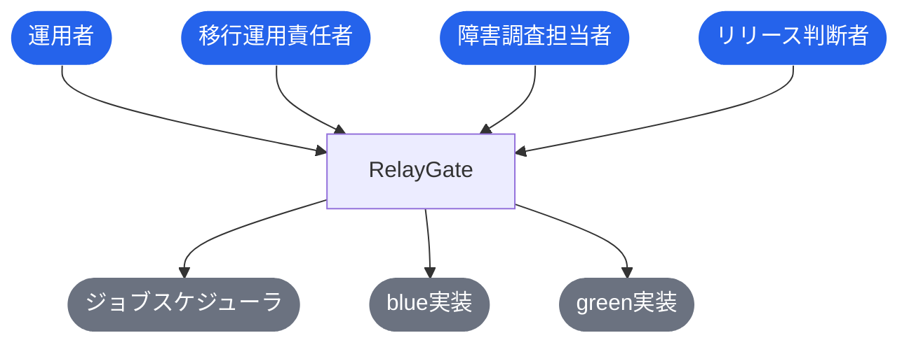
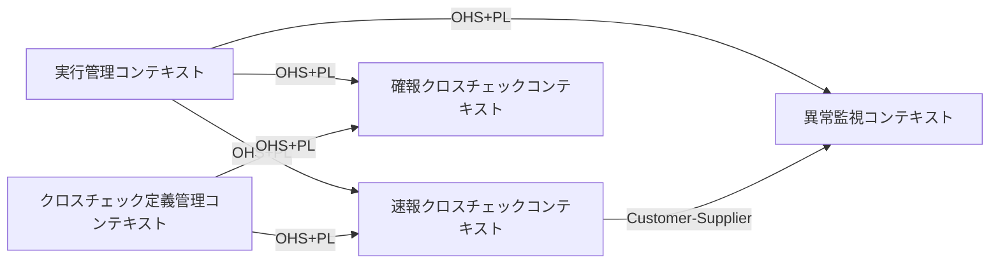
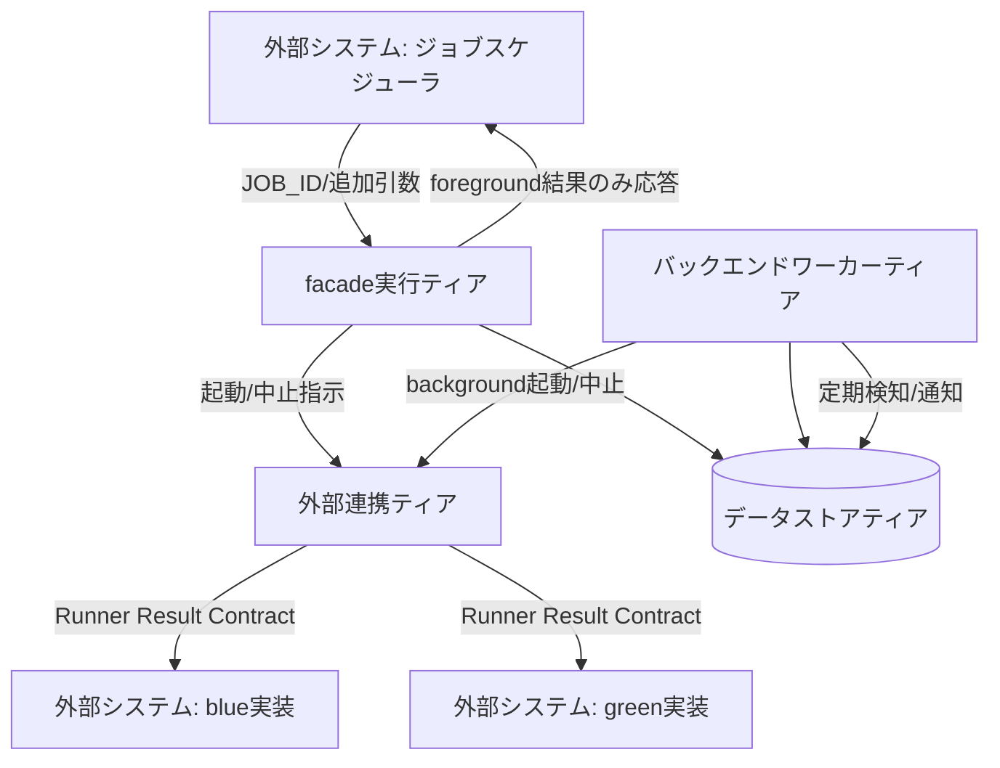
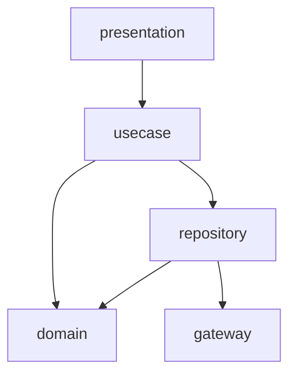

# RelayGate

> undefined

**最終更新**: 2026-08-29 22:01:17 spec stories (design)

## 成果物一覧

| ドメイン | 最新 | イベント数 |
|---------|------|-----------:|
| [USDM（要求分解）](#usdm要求分解) | [usdm/latest/](usdm/latest/) | 4 |
| [RDRA（要件定義）](#rdra要件定義) | [rdra/latest/](rdra/latest/) | 4 |
| [NFR（非機能要求）](#nfr非機能要求) | [nfr/latest/](nfr/latest/) | 4 |
| [Arch（アーキテクチャ）](#archアーキテクチャ) | [arch/latest/](arch/latest/) | 6 |
| [Infra（インフラ設計）](#infraインフラ設計) | [infra/latest/](infra/latest/) | 5 |
| [Design（デザイン）](#designデザイン) | [design/latest/](design/latest/) | 9 |
| [Specs（詳細仕様）](#specs詳細仕様) | [specs/latest/](specs/latest/) | 4 |

## USDM（要求分解）

### 主要な成果物

- [requirements.md](usdm/latest/requirements.md)
- [requirements.yaml](usdm/latest/requirements.yaml)

| 項目 | 値 |
|------|-----|
| 要求数 | 12 |
| 仕様数 | 42 |

## RDRA（要件定義）

### 主要な成果物

- [アクター.tsv](rdra/latest/アクター.tsv)
- [外部システム.tsv](rdra/latest/外部システム.tsv)
- [情報.tsv](rdra/latest/情報.tsv)
- [状態.tsv](rdra/latest/状態.tsv)
- [条件.tsv](rdra/latest/条件.tsv)
- [バリエーション.tsv](rdra/latest/バリエーション.tsv)
- [BUC.tsv](rdra/latest/BUC.tsv)
- [関連データ.txt](rdra/latest/関連データ.txt)
- [ZeroOne.txt](rdra/latest/ZeroOne.txt)
- [システム概要.json](rdra/latest/システム概要.json)
- [views/（人間可読ビュー: Mermaid 図解つき Markdown）](rdra/latest/views/README.md)

| 項目 | 値 |
|------|-----|
| アクター | 4 |
| 外部システム | 3 |
| 情報 | 8 |
| 状態モデル | 3 |
| 条件 | 3 |
| バリエーション | 7 |
| 業務 | 4 |
| BUC | 9 |
| UC | 23 |

### 外部ツール連携

| ツール | データファイル | 手順 |
|--------|-------------|------|
| [RDRA Graph](https://vsa.co.jp/rdratool/graph/v0.94/) | [関連データ.txt](rdra/latest/関連データ.txt) | ファイル内容をコピーし、RDRA Graph に貼り付け |
| [RDRA Sheet](https://docs.google.com/spreadsheets/d/1h7J70l6DyXcuG0FKYqIpXXfdvsaqjdVFwc6jQXSh9fM/) | [ZeroOne.txt](rdra/latest/ZeroOne.txt) | ファイル内容をコピーし、テンプレートに貼り付け |

### システムコンテキスト図



## NFR（非機能要求）

### 主要な成果物

- [nfr-grade.md](nfr/latest/nfr-grade.md)
- [nfr-grade.yaml](nfr/latest/nfr-grade.yaml)

| 項目 | 値 |
|------|-----|
| モデルシステム | model2 |
| カテゴリ | 6 |
| 重要項目 | 66 |

## Arch（アーキテクチャ）

### 主要な成果物

- [arch-design.md](arch/latest/arch-design.md)
- [arch-design.yaml](arch/latest/arch-design.yaml)
- [coverage-report.md](arch/latest/coverage-report.md)

| 項目 | 値 |
|------|-----|
| 言語 | Shell Script (POSIX/bash), SQL |
| サブドメイン | 4 |
| Bounded Context | 5 |
| コンテキストマップ関係 | 6 |
| ティア | 4 |
| ポリシー | 12 |
| ルール | 6 |
| エンティティ | 8 |

### ドメインアーキテクチャ（コンテキストマップ）



### コンテナ図（システム構成）



### コンポーネント図（レイヤー依存）

**tier-facade**



**tier-worker**


## Infra（インフラ設計）

### 主要な成果物

- [_changes.md](infra/latest/_changes.md)
- [_inference.md](infra/latest/_inference.md)
- [infra-event.md](infra/latest/infra-event.md)
- [infra-event.yaml](infra/latest/infra-event.yaml)
- [product-input.yaml](infra/latest/product-input.yaml)

## Design（デザイン）

### 主要な成果物

- [design-event.md](design/latest/design-event.md)
- [design-event.yaml](design/latest/design-event.yaml)
- [assets/](design/latest/assets) (SVG 11 ファイル)

### ブランド

| 項目 | 値 |
|------|-----|
| 名称 | RelayGate Ops |
| プライマリカラー | `'#475569'` |
| セカンダリカラー | `'#D97706'` |
| トーン | 簡潔・断定的・運用者向け。装飾語を排し、状態と次のアクションを明示する |

### Storybook

```bash
cd docs/design/latest/storybook-app && npm run storybook
```

Stories: 24 ファイル

## Specs（詳細仕様）

### 主要な成果物

- [spec-event.md](specs/latest/spec-event.md)
- [spec-event.yaml](specs/latest/spec-event.yaml)

| 項目 | 値 |
|------|-----|
| UC | 23 |
| API | 24 |

### 横断設計

| 仕様 | ファイル |
|------|---------|
| UX デザイン仕様 | [ux-ui/ux-design.md](specs/latest/_cross-cutting/ux-ui/ux-design.md) |
| UI デザイン仕様 | [ux-ui/ui-design.md](specs/latest/_cross-cutting/ux-ui/ui-design.md) |
| データ可視化仕様 | [ux-ui/data-visualization.md](specs/latest/_cross-cutting/ux-ui/data-visualization.md) |
| 共通コンポーネント設計 | [ux-ui/common-components.md](specs/latest/_cross-cutting/ux-ui/common-components.md) |
| OpenAPI 3.1 | [api/openapi.yaml](specs/latest/_cross-cutting/api/openapi.yaml) |
| RDB スキーマ | [datastore/rdb-schema.yaml](specs/latest/_cross-cutting/datastore/rdb-schema.yaml) |
| トレーサビリティマトリクス | [traceability-matrix.md](specs/latest/_cross-cutting/traceability-matrix.md) |

### 並行稼働実行業務

**並行稼働実行フロー**

- [並行稼働実行結果を確認する](specs/latest/並行稼働実行業務/並行稼働実行フロー/並行稼働実行結果を確認する/spec.md)
- [feature flag設定に基づきslotを選択して起動する](specs/latest/並行稼働実行業務/並行稼働実行フロー/feature flag設定に基づきslotを選択して起動する/spec.md)
- [background roleを起動する](specs/latest/並行稼働実行業務/並行稼働実行フロー/background roleを起動する/spec.md)
- [foreground roleの標準出力・標準エラー・終了コードを応答する](specs/latest/並行稼働実行業務/並行稼働実行フロー/foreground roleの標準出力・標準エラー・終了コードを応答する/spec.md)

### クロスチェック業務

**速報クロスチェックフロー**

- [速報クロスチェック結果を確認する](specs/latest/クロスチェック業務/速報クロスチェックフロー/速報クロスチェック結果を確認する/spec.md)
- blue/green runnerの完了通知を受けて速報比較依頼を作成する
- [速報クロスチェックを実行し差分を検知する](specs/latest/クロスチェック業務/速報クロスチェックフロー/速報クロスチェックを実行し差分を検知する/spec.md)

**確報クロスチェックフロー**

- [確報クロスチェック結果を確認する](specs/latest/クロスチェック業務/確報クロスチェックフロー/確報クロスチェック結果を確認する/spec.md)
- [全テーブル・全ファイルを対象に確報クロスチェックを実行する](specs/latest/クロスチェック業務/確報クロスチェックフロー/全テーブル・全ファイルを対象に確報クロスチェックを実行する/spec.md)
- 確報クロスチェック結果をstdout/stderr/exitcodeで応答する

### 実行監視業務

**ハング監視フロー**

- [ハング疑い・異常の通知を確認する](specs/latest/実行監視業務/ハング監視フロー/ハング疑い・異常の通知を確認する/spec.md)
- [background実行の未完了・非0終了・速報比較異常を定期検知する](specs/latest/実行監視業務/ハング監視フロー/background実行の未完了・非0終了・速報比較異常を定期検知する/spec.md)
- [ハング疑い・異常を運用者へ通知する](specs/latest/実行監視業務/ハング監視フロー/ハング疑い・異常を運用者へ通知する/spec.md)

### 実行制御業務

**blue中止フロー**

- [blue background実行の中止を依頼する](specs/latest/実行制御業務/blue中止フロー/blue background実行の中止を依頼する/spec.md)
- [対話確認のうえblue background実行をABORTEDへ遷移させる](specs/latest/実行制御業務/blue中止フロー/対話確認のうえblue background実行をABORTEDへ遷移させる/spec.md)

**green中止フロー**

- [green background実行の中止を依頼する](specs/latest/実行制御業務/green中止フロー/green background実行の中止を依頼する/spec.md)
- [対話確認のうえgreen background実行をABORTEDへ遷移させる](specs/latest/実行制御業務/green中止フロー/対話確認のうえgreen background実行をABORTEDへ遷移させる/spec.md)

**速報比較中止フロー**

- [RUNNING中の速報比較依頼の中止を依頼する](specs/latest/実行制御業務/速報比較中止フロー/RUNNING中の速報比較依頼の中止を依頼する/spec.md)
- [対話確認のうえ速報比較依頼をABORTEDへ遷移させる](specs/latest/実行制御業務/速報比較中止フロー/対話確認のうえ速報比較依頼をABORTEDへ遷移させる/spec.md)

**確報比較中止フロー**

- [RUNNING中の確報比較依頼の中止を依頼する](specs/latest/実行制御業務/確報比較中止フロー/RUNNING中の確報比較依頼の中止を依頼する/spec.md)
- [対話確認のうえ確報比較依頼をABORTEDへ遷移させる](specs/latest/実行制御業務/確報比較中止フロー/対話確認のうえ確報比較依頼をABORTEDへ遷移させる/spec.md)

**background側リランフロー**

- [再実行対象のbackground実行・速報比較依頼を選択する](specs/latest/実行制御業務/background側リランフロー/再実行対象のbackground実行・速報比較依頼を選択する/spec.md)
- [execution-spec.jsonの実行設定を保ったまま再実行する](specs/latest/実行制御業務/background側リランフロー/execution-spec.jsonの実行設定を保ったまま再実行する/spec.md)

> 4 業務 / 9 BUC / 23 UC

## ADRs（設計判断記録）

| # | ドメイン | 判断 | ステータス |
|---|---------|------|----------|
| 1 | Arch | [サブドメイン分類とBC分割: 並行稼働実行とクロスチェック検証をCoreとする](arch/events/20260817_150512_initial_arch/decisions/arch-decision-001.yaml) | approved |
| 2 | Arch | [ティア構成: Web UI/IdP/API Gatewayを持たないシェルスクリプト中心の4ティア構成](arch/events/20260817_150512_initial_arch/decisions/arch-decision-002.yaml) | approved |
| 3 | Arch | [slot起動監査イベントをRDBへappend-onlyで記録する](arch/events/20260818_090120_arch_audit_contract_feedback/decisions/arch-decision-003.yaml) | approved |
| 4 | Arch | [run共通execution specとslot別実行設定の分離・起動試行identityの導入](arch/events/20260818_135504_arch_slot_config_attempt_identity/decisions/arch-decision-004.yaml) | approved |
| 5 | Arch | [再実行identity（新run_id + parent_run_id関連付け・既存履歴不変）へのアーキテクチャ整合](arch/events/20260818_135504_arch_slot_config_attempt_identity/decisions/arch-decision-005.yaml) | approved |
| 6 | Arch | [比較定義を独立したクロスチェック定義管理コンテキストへ配置する](arch/events/20260819_110531_arch_comparison_definition_exitcode/decisions/arch-decision-006.yaml) | approved |
| 7 | Arch | [foreground 終了コードの透過と relay-gate エラーの退避終了コード分離](arch/events/20260819_110531_arch_comparison_definition_exitcode/decisions/arch-decision-007.yaml) | approved |
| 8 | Infra | [デプロイ先をオンプレミス単一ベンダーに限定](infra/events/20260817_151023_infra_product_design/docs/cloud-context/decisions/product/product-decision-onprem-only.yaml) | accepted |
| 9 | Infra | [永続化はRDB（PostgreSQL）+ ローカルファイルシステムの組合せとする](infra/events/20260817_151023_infra_product_design/docs/cloud-context/decisions/product/product-decision-storage-approach.yaml) | accepted |
| 10 | Infra | [slot起動監査をPostgreSQLの追記専用テーブルへ統合](infra/events/20260818_093020_infra_product_design/docs/cloud-context/decisions/product/product-decision-audit-persistence.yaml) | accepted |
| 11 | Infra | [Runner実行結果等の状態遷移エンティティはEvent/Snapshot併用方式で永続化する](infra/events/20260818_141149_infra_product_design/docs/cloud-context/decisions/product/product-decision-event-snapshot-persistence.yaml) | accepted |
| 12 | Design | [デザインシステムの適用範囲をCLI出力規約 + 最小トークンに限定する](design/events/20260817_153235_design_system/decisions/design-decision-001.yaml) | approved |
| 13 | Design | [ブランド・トークン・コンポーネントスタイルの採用（auto_adopt方針）](design/events/20260817_153235_design_system/decisions/design-decision-002.yaml) | approved |
| 14 | Design | [Runner実行結果6値状態のバッジ表現とrun共通/slot別実行設定の分離表示](design/events/20260818_143057_design_system/decisions/design-decision-003.yaml) | approved |
| 15 | Design | [states セクションの6値整合とforeground exitcode全値透過・退避終了コードの表示契約](design/events/20260819_113049_design_system/decisions/design-decision-004.yaml) | approved |
| 16 | Specs | [API契約表現方式: CLIコマンド契約を正本としopenapi.yaml/asyncapi.yamlを生成しない](specs/events/20260817_155817_spec_generation/decisions/spec-decision-001.yaml) | approved |
| 17 | Specs | [同期/非同期境界: RDBのlease/claimポーリング+CronJobを非同期実行の唯一の機構とする](specs/events/20260817_155817_spec_generation/decisions/spec-decision-002.yaml) | approved |
| 18 | Specs | [RDB正規化レベル: 第3正規形を基本とし、event_snapshot型エンティティはhistory+snapshotの非正規化を許容](specs/events/20260817_155817_spec_generation/decisions/spec-decision-003.yaml) | approved |
| 19 | Specs | [横断関心事の解決方針: 終了コード規約によるエラーハンドリング、監査ログのスコープ限定、対話確認の二段階パターン統一](specs/events/20260817_155817_spec_generation/decisions/spec-decision-004.yaml) | approved |
| 20 | Specs | [監査イベントの永続化・冪等化・ハッシュチェーン直列化の仕様確定](specs/events/20260818_144847_spec_generation/decisions/spec-decision-005.yaml) | approved |
| 21 | Specs | [respond-foregroundの終了コード透過契約とrelay-gate退避コードの分離](specs/events/20260819_114307_spec_generation/decisions/spec-decision-006.yaml) | approved |
| 22 | Specs | [比較定義のSCD2世代管理と依頼側での適用世代固定](specs/events/20260819_114307_spec_generation/decisions/spec-decision-007.yaml) | approved |
| 23 | Specs | [slot別ジョブマップ契約とjob_map_versionのslot別保持、認証情報ディレクトリ方式によるcredential_ref解決](specs/events/20260829_210828_spec_generation/decisions/spec-decision-008.yaml) | approved |
| 24 | Specs | [論理型→PostgreSQL物理型対応表、datetimeのマイクロ秒精度・UTC、引数カラムのJSON配列保存](specs/events/20260829_210828_spec_generation/decisions/spec-decision-009.yaml) | approved |
| 25 | Specs | [監査event_hashの正規化形式、起動イベント送出失敗の補償記録、起動UCとforeground応答UCの応答時間責務分割](specs/events/20260829_210828_spec_generation/decisions/spec-decision-010.yaml) | approved |

## イベント履歴

| 日時 | ドメイン | イベントID |
|------|---------|-----------|
| 2026-08-17 14:22:58 | USDM（要求分解） | [20260817_142258_initial_build](usdm/events/20260817_142258_initial_build) |
| 2026-08-17 14:22:58 | RDRA（要件定義） | [20260817_142258_initial_build](rdra/events/20260817_142258_initial_build) |
| 2026-08-17 14:48:44 | NFR（非機能要求） | [20260817_144844_initial_nfr](nfr/events/20260817_144844_initial_nfr) |
| 2026-08-17 15:05:12 | Arch（アーキテクチャ） | [20260817_150512_initial_arch](arch/events/20260817_150512_initial_arch) |
| 2026-08-17 15:10:23 | Infra（インフラ設計） | [20260817_151023_infra_product_design](infra/events/20260817_151023_infra_product_design) |
| 2026-08-17 15:21:55 | Arch（アーキテクチャ） | [20260817_152155_arch_infra_feedback](arch/events/20260817_152155_arch_infra_feedback) |
| 2026-08-17 15:32:35 | Design（デザイン） | [20260817_153235_design_system](design/events/20260817_153235_design_system) |
| 2026-08-17 15:58:17 | Specs（詳細仕様） | [20260817_155817_spec_generation](specs/events/20260817_155817_spec_generation) |
| 2026-08-17 18:02:35 | Design（デザイン） | [20260817_180235_spec_stories](design/events/20260817_180235_spec_stories) |
| 2026-08-18 09:01:20 | Arch（アーキテクチャ） | [20260818_090120_arch_audit_contract_feedback](arch/events/20260818_090120_arch_audit_contract_feedback) |
| 2026-08-18 09:30:20 | Infra（インフラ設計） | [20260818_093020_infra_product_design](infra/events/20260818_093020_infra_product_design) |
| 2026-08-18 09:48:41 | Design（デザイン） | [20260818_094841_design_system_feedback_disposition](design/events/20260818_094841_design_system_feedback_disposition) |
| 2026-08-18 13:38:55 | USDM（要求分解） | [20260818_133855_rerun_identity_new_run_id](usdm/events/20260818_133855_rerun_identity_new_run_id) |
| 2026-08-18 13:38:55 | RDRA（要件定義） | [20260818_133855_rerun_identity_new_run_id](rdra/events/20260818_133855_rerun_identity_new_run_id) |
| 2026-08-18 13:48:43 | NFR（非機能要求） | [20260818_134843_feedback_disposition](nfr/events/20260818_134843_feedback_disposition) |
| 2026-08-18 13:55:04 | Arch（アーキテクチャ） | [20260818_135504_arch_slot_config_attempt_identity](arch/events/20260818_135504_arch_slot_config_attempt_identity) |
| 2026-08-18 14:11:49 | Infra（インフラ設計） | [20260818_141149_infra_product_design](infra/events/20260818_141149_infra_product_design) |
| 2026-08-18 14:30:57 | Design（デザイン） | [20260818_143057_design_system](design/events/20260818_143057_design_system) |
| 2026-08-18 14:48:47 | Specs（詳細仕様） | [20260818_144847_spec_generation](specs/events/20260818_144847_spec_generation) |
| 2026-08-18 16:22:51 | Design（デザイン） | [20260818_162251_spec_stories](design/events/20260818_162251_spec_stories) |
| 2026-08-19 10:43:01 | USDM（要求分解） | [20260819_104301_slot_config_comparison_def_exitcode](usdm/events/20260819_104301_slot_config_comparison_def_exitcode) |
| 2026-08-19 10:43:01 | RDRA（要件定義） | [20260819_104301_slot_config_comparison_def_exitcode](rdra/events/20260819_104301_slot_config_comparison_def_exitcode) |
| 2026-08-19 10:59:15 | NFR（非機能要求） | [20260819_105915_feedback_disposition](nfr/events/20260819_105915_feedback_disposition) |
| 2026-08-19 11:05:31 | Arch（アーキテクチャ） | [20260819_110531_arch_comparison_definition_exitcode](arch/events/20260819_110531_arch_comparison_definition_exitcode) |
| 2026-08-19 11:19:31 | Infra（インフラ設計） | [20260819_111931_infra_product_design](infra/events/20260819_111931_infra_product_design) |
| 2026-08-19 11:30:49 | Design（デザイン） | [20260819_113049_design_system](design/events/20260819_113049_design_system) |
| 2026-08-19 11:43:07 | Specs（詳細仕様） | [20260819_114307_spec_generation](specs/events/20260819_114307_spec_generation) |
| 2026-08-19 12:56:15 | Design（デザイン） | [20260819_125615_spec_stories](design/events/20260819_125615_spec_stories) |
| 2026-08-29 20:53:05 | USDM（要求分解） | [20260829_205305_spec_009_03_execution_spec_split_wording](usdm/events/20260829_205305_spec_009_03_execution_spec_split_wording) |
| 2026-08-29 20:53:05 | RDRA（要件定義） | [20260829_205305_spec_009_03_execution_spec_split_wording](rdra/events/20260829_205305_spec_009_03_execution_spec_split_wording) |
| 2026-08-29 20:57:40 | NFR（非機能要求） | [20260829_205740_feedback_disposition](nfr/events/20260829_205740_feedback_disposition) |
| 2026-08-29 20:59:03 | Arch（アーキテクチャ） | [20260829_205903_feedback_disposition](arch/events/20260829_205903_feedback_disposition) |
| 2026-08-29 21:00:31 | Infra（インフラ設計） | [20260829_210031_feedback_disposition](infra/events/20260829_210031_feedback_disposition) |
| 2026-08-29 21:02:10 | Design（デザイン） | [20260829_210210_design_system_feedback_disposition](design/events/20260829_210210_design_system_feedback_disposition) |
| 2026-08-29 21:08:28 | Specs（詳細仕様） | [20260829_210828_spec_generation](specs/events/20260829_210828_spec_generation) |
| 2026-08-29 22:01:17 | Design（デザイン） | [20260829_220117_spec_stories](design/events/20260829_220117_spec_stories) |

---

*このファイルは `generateReadme.js` により自動生成されています。手動編集しないでください。*
