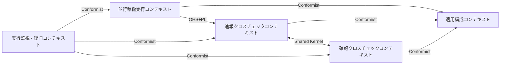
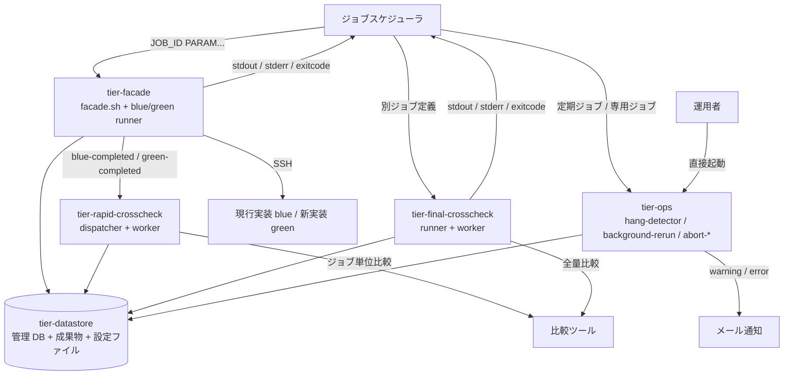
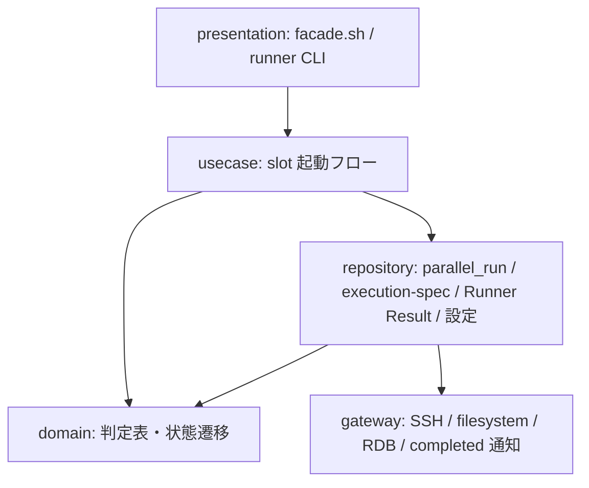
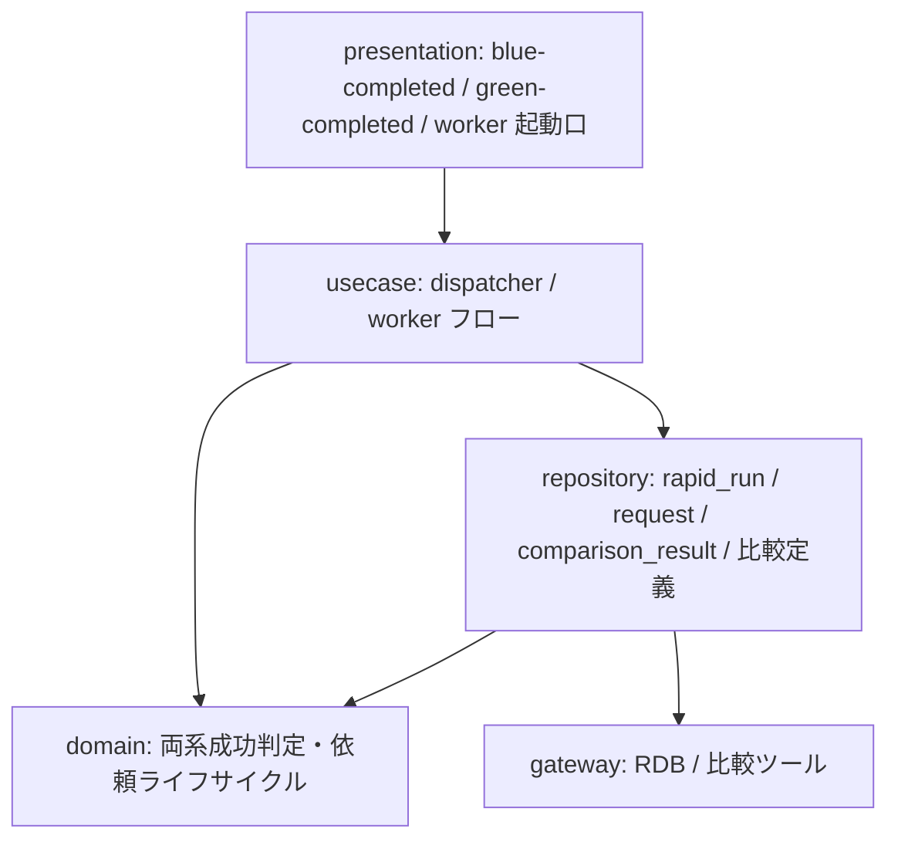
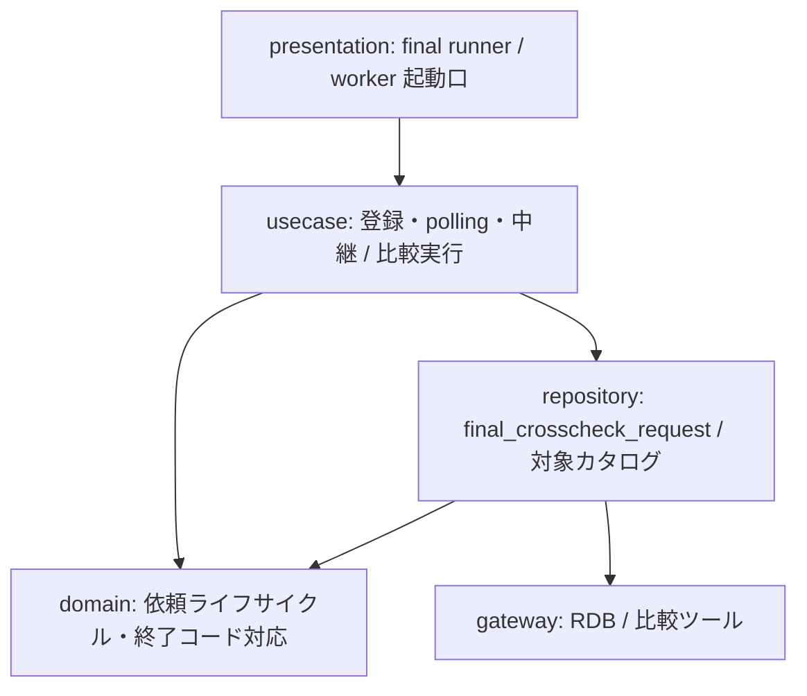
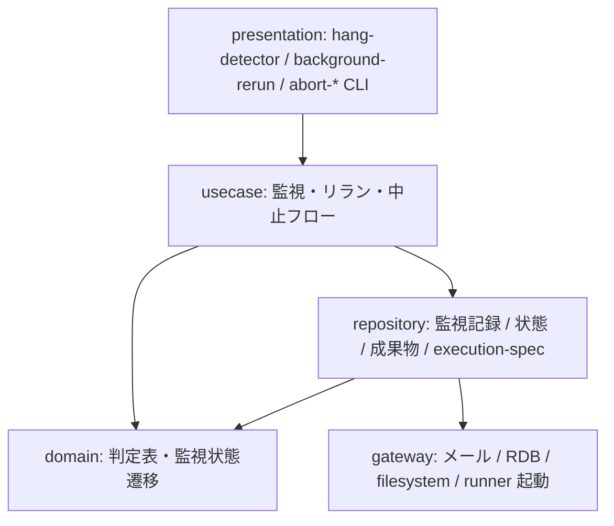

# relay-gate 並行稼働実行基盤

> 既存実装(blue)と新実装(green)をジョブスケジューラの同一ジョブ定義から並行稼働させ、クロスチェックで整合性を検証しながら段階的に切り替えるための feature flag 付きストラングラーファサード型の実行基盤。facade が feature flag(BLUE_MODE / GREEN_MODE / RAPID_CROSSCHECK_MODE / BLUE_IMPL / GREEN_IMPL / BLUE_RUNNER / GREEN_RUNNER / RAPID_CROSSCHECK_RUNNER / RAPID_CROSSCHECK_WORKER)で slot ごとの実行モード(foreground / background / off)を選択し、background slot を先に起動してから foreground の Runner Result(stdout.log / stderr.log / exitcode.txt)だけをジョブスケジューラへ中継する。slot runner がジョブマップで JOB_ID から実行先を解決し execution-spec.json として確定保存する。速報クロスチェックはジョブ実行ごとに blue / green の完了結果を非同期に比較し、確報クロスチェックは別ジョブ定義から全テーブル・全ファイルの日次全量比較を行って stdout・stderr・exitcode をジョブスケジューラへ返す。ハング検知の定期ジョブが background 実行の異常を運用者へメール通知し、運用者は中止スクリプトで停止確認済みの実行を ABORTED にしてから background 側リランで元の execution-spec.json から再実行する。シェルスクリプトと relay-gate 内部のデータストアである RDB(ジョブキュー兼管理 DB。外部システムではなく relay-gate の構成要素)で構成し、実装固有のホスト配置(リモート実行ホストへの SSH 接続など)は適用側の関心事として slot の runner に閉じ込め、UI 画面を持たず CLI と定期ジョブだけで動作する。

**最終更新**: 2026-09-07 13:10:00 feedback abort consistency (specs)

## 成果物一覧

| ドメイン | 最新 | イベント数 |
|---------|------|-----------:|
| [USDM（要求分解）](#usdm要求分解) | [usdm/latest/](usdm/latest/) | 4 |
| [RDRA（要件定義）](#rdra要件定義) | [rdra/latest/](rdra/latest/) | 4 |
| [NFR（非機能要求）](#nfr非機能要求) | [nfr/latest/](nfr/latest/) | 4 |
| [Arch（アーキテクチャ）](#archアーキテクチャ) | [arch/latest/](arch/latest/) | 5 |
| [Infra（インフラ設計）](#infraインフラ設計) | [infra/latest/](infra/latest/) | 4 |
| [Design（デザイン）](#designデザイン) | - | 0 |
| [Specs（詳細仕様）](#specs詳細仕様) | [specs/latest/](specs/latest/) | 4 |

## USDM（要求分解）

### 主要な成果物

- [requirements.md](usdm/latest/requirements.md)
- [requirements.yaml](usdm/latest/requirements.yaml)

| 項目 | 値 |
|------|-----|
| 要求数 | 13 |
| 仕様数 | 50 |

## RDRA（要件定義）

### 主要な成果物

- [アクター.tsv](rdra/latest/アクター.tsv)
- [外部システム.tsv](rdra/latest/外部システム.tsv)
- [情報.tsv](rdra/latest/情報.tsv)
- [状態.tsv](rdra/latest/状態.tsv)
- [条件.tsv](rdra/latest/条件.tsv)
- [バリエーション.tsv](rdra/latest/バリエーション.tsv)
- [BUC.tsv](rdra/latest/BUC.tsv)
- [関連データ.txt](rdra/latest/関連データ.txt)
- [ZeroOne.txt](rdra/latest/ZeroOne.txt)
- [システム概要.json](rdra/latest/システム概要.json)
- [views/（人間可読ビュー: Mermaid 図解つき Markdown）](rdra/latest/views/README.md)

| 項目 | 値 |
|------|-----|
| アクター | 2 |
| 外部システム | 6 |
| 情報 | 27 |
| 状態モデル | 5 |
| 条件 | 48 |
| バリエーション | 24 |
| 業務 | 5 |
| BUC | 7 |
| UC | 32 |

### 外部ツール連携

| ツール | データファイル | 手順 |
|--------|-------------|------|
| [RDRA Graph](https://vsa.co.jp/rdratool/graph/v0.94/) | [関連データ.txt](rdra/latest/関連データ.txt) | ファイル内容をコピーし、RDRA Graph に貼り付け |
| [RDRA Sheet](https://docs.google.com/spreadsheets/d/1h7J70l6DyXcuG0FKYqIpXXfdvsaqjdVFwc6jQXSh9fM/) | [ZeroOne.txt](rdra/latest/ZeroOne.txt) | ファイル内容をコピーし、テンプレートに貼り付け |

### システムコンテキスト図

## NFR（非機能要求）

### 主要な成果物

- [nfr-grade.md](nfr/latest/nfr-grade.md)
- [nfr-grade.yaml](nfr/latest/nfr-grade.yaml)

| 項目 | 値 |
|------|-----|
| モデルシステム | model1 |
| カテゴリ | 6 |
| 重要項目 | 76 |

## Arch（アーキテクチャ）

### 主要な成果物

- [arch-design.md](arch/latest/arch-design.md)
- [arch-design.yaml](arch/latest/arch-design.yaml)
- [coverage-report.md](arch/latest/coverage-report.md)

| 項目 | 値 |
|------|-----|
| 言語 | bash(シェルスクリプト。facade / runner / worker / 監視 / 復旧の全スクリプト), SQL(管理 DB のジョブキュー操作。RDB クライアント CLI 経由), JavaScript(CommonJS。BDD の step 定義のみ。実行時には使用しない) |
| サブドメイン | 4 |
| Bounded Context | 5 |
| コンテキストマップ関係 | 8 |
| ティア | 5 |
| ポリシー | 26 |
| ルール | 6 |
| エンティティ | 27 |

### ドメインアーキテクチャ（コンテキストマップ）

### コンテナ図（システム構成）

### コンポーネント図（レイヤー依存）

**tier-facade**

**tier-rapid-crosscheck**

**tier-final-crosscheck**

**tier-ops**

## Infra（インフラ設計）

### 主要な成果物

- [_changes.md](infra/latest/_changes.md)
- [_inference.md](infra/latest/_inference.md)
- [infra-event-diff.yaml](infra/latest/infra-event-diff.yaml)
- [infra-event.md](infra/latest/infra-event.md)
- [infra-event.yaml](infra/latest/infra-event.yaml)
- [product-input.yaml](infra/latest/product-input.yaml)

## Design（デザイン）

design ステージは pipeline-config の `skip_steps` で skip されている（UI 画面を持たないプロダクト）。

## Specs（詳細仕様）

### 主要な成果物

- [spec-event.md](specs/latest/spec-event.md)
- [spec-event.yaml](specs/latest/spec-event.yaml)

| 項目 | 値 |
|------|-----|
| UC | 32 |
| 非同期イベント | 4 |

### 横断設計

| 仕様 | ファイル |
|------|---------|
| UX デザイン仕様 | [ux-ui/ux-design.md](specs/latest/_cross-cutting/ux-ui/ux-design.md) |
| UI デザイン仕様 | [ux-ui/ui-design.md](specs/latest/_cross-cutting/ux-ui/ui-design.md) |
| データ可視化仕様 | [ux-ui/data-visualization.md](specs/latest/_cross-cutting/ux-ui/data-visualization.md) |
| OpenAPI 3.1 | [api/openapi.yaml](specs/latest/_cross-cutting/api/openapi.yaml) |
| AsyncAPI 3.0 | [api/asyncapi.yaml](specs/latest/_cross-cutting/api/asyncapi.yaml) |
| RDB スキーマ | [datastore/rdb-schema.yaml](specs/latest/_cross-cutting/datastore/rdb-schema.yaml) |
| トレーサビリティマトリクス | [traceability-matrix.md](specs/latest/_cross-cutting/traceability-matrix.md) |

### 実装切替業務

**実装切替ジョブ実行フロー**

- [業務ジョブの実行結果を確認する](specs/latest/実装切替業務/実装切替ジョブ実行フロー/業務ジョブの実行結果を確認する/spec.md)
- [slot 実行モードを選択して runner を起動する](specs/latest/実装切替業務/実装切替ジョブ実行フロー/slot 実行モードを選択して runner を起動する/spec.md)
- [ジョブマップで JOB_ID から実行先を解決する](specs/latest/実装切替業務/実装切替ジョブ実行フロー/ジョブマップで JOB_ID から実行先を解決する/spec.md)
- [execution-spec.json を確定保存する](specs/latest/実装切替業務/実装切替ジョブ実行フロー/execution-spec.json を確定保存する/spec.md)
- [実装スクリプトを実行して Runner Result を出力する](specs/latest/実装切替業務/実装切替ジョブ実行フロー/実装スクリプトを実行して Runner Result を出力する/spec.md)
- [foreground slot の結果をジョブスケジューラへ中継する](specs/latest/実装切替業務/実装切替ジョブ実行フロー/foreground slot の結果をジョブスケジューラへ中継する/spec.md)

### クロスチェック業務

**速報クロスチェックフロー**

- [速報比較結果を参照する](specs/latest/クロスチェック業務/速報クロスチェックフロー/速報比較結果を参照する/spec.md)
- [速報クロスチェック runner へ完了通知を送信する](specs/latest/クロスチェック業務/速報クロスチェックフロー/速報クロスチェック runner へ完了通知を送信する/spec.md)
- [両系成功時に速報比較依頼を作成する](specs/latest/クロスチェック業務/速報クロスチェックフロー/両系成功時に速報比較依頼を作成する/spec.md)
- [速報比較依頼を claim する](specs/latest/クロスチェック業務/速報クロスチェックフロー/速報比較依頼を claim する/spec.md)
- [比較ツールでジョブ単位比較を実行して結果を登録する](specs/latest/クロスチェック業務/速報クロスチェックフロー/比較ツールでジョブ単位比較を実行して結果を登録する/spec.md)

**確報クロスチェックフロー**

- [確報クロスチェック結果を確認する](specs/latest/クロスチェック業務/確報クロスチェックフロー/確報クロスチェック結果を確認する/spec.md)
- [確報比較依頼を登録して終端状態まで待機する](specs/latest/クロスチェック業務/確報クロスチェックフロー/確報比較依頼を登録して終端状態まで待機する/spec.md)
- [確報比較依頼を claim する](specs/latest/クロスチェック業務/確報クロスチェックフロー/確報比較依頼を claim する/spec.md)
- [比較ツールで日次全量比較を実行して結果を保存する](specs/latest/クロスチェック業務/確報クロスチェックフロー/比較ツールで日次全量比較を実行して結果を保存する/spec.md)
- [保存済みの確報結果をジョブスケジューラへ返す](specs/latest/クロスチェック業務/確報クロスチェックフロー/保存済みの確報結果をジョブスケジューラへ返す/spec.md)

### 実行監視業務

**background 実行監視フロー**

- [background 異常の通知メールを受け取る](specs/latest/実行監視業務/background 実行監視フロー/background 異常の通知メールを受け取る/spec.md)
- [background 実行の経過時間と終了状態を判定する](specs/latest/実行監視業務/background 実行監視フロー/background 実行の経過時間と終了状態を判定する/spec.md)
- [ハング疑い・実行エラー・比較異常を通知する](specs/latest/実行監視業務/background 実行監視フロー/ハング疑い・実行エラー・比較異常を通知する/spec.md)
- [監視記録を保存する](specs/latest/実行監視業務/background 実行監視フロー/監視記録を保存する/spec.md)
- [hang_detect_limit_minutes をジョブごとに調整する](specs/latest/実行監視業務/background 実行監視フロー/hang_detect_limit_minutes をジョブごとに調整する/spec.md)

### 実行復旧業務

**実行中止フロー**

- [現在状態を確認して停止確認に応答する](specs/latest/実行復旧業務/実行中止フロー/現在状態を確認して停止確認に応答する/spec.md)
- [実行を ABORTED へ遷移させる](specs/latest/実行復旧業務/実行中止フロー/実行を ABORTED へ遷移させる/spec.md)

**background 側リランフロー**

- [リラン結果を parent_run_id で追跡する](specs/latest/実行復旧業務/background 側リランフロー/リラン結果を parent_run_id で追跡する/spec.md)
- [リラン対象を検証する](specs/latest/実行復旧業務/background 側リランフロー/リラン対象を検証する/spec.md)
- [元の execution-spec.json から復元して新しい run_id で起動する](specs/latest/実行復旧業務/background 側リランフロー/元の execution-spec.json から復元して新しい run_id で起動する/spec.md)
- [速報比較依頼だけを新規作成する](specs/latest/実行復旧業務/background 側リランフロー/速報比較依頼だけを新規作成する/spec.md)

### 適用構成業務

**適用構成定義フロー**

- [切り替えた運用モードで業務ジョブを実行する](specs/latest/適用構成業務/適用構成定義フロー/切り替えた運用モードで業務ジョブを実行する/spec.md)
- [feature flag を設定する](specs/latest/適用構成業務/適用構成定義フロー/feature flag を設定する/spec.md)
- [slot runner の実体スクリプトを割り当てる](specs/latest/適用構成業務/適用構成定義フロー/slot runner の実体スクリプトを割り当てる/spec.md)
- [slot ごとのジョブマップを定義する](specs/latest/適用構成業務/適用構成定義フロー/slot ごとのジョブマップを定義する/spec.md)
- [クロスチェックのジョブマップと比較定義を定義する](specs/latest/適用構成業務/適用構成定義フロー/クロスチェックのジョブマップと比較定義を定義する/spec.md)

> 5 業務 / 7 BUC / 32 UC

## ADRs（設計判断記録）

| # | ドメイン | 判断 | ステータス |
|---|---------|------|----------|
| 1 | Arch | [サブドメイン分類: 実装切替とクロスチェックを Core、監視・復旧と適用構成を Supporting](arch/events/20260830_184457_initial_arch/decisions/arch-decision-001.yaml) | approved |
| 2 | Arch | [BC 設計: 並行稼働実行 / 速報 / 確報 / 監視・復旧 / 適用構成の 5 コンテキスト](arch/events/20260830_184457_initial_arch/decisions/arch-decision-002.yaml) | approved |
| 3 | Arch | [コンテキストマップ: 設定契約への Conformist、完了通知の OHS、依頼ライフサイクルの Shared Kernel](arch/events/20260830_184457_initial_arch/decisions/arch-decision-003.yaml) | approved |
| 4 | Arch | [集約境界仮説: parallel_run / rapid_run / final_crosscheck_request / 監視記録 / ジョブマップ を root とする 5 仮説](arch/events/20260830_184457_initial_arch/decisions/arch-decision-004.yaml) | approved |
| 5 | Arch | [テクノロジースタック: bash シェルスクリプト + RDB、フレームワーク非採用](arch/events/20260830_184457_initial_arch/decisions/arch-decision-005.yaml) | approved |
| 6 | Arch | [BC : tier 対応形態: 方針資料の C2 コンテナに対応する CLI スクリプト群 4 tier + データストア 1 tier](arch/events/20260830_184457_initial_arch/decisions/arch-decision-006.yaml) | approved |
| 7 | Arch | [認証・認可方式: SSH 鍵と OS 権限のみ(IdP / API Gateway / 認可サービス非導入)](arch/events/20260830_184457_initial_arch/decisions/arch-decision-007.yaml) | approved |
| 8 | Arch | [レイヤリング戦略: 全スクリプト tier で 5 層(presentation → usecase → domain → repository / gateway)の直接依存](arch/events/20260830_184457_initial_arch/decisions/arch-decision-008.yaml) | approved |
| 9 | Arch | [データモデル戦略: 状態を持つ管理レコードは event_snapshot、記録は event、設定は resource_scd2。成果物ファイルを外部 IF の正本にする](arch/events/20260830_184457_initial_arch/decisions/arch-decision-009.yaml) | approved |
| 10 | Arch | [管理 DB をジョブキューとして使い、worker は poll / claim / lease で多重実行を防ぐ(MQ 非導入)](arch/events/20260830_184457_initial_arch/decisions/arch-decision-010.yaml) | approved |
| 11 | Arch | [slot 実行の状態はファイル正本(exitcode.txt / aborted.txt)から導出し、管理 DB は速報有効時の複製とする(二重マッピング確定)](arch/events/20260905_091000_feedback_todo_resolution/decisions/arch-decision-011.yaml) | approved |
| 12 | Arch | [設定契約を元の方針資料に戻す(feature flag 9 キー・設定版なし、ジョブマップは CSV と元の列名、ハング検知定期ジョブ設定を追加)](arch/events/20260905_091000_feedback_todo_resolution/decisions/arch-decision-012.yaml) | approved |
| 13 | Arch | [run_id はローカルタイムゾーンの時刻 + job_id + 8 桁 hex 乱数とし、facade がモードによらず発行する](arch/events/20260905_091000_feedback_todo_resolution/decisions/arch-decision-013.yaml) | approved |
| 14 | Arch | [実行ログの日時はホストのローカルタイムゾーン(タイムゾーン指示子なし)に統一し、CLP-002 の UTC 統一を改める](arch/events/20260907_015000_feedback_todo_followup/decisions/arch-decision-014.yaml) | approved |
| 15 | Arch | [中止済み run では速報比較依頼を作成せず(判断主体は dispatcher)、abort-blue / abort-green は未着手の速報比較依頼も ABORTED にする](arch/events/20260907_015000_feedback_todo_followup/decisions/arch-decision-015.yaml) | approved |
| 16 | Arch | [速報クロスチェック設定(rapid-crosscheck.env)を BC-005 所有の設定エンティティ E-027 として追加し、env 形式の設定ファイルに配置する](arch/events/20260907_015000_feedback_todo_followup/decisions/arch-decision-016.yaml) | approved |
| 17 | Arch | [中止済み run の判定キーに対象 slot の slot 実行 ABORTED を加え、abort-rapid-crosscheck を REQUESTED / CLAIMED / RUNNING の速報比較依頼に拡張し、REQUESTED → ABORTED を競合窓の保険と位置づける](arch/events/20260907_122000_feedback_abort_consistency/decisions/arch-decision-017.yaml) | approved |
| 18 | Infra | [スクリプト実行ホストの常駐/定期起動基盤の選定](infra/events/20260830_190412_infra_product_design/docs/cloud-context/decisions/product/product-decision-001.yaml) | accepted |
| 19 | Infra | [管理DB(ジョブキュー兼管理DB)のRDBMS選定](infra/events/20260830_190412_infra_product_design/docs/cloud-context/decisions/product/product-decision-002.yaml) | accepted |
| 20 | Infra | [成果物ディレクトリ(Runner Result)の配置方式選定](infra/events/20260830_190412_infra_product_design/docs/cloud-context/decisions/product/product-decision-003.yaml) | accepted |
| 21 | Infra | [運用者向けメール通知のMTA選定](infra/events/20260830_190412_infra_product_design/docs/cloud-context/decisions/product/product-decision-004.yaml) | accepted |
| 22 | Infra | [バックアップと基盤監視の方式選定](infra/events/20260830_190412_infra_product_design/docs/cloud-context/decisions/product/product-decision-005.yaml) | accepted |
| 23 | Specs | [インターフェース契約の形式: HTTP API を持たず CLI コマンド契約(cli-command-contract.yaml)を正本にする](specs/events/20260830_202851_spec_generation/decisions/spec-decision-001.yaml) | approved |
| 24 | Specs | [イベント駆動パターン: RDB ジョブキュー(poll / claim / lease)と同期プロセス起動の完了通知を AsyncAPI で契約化する](specs/events/20260830_202851_spec_generation/decisions/spec-decision-002.yaml) | approved |
| 25 | Specs | [データ正規化レベル: 第 3 正規形・状態履歴テーブルなし・速報/確報モデル分離(rdb-schema.yaml 7 テーブル)](specs/events/20260830_202851_spec_generation/decisions/spec-decision-003.yaml) | approved |
| 26 | Specs | [横断関心事: 終了コード体系(0/2/3/6)・出力規約(key=value / TSV)・設定ファイル形式(env + TSV)・run_id 形式・通知メール手段](specs/events/20260830_202851_spec_generation/decisions/spec-decision-004.yaml) | approved |
| 27 | Specs | [feedback todo-resolution-20260905 の Spec 追従: CSV セル解析規則・ファイル正本の状態導出・operation_mode 英字コード・グループ間統一決定](specs/events/20260905_100000_feedback_todo_resolution/decisions/spec-decision-005.yaml) | approved |
| 28 | Specs | [速報クロスチェック設定の所有区分・中止済み run の依頼作成除外と未着手依頼の中止・実行ログと出力の日時をローカルタイムゾーンへ統一する Spec 追従](specs/events/20260907_024000_feedback_todo_followup/decisions/spec-decision-006.yaml) | approved |
| 29 | Specs | [中止済み run の判定キー拡張・速報比較依頼の中止対象拡張と worker の条件付き RUNNING 遷移・未着手依頼の中止を競合窓の保険と位置づける Spec 追従](specs/events/20260907_131000_feedback_abort_consistency/decisions/spec-decision-007.yaml) | approved |

## Pipeline feedback runs

distillery-impl が公開した feedback-request Markdown を `dist-pipeline` が差分実行した記録。
`input.md`（不変 snapshot）/ `routing.json`（所有 stage の判定）/ `plan.json`（work unit と実行順）/ `result.json`（要求ごとの最終判定）を含む。

| feedback_id | 状態 | 要求 | applied | merged | deferred | 実行 stage | run dir |
|-------------|------|-----:|--------:|-------:|---------:|-----------|---------|
| 20260905_todo_resolution | completed | 12 | 12 | 0 | 0 | requirements → quality_attributes → architecture → infrastructure → spec | [feedback-runs/](pipeline/feedback-runs/20260905_todo_resolution) |
| 20260907_abort_consistency | completed | 3 | 3 | 0 | 0 | requirements → quality_attributes → architecture → infrastructure → spec | [feedback-runs/](pipeline/feedback-runs/20260907_abort_consistency) |
| 20260907_todo_followup | completed | 3 | 3 | 0 | 0 | requirements → quality_attributes → architecture → infrastructure → spec | [feedback-runs/](pipeline/feedback-runs/20260907_todo_followup) |

## イベント履歴

| 日時 | ドメイン | イベントID |
|------|---------|-----------|
| 2026-08-30 18:18:41 | USDM（要求分解） | [20260830_181841_initial_build](usdm/events/20260830_181841_initial_build) |
| 2026-08-30 18:18:41 | RDRA（要件定義） | [20260830_181841_initial_build](rdra/events/20260830_181841_initial_build) |
| 2026-08-30 18:37:26 | NFR（非機能要求） | [20260830_183726_initial_nfr](nfr/events/20260830_183726_initial_nfr) |
| 2026-08-30 18:44:57 | Arch（アーキテクチャ） | [20260830_184457_initial_arch](arch/events/20260830_184457_initial_arch) |
| 2026-08-30 19:04:12 | Infra（インフラ設計） | [20260830_190412_infra_product_design](infra/events/20260830_190412_infra_product_design) |
| 2026-08-30 20:24:27 | Arch（アーキテクチャ） | [20260830_202427_arch_infra_feedback_20260830_190412_infra_product_design](arch/events/20260830_202427_arch_infra_feedback_20260830_190412_infra_product_design) |
| 2026-08-30 20:28:51 | Specs（詳細仕様） | [20260830_202851_spec_generation](specs/events/20260830_202851_spec_generation) |
| 2026-09-05 08:30:00 | USDM（要求分解） | [20260905_083000_feedback_todo_resolution](usdm/events/20260905_083000_feedback_todo_resolution) |
| 2026-09-05 08:30:00 | RDRA（要件定義） | [20260905_083000_feedback_todo_resolution](rdra/events/20260905_083000_feedback_todo_resolution) |
| 2026-09-05 08:50:00 | NFR（非機能要求） | [20260905_085000_feedback_todo_resolution](nfr/events/20260905_085000_feedback_todo_resolution) |
| 2026-09-05 09:10:00 | Arch（アーキテクチャ） | [20260905_091000_feedback_todo_resolution](arch/events/20260905_091000_feedback_todo_resolution) |
| 2026-09-05 09:30:00 | Infra（インフラ設計） | [20260905_093000_feedback_todo_resolution](infra/events/20260905_093000_feedback_todo_resolution) |
| 2026-09-05 10:00:00 | Specs（詳細仕様） | [20260905_100000_feedback_todo_resolution](specs/events/20260905_100000_feedback_todo_resolution) |
| 2026-09-07 01:10:00 | USDM（要求分解） | [20260907_011000_feedback_todo_followup](usdm/events/20260907_011000_feedback_todo_followup) |
| 2026-09-07 01:10:00 | RDRA（要件定義） | [20260907_011000_feedback_todo_followup](rdra/events/20260907_011000_feedback_todo_followup) |
| 2026-09-07 01:30:00 | NFR（非機能要求） | [20260907_013000_feedback_todo_followup](nfr/events/20260907_013000_feedback_todo_followup) |
| 2026-09-07 01:50:00 | Arch（アーキテクチャ） | [20260907_015000_feedback_todo_followup](arch/events/20260907_015000_feedback_todo_followup) |
| 2026-09-07 02:10:00 | Infra（インフラ設計） | [20260907_021000_feedback_todo_followup](infra/events/20260907_021000_feedback_todo_followup) |
| 2026-09-07 02:40:00 | Specs（詳細仕様） | [20260907_024000_feedback_todo_followup](specs/events/20260907_024000_feedback_todo_followup) |
| 2026-09-07 11:40:00 | USDM（要求分解） | [20260907_114000_feedback_abort_consistency](usdm/events/20260907_114000_feedback_abort_consistency) |
| 2026-09-07 11:40:00 | RDRA（要件定義） | [20260907_114000_feedback_abort_consistency](rdra/events/20260907_114000_feedback_abort_consistency) |
| 2026-09-07 12:00:00 | NFR（非機能要求） | [20260907_120000_feedback_abort_consistency](nfr/events/20260907_120000_feedback_abort_consistency) |
| 2026-09-07 12:20:00 | Arch（アーキテクチャ） | [20260907_122000_feedback_abort_consistency](arch/events/20260907_122000_feedback_abort_consistency) |
| 2026-09-07 12:40:00 | Infra（インフラ設計） | [20260907_124000_feedback_abort_consistency](infra/events/20260907_124000_feedback_abort_consistency) |
| 2026-09-07 13:10:00 | Specs（詳細仕様） | [20260907_131000_feedback_abort_consistency](specs/events/20260907_131000_feedback_abort_consistency) |

---

*このファイルは `generateReadme.js` により自動生成されています。手動編集しないでください。*
