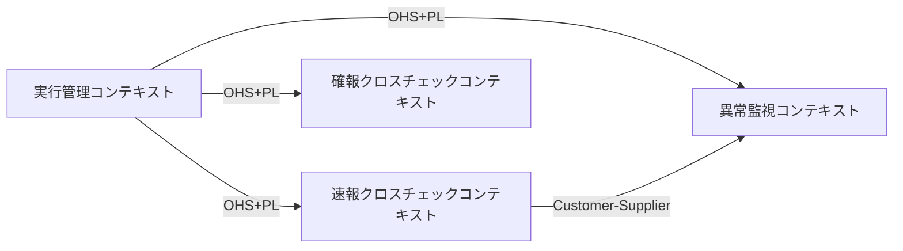
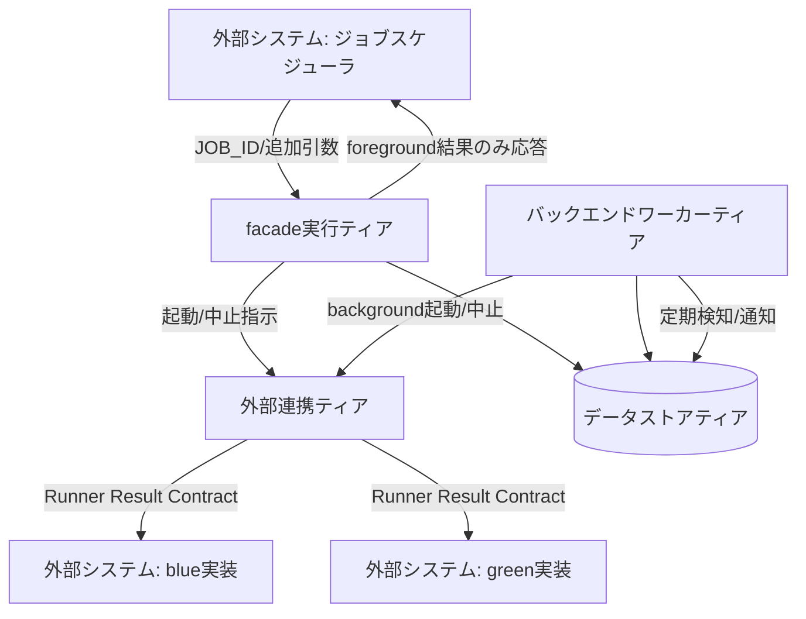
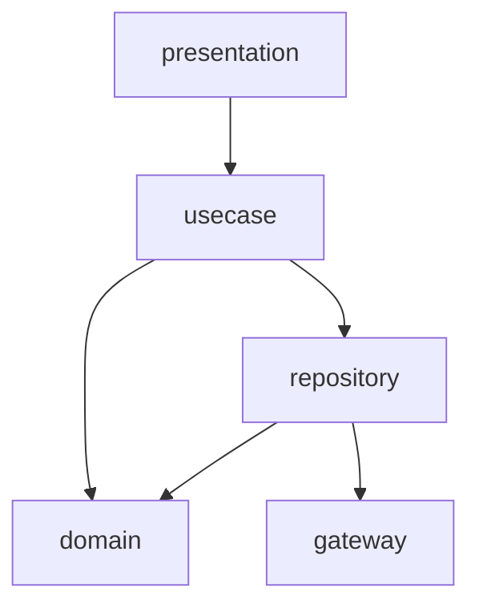
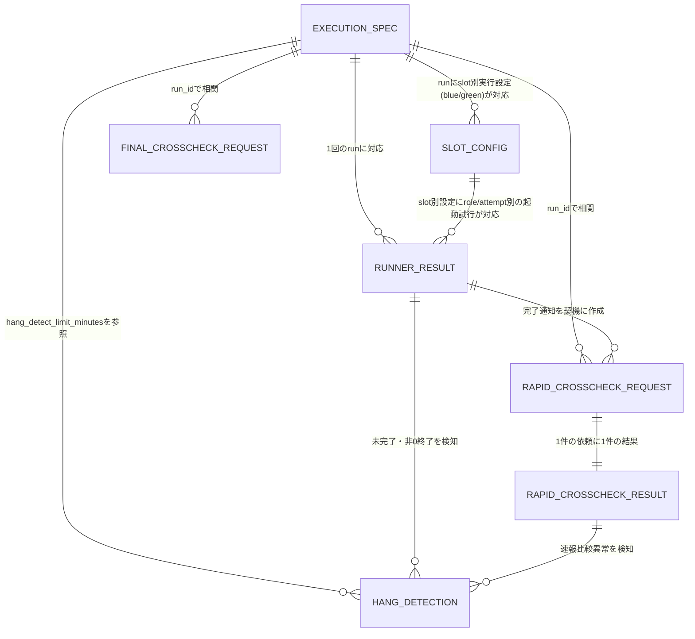

# アーキテクチャ設計書

## 概要

| 項目 | 内容 |
|------|------|
| イベントID | 20260818_135504_arch_slot_config_attempt_identity |
| 作成日時 | 2026-08-18T13:55:04 |
| ソース | 実装フィードバック 20260818_113601_impl_feedback_6078c4ed に基づくslot別実行設定の分離と起動試行identity・実行状態の正式定義 |
| 言語 | Shell Script (POSIX/bash), SQL |
| フレームワーク | なし（フレームワーク非使用。POSIX準拠シェルスクリプトによる直接実装） |
| 技術的制約 | エアギャップ環境のオンプレミスLinuxサーバへのデプロイ（インターネット接続なし・クラウドマネージドサービス利用なし）, ジョブスケジューラの既存ジョブ定義を変更しない（strangler facadeとして追加導入のみ）, Web UIを持たないCLI/バッチ運用中心, blue実装・green実装のいずれも改変せず、facade層のみで並行稼働・比較・切替を実現する, 外部SaaS型の監視・アラーティングサービスはエアギャップ環境のため利用不可。閉域内監視基盤（ログ集約・可視化）の整備が前提となる（共有プラットフォーム未確定時は構造化ログ+logrotateによるローカル最小構成とする） |

## ドメインアーキテクチャ

### コンテキストマップ図

### サブドメイン分類

| ID | 名前 | 分類 | 投資方針 | 関連 BUC | confidence | 根拠 |
|----|------|:----:|---------|---------|:----------:|------|
| SD-001 | 並行稼働実行 | core | 最優先で深いモデリングと継続的リファクタリングに投資。チーム最強の人材を配置 | 並行稼働実行フロー | 中 | システム概要の中核機能。ジョブ定義を変更せずfeature flag設定でblue/greenのslot起動可否とrole実行順序を制御し、foreground結果のみをジョブスケジューラへ中継するstrangler facade機構そのものであり、本システムの競争優位（既存基盤に手を入れず段階移行を可能にする点）の源泉 |
| SD-002 | クロスチェック検証 | core | 最優先で深いモデリングと継続的リファクタリングに投資。チーム最強の人材を配置 | 速報クロスチェックフロー, 確報クロスチェックフロー | 中 | blue/green実行結果の整合性を速報（ジョブ単位）・確報（日次全量）の二段階で検証し、段階的切替とリリース判断の正本を提供する仕組み。strangler facadeパターンにおいて安全な移行を担保する中核機能であり、単なる汎用比較ツールではなく本システム固有の価値提供部分 |
| SD-003 | 実行監視 | supporting | good engood な品質で安定運用。標準的なフレームワーク採用 | ハング監視フロー | 中 | background実行の未完了・異常やクロスチェック異常を定期検知し運用者へ通知する機能。並行稼働実行・クロスチェック検証を支える運用支援機能であり、それ自体が差別化要因ではない |
| SD-004 | 実行制御 | supporting | good enough な品質で安定運用。標準的なフレームワーク採用 | blue中止フロー, green中止フロー, 速報比較中止フロー, 確報比較中止フロー, background側リランフロー | 中 | 対話確認を伴う中止操作と元の実行設定を保った選択的リランを提供する運用オペレーション機能。並行稼働実行・クロスチェック検証の異常時リカバリを支える支援機能 |

### 境界づけられたコンテキスト (Bounded Context)

| ID | 名前 | 所属 SD | 所有 entity | 所有 BUC | チーム | confidence | 根拠 |
|----|------|:------:|-----------|---------|--------|:----------:|------|
| BC-001 | 実行管理コンテキスト | SD-001 | E-001, E-002, E-007 | 並行稼働実行フロー | - | 中 | execution-spec.json（run共通）・slot別実行設定・Runner実行結果（起動試行）の3エンティティに閉じた独立の状態モデル（background slot実行状態）を持ち、他コンテキストからはrun_idで相関参照されるのみで属性を共有しない言語境界がある |
| BC-002 | 速報クロスチェックコンテキスト | SD-002 | E-003, E-004 | 速報クロスチェックフロー | - | 中 | 速報比較依頼状態という独立の状態モデルを持ち、確報クロスチェックコンテキストとはlease機構・状態遷移パスが異なる（速報はジョブ単位の非同期比較、確報は日次全量比較）ため別コンテキストとして分離 |
| BC-003 | 確報クロスチェックコンテキスト | SD-002 | E-005 | 確報クロスチェックフロー | - | 中 | 情報.tsvで「速報側のエンティティと独立してrun_idで相関付け」と明記されており、速報クロスチェックコンテキストとは独立した状態モデル・応答仕様（stdout/stderr/exitcodeのみに限定）を持つ |
| BC-004 | 異常監視コンテキスト | SD-003 | E-006 | ハング監視フロー | - | 中 | ハング検知記録は独自の異常検知種別バリエーションを持ち、実行管理・速報/確報クロスチェックの結果を横断的に参照して異常を判定・通知する独立した関心事であるため分離 |

#### ユビキタス言語

**BC-001 実行管理コンテキスト**

| 用語 | 定義 |
|------|------|
| run | facadeが起動する1回のslot実行の単位。run_idで一意に識別され、parent_run_idでリラン系譜を追跡する。再実行は新しいrun_idの新規runとして作成しparent_run_idで元runに関連付け、既存runのレコード・履歴は変更しない |
| slot | blue実装またはgreen実装のうち、facadeが起動する実装系統（slot種別: blue/green） |
| role | slot runnerが担う実行役割（foreground: ジョブスケジューラへの応答対象、background: 非同期実行、rapid-crosscheck: 速報比較専用） |
| 実行設定 | execution-spec.jsonに起動時解決済みで一度だけ確定・保存される実行設定。run共通部（JOB_ID・追加引数・マップ版・hang_detect_limit_minutes等）とslot別実行設定に分離して保持し、リラン時の復元基準となる |
| slot別実行設定 | blue/green各slotに対して起動時に一度だけ確定される実行設定（ホスト・実行ユーザー・スクリプト・作業ディレクトリ・固定引数・実装版・認証情報参照名）。slotごとにhost・impl_version等が異なる並行稼働を表現する |
| attempt（起動試行） | slotのroleに対する1回の起動試行。attempt_idで一意に識別し、attempt_noを同一（run_id, slot, role）内の連番として管理する。実行状態STARTING/RUNNING/SUCCEEDED/FAILED/UNKNOWN/ABORTEDを遷移し、timeout後は推測でFAILEDを確定せずUNKNOWNとする |

**BC-002 速報クロスチェックコンテキスト**

| 用語 | 定義 |
|------|------|
| 速報比較依頼 | blue/green runnerの完了通知を受けてジョブ単位に作成される、非同期の比較実行依頼。REQUESTED/CLAIMED/RUNNING/SUCCEEDED/FAILED/ABORTEDの状態を持つ |
| lease | workerが速報比較依頼を取得（claim）した際に設定する占有期限。失効かつ未着手の場合はREQUESTEDへ差し戻し重複実行を防ぐ |

**BC-003 確報クロスチェックコンテキスト**

| 用語 | 定義 |
|------|------|
| 確報比較依頼 | 日次で全テーブル・全ファイルを対象に作成される比較実行依頼。速報比較依頼とは独立してrun_idで相関付けられ、リリース判断の正本となる実行状態を管理する |
| リリース判断の正本 | 確報クロスチェックのSUCCEEDED/FAILED結果が、リリース判断者が本番リリース可否を判断する際に用いる唯一の根拠情報であること |

**BC-004 異常監視コンテキスト**

| 用語 | 定義 |
|------|------|
| ハング検知記録 | background実行の未完了超過（ハング疑い）・非0終了エラー・速報クロスチェック異常を記録した検知結果。異常検知種別・検知しきい値・対象slot種別・通知先を持つ |
| hang_detect_limit_minutes | background roleごとに設定される、未完了状態を許容する経過時間のしきい値（分）。ジョブマップで解決されexecution-spec.jsonに保存される |

### コンテキストマップ

| ID | from BC | to BC | パターン | 方向 | 翻訳責務 | 統合イベント | confidence |
|----|---------|-------|:-------:|:----:|---------|--------------|:----------:|
| CM-001 | BC-001 | BC-002 | ohs | upstream | BC-001（実行管理）はexecution-spec.json/Runner実行結果を「Runner Result Contract」という共通形式（Published Language）で公開し、BC-002（速報クロスチェック）はrun_idで相関付けてこれを消費する | - | 中 |
| CM-002 | BC-001 | BC-003 | ohs | upstream | BC-001が公開するRunner Result Contract（execution-spec.json）をBC-003（確報クロスチェック）がrun_idで相関付けて消費する | - | 中 |
| CM-003 | BC-001 | BC-004 | ohs | upstream | BC-001が公開するRunner Result Contract（execution-spec.json, Runner実行結果）をBC-004（異常監視）がrun_idで相関付けて消費し、ハング疑い・エラーを検知する | - | 中 |
| CM-004 | BC-002 | BC-004 | customer_supplier | upstream | BC-002（速報クロスチェック）が生成する速報比較結果をBC-004（異常監視）が消費し、速報クロスチェック異常の検知種別として扱う | - | 中 |

### 集約境界の仮説

> 注: これらは戦略段階の仮説です。最終確定は dist-spec or ddd-tactical-implementation で行います。

| ID | BC | root entity | members | invariants | confidence | 備考 |
|----|----|-----------|---------|-----------|:----------:|------|
| AG-001 | BC-001 | E-001 | E-007 | • BLUE_MODEとGREEN_MODEを同時にforegroundにする組み合わせは許可しない • 認証情報は参照名のみを保存し実値は保存しない • slot別実行設定（host/exec_user/script/work_dir/固定引数/impl_version/認証情報参照名）はrun起動時にslotごとに一度だけ確定し、以後変更しない • 再実行は新しいrun_idの新規runとして作成しparent_run_idで元runに関連付ける。既存runのレコード・履歴は変更しない | 低 | 仮説。最終確定は dist-spec または ddd-tactical-implementation で行う |
| AG-002 | BC-001 | E-002 | - | • 起動試行は（run_id, slot種別, role区分, attempt_id）で一意に識別し、attempt_noは同一（run_id, slot種別, role区分）内の連番とする • 実行状態はSTARTING→RUNNING→SUCCEEDED/FAILEDを基本遷移とし、exitcode.txtの有無と終了コードの値からSUCCEEDED/FAILEDを判定する • timeoutや結果取得不能の場合はUNKNOWNとし、推測でFAILEDを確定しない。UNKNOWNからの確定は実結果の回収または対話確認による回復処理でのみ行う • ABORTEDへの遷移は対話確認による明示的操作でのみ発生する（自動遷移は不可） | 低 | 仮説。最終確定は dist-spec または ddd-tactical-implementation で行う |
| AG-003 | BC-002 | E-003 | E-004 | • CLAIMED状態でlease失効かつworkerが未着手の場合はREQUESTEDへ差し戻し重複実行を防ぐ | 低 | 仮説。最終確定は dist-spec または ddd-tactical-implementation で行う |
| AG-004 | BC-003 | E-005 | - | • 確報比較は対象テーブル・対象ファイルの全量を対象とし部分実行は行わない • 応答はstdout/stderr/exitcodeの3項目のみに限定し比較結果・差分件数・レポートURI等は含めない | 低 | 仮説。最終確定は dist-spec または ddd-tactical-implementation で行う |
| AG-005 | BC-004 | E-006 | - | • hang_detect_limit_minutesのしきい値を超過した場合にのみハング疑いとして検知記録を作成する | 低 | 仮説。最終確定は dist-spec または ddd-tactical-implementation で行う |

## システムアーキテクチャ

### システム構成図

### ティア構成

| ID | ティア名 | 説明 | テクノロジー候補 |
|-----|---------|------|----------------|
| tier-facade | facade実行ティア | ジョブスケジューラからJOB_IDと追加引数を受け取り、feature flag設定に基づきblue/greenのslotを選択・起動し、foreground roleの標準出力・標準エラー・終了コードのみをジョブスケジューラへ応答するCLIエントリポイント。BC-001（実行管理）を実装する | CLI実行基盤（シェルスクリプト）, SSH（対象実装の起動・作業ディレクトリ制御） |
| tier-worker | バックエンドワーカーティア | background role実行、速報/確報クロスチェックの非同期実行、hang-detectorによる定期監視を担う。BC-002（速報クロスチェック）・BC-003（確報クロスチェック）・BC-004（異常監視）と、BC-001のbackground role実行部分を実装する | CronJob（cron/systemdタイマー等の定期実行機構）, CLI実行基盤（シェルスクリプト、RDBのlease/claimを用いたworkerプロセス） |
| tier-datastore | データストアティア | execution-spec.json・Runner実行結果・速報/確報比較依頼・比較結果・ハング検知記録を保持する。RDBがジョブキュー（REQUESTED/CLAIMED/RUNNING等のlease管理）と管理DB（実行系譜の照会）を兼ねる | RDB（ジョブキュー兼管理DB）, ファイルシステム（started-at.txt/stdout.log/stderr.log/exitcode.txt 等の実行ログ本体） |
| tier-external-integration | 外部連携ティア | ジョブスケジューラ・blue実装・green実装との連携アダプタ層。3種の外部システムそれぞれの起動・応答形式差異を吸収する | アダプタ（シェルスクリプト経由のプロセス起動・SSH） |

### facade実行ティア (tier-facade) の方針・ルール

#### 方針

| ID | 方針名 | 内容 | 根拠 | RDRA/NFR 要素 | 確信度 |
|-----|---------|------|------|--------------|:------:|
| SP-001 | ジョブ定義非変更の原則 | facadeは既存ジョブスケジューラのジョブ定義（起動コマンド・引数形式）を変更せずに追加導入し、JOB_IDと追加引数のみを入力として受け取る | ジョブ定義を変更せずに既存実装（blue）と新実装（green）を並行稼働・段階的に切替える strangler facade パターンの前提 | システム概要: 「ジョブスケジューラのジョブ定義を変更せず」, NFR D.3.1.1 | 高 |
| SP-002 | foreground結果限定応答 | ジョブスケジューラへはforeground roleの標準出力・標準エラー・終了コードのみを応答し、background/rapid-crosscheckの実行状況は応答に含めない | 既存ジョブスケジューラの契約（stdout/stderr/exitcode）を変えずに済ませるため | BUC: 並行稼働実行フロー「foreground実行結果をジョブスケジューラへ応答する」 | 高 |

#### ルール

| ID | ルール名 | 内容 | 根拠 | RDRA/NFR 要素 | 確信度 |
|-----|---------|------|------|--------------|:------:|
| SR-001 | 排他的foreground制約 | BLUE_MODEとGREEN_MODEを同時にforegroundにする組み合わせを起動前に検証し拒否する | 条件.tsvで明示された制約 | 条件: feature flag設定（BLUE_MODE/GREEN_MODE/RAPID_CROSSCHECK_MODE） | 高 |
| SR-005 | 対応OS限定・Web UI非対応 | facadeは単一OS（Linux）上でのシェルスクリプト実行のみをサポートする。Web UIを持たないためブラウザ対応・WAF・Webアプリケーション対策は対象外とする | デプロイ先がエアギャップ環境のオンプレミスLinuxサーバに限定され、Web UIを持たないCLI/バッチ運用が中心であるため | NFR F.1.1.1, NFR F.1.1.2, NFR E.10.1.1, プロジェクト背景: エアギャップ環境のオンプレミスLinuxサーバ, Web UIを持たないCLI/バッチ運用 | 高 |

### バックエンドワーカーティア (tier-worker) の方針・ルール

#### 方針

| ID | 方針名 | 内容 | 根拠 | RDRA/NFR 要素 | 確信度 |
|-----|---------|------|------|--------------|:------:|
| SP-003 | lease/claimによる排他制御 | 速報/確報比較依頼はRDBのlease機構でworkerが排他的にclaimし、lease失効かつ未着手の場合はREQUESTEDへ差し戻して重複実行を防止する | 複数workerによる同一依頼の重複実行を避けるため | 情報: 速報比較依頼, 確報比較依頼（lease期限、worker識別子）, 状態: 速報比較依頼状態, 確報比較依頼状態 | 高 |
| SP-004 | 全量比較の原則（確報） | 確報クロスチェックは日次で全テーブル・全ファイルを対象とし、部分実行を行わない。日次バッチとして8時間以内に完了することを目標処理時間とする | リリース判断の正本として整合性を確実に確認するため。確報クロスチェックが日次全量バッチとして実行される | BUC: 確報クロスチェックフロー「全テーブル・全ファイルを対象に確報クロスチェックを実行する」, NFR B.2.2.1 | 高 |
| SP-008 | background実行異常の24時間定期監視 | hang-detectorはbackground実行の未完了・非0終了・速報クロスチェック異常を24時間体制で定期検知し、検知結果をハング検知記録として記録したうえで運用者へ通知する | 実行監視業務（ハング監視フロー）の中核処理であり、可用性A.1.1.1（24時間無停止運用）に連動して監視自体も24時間体制とする必要がある | BUC: 実行監視業務「background実行異常を定期検知する」「異常を運用者へ通知する」, NFR C.1.1.1, NFR A.1.1.1 | 高 |

#### ルール

| ID | ルール名 | 内容 | 根拠 | RDRA/NFR 要素 | 確信度 |
|-----|---------|------|------|--------------|:------:|
| SR-002 | RAPID_CROSSCHECK_MODE off時の非接続原則 | RAPID_CROSSCHECK_MODEがoffの場合、blue/green runnerは完了通知の送信および速報管理DBへの接続・書込みを行わない | 条件.tsvで明示された制約 | 条件: feature flag設定（BLUE_MODE/GREEN_MODE/RAPID_CROSSCHECK_MODE） | 高 |

### データストアティア (tier-datastore) の方針・ルール

#### 方針

| ID | 方針名 | 内容 | 根拠 | RDRA/NFR 要素 | 確信度 |
|-----|---------|------|------|--------------|:------:|
| SP-005 | 実行系譜の一元管理 | run_id/parent_run_idをRDBの主要な相関キーとし、リラン時の系譜追跡を可能にする | システム概要に明記された実行系譜の追跡要件 | システム概要: 「run_id/parent_run_idによる実行系譜の追跡」 | 高 |
| SP-009 | バックアップ運用 | RDB・実行ログファイルはフル+差分バックアップ（日次）で保護し、7世代程度を保持する。execution-spec.json・実行結果ログ・速報/確報比較結果等の全データを対象とする | モデルシステム2のデフォルト水準を適用。エアギャップオンプレのためクラウド管理サービスによるバックアップは利用できず、RDB/ファイルシステムレベルでの運用が前提 | NFR C.1.2.1, プロジェクト背景: オンプレミス | デフォルト |
| SP-010 | 災害対策・復旧目標 | コールドスタンバイ拠点を用意し、RPO（前日の最終バックアップまで）・RTO（1営業日以内）を目標に業務継続を図る | 確報クロスチェック結果がリリース判断の正本として利用されるため、業務継続の要否を明確化する必要がある | NFR A.3.1.1, NFR A.3.1.2, NFR A.4.1.1, NFR A.4.1.2 | 中 |
| SP-011 | インフラ冗長化前提 | オンプレミスサーバはN+1冗長（手動切替）、ネットワーク機器・回線は一部冗長化、ストレージはRAID5（パリティ）、電源はUPSによる冗長化を前提とする。CPU/メモリ/ストレージの拡張はスケールアップ（増設・交換）で対応する | エアギャップオンプレミスの物理/VMサーバであり、クラウドのような自動スケールアウトは想定しにくいため | NFR A.2.3.1, NFR A.2.5.1, NFR A.2.6.2, NFR B.3.1.1, プロジェクト背景: エアギャップ環境のオンプレミスLinuxサーバ | デフォルト |
| SP-012 | サービス切替時間 | RDBはコールドスタンバイ構成とし、障害時のサービス切替は60分未満で完了する運用手順を整備する | モデルシステム2のデフォルト値を適用（エアギャップオンプレのためクラウド補正なし） | NFR A.1.2.1 | デフォルト |
| SP-013 | 実行ログのストレージ階層化 | 実行ログ（started-at.txt/stdout.log/stderr.log/exitcode.txt）は保持方針（7世代程度）に基づき、一定期間経過後にコールドストレージ相当（低速・安価なディスク）へ移動する運用を検討する | MCL product-cost-hints（オンプレミス資産運用観点）で示されたストレージ階層化ヒントを、データストアティア固有のポリシーとして採用する | infra: docs/infra/latest/docs/mcl/product/output/product-cost-hints.yaml (hints[category=storage_tiering]) | 中 |

#### ルール

| ID | ルール名 | 内容 | 根拠 | RDRA/NFR 要素 | 確信度 |
|-----|---------|------|------|--------------|:------:|
| SR-003 | 認証情報の非保存 | execution-spec.jsonには認証情報の参照名のみを保存し、実値（パスワード・鍵等）は保存しない | 情報.tsvに明記された制約。エアギャップオンプレ環境でも機密情報の保管リスクを避ける | 情報: execution-spec.json「認証情報は参照名のみを保存し実値は保存しない」, NFR E.6.1.1 | 高 |
| SR-004 | データ移行量の前提 | facade自体は新規導入であり、既存実装（blue）からのデータ移行は発生しない。データ変換もRunner Result Contractによる実行結果形式の標準化のみに限定する | RDRAにデータ移行の直接記載がなく、facade新規導入のため移行データ量は限定的と推定 | NFR D.4.1.1 | 低 |

### 外部連携ティア (tier-external-integration) の方針・ルール

#### 方針

| ID | 方針名 | 内容 | 根拠 | RDRA/NFR 要素 | 確信度 |
|-----|---------|------|------|--------------|:------:|
| SP-006 | Runner Result Contractへの変換 | blue実装・green実装それぞれの実行結果を、共通形式（started-at.txt/stdout.log/stderr.log/exitcode.txt）に標準化してから内部に取り込む | blue/green実装の差異を内部ドメインに漏らさないため（Anti-Corruption Layer相当） | システム概要: 「Runner Result Contractで標準化」, 外部システム: blue実装, green実装 | 高 |

### ティア共通の方針

| ID | 方針名 | 内容 | 根拠 | RDRA/NFR 要素 | 確信度 |
|-----|---------|------|------|--------------|:------:|
| CTP-001 | 認証方式 | 運用端末・踏み台サーバからのSSH鍵認証を基本とし、多要素認証（MFA）を組み合わせる。エアギャップ環境のため外部IdP連携は行わずOS/SSHレベルの認証に統一する | 利用者は社内アクター（運用者/移行運用責任者/障害調査担当者/リリース判断者）のみで、Web UIを持たないCLI/バッチ運用のためOAuth2/OIDC等の外部向け認証基盤は不要 | アクター: 運用者/移行運用責任者/障害調査担当者/リリース判断者（社内のみ）, NFR E.5.1.1, プロジェクト背景: Web UIを持たないCLI/バッチ運用 | 低 |
| CTP-002 | アクセス制御 | ロールベースアクセス制御（RBAC）をOS/SSHレベルのユーザー・グループ権限とRDBのアクセス権限で実現する。アクター種別（運用者/移行運用責任者/障害調査担当者/リリース判断者）ごとに実行可能な操作を分離する | アクター種別が4種で操作権限が分離されているが、所有権ベース・条件ベースの認可パターンはRDRAから検出できなかったため、RBAC + 作り込みで十分と判断 | アクター.tsv: 4アクター種別の役割分担, NFR E.5.2.1 | 中 |
| CTP-003 | 利用制限 | 運用端末・踏み台サーバ等、特定の接続元からのSSHアクセスのみに限定する | エアギャップ環境かつ社内アクターのみの利用のため、接続元IPを限定する構成が妥当 | プロジェクト背景: エアギャップ環境のオンプレミスLinuxサーバ, NFR E.5.3.1, NFR E.8.3.1 | 中 |
| CTP-004 | 実行系譜トレーサビリティ | run_id/parent_run_idを全ティア共通の相関IDとして扱う。各ティア（facade/worker）はrun_idを構造化ログの必須フィールドに含め、リクエスト起点から比較結果・検知記録までを横断的に追跡可能にする。OpenTelemetryのtrace_id/span_id相当の役割をrun_id/parent_run_idが担う | NFR C.6（ログ管理）・C.1.3（監視範囲: アプリケーション監視）が重要項目であり、システム概要でrun_id/parent_run_idによる実行系譜の追跡が明記されている | システム概要: 「run_id/parent_run_idによる実行系譜の追跡」, NFR C.6.1.1, NFR C.1.3.1 | 中 |
| CTP-005 | 監査ログ・操作ログ | slot起動の操作受付、slotごとの起動試行、成功、失敗、timeout、最終状態、および対話確認を経た中止・リラン操作を、RDBのappend-only監査ログへ同一schemaで追記する。event_id、event_name、schema_version、run_id、parent_run_id、slot、attempt_id、occurred_at、actor、operation、outcome、final_status、error_code、previous_hash、event_hashを必須または事象に応じた条件付きフィールドとし、run_id/parent_run_idで実行系譜を一元照会できるようにする。認証情報、起動引数の実値、stdout/stderr本文は記録しない。保持期間は6ヶ月とし、ハッシュチェーンを定期検証して欠損・改ざんを検知する | slot起動を監査対象へ追加するユーザー指定と、操作ログ・改ざん検知、6ヶ月保持、run_id/parent_run_idによる実行系譜追跡を一つの永続化契約で満たすため | BUC: feature flag設定に基づきslotを選択して起動する, blue中止フロー, green中止フロー, 速報比較中止フロー, 確報比較中止フロー, システム概要: run_id/parent_run_idによる実行系譜の追跡, NFR E.7.1.1, NFR C.6.1.1 | ユーザー指定 |
| CTP-006 | 冪等性方針 | background側リランおよび比較依頼の再実行は、元のexecution-spec.json（run共通実行設定+slot別実行設定）を保ったまま、新しいrun_idを発行しparent_run_idで元runに関連付けた新規runとして実行する。既存runのレコード・状態・履歴は変更しない。RDBのlease/claim機構とrun_id/parent_run_idの相関により、同一対象への重複起動を検知・防止する | ユーザー指定: 再実行は新run_id発行+parent_run_id関連付け・既存履歴不変とする再実行identity（CR-6078c4ed-003）に、RDRA状態遷移（新規作成遷移）と整合してアーキテクチャ方針を一意化するため | BUC: background側リランフロー「元のexecution-spec.jsonの実行設定を保ったまま再実行する」, 状態: background slot実行状態, 速報比較依頼状態（再実行の新規作成遷移） | ユーザー指定 |
| CTP-007 | i18n方針 | 日本語のみ対応とする。i18n対応（テキスト外部化・多言語リソース）は行わない | アクター.tsv・BUC.tsv・バリエーション.tsv・システム概要.jsonのいずれにも外国語名/多言語/海外/グローバルを示すシグナルが検出されず、社内アクターのみのCLI/バッチ運用であるため | アクター.tsv, BUC.tsv, バリエーション.tsv, システム概要.json（i18nシグナルなし） | 高 |
| CTP-008 | 運用スケジュール | facade・worker・データストアは24時間無停止で稼働可能とし、ジョブスケジューラからの随時起動に応答する。不定期の計画停止が必要な場合は3日前までに運用者へ事前通知する | ジョブスケジューラから随時起動されうる基盤であり24/7運用が前提。計画停止は不定期に発生しうる | NFR A.1.1.1, NFR A.1.1.3, BUC: 並行稼働実行フロー, ハング監視フロー | 高 |
| CTP-009 | 性能・拡張性の設計方針 | 利用者は社内の少人数運用者に限定されるため、同時アクセス数・オンラインリクエスト件数（ジョブ起動頻度相当）は小規模を前提とする。CLI応答は10秒以内、スループットは10TPS程度を目安とし、リソース拡張はスケールアップで対応する | Web UIを持たないCLI/バッチ運用であり、一般的なオンライン性能概念の直接適用は難しいため保守的に設計目標を設定する | NFR B.1.1.1, NFR B.1.1.3, NFR B.1.2.1, NFR B.2.1.1, NFR B.2.1.2, NFR B.3.1.1 | 低 |
| CTP-010 | 移行方式・移行計画 | 既存実装（blue）と新実装（green）をジョブ定義を変更せず並行稼働させ、feature flag設定により段階的に切替える「並行運用+段階移行」方式を採用する。本番切替前に移行リハーサルを2回実施する | システム概要に明記された並行稼働・段階移行方式そのもの | NFR D.2.1.1, NFR D.5.1.1, システム概要: 「既存実装（blue）と新実装（green）を並行稼働・段階的に切替」 | 高 |
| CTP-011 | セキュリティガバナンス | 組織のセキュリティポリシーに準拠し、定期的なリスク分析（脅威・脆弱性評価）・手動での脆弱性診断を実施する。セキュリティインシデント対応手順書を整備し定期訓練を行う | モデルシステム2のデフォルト値を適用 | NFR E.1.1.1, NFR E.2.1.1, NFR E.3.1.1, NFR E.11.1.1 | デフォルト |
| CTP-012 | ネットワーク境界防御 | エアギャップ環境の境界にステートフルインスペクション型ファイアウォールを配置する。ウイルス対策ソフトを導入し、インターネット非接続のため定義ファイルは手動更新とする | エアギャップ環境のためインターネット経由の自動定義ファイル更新が困難であり、モデルシステム2デフォルトより引き下げた運用とする | NFR E.8.1.1, NFR E.9.1.1, プロジェクト背景: エアギャップ環境（インターネット接続なし） | 中 |
| CTP-013 | SLI/SLOベースのオブザーバビリティ方針 | facadeエントリポイントの可用性SLI（月次99.9%）、p99レイテンシSLI（日次1秒以内）、日次確報クロスチェックの完了SLI（8時間以内）を定義し、エラーバジェット消化時は非緊急変更を凍結して原因調査を優先する運用方針とする。レイテンシSLOの閾値超過が継続する場合はリソース増強（スケールアップ）を検討する | MCL product-design（オンプレミス実装仕様）でSLI/SLOの具体値が定義されたため、arch レベルの横断方針として採用する。CTP-009（性能・拡張性の設計方針）を補完する運用ガバナンス方針 | infra: docs/infra/latest/docs/mcl/product/output/product-observability.yaml (sli / slo) | 中 |

### ティア共通のルール

| ID | ルール名 | 内容 | 根拠 | RDRA/NFR 要素 | 確信度 |
|-----|---------|------|------|--------------|:------:|
| CTR-001 | 通信暗号化 | SSH等の内部通信は全て暗号化する（TLS/SSHプロトコルの暗号化機能を使用） | NFR E.6.1.2（全通信暗号化）に準拠 | NFR E.6.1.2 | デフォルト |
| CTR-002 | 構造化ログ出力 | 全ティアでJSON形式の構造化ログをstdout/stderrへ出力し、run_id・timestamp・serviceを必須フィールドとする | NFR C.1.3.1（監視範囲: +アプリケーション監視）、C.6.1.2（ログ種別）に準拠し、hang-detectorや障害調査での横断検索を可能にする | NFR C.1.3.1, NFR C.6.1.2 | 中 |
| CTR-003 | ログ保持・運用方針 | ログ保持期間はNFR C.6.1.1（6ヶ月）に準拠する。DEBUG/TRACEは本番無効をデフォルトとし、ログローテーションはサイズ+時間ベースの併用とする | リリース判断の正本として確報クロスチェック結果を保持する必要があるため、ログ保管期間を明確化する | NFR C.6.1.1 | 中 |
| CTR-004 | 保守運用方針 | パッチ適用は四半期の定期サイクルで実施する。テスト環境は本番縮小構成の簡易環境を用意する。サポート時間は可用性A.1.1.1（24時間無停止）に連動し24時間365日対応とする | モデルシステム2のデフォルト値を適用し、可用性要件との整合を取る | NFR C.2.1.2, NFR C.4.1.1, NFR C.5.1.1 | デフォルト |
| CTR-005 | 性能テスト方針 | 本番リリース前にピーク時想定の負荷テストを実施する | モデルシステム2のデフォルト値を適用 | NFR B.4.1.1 | デフォルト |
| CTR-006 | 可用性・リストア運用手順の整備 | RDBのウォームスタンバイ切替、バックアップからのリストアはいずれもマネージド自動化機能を持たないため、手順書（フェイルオーバー手順・バックアップ/リストア手順）を整備し、定期的な復旧訓練で実効性を検証する | MCL product-mapping（オンプレミス）で availability_target・recovery_target・persistence が fidelity: partial（自動フェイルオーバー/自動リストア相当機能なし）と判定されたため、運用手順の整備を横断ルールとして明示する | infra: docs/infra/latest/docs/mcl/product/output/product-mapping-onprem.yaml (fidelity: partial — availability_target, recovery_target, persistence) | 中 |
| CTR-007 | アラートしきい値・エスカレーションの統一方針 | facade/workerのヘルスチェック失敗はcritical（運用者へ即時通知）、実行異常終了率超過・ハング検知はhigh（運用者・障害調査担当者/移行運用責任者へ通知）、レイテンシp99超過はmedium（運用者へ通知）として重大度とエスカレーション先を統一する | MCL product-observability のアラート定義に基づき、全ティア共通のアラート重大度・エスカレーション方針を横断ルールとして明示する | infra: docs/infra/latest/docs/mcl/product/output/product-observability.yaml (alerting.rules) | 中 |
| CTR-008 | slot起動監査ログの失敗時契約 | 外部slot起動前に操作受付・起動試行の監査イベントをRDBへ追記できない場合は起動を中止する。外部slot起動後に成功・失敗・timeout・最終状態の監査イベント追記が失敗した場合は、元の起動結果と未記録状態を失わず再試行対象として永続化し、run_id・slot・attempt_idによる照合で重複なく追記する。監査ログはUPDATE/DELETEせず、訂正も新しいイベントとして追記する。CLIのstdout/stderr/exitcode契約は変更しない | 監査証跡の欠落を理由に未記録の外部起動を許さず、外部作用発生後の一時的なRDB障害でも起動結果を失わず整合を回復するため | BUC: feature flag設定に基づきslotを選択して起動する, 情報: Runner実行結果, NFR E.7.1.1, NFR C.6.1.1 | ユーザー指定 |

## アプリケーションアーキテクチャ

### tier-facade のレイヤー構成

#### レイヤー依存図

| ID | レイヤー名 | 責務 | 依存許可先 |
|-----|---------|------|----------|
| L-facade-presentation | プレゼンテーション層 | Driver Side の入出力。ジョブスケジューラからのJOB_ID・追加引数の解析、foreground role実行結果（標準出力・標準エラー・終了コード）のみへの整形出力 | L-facade-usecase |
| L-facade-usecase | ユースケース層 | feature flag設定に基づくslot選択・起動制御、background role先行起動、foreground実行結果応答のフロー制御、トランザクション境界 | L-facade-domain, L-facade-repository |
| L-facade-domain | ドメイン層 | 実行設定（execution-spec.json・slot別実行設定）・起動試行状態（Runner実行結果）に関するビジネスルール。BLUE_MODE/GREEN_MODE排他制約、exitcode.txtの有無・値からの実行状態判定、timeout後のUNKNOWN扱い、ABORTEDへの明示的遷移制御 | - |
| L-facade-repository | リポジトリ層 | domainのデータアクセス方法。execution-spec.json（AG-001: slot別実行設定を含む）・Runner実行結果（AG-002）のaggregate rootと1:1で定義し、gateway/adapterを利用して永続化・取得する | L-facade-domain, L-facade-gateway |
| L-facade-gateway | ゲートウェイ層 | Driven Sideの入出力。RDBへのadapter（execution-spec.json/slot別実行設定/Runner実行結果テーブルと1:1）と、blue/green実装をSSH経由で起動するclient（Runner Result Contractへの変換を担う） | - |

#### プレゼンテーション層 (L-facade-presentation) の方針・ルール

**方針**

| ID | 方針名 | 内容 | 根拠 | RDRA/NFR 要素 | 確信度 |
|-----|---------|------|------|--------------|:------:|
| LP-001 | 入力バリデーション | JOB_ID・追加引数をAPI境界（CLI引数解析時点）で全て検証する | 条件.tsvのfeature flag設定・hang_detect_limit_minutes等、入力に基づく判定条件が複数存在するため | 条件: feature flag設定（BLUE_MODE/GREEN_MODE/RAPID_CROSSCHECK_MODE）, hang_detect_limit_minutes | 高 |

#### ユースケース層 (L-facade-usecase) の方針・ルール

**方針**

| ID | 方針名 | 内容 | 根拠 | RDRA/NFR 要素 | 確信度 |
|-----|---------|------|------|--------------|:------:|
| LP-002 | 操作の監査ログ記録 | slot起動・background先行起動などの状態遷移を伴うビジネスイベントを、誰が・何を・どうしたかを含む構造化ログで記録する | 状態.tsvのbackground slot実行状態遷移とNFR E.7.1（監査ログ）が重要項目であるため | 状態: background slot実行状態, NFR E.7.1.1 | 高 |

#### ドメイン層 (L-facade-domain) の方針・ルール

**方針**

| ID | 方針名 | 内容 | 根拠 | RDRA/NFR 要素 | 確信度 |
|-----|---------|------|------|--------------|:------:|
| LP-003 | 状態遷移の整合性保証 | 起動試行の実行状態（STARTING/RUNNING/SUCCEEDED/FAILED/UNKNOWN/ABORTED）の遷移をドメインモデル内で一貫して検証・保証する。timeoutや結果取得不能時はUNKNOWNとし、推測でFAILEDを確定しない。UNKNOWNからの確定は回復処理（実結果の回収または対話確認）でのみ行う | ユーザー指定: 起動試行identityと結果不明状態の正式定義（CR-6078c4ed-005）により、runner_resultsの識別規則と状態遷移を実装者が推測なしに一意に実装できるようにするため | 状態: background slot実行状態, 情報: Runner実行結果 | ユーザー指定 |
| LP-004 | ログ出力禁止 | domain層は直接ログ出力を行わない。ドメインイベントの発行または例外のスローで状態変化を通知する | レイヤー責務の分離とテスト容易性の確保 | なし | 高 |

#### リポジトリ層 (L-facade-repository) の方針・ルール

**ルール**

| ID | ルール名 | 内容 | 根拠 | RDRA/NFR 要素 | 確信度 |
|-----|---------|------|------|--------------|:------:|
| LR-001 | Aggregate Root対応 | repositoryはdomainのaggregate root（execution-spec.json, Runner実行結果）と1:1で定義する | DDDの集約パターンに従い、データアクセスの責務を明確化 | なし | デフォルト |
| LR-002 | Event/Snapshot併用パターン | Runner実行結果（event_snapshot型）の repository.save は historyAdapter.insert + snapshotAdapter.upsert を実行する | イミュータブルデータモデルの永続化パターンをrepositoryで隠蔽する | なし | デフォルト |

#### ゲートウェイ層 (L-facade-gateway) の方針・ルール

**ルール**

| ID | ルール名 | 内容 | 根拠 | RDRA/NFR 要素 | 確信度 |
|-----|---------|------|------|--------------|:------:|
| LR-003 | 冪等性の保証 | blue/green実装へのslot起動呼び出しは冪等性を保証する。run_id・slot・attempt_idの一意性により重複起動を防止する | 外部システム（blue実装・green実装）への連携があるため | 外部システム: blue実装, green実装 | 高 |
| LR-004 | 依存関係ログ | blue/green実装へのSSH起動呼び出しの開始・終了・処理時間・成否を構造化ログで出力する | 外部システム連携があり、NFR C.1.3.1（監視範囲: +アプリケーション監視）が求められているため | 外部システム: blue実装, green実装, NFR C.1.3.1 | 中 |
| LR-005 | 劣化兆候ログ | SSH接続リトライ発生・接続遅延をWARNレベルで構造化ログ出力する。degradation_type, current_value, thresholdをcontextに含め、しきい値は設定ファイルから読み込む | 外部システム連携があり、NFR A.2.1.1（サーバ内の冗長化: N+1冗長）がLv2以上であるため | 外部システム: blue実装, green実装, NFR A.2.1.1 | 中 |

#### レイヤー共通の方針

| ID | 方針名 | 内容 | 根拠 | RDRA/NFR 要素 | 確信度 |
|-----|---------|------|------|--------------|:------:|
| CLP-001 | IFなし（直接依存） | レイヤー間は直接依存とし、開発スピードを優先する。将来外部システムAPI変更が頻繁化した場合は該当gatewayに凹型でIFを導入する | 新規構築のため過剰な抽象化を避ける | なし | デフォルト |
| CLP-002 | エラーハンドリング伝播 | domain例外はusecaseで集約キャッチし1回だけログ出力する（多重ログ防止）。presentationでCLI終了コードに変換する。gatewayは依存関係ログに記録後、技術例外としてスローする。cause chainをcontextに保持する | 外部システム（ジョブスケジューラ・blue実装・green実装）との連携があり、エラーの発生元切り分けが必要 | 外部システム: ジョブスケジューラ, blue実装, green実装 | 中 |
| CLP-003 | ログ運用方針 | 非同期ログ出力を原則とする。DEBUG/TRACEは本番無効をデフォルトとする。ログローテーションはサイズ+時間ベースの併用とし、保持期間はNFR C.6.1.1（6ヶ月）に準拠する | NFR C.6（ログ管理）の要件を満たすため | NFR C.6.1.1 | 中 |
| CLP-004 | 動的ログレベル変更 | 再起動なしでログレベルを変更可能な仕組みを実装する | NFR C.3.1.1（障害検知方式: 自動検知+自動通知+自動記録）がLv3であるため | NFR C.3.1.1 | 中 |

#### レイヤー共通のルール

| ID | ルール名 | 内容 | 根拠 | RDRA/NFR 要素 | 確信度 |
|-----|---------|------|------|--------------|:------:|
| CLR-001 | ログアンチパターン防止 | 多重ログ出力禁止、例外の握り潰し禁止、機密情報（認証情報参照名等）のマスキング必須、ループ内逐次ログ禁止、構造化ログ強制、タイムゾーンはUTC統一とする | 運用監視・障害調査の実効性を確保するため | なし | デフォルト |

### tier-worker のレイヤー構成

#### レイヤー依存図

| ID | レイヤー名 | 責務 | 依存許可先 |
|-----|---------|------|----------|
| L-worker-presentation | プレゼンテーション層 | Driver Side の入出力。CronJob/定期実行のエントリポイント、RDBのlease/claim取得、ハング・異常検知結果の通知出力 | L-worker-usecase |
| L-worker-usecase | ユースケース層 | 速報/確報クロスチェックの実行フロー制御、hang-detectorによるbackground実行異常の定期検知フロー制御、対話確認を伴う中止・リランのフロー制御、トランザクション境界 | L-worker-domain, L-worker-repository |
| L-worker-domain | ドメイン層 | 速報/確報比較依頼の状態遷移ルール、比較判定ロジック、hang_detect_limit_minutesに基づく異常検知しきい値判定 | - |
| L-worker-repository | リポジトリ層 | domainのデータアクセス方法。速報比較依頼（AG-003）・確報比較依頼（AG-004）・ハング検知記録（AG-005）のaggregate rootと1:1で定義し、gateway/adapterを利用して永続化・取得する | L-worker-domain, L-worker-gateway |
| L-worker-gateway | ゲートウェイ層 | Driven Sideの入出力。RDBへのadapter（速報/確報比較依頼、速報比較結果、ハング検知記録テーブルと1:1）と、比較対象データ取得・通知送信のclient | - |

#### プレゼンテーション層 (L-worker-presentation) の方針・ルール

**方針**

| ID | 方針名 | 内容 | 根拠 | RDRA/NFR 要素 | 確信度 |
|-----|---------|------|------|--------------|:------:|
| LP-005 | キュー（lease）劣化ログ | RDBのlease/claim待ち依頼件数（キュー深度相当）の超過や処理遅延をWARNレベルで出力する。しきい値は設定ファイルから読み込む | 速報/確報比較依頼をRDBのlease/claim機構で非同期処理するキュー相当の仕組みであるため | 情報: 速報比較依頼, 確報比較依頼（lease期限、worker識別子） | 中 |

#### ユースケース層 (L-worker-usecase) の方針・ルール

**方針**

| ID | 方針名 | 内容 | 根拠 | RDRA/NFR 要素 | 確信度 |
|-----|---------|------|------|--------------|:------:|
| LP-006 | 操作の監査ログ記録 | 速報/確報比較依頼の状態遷移、対話確認を経た中止操作、リラン操作を、誰が・何を・どうしたかを含む構造化ログで記録する | 状態.tsvの速報比較依頼状態・確報比較依頼状態の遷移とNFR E.7.1（監査ログ）が重要項目であるため | 状態: 速報比較依頼状態, 確報比較依頼状態, NFR E.7.1.1 | 高 |

#### ドメイン層 (L-worker-domain) の方針・ルール

**方針**

| ID | 方針名 | 内容 | 根拠 | RDRA/NFR 要素 | 確信度 |
|-----|---------|------|------|--------------|:------:|
| LP-007 | 状態遷移の整合性保証 | 速報比較依頼状態（REQUESTED/CLAIMED/RUNNING/SUCCEEDED/FAILED/ABORTED）・確報比較依頼状態の遷移をドメインモデル内で一貫して検証・保証する | 状態.tsvに複数の遷移パスが存在するため | 状態: 速報比較依頼状態, 確報比較依頼状態 | 高 |
| LP-008 | ログ出力禁止 | domain層は直接ログ出力を行わない。ドメインイベントの発行または例外のスローで状態変化を通知する | レイヤー責務の分離とテスト容易性の確保 | なし | 高 |

#### リポジトリ層 (L-worker-repository) の方針・ルール

**ルール**

| ID | ルール名 | 内容 | 根拠 | RDRA/NFR 要素 | 確信度 |
|-----|---------|------|------|--------------|:------:|
| LR-006 | Aggregate Root対応 | repositoryはdomainのaggregate root（速報比較依頼、確報比較依頼、ハング検知記録）と1:1で定義する | DDDの集約パターンに従い、データアクセスの責務を明確化 | なし | デフォルト |
| LR-007 | Event/Snapshot併用パターン | 速報比較依頼・確報比較依頼（event_snapshot型）の repository.save は historyAdapter.insert + snapshotAdapter.upsert を実行する | イミュータブルデータモデルの永続化パターンをrepositoryで隠蔽する | なし | デフォルト |

#### ゲートウェイ層 (L-worker-gateway) の方針・ルール

**ルール**

| ID | ルール名 | 内容 | 根拠 | RDRA/NFR 要素 | 確信度 |
|-----|---------|------|------|--------------|:------:|
| LR-008 | 楽観ロック競合ログ | 速報/確報比較依頼のlease/claim更新時の楽観ロック競合（OptimisticLockException相当）をWARNレベルで出力する。対象run_idと競合回数をcontextに含める | 速報比較依頼・確報比較依頼が状態モデルを持ち、複数workerからの同時claimが起こりうるため | 情報: 速報比較依頼, 確報比較依頼 | 中 |

#### レイヤー共通の方針

| ID | 方針名 | 内容 | 根拠 | RDRA/NFR 要素 | 確信度 |
|-----|---------|------|------|--------------|:------:|
| CLP-005 | IFなし（直接依存） | レイヤー間は直接依存とし、開発スピードを優先する | 新規構築のため過剰な抽象化を避ける | なし | デフォルト |
| CLP-006 | ログ運用方針 | 非同期ログ出力を原則とする。DEBUG/TRACEは本番無効をデフォルトとする。保持期間はNFR C.6.1.1（6ヶ月）に準拠する | NFR C.6（ログ管理）の要件を満たすため | NFR C.6.1.1 | 中 |

#### レイヤー共通のルール

| ID | ルール名 | 内容 | 根拠 | RDRA/NFR 要素 | 確信度 |
|-----|---------|------|------|--------------|:------:|
| CLR-002 | ログアンチパターン防止 | 多重ログ出力禁止、例外の握り潰し禁止、機密情報のマスキング必須、ループ内逐次ログ禁止、構造化ログ強制、タイムゾーンはUTC統一とする | 運用監視・障害調査の実効性を確保するため | なし | デフォルト |

## データアーキテクチャ

### ER 図

### エンティティ一覧

#### E-001: execution-spec.json

- **参照元**: 情報: execution-spec.json
- **モデル種別**: イベント

| 属性名 | 型 | 説明 | NULL | PK |
|--------|-----|------|:----:|:--:|
| run_id | string | 実行の一意識別子 | No | Yes |
| parent_run_id | string | リラン元のrun_id（新規実行時はnull）。再実行は新しいrun_idの新規runとして作成され、元runのレコード・履歴は変更しない | Yes |  |
| job_id | string | ジョブスケジューラから渡されるジョブ識別子 | No |  |
| additional_args | text | 起動時に解決済みの追加引数（ジョブスケジューラから渡されるrun共通の引数） | Yes |  |
| job_map_version | string | 実行先解決に用いたジョブマップのバージョン | No |  |
| hang_detect_limit_minutes | integer | background roleごとの未完了許容時間しきい値（分） | No |  |

**リレーション**

| 対象エンティティ | カーディナリティ | 説明 |
|-----------------|:---------------:|------|
| E-007 | 1:N | 1つのrun共通実行設定に対し、blue/green各slotのslot別実行設定が対応する |
| E-002 | 1:N | 1つの実行設定に対し、slot・role・起動試行ごとのRunner実行結果が対応する |
| E-003 | 1:N | 1つの実行設定に対し速報比較依頼が対応する（run_id相関） |
| E-005 | 1:N | 1つの実行設定に対し確報比較依頼が対応する（run_id相関） |
| E-006 | 1:N | 1つの実行設定に対し複数のハング検知記録が対応しうる（run_id相関） |

#### E-007: slot実行設定

- **参照元**: 情報: execution-spec.json（slot別実行設定の分離）
- **モデル種別**: イベント

| 属性名 | 型 | 説明 | NULL | PK |
|--------|-----|------|:----:|:--:|
| run_id | string | 対応するrun共通実行設定のrun_id | No | Yes |
| slot_type | string | slot種別（blue/green） | No | Yes |
| host | string | 起動時に解決済みの実行ホスト（slotごとに異なりうる） | No |  |
| exec_user | string | 起動時に解決済みの実行ユーザー（slotごとに異なりうる） | No |  |
| script_path | string | 起動時に解決済みのスクリプトパス（slotごとに異なりうる） | No |  |
| work_dir | string | 起動時に解決済みの作業ディレクトリ（slotごとに異なりうる） | No |  |
| fixed_args | text | 起動時に解決済みの固定引数（slotごとに異なりうる） | Yes |  |
| impl_version | string | 当該slotの起動対象実装版 | No |  |
| credential_ref | string | 認証情報の参照名（実値は保存しない） | Yes |  |

**リレーション**

| 対象エンティティ | カーディナリティ | 説明 |
|-----------------|:---------------:|------|
| E-001 | N:1 | run共通実行設定に紐づくslot別実行設定 |
| E-002 | 1:N | 1つのslot別実行設定に対し、role・起動試行ごとのRunner実行結果が対応する |

#### E-002: Runner実行結果

- **参照元**: 情報: Runner実行結果（started-at.txt/stdout.log/stderr.log/exitcode.txt）
- **モデル種別**: イベント+スナップショット

| 属性名 | 型 | 説明 | NULL | PK |
|--------|-----|------|:----:|:--:|
| run_id | string | 対応する実行設定のrun_id | No | Yes |
| slot_type | string | slot種別（blue/green） | No | Yes |
| role_type | string | role区分（foreground/background/rapid-crosscheck） | No | Yes |
| attempt_id | string | 起動試行の一意識別子。同一runで同一slot・roleを複数回起動しても試行を識別できる | No | Yes |
| attempt_no | integer | 同一（run_id, slot_type, role_type）内の起動試行連番 | No |  |
| accepted_at | datetime | 起動受付時刻（STARTING遷移時点のイベント発生時刻） | No |  |
| started_at | datetime | 開始時刻（started-at.txt由来。プロセス起動確認前はnull） | Yes |  |
| stdout_path | string | 標準出力ログファイルの参照パス（stdout.log） | Yes |  |
| stderr_path | string | 標準エラーログファイルの参照パス（stderr.log） | Yes |  |
| exit_code | integer | 終了コード（exitcode.txt出力前はnull） | Yes |  |
| status | string | 実行状態（STARTING/RUNNING/SUCCEEDED/FAILED/UNKNOWN/ABORTED）。timeoutや結果取得不能時はUNKNOWNとし推測でFAILEDを確定しない。スナップショットとして保持するキャッシュ的ステータス | No |  |

**リレーション**

| 対象エンティティ | カーディナリティ | 説明 |
|-----------------|:---------------:|------|
| E-001 | N:1 | run共通実行設定に紐づく起動試行の実行結果 |
| E-007 | N:1 | slot別実行設定に紐づく起動試行の実行結果 |

#### E-003: 速報比較依頼

- **参照元**: 情報: 速報比較依頼
- **モデル種別**: イベント+スナップショット

| 属性名 | 型 | 説明 | NULL | PK |
|--------|-----|------|:----:|:--:|
| run_id | string | 対応する実行設定・実行結果のrun_id | No | Yes |
| job_id | string | ジョブ識別子 | No |  |
| requested_at | datetime | 依頼作成日時（イベント発生時刻） | No |  |
| status | string | 依頼状態（REQUESTED/CLAIMED/RUNNING/SUCCEEDED/FAILED/ABORTED） | No |  |
| lease_expires_at | datetime | worker占有のlease期限 | Yes |  |
| worker_id | string | claimしたworkerの識別子 | Yes |  |

**リレーション**

| 対象エンティティ | カーディナリティ | 説明 |
|-----------------|:---------------:|------|
| E-001 | N:1 | 実行設定に紐づく速報比較依頼 |
| E-002 | N:1 | 実行結果（blue/green双方の完了通知）に紐づく速報比較依頼 |
| E-004 | 1:1 | 1件の速報比較依頼に対し1件の速報比較結果が対応する |

#### E-004: 速報比較結果

- **参照元**: 情報: 速報比較結果
- **モデル種別**: イベント

| 属性名 | 型 | 説明 | NULL | PK |
|--------|-----|------|:----:|:--:|
| run_id | string | 対応する速報比較依頼のrun_id | No | Yes |
| comparison_result | string | 比較判定結果（OK/NG） | No |  |
| diff_count | integer | 差分件数 | No |  |
| diff_detail_uri | string | 差分詳細（レポートURI） | Yes |  |
| completed_at | datetime | 比較完了日時（イベント発生時刻） | No |  |

**リレーション**

| 対象エンティティ | カーディナリティ | 説明 |
|-----------------|:---------------:|------|
| E-003 | 1:1 | 速報比較依頼の完了結果 |

#### E-005: 確報比較依頼

- **参照元**: 情報: 確報比較依頼
- **モデル種別**: イベント+スナップショット

| 属性名 | 型 | 説明 | NULL | PK |
|--------|-----|------|:----:|:--:|
| run_id | string | 確報比較依頼のrun_id（速報側とは独立して相関付け） | No | Yes |
| target_date | date | 対象日 | No |  |
| status | string | 依頼状態（REQUESTED/CLAIMED/RUNNING/SUCCEEDED/FAILED/ABORTED） | No |  |
| lease_expires_at | datetime | worker占有のlease期限 | Yes |  |
| worker_id | string | claimしたworkerの識別子 | Yes |  |
| target_tables | text | 対象テーブル一覧 | No |  |
| target_files | text | 対象ファイル一覧 | No |  |

**リレーション**

| 対象エンティティ | カーディナリティ | 説明 |
|-----------------|:---------------:|------|
| E-001 | N:1 | 実行設定に紐づく確報比較依頼 |

#### E-006: ハング検知記録

- **参照元**: 情報: ハング検知記録
- **モデル種別**: イベント

| 属性名 | 型 | 説明 | NULL | PK |
|--------|-----|------|:----:|:--:|
| detection_id | string | 検知記録の一意識別子 | No | Yes |
| run_id | string | 検知対象のrun_id | No |  |
| detection_type | string | 異常検知種別（ハング疑い/background実行エラー/速報クロスチェック異常） | No |  |
| detected_at | datetime | 検知日時（イベント発生時刻） | No |  |
| threshold_minutes | integer | 検知しきい値（hang_detect_limit_minutes） | Yes |  |
| slot_type | string | 対象slot種別（blue/green） | Yes |  |
| notify_target | string | 通知先 | No |  |

**リレーション**

| 対象エンティティ | カーディナリティ | 説明 |
|-----------------|:---------------:|------|
| E-001 | N:1 | 実行設定（hang_detect_limit_minutes）に紐づく検知記録 |
| E-002 | N:1 | 実行結果（background実行の未完了・非0終了）を根拠とする検知記録 |
| E-004 | N:1 | 速報比較結果（速報クロスチェック異常）を根拠とする検知記録 |

### ストレージマッピング

| エンティティID | ストレージ種別 | 根拠 | 確信度 |
|---------------|:------------:|------|:------:|
| E-001 | RDB | リラン時の実行設定復元と実行系譜追跡の基準となるため、トランザクション整合性のあるRDBに保持する。project背景でRDBをジョブキュー兼管理DBとして利用する方針に合致 | 高 |
| E-002 | RDB | background slot実行状態の状態モデルを持ち、hang-detectorや速報/確報クロスチェックから頻繁に参照されるためRDBに保持する。stdout/stderr本体はファイルシステム上のログファイルをパス参照する | 高 |
| E-003 | RDB | lease/claimによる排他制御が必要でありRDBをジョブキューとして利用する方針に合致する | 高 |
| E-004 | RDB | 速報比較依頼と1:1で管理され、障害調査担当者の早期差分検知に用いるためRDBに保持する | 高 |
| E-005 | RDB | lease/claimによる排他制御が必要でありRDBをジョブキューとして利用する方針に合致する。リリース判断の正本として整合性のある参照が必要 | 高 |
| E-006 | RDB | run_idを起点に実行結果・速報比較結果を横断参照して異常を判定・通知するためRDBに保持する | 高 |
| E-007 | RDB | run共通実行設定と1:Nで整合参照され、リラン時のslot別設定復元とRunner実行結果のslot識別の基準となるため、トランザクション整合性のあるRDBに保持する | 高 |

## 凡例

### 確信度

| 確信度 | 意味 |
|:------:|------|
| 高 | RDRA/NFR モデルから明確に推論 |
| 中 | RDRA/NFR モデルから間接推論 |
| 低 | 弱い根拠での推論 |
| デフォルト | 一般的なベストプラクティスを適用 |
| ユーザー指定 | 対話でユーザーが指定 |
