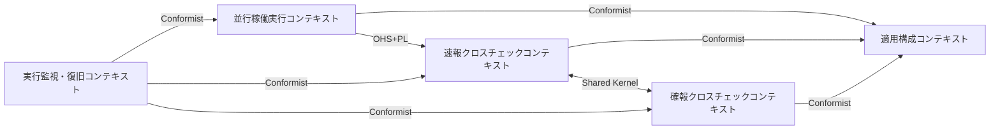
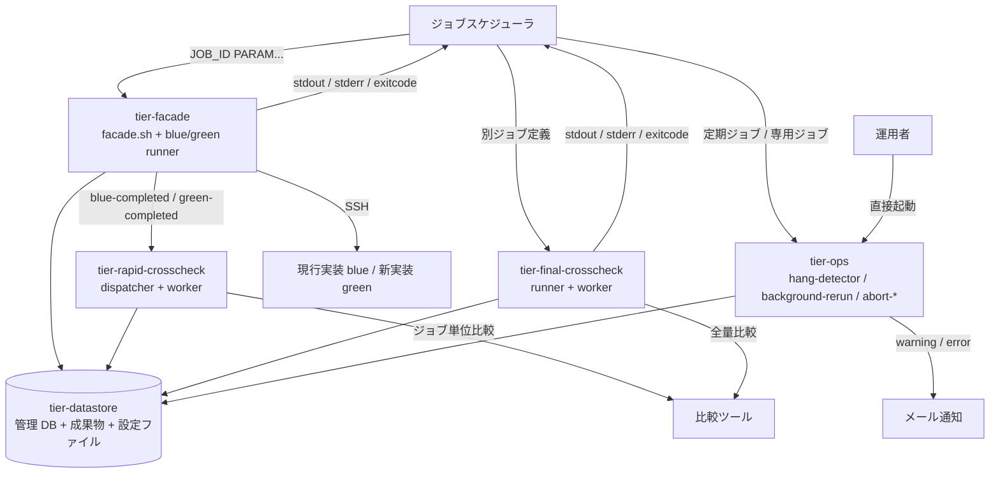
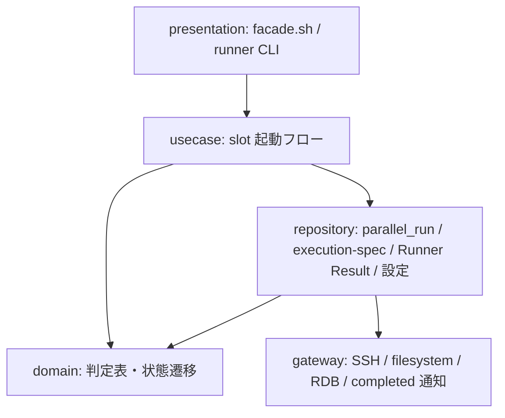
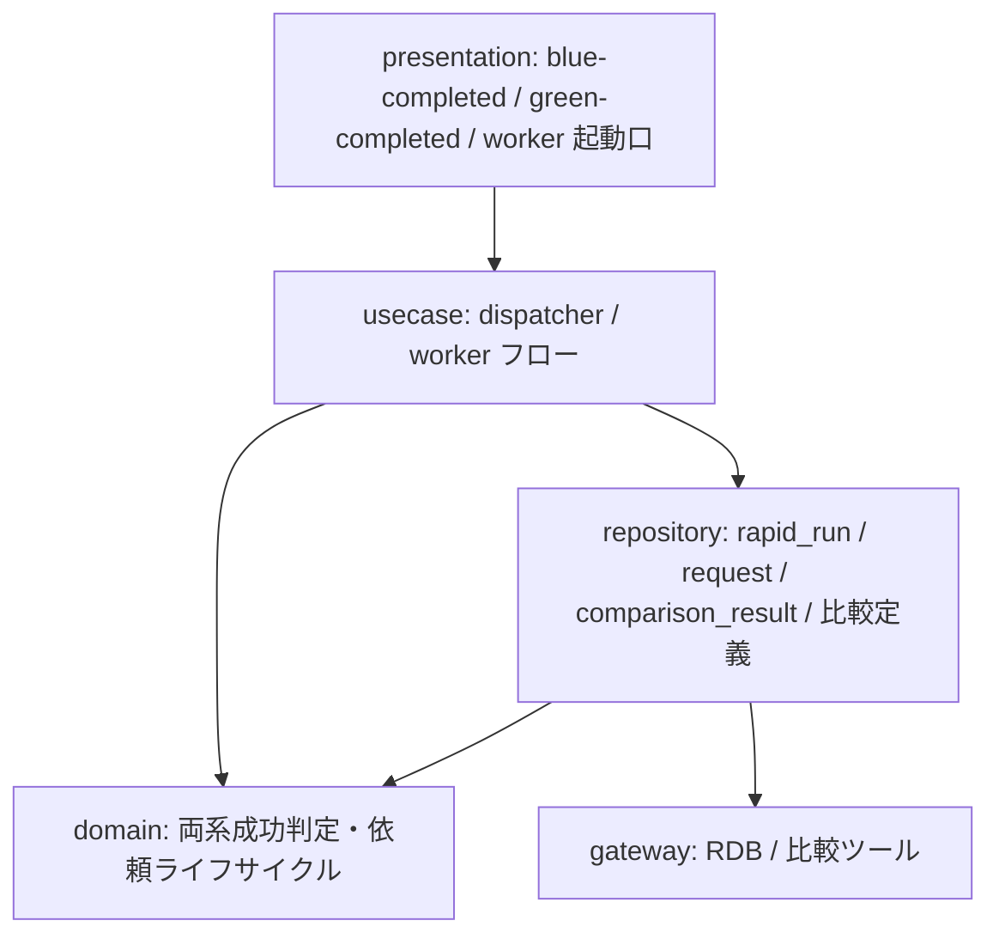
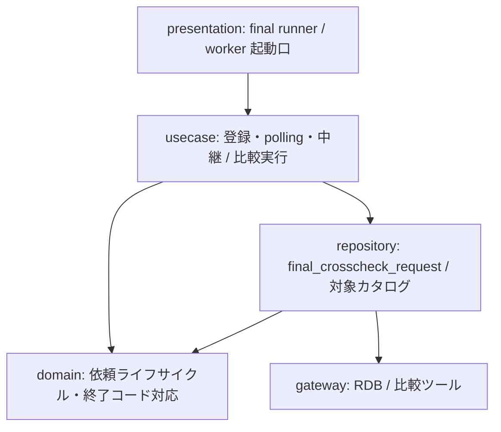
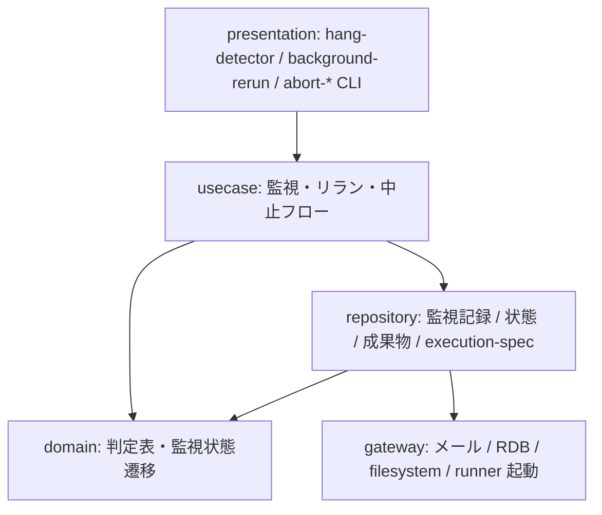
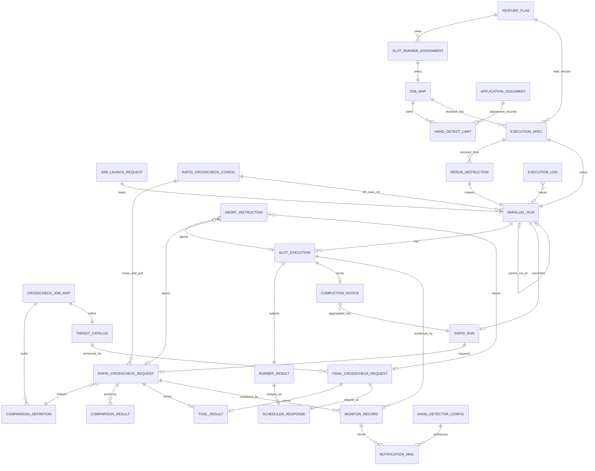

# アーキテクチャ設計書

## 概要

| 項目 | 内容 |
|------|------|
| イベントID | 20260908_015000_feedback_slot_status_wording |
| 作成日時 | 2026-09-08T01:50:00Z |
| ソース | RDRA 差分 20260908_011000_feedback_slot_status_wording に基づくアーキテクチャ再評価(条件「slot 実行の状態導出規則」の管理 DB 側文言の追従: slot_executions.status は aborted.txt / exitcode.txt 公開時点の状態を条件付き更新(RUNNING のときだけ)で一度だけ書き、abort 後は ABORTED のまま残してファイル正本へ再同期しない。実装挙動は不変) |
| 言語 | bash(シェルスクリプト。facade / runner / worker / 監視 / 復旧の全スクリプト), SQL(管理 DB のジョブキュー操作。RDB クライアント CLI 経由), JavaScript(CommonJS。BDD の step 定義のみ。実行時には使用しない) |
| フレームワーク | なし(フレームワーク非採用。bash 標準コマンド + ssh + RDB クライアント CLI + OS のメール送信コマンドで構成) |
| 技術的制約 | エアーギャップ環境のオンプレミス Linux。実行時にインターネット接続・外部 SaaS を要求しない, UI 画面を持たない。CLI(標準出力・標準エラー・終了コード)と定期ジョブとメール通知だけで動作する。presentation 系 tier(frontend / web / ui)は作らない, HTTP API は無い。IdP / API Gateway / 認可サービスは導入しない(SSH 鍵と OS 権限のみ), 方針資料の C2/C3/C4 構成(facade / slot runner / rapid-crosscheck runner・worker / final-crosscheck runner・worker / hang-detector / background-rerun / abort-*)と Runner Result Contract(stdout.log / stderr.log / exitcode.txt + execution-spec.json)を spec 都合で変更しない, 設定契約(feature flag / slot ジョブマップ / クロスチェックジョブマップ / 適用文書)の設定所有区分を維持する, 管理 DB は RDB 1 種(ジョブキュー兼管理 DB)。速報側と確報側のデータモデルを分離する, 成果物に特定案件の固有名(製品名・サーバ名・業務名)を記載しない(中立表現), 実行履歴・監査の正本はジョブスケジューラ。relay-gate はファイル(成果物・実行ログ)と管理レコードを残すだけ |

## ドメインアーキテクチャ

### コンテキストマップ図

### サブドメイン分類

| ID | 名前 | 分類 | 投資方針 | 関連 BUC | confidence | 根拠 |
|----|------|:----:|---------|---------|:----------:|------|
| SD-001 | 実装切替(ストラングラーファサード) | core | 最優先で深いモデリングと継続的リファクタリングに投資。チーム最強の人材を配置 | 実装切替ジョブ実行フロー | 中 | システム概要が「feature flag 付きストラングラーファサード型の実行基盤」を目的そのものとしており、同一ジョブ定義から blue / green を並行稼働させ foreground 結果だけを中継する仕組みが差別化の核であるため |
| SD-002 | クロスチェック(整合性検証) | core | 最優先で深いモデリングと継続的リファクタリングに投資。チーム最強の人材を配置 | 速報クロスチェックフロー, 確報クロスチェックフロー | 中 | 並行稼働の目的は整合性を検証しながら段階的に切り替えることであり、速報(原因調査)と確報(リリース判断の正本)の二段構えの比較規約が基盤の価値を決めるため。比較ツール自体は外部システムに委譲する |
| SD-003 | background 実行の監視と復旧 | supporting | good enough な品質で安定運用。標準的なフレームワーク採用 | background 実行監視フロー, 実行中止フロー, background 側リランフロー | 中 | ジョブスケジューラのジョブステータスに現れない background 異常を補完する運用機能であり、監視は通知のみ・復旧は運用者判断という限定責務のため supporting とする |
| SD-004 | 適用構成の定義 | supporting | good enough な品質で安定運用。標準的なフレームワーク採用 | 適用構成定義フロー | 中 | feature flag・ジョブマップ・比較定義・適用文書の設定契約を保守する業務で、案件ごとの差し替えを支える。設定所有区分の分離が主要関心であり、差別化要因ではない |

### 境界づけられたコンテキスト (Bounded Context)

| ID | 名前 | 所属 SD | 所有 entity | 所有 BUC | チーム | confidence | 根拠 |
|----|------|:------:|-----------|---------|--------|:----------:|------|
| BC-001 | 並行稼働実行コンテキスト | SD-001 | E-009, E-010, E-011, E-012, E-013, E-014, E-025 | 実装切替ジョブ実行フロー | - | 中 | 状態モデル「並行稼働実行」「slot 実行」が独立して閉じ、facade と slot runner が扱う語彙(run / slot / mode / Runner Result)が他コンテキストと異なるため |
| BC-002 | 速報クロスチェックコンテキスト | SD-002 | E-015, E-016, E-017, E-018 | 速報クロスチェックフロー | - | 中 | 方針資料が「速報と確報の比較規約はそれぞれ別ドメインが所有する」と明示し、rapid_run / rapid_crosscheck_request / comparison_result のモデルが確報側と分離されているため |
| BC-003 | 確報クロスチェックコンテキスト | SD-002 | E-019, E-020 | 確報クロスチェックフロー | - | 中 | 条件「速報と確報のモデル分離」により final_crosscheck_request と対象カタログを用い、速報側の rapid_run / rapid_crosscheck_request を作成・変更しないと定義されているため独立 BC とする |
| BC-004 | 実行監視・復旧コンテキスト | SD-003 | E-021, E-022, E-023, E-024 | background 実行監視フロー, 実行中止フロー, background 側リランフロー | - | 中 | 状態モデル「監視状態」が独立し、hang-detector / background-rerun / abort-* が通常起動の facade から分離された運用スクリプト群として方針資料に定義されているため |
| BC-005 | 適用構成コンテキスト | SD-004 | E-001, E-002, E-003, E-004, E-005, E-006, E-007, E-008, E-026, E-027 | 適用構成定義フロー | - | 中 | 基盤適用設計者だけが扱う設定契約の語彙(feature flag / ジョブマップ / 比較定義 / ハング検知定期ジョブ設定 / 速報クロスチェック設定 / 適用文書)で閉じており、実行系コンテキストは読み取り専用で従うため |

#### ユビキタス言語

**BC-001 並行稼働実行コンテキスト**

| 用語 | 定義 |
|------|------|
| run | 1 回の並行稼働。run_id({ローカルタイムゾーンの yyyymmddThhmmss}-{job_id}-{8 桁 hex 乱数}。facade がモードによらず発行する)で成果物・rapid_run・比較依頼を相関付ける。parent_run_id でリラン系譜を追跡する |
| slot | 実装系統(blue / green)の枠。feature flag で実行モード(foreground / background / off)を選ぶ。foreground は同時に 1 slot だけ |
| Runner Result | slot runner が成果物ディレクトリに残す stdout.log / stderr.log / exitcode.txt(+ started-at.txt。明示中止時のみ aborted.txt)。外部 IF の正本であり、slot 実行の状態は exitcode.txt / aborted.txt の有無と値から導出する |
| execution-spec | run 開始時にジョブマップから解決して一度だけ確定保存する実行設定。以後のジョブマップ変更に影響されない |

**BC-002 速報クロスチェックコンテキスト**

| 用語 | 定義 |
|------|------|
| 完了通知 | blue / green runner が自系統の公開 function(blue-completed / green-completed)で送る一方向の完了結果。相手側の状態も自 slot の中止状態(aborted.txt の有無)も判断せず、中止後に実装が走り切った場合も通常どおり送る |
| 両系成功 | blue と green の両方が exitcode 0 で完了した状態。このときに限り速報比較依頼を 1 件だけ作成する。ただし中止済み run(並行稼働実行が ABORTED、または完了通知の対象 slot の slot 実行が ABORTED(成果物ディレクトリに aborted.txt が公開済み)のいずれか)では両系成功でも依頼を作成せず、完了事実だけを記録して実行ログに警告を残す。判定材料は管理 DB の parallel_run.status と slot_executions.status(aborted.txt のミラー)で、この判断は dispatcher(速報クロスチェック runner)が行う |
| 比較依頼 | 管理 DB 上のジョブキューのレコード。速報では run_id を主キーとし、worker が claim / lease で多重実行を防ぐ |

**BC-003 確報クロスチェックコンテキスト**

| 用語 | 定義 |
|------|------|
| 確報比較依頼 | business_date と対象カタログの版で登録する日次全量比較の依頼。runner が終端状態まで同期 polling し、保存済み stdout / stderr / exitcode だけを中継する |
| 対象カタログ | 全テーブル・全ファイルを target_type / target_identifier と版で定義する比較対象の一覧。リリース判断の正本となる比較範囲 |

**BC-004 実行監視・復旧コンテキスト**

| 用語 | 定義 |
|------|------|
| ハング疑い | exitcode.txt が未出力のまま started-at.txt からの経過時間が hang_detect_limit_minutes を超えた background role。warning で通知するが状態は変更しない |
| 明示中止 | 運用者がプロセス停止を自身で確認し、中止スクリプトに yes と答えて ABORTED へ更新すること。中止できる状態は background slot 実行と確報比較依頼が RUNNING のみ、速報比較依頼は REQUESTED / CLAIMED / RUNNING のいずれか(abort-rapid-crosscheck。CLAIMED を放置すると lease 失効で再 claim されるため運用者が止める手段として必要)。slot の中止は成果物ディレクトリへの aborted.txt 書き込みを正本とし、RAPID_CROSSCHECK_MODE が off 以外なら管理 DB の状態も更新する。abort-blue / abort-green は run の中止として、対象 run に REQUESTED で未着手(worker が claim していない)の速報比較依頼があればそれも ABORTED にする。これは両系の完了通知で依頼が作成された直後に slot を中止した場合の競合窓を塞ぐ保険であり、dispatcher 側の中止済み run 判定と併用する(CLAIMED / RUNNING の依頼は abort-rapid-crosscheck の対象)。スクリプトはプロセスを停止しない |
| background 側リラン | 完了済みまたは明示中止済みの background slot / 速報比較依頼を、元の execution-spec.json から新しい run_id で再実行すること |

**BC-005 適用構成コンテキスト**

| 用語 | 定義 |
|------|------|
| feature flag | 9 キー(BLUE_MODE / GREEN_MODE / RAPID_CROSSCHECK_MODE / BLUE_IMPL / GREEN_IMPL / BLUE_RUNNER / GREEN_RUNNER / RAPID_CROSSCHECK_RUNNER / RAPID_CROSSCHECK_WORKER)で slot ごとの実行モード・実装版・runner 実体・速報クロスチェックモード(foreground / background / off)と完了通知先・worker 実体を切り替える正本。設定版は持たない。運用モード(並行稼働 / 単独本番 / 次世代並行稼働)を組み合わせで表現する |
| ジョブマップ | JOB_ID から実行先(host・user・work_dir・script・fixed_params・hang_detect_limit_minutes)を slot ごとに解決する正本。1 行目ヘッダーの CSV(1 行 1 job_id)で、credential_ref / map_version は末尾の任意列 |
| 速報クロスチェック設定 | 速報クロスチェック用の env 設定ファイル(rapid-crosscheck.env)。管理 DB 接続参照名(RAPID_DB_CONN_REF。値は置かず参照名のみ)・lease 期間(RAPID_LEASE_SEC)・worker の poll 間隔(RAPID_POLL_INTERVAL_SEC)を保持し、facade・slot runner・速報クロスチェック runner・worker が読む。RAPID_CROSSCHECK_MODE=off では不要。ハング検知定期ジョブ設定と同型だが所有項目と読み手が異なるため別ファイル |
| 設定所有区分 | 各設定項目の正本をどこ(feature flag / slot ジョブマップ / クロスチェックジョブマップ / ハング検知定期ジョブ設定 / 速報クロスチェック設定 / 適用文書)が所有するかの区分 |

### コンテキストマップ

| ID | from BC | to BC | パターン | 方向 | 翻訳責務 | 統合イベント | confidence |
|----|---------|-------|:-------:|:----:|---------|--------------|:----------:|
| CM-001 | BC-001 | BC-005 | conformist | downstream | BC-001(並行稼働実行)は BC-005 の設定契約(feature flag / slot ジョブマップ)をそのまま読み込み従う。翻訳層は持たず、run 開始時に execution-spec.json へ確定保存することで以後の変更から隔離する | - | 中 |
| CM-002 | BC-001 | BC-002 | ohs | upstream | BC-001 が Runner Result Contract と完了通知の公開 function(blue-completed / green-completed)を公開言語として提供し、BC-002 が受け取る。runner は相手側の状態や比較依頼の要否を判断しない | blue-completed, green-completed | 中 |
| CM-003 | BC-002 | BC-003 | shared_kernel | symmetric | クロスチェック依頼のライフサイクル(REQUESTED / CLAIMED / RUNNING / SUCCEEDED / FAILED / ABORTED)、claim / lease 規則、比較ツール終了コード契約(0 / 3 / 6)を共有する。データモデル(レコード)は共有しない | - | 中 |
| CM-004 | BC-004 | BC-001 | conformist | downstream | BC-004(監視・復旧)は BC-001 の成果物(started-at.txt / exitcode.txt / execution-spec.json)と slot 実行・parallel_run の状態をそのまま読み、監視は通知のみ、中止は状態更新のみ、リランは execution-spec.json からの復元で新 run を作る | - | 中 |
| CM-005 | BC-004 | BC-002 | conformist | downstream | BC-004 は速報比較依頼の状態と終了コードを読み取り異常を通知し、abort-rapid-crosscheck で REQUESTED / CLAIMED / RUNNING の速報比較依頼を(運用者の worker 停止確認のうえ status IN (REQUESTED, CLAIMED, RUNNING) を条件とする条件付き UPDATE で)ABORTED に、abort-blue / abort-green で対象 run の REQUESTED(未着手)の速報比較依頼を競合窓の保険として ABORTED に更新し、background-rerun(--role rapid-crosscheck)で新 run_id の速報比較依頼を作成する。比較の要否判断(中止済み run の除外を含む)は BC-002 の dispatcher が持ち、CLAIMED で中止された依頼の比較を開始しない規則(CLAIMED → RUNNING の条件付き UPDATE が 0 件なら終了)は BC-002 の worker が持つ。BC-004 は状態遷移規則に従って更新するだけ | - | 中 |
| CM-006 | BC-004 | BC-003 | conformist | downstream | BC-004 は abort-final-crosscheck で RUNNING の確報比較依頼を ABORTED に更新するだけ。確報の再実行はジョブスケジューラの正規ジョブに委ね、background-rerun の対象にしない | - | 中 |
| CM-007 | BC-002 | BC-005 | conformist | downstream | BC-002 は BC-005 のクロスチェックジョブマップ(job_id ごとの比較定義)を読み、比較ツールの起動コマンド・比較対象・オプションをそのまま用いる | - | 中 |
| CM-008 | BC-003 | BC-005 | conformist | downstream | BC-003 は BC-005 の対象カタログ(版付き)を読み、確報比較依頼に版を紐付けて全量比較の範囲を確定する | - | 中 |

### 集約境界の仮説

> 注: これらは戦略段階の仮説です。最終確定は dist-spec or ddd-tactical-implementation で行います。

| ID | BC | root entity | members | invariants | confidence | 備考 |
|----|----|-----------|---------|-----------|:----------:|------|
| AG-001 | BC-001 | E-013 | E-014, E-010, E-011, E-012 | • blue と green の両方が foreground の構成は許可しない(入力検証でエラー終了し、どの slot も起動しない) • background slot をすべて起動してから foreground slot を起動し、foreground の PID だけを待機する • execution-spec.json は run 開始時に一度だけ確定保存し、以後上書きしない。認証情報の値は保存しない • slot 実行終了時に stdout.log / stderr.log / exitcode.txt が揃う。exitcode.txt は数値 1 行で runner の終了コードと一致する • ジョブスケジューラへの応答は foreground slot の Runner Result のみ。background と速報の結果は反映しない | 低 | 仮説。最終確定は dist-spec または ddd-tactical-implementation で行う。RAPID_CROSSCHECK_MODE=off では parallel_run を作成せず成果物ファイルだけで動作するため、root の永続化有無はモードに依存する |
| AG-002 | BC-002 | E-016 | E-015, E-017, E-018 | • blue と green の両方が成功(exitcode 0)したときに限り速報比較依頼を作成する • 中止済み run(並行稼働実行が ABORTED、または完了通知の対象 slot の slot 実行が ABORTED(aborted.txt 公開済み))では両系成功でも速報比較依頼を作成しない。完了事実(blue_status / green_status / 成果物 URI)だけを rapid_run に記録し、実行ログに警告を残す。判定材料は parallel_run.status と slot_executions.status • 1 つの run_id に対する速報比較依頼は完了順にかかわらず 1 件だけ(run_id 主キー) • claim 中(lease 有効)の依頼は他 worker が取得できない。lease 失効かつ未開始なら REQUESTED に戻す。lease 期間と poll 間隔は速報クロスチェック設定から読む • REQUESTED で未着手の速報比較依頼は対象 run の abort-blue / abort-green(競合窓の保険)または abort-rapid-crosscheck で ABORTED になる。CLAIMED / RUNNING の依頼は abort-rapid-crosscheck だけが ABORTED にする(確報比較依頼は RUNNING のみ) • CLAIMED から RUNNING への遷移は status = CLAIMED を条件とする条件付き UPDATE で行い、更新件数が 0 件(ABORTED 済み)なら worker は比較を開始しない • 依頼状態は比較ツールの exitcode に従う(0=SUCCEEDED / 非 0・実行エラー=FAILED) | 低 | 仮説。最終確定は dist-spec または ddd-tactical-implementation で行う。rapid_run と rapid_crosscheck_request を同一集約に置くか(両系成功→依頼作成の原子性)、依頼を別集約にするか(worker の claim 競合)は実装時に再判断する |
| AG-003 | BC-003 | E-019 | E-020 | • 確報比較依頼は business_date と対象カタログの版を持って REQUESTED で登録する • ジョブスケジューラへ返すのは保存済みの stdout / stderr / exitcode だけ。状態名や差分件数・レポート URI は返さない • rapid_run / rapid_crosscheck_request を作成・変更しない | 低 | 仮説。最終確定は dist-spec または ddd-tactical-implementation で行う |
| AG-004 | BC-004 | E-021 | E-022 | • 監視は monitor_status / hang_suspected_at / alerted_at を記録し通知するだけ。RUNNING を ABORTED にせず、プロセスを停止せず、新しい実行依頼を作成しない • hang_detect_limit_minutes が 0 の role と foreground role は検知対象外 • ハング疑いは warning、background 実行エラーと速報クロスチェック異常は error | 低 | 仮説。最終確定は dist-spec または ddd-tactical-implementation で行う。リラン指示・中止指示は状態更新の指示であり、集約というより並行稼働実行 / 依頼に対するコマンドとして扱う可能性が高い |
| AG-005 | BC-005 | E-003 | E-004 | • JOB_ID の行がジョブマップに存在するときのみ実行先を解決できる。未定義なら runner は非 0 の exitcode.txt と原因を含む stderr.log を出力する • 固定引数は JSON 配列で引数の数と空白・カンマを維持し、その後ろに PARAM を順序を変えずに連結する。空の固定引数は [] • hang_detect_limit_minutes の変更は次回以降の run の execution-spec.json にのみ反映される | 低 | 仮説。最終確定は dist-spec または ddd-tactical-implementation で行う。設定はファイルとして版管理されるため、集約というより不変の設定スナップショットとして扱う |

## システムアーキテクチャ

### システム構成図

### ティア構成

| ID | ティア名 | 説明 | テクノロジー候補 |
|-----|---------|------|----------------|
| tier-facade | facade / slot runner ティア | ジョブスケジューラの業務ジョブから JOB_ID [PARAM...] で同期起動される CLI。facade.sh が feature flag(9 キー)で slot と mode を選択し、run_id を発行して blue / green slot runner を起動し、foreground の Runner Result だけを中継する。slot runner はジョブマップ(CSV)で実行先を解決し、SSH で実装スクリプトを実行して Runner Result を出力し、速報有効時(RAPID_CROSSCHECK_MODE が foreground / background)に RAPID_CROSSCHECK_RUNNER へ完了通知を送る。速報有効時の管理 DB 接続参照名は速報クロスチェック設定(rapid-crosscheck.env)から読み、off では読まない | シェルスクリプト CLI(bash), SSH クライアント(リモート実行ホストへの実装スクリプト起動), ローカル / 共有ファイルシステム(成果物ディレクトリ facade/<run_id>/), RDB クライアント CLI(速報有効時のみ parallel_run を作成。接続先は速報クロスチェック設定の RAPID_DB_CONN_REF で解決) |
| tier-rapid-crosscheck | 速報クロスチェックティア | rapid-crosscheck-runner(dispatcher。runner から完了通知を受ける一回ごとの起動スクリプト)と rapid-crosscheck-worker(管理 DB のジョブキューを継続的に poll / claim し、比較ツールでジョブ単位比較を実行して結果を登録する worker)で構成する。管理 DB 接続参照名・lease 期間・worker の poll 間隔は速報クロスチェック設定(rapid-crosscheck.env)から読む | シェルスクリプト CLI(bash。dispatcher は都度起動、worker は常駐ループまたは定期起動。poll 間隔は速報クロスチェック設定の RAPID_POLL_INTERVAL_SEC), RDB クライアント CLI(ジョブキュー: rapid_run / rapid_crosscheck_request / comparison_result。接続先は速報クロスチェック設定の RAPID_DB_CONN_REF で解決), 比較ツール起動アダプタ(job_id ごとの比較定義に従うコマンド実行) |
| tier-final-crosscheck | 確報クロスチェックティア | ジョブスケジューラの別ジョブ定義から起動される final-crosscheck-runner(依頼登録 → 終端状態まで同期 polling → 保存済み結果の中継)と、DB セグメントで依頼を poll / claim して全テーブル・全ファイルの日次全量比較を実行する final-crosscheck-worker で構成する | シェルスクリプト CLI(bash。runner は都度起動、worker は DB セグメント上の常駐ループまたは定期起動), RDB クライアント CLI(ジョブキュー: final_crosscheck_request / 対象カタログ), 比較ツール起動アダプタ(対象カタログに基づく全量比較) |
| tier-ops | 実行監視・復旧ティア | hang-detector(ジョブスケジューラの定期ジョブ)、background-rerun(専用ジョブ)、abort-blue / abort-green / abort-rapid-crosscheck / abort-final-crosscheck(運用者が配置ディレクトリから直接起動する対話 CLI)で構成する。監視は通知のみ、中止は状態更新(slot は aborted.txt の書き込みを正本とする)のみ、リランは execution-spec.json からの復元で行う。通知先・送信コマンド・件名プレフィックス・管理 DB 接続参照名はハング検知定期ジョブ設定から読む | シェルスクリプト CLI(bash。定期ジョブ / 専用ジョブ / 対話 CLI), OS 標準のメール送信コマンド(warning / error 通知。コマンドと宛先はハング検知定期ジョブ設定で指定), RDB クライアント CLI(監視記録・状態更新・parallel_run 作成。RAPID_CROSSCHECK_MODE=off では使わない), ファイルシステム走査・書き込み(started-at.txt / exitcode.txt / aborted.txt / execution-spec.json) |
| tier-datastore | データストアティア | 管理 DB(RDB。relay-gate 内部のジョブキュー兼管理 DB。外部システムではない)、成果物ディレクトリ(facade/<run_id>/ 配下の Runner Result と execution-spec.json)、設定ファイル(feature flag / ジョブマップ / クロスチェックジョブマップ / 対象カタログ / ハング検知定期ジョブ設定 / 速報クロスチェック設定 / 適用文書)、実行ログファイルで構成する | RDB(単一インスタンス。速報側と確報側のテーブルを分離), ローカル / 共有ファイルシステム(成果物ディレクトリ・設定ファイル・実行ログ) |

### facade / slot runner ティア (tier-facade) の方針・ルール

#### 方針

| ID | 方針名 | 内容 | 根拠 | RDRA/NFR 要素 | 確信度 |
|-----|---------|------|------|--------------|:------:|
| SP-001 | facade の責務限定と slot 選択 | facade は JOB_ID [PARAM...] だけを受け取り、feature flag 設定(BLUE_MODE / GREEN_MODE / RAPID_CROSSCHECK_MODE / BLUE_IMPL / GREEN_IMPL / BLUE_RUNNER / GREEN_RUNNER / RAPID_CROSSCHECK_RUNNER / RAPID_CROSSCHECK_WORKER の 9 キー。設定版は持たない)を起動のたびに読み込んで blue / green slot ごとに foreground / background / off を選択する。元資料の 9 キーは未知キーとして警告しない。比較対象や実装固有の起動方式は判断せず、設定された runner を起動するだけとする。off の slot は起動しない | 条件「facade の責務限定」「slot 起動可否判定」により、ジョブスケジューラ側の定義を実装非依存に保ち runner の差し替えだけで世代交代を可能にするため | 外部システム: ジョブスケジューラ, 情報: ジョブ起動要求, feature flag 設定, 条件: facade の責務限定, slot 起動可否判定, 実装固有事項の runner への閉じ込め, BUC: 実装切替ジョブ実行フロー | 高 |
| SP-002 | foreground slot 排他の入力検証 | blue と green の両方が foreground に設定された構成は入力検証で検出し、どの slot も起動せずエラー終了する。foreground は同時に 1 slot だけ許可する | 条件「foreground slot 排他」。ジョブスケジューラへ返す結果は 1 系統でなければならないため | 条件: foreground slot 排他, バリエーション: slot 実行モード, 運用モード | 高 |
| SP-003 | slot 起動順序と foreground 待機 | background の slot をすべて起動して PID と成果物ディレクトリを確定してから foreground slot を起動し、すべての slot 起動後に foreground の PID だけを待機する。並行稼働実行は STARTED から RUNNING へ遷移する | 条件「slot 起動順序」。foreground が長時間実行中でも background slot を同時に実行させるため | 条件: slot 起動順序, 状態: 並行稼働実行, slot 実行 | 高 |
| SP-004 | ジョブスケジューラ応答の無加工中継 | foreground slot の stdout.log / stderr.log / exitcode.txt をそのまま標準出力・標準エラー・終了コードとしてジョブスケジューラへ中継し、中継完了で並行稼働実行を COMPLETED にする。background slot と速報クロスチェックの結果は応答に含めず待機もしない | 条件「ジョブスケジューラ応答の決定」「速報結果の位置付け」。並行稼働中も単独本番中も運用者が同じ見え方で結果を判定できるようにするため | 条件: ジョブスケジューラ応答の決定, 速報結果の位置付け, 情報: ジョブスケジューラ応答, アクター: 運用者, NFR B.2.1.1 | 高 |
| SP-005 | 確報クロスチェックの非起動 | 確報クロスチェックの制御は feature flag に含めず、facade は確報クロスチェックを起動しない。確報はジョブスケジューラの別ジョブ定義から final-crosscheck-runner を直接起動する | 条件「確報クロスチェック非起動」。確報は日次処理後の別タイミングで全量比較を行うため | 条件: 確報クロスチェック非起動, バリエーション: ジョブスケジューラ起動ジョブ種別 | 高 |
| SP-006 | ジョブマップによる実行先解決と引数連結 | slot runner は自 slot のジョブマップ(1 行目ヘッダーの CSV。列は job_id / host / user / work_dir / script / fixed_params / hang_detect_limit_minutes。credential_ref / map_version は末尾の任意列)に JOB_ID の行が存在するときのみ実行先を解決する。host / user はローカル実行の slot では省略できる。fixed_params は JSON 配列文字列を格納する CSV セル(二重引用符で囲み、セル内の二重引用符は二重化。空は [])で、bash 単独でクォートを解析する。固定引数の後ろに PARAM を順序を変えずに連結し、引数の数と空白・カンマを維持する。JOB_ID 未定義なら非 0 の exitcode.txt と原因を含む stderr.log を出力して終了する | 条件「ジョブマップ解決条件」「引数連結規則」。ジョブスケジューラ側の定義に実行先を持たせないため | 条件: ジョブマップ解決条件, 引数連結規則, 情報: ジョブマップ, slot runner 割当, 外部システム: リモート実行ホスト(SSH), 現行実装(blue), 新実装(green) | 高 |
| SP-007 | execution-spec の一度きりの確定保存 | run 開始時(並行稼働実行の STARTED 遷移時)に解決済みの実行設定・追加引数・マップ版(ジョブマップ側の任意列 map_version)・実装版(feature flag の BLUE_IMPL / GREEN_IMPL)・role ごとの hang_detect_limit_minutes を facade/<run_id>/execution-spec.json として一時ファイル経由で一度だけ保存する。以後ジョブマップを変更しても上書きしない。認証情報は値を保存せず参照名だけを保存する | 条件「実行設定の確定条件」「認証情報の非保存」。ハング検知の判定基準・リランの再現性・障害調査の根拠とするため | 条件: 実行設定の確定条件, 認証情報の非保存, 情報: 実行設定(execution-spec), NFR E.5.1.1, NFR E.6.1.1 | 高 |
| SP-008 | 速報クロスチェック有効判定と完了通知の系統独立 | facade はモードによらず run_id を発行し、RAPID_CROSSCHECK_MODE が foreground または background のときのみ parallel_run を作成する。runner は完了時に RAPID_CROSSCHECK_RUNNER が指す速報クロスチェック runner の自系統の公開 function(blue-completed / green-completed)で run_id・job_id・結果を通知する。off のときは完了通知を送らず、速報管理 DB へ接続も書き込みもせず parallel_run も作成しない。完了通知の送信失敗は自動検知しない: slot runner は実行ログに警告を残し、Runner Result と終了コードは変更しない。復旧は運用者が速報クロスチェック runner を同一引数で再実行する(冪等・先勝ち)。runner は相手側の状態や比較依頼の要否を判断せず、自 slot の中止状態(aborted.txt の有無)も判断しない。中止後に実装が走り切って exitcode.txt を公開した場合も通常どおり完了通知を送り、中止済み run の扱いは速報クロスチェック runner に委ねる。速報有効時の管理 DB 接続は速報クロスチェック設定(rapid-crosscheck.env の RAPID_DB_CONN_REF)の接続参照名で解決し、認証情報の値は持たない | 条件「速報クロスチェック有効判定」「完了通知の系統独立」「完了通知失敗の扱い」「中止済み run の比較依頼作成除外」(判断主体は速報クロスチェック runner)と情報「速報クロスチェック設定」。速報 DB 接続設定なしで slot 実行できるようにし、比較規約を rapid-crosscheck 側に閉じ込めるため | 条件: 速報クロスチェック有効判定, 完了通知の系統独立, 完了通知失敗の扱い, 中止済み run の比較依頼作成除外, 情報: 完了通知, 並行稼働実行(parallel_run), feature flag 設定, 速報クロスチェック設定, 実行ログ, バリエーション: 速報クロスチェックモード, NFR C.3.1.1, NFR C.3.3.1 | 高 |

#### ルール

| ID | ルール名 | 内容 | 根拠 | RDRA/NFR 要素 | 確信度 |
|-----|---------|------|------|--------------|:------:|
| SR-001 | Runner Result 完備 | slot 実行が終了したとき成果物ディレクトリに stdout.log / stderr.log / exitcode.txt を揃える。exitcode.txt は数値 1 行で runner の終了コードと一致させる。起動失敗・ジョブマップ未定義・SSH 失敗でも可能な限り 3 ファイルを出力する。started-at.txt は起動時に出力し、aborted.txt(中止日時 1 行)は明示中止時のみ abort-blue / abort-green が出力する。slot 実行の状態はファイル正本から導出する: exitcode.txt があれば SUCCEEDED(0)/ FAILED(非 0)、無く aborted.txt があれば ABORTED、どちらも無ければ RUNNING。background slot のリラン由来 run では、runner が終端時に parallel_run を COMPLETED にする(速報有効時) | 条件「Runner Result 完備条件」「slot 実行の状態導出規則」。ジョブスケジューラ応答・完了通知・ハング検知・中止・リラン・障害調査が同じファイルを共通利用し、RAPID_CROSSCHECK_MODE=off でも状態を判定できるようにするため | 条件: Runner Result 完備条件, slot 実行の状態導出規則, 情報: Runner Result, 状態: slot 実行, 並行稼働実行, バリエーション: Runner Result 成果物種別 | 高 |
| SR-002 | 実装固有事項の runner への閉じ込め | 実装固有の起動方式・ホスト・OS・プロトコル・SSH 接続方法は slot の runner 実体スクリプトに閉じ込める。facade と速報 / 確報の比較規約、ハング検知、リラン、中止の各スクリプトは runner を差し替えても変更しない | 条件「実装固有事項の runner への閉じ込め」と NFR F.1.1.1(実装側の OS 差異は runner に閉じ込める)への対応 | 条件: 実装固有事項の runner への閉じ込め, 情報: slot runner 割当, 適用構成文書, NFR F.1.1.1, NFR D.2.1.1 | 高 |

### 速報クロスチェックティア (tier-rapid-crosscheck) の方針・ルール

#### 方針

| ID | 方針名 | 内容 | 根拠 | RDRA/NFR 要素 | 確信度 |
|-----|---------|------|------|--------------|:------:|
| SP-009 | 両系成功判定と比較依頼の一意作成 | dispatcher は完了通知を受けて rapid_run の blue_status / green_status を更新し、blue と green の両方が成功(exitcode 0)で完了したときに限り、完了順にかかわらず run_id を主キーとする速報比較依頼を 1 件だけ REQUESTED で作成する。いずれかが失敗した場合は作成しない。中止済み run(並行稼働実行(parallel_run)が ABORTED、または完了通知の対象 slot の slot 実行が ABORTED(成果物ディレクトリに aborted.txt が公開済み)のいずれか)では、完了通知を受けても両系成功でも依頼を作成せず、完了事実(blue_status / green_status と成果物 URI)だけを rapid_run に記録して実行ログに警告を残す。判定材料は管理 DB の parallel_run.status と slot_executions.status(ファイル正本 aborted.txt のミラー)。並行稼働実行は foreground slot の結果を中継した時点で COMPLETED になるため、foreground 完了後に background slot を abort-blue / abort-green で中止した典型経路は slot 実行 ABORTED の側で除外する。この判断は dispatcher が持ち、slot runner には持たせない。速報有効時(foreground / background)だけに適用する | 条件「両系成功判定」「比較依頼の一意性」「中止済み run の比較依頼作成除外」(判定キー: 並行稼働実行 ABORTED または対象 slot の slot 実行 ABORTED)。失敗結果同士や片方失敗の比較と重複作成を防ぎ、中止後に実装が走り切った run の比較を止めるため。並行稼働実行だけを見ると foreground 完了後の background 中止が除外されないため slot 実行の状態も判定材料にする。比較の要否判断を方針資料どおり速報クロスチェック側に閉じ込める | 条件: 両系成功判定, 比較依頼の一意性, 中止済み run の比較依頼作成除外, 状態: 速報実行の完了状況, 並行稼働実行, slot 実行, 情報: 速報実行(rapid_run), 速報比較依頼(rapid_crosscheck_request), 完了通知, slot 実行, 実行ログ, BUC: 速報クロスチェックフロー, NFR C.3.3.1 | 高 |
| SP-010 | worker の poll / claim / lease による多重実行防止 | worker は管理 DB を poll し、REQUESTED の依頼を worker_id と lease_until 付きで CLAIMED にする。lease 有効中は他の worker が同じ依頼を取得できない。lease が失効しかつ比較が未開始なら REQUESTED に戻し、別の worker が再取得できるようにする。lease 期間(RAPID_LEASE_SEC)と poll 間隔(RAPID_POLL_INTERVAL_SEC)は速報クロスチェック設定から読み、コードに埋め込まない。worker はサーバ追加で水平に増やせる | 条件「claim 排他」「lease 失効判定」と情報「速報クロスチェック設定」、NFR B.3.1.1(スケールアウト)への対応 | 条件: claim 排他, lease 失効判定, 状態: クロスチェック依頼, 情報: 速報クロスチェック設定, NFR B.3.1.1, NFR B.1.2.1 | 高 |
| SP-011 | 比較定義に従うジョブ単位比較と結果登録 | claim した worker は依頼を status = CLAIMED を条件とする条件付き UPDATE で RUNNING にし、更新件数が 0 件(abort-rapid-crosscheck で ABORTED 済み)なら比較を開始せず終了する(comparison_result も登録しない)。RUNNING にできたときだけクロスチェックジョブマップ(CSV)の job_id ごとの比較定義に従って比較ツールでジョブ単位比較を実行する。比較ツールの stdout / stderr / exitcode を依頼に保存し、exitcode 0 で SUCCEEDED、非 0(3=比較 NG / 6=実行エラー)または実行エラーで FAILED とする。comparison_result は比較ツールを起動して終了コードを得たときだけ登録し、比較定義なし・起動失敗では登録せず依頼だけを FAILED(exit_code=6 相当、error_summary に理由)で終端する。速報比較依頼だけを新規作成したリラン由来の parallel_run は、依頼が終端状態(SUCCEEDED / FAILED)になった時点で worker が COMPLETED にする | 条件「比較定義の選択」「依頼状態遷移規則」「比較ツール終了コードの対応」「比較結果の登録条件」「依頼中止可否判定」(CLAIMED 中止時の競合規則)と状態モデル「クロスチェック依頼」(CLAIMED → RUNNING は条件付き UPDATE)「並行稼働実行」(リラン由来 run の COMPLETED 到達)。比較実装は外部ツールに委譲し、規約だけを worker に閉じ込める。claim 後に abort-rapid-crosscheck で中止された依頼の比較を開始しないため | 条件: 比較定義の選択, 依頼状態遷移規則, 比較ツール終了コードの対応, 比較結果の登録条件, 依頼中止可否判定, 外部システム: 比較ツール, 情報: 比較定義, 比較結果(comparison_result), 比較ツール実行結果, 状態: 並行稼働実行, クロスチェック依頼 | 高 |
| SP-012 | 速報結果の位置付け(原因調査用) | 速報クロスチェックの exitcode や失敗は通常業務ジョブの結果としてジョブスケジューラへ返さない。比較結果(comparison_result)と依頼の stdout / stderr / exitcode は運用者が run_id で参照し、両実装の差分の原因調査に使う。リリース判断の正本には用いない | 条件「速報結果の位置付け」。速報は非同期の background 処理であり本番結果に影響させないため | 条件: 速報結果の位置付け, アクター: 運用者, バリエーション: 比較結果ステータス, クロスチェック種別 | 高 |

#### ルール

| ID | ルール名 | 内容 | 根拠 | RDRA/NFR 要素 | 確信度 |
|-----|---------|------|------|--------------|:------:|
| SR-003 | 速報側データモデルの所有 | rapid_run / rapid_crosscheck_request / comparison_result は速報クロスチェックティアだけが作成・更新する。確報側および facade は参照・作成しない。parallel_run の作成は facade と background-rerun が行い、速報クロスチェックティアはリラン由来 run の COMPLETED 更新だけを行う | 方針資料「速報と確報の比較規約はそれぞれ別ドメインが所有する」への対応。管理 DB は relay-gate 内部のジョブキュー兼管理 DB として速報側 / 確報側のテーブルを分離する | 条件: 速報と確報のモデル分離, システム概要: ジョブキュー兼管理 DB(内部データストア), 状態: 並行稼働実行 | 高 |

### 確報クロスチェックティア (tier-final-crosscheck) の方針・ルール

#### 方針

| ID | 方針名 | 内容 | 根拠 | RDRA/NFR 要素 | 確信度 |
|-----|---------|------|------|--------------|:------:|
| SP-013 | 確報比較依頼の登録と同期 polling | runner はジョブスケジューラから起動されたとき business_date と対象カタログの版を持つ確報比較依頼を REQUESTED で登録し、SUCCEEDED / FAILED / ABORTED の終端状態になるまで同期 polling する。日次確報は夜間バッチウィンドウ内(8 時間以内)に完了させる | 条件「確報依頼の登録条件」と NFR B.2.2.1(バッチ処理時間)への対応 | 条件: 確報依頼の登録条件, 情報: 確報比較依頼(final_crosscheck_request), 対象カタログ, 外部システム: ジョブスケジューラ, BUC: 確報クロスチェックフロー, NFR B.2.2.1 | 高 |
| SP-014 | 確報結果の無加工中継 | runner は依頼に保存された stdout / stderr / exitcode だけをそのまま標準出力・標準エラー・終了コードとしてジョブスケジューラへ返す。チェック結果・差分件数・レポート URI などの追加連携データや依頼の状態名は返さない。比較 OK=0 / 比較 NG=3(警告終了) / 実行エラー=6(エラー終了)の終了コードをそのまま中継する | 条件「確報結果の中継制約」「比較ツール終了コードの対応」。ジョブスケジューラ側の判定を比較ツールの終了コード契約に委ねるため | 条件: 確報結果の中継制約, 比較ツール終了コードの対応, 外部システム: 比較ツール, バリエーション: 比較ツール終了コード, アクター: 運用者 | 高 |
| SP-015 | 確報 worker の DB セグメント実行と claim / lease | worker は DB セグメントで管理 DB を poll し、REQUESTED の確報比較依頼を worker_id と lease_until 付きで CLAIMED にし、RUNNING で対象カタログに従う全量比較を実行して stdout / stderr / exitcode を保存する。lease 失効かつ未開始なら REQUESTED に戻す規則は速報と同一とする | 条件「依頼状態遷移規則」「claim 排他」「lease 失効判定」。DB セグメント経由の配置制約を worker 側に閉じ込めるため | 条件: 依頼状態遷移規則, claim 排他, lease 失効判定, 状態: クロスチェック依頼, 情報: 比較ツール実行結果, 適用構成文書 | 高 |

#### ルール

| ID | ルール名 | 内容 | 根拠 | RDRA/NFR 要素 | 確信度 |
|-----|---------|------|------|--------------|:------:|
| SR-004 | 速報と確報のモデル分離 | 確報クロスチェックは final_crosscheck_request と対象カタログだけを用い、rapid_run / rapid_crosscheck_request を作成・変更しない。確報の再実行はジョブスケジューラの正規ジョブを直接再実行し、background-rerun を使わない | 条件「速報と確報のモデル分離」「復旧手段の選択」への対応 | 条件: 速報と確報のモデル分離, 復旧手段の選択, バリエーション: 再実行経路 | 高 |

### 実行監視・復旧ティア (tier-ops) の方針・ルール

#### 方針

| ID | 方針名 | 内容 | 根拠 | RDRA/NFR 要素 | 確信度 |
|-----|---------|------|------|--------------|:------:|
| SP-016 | ハング検知判定と対象除外 | 定期ジョブ(5 分ごとなど)として未終端の background role を走査し、started-at.txt と execution-spec.json の hang_detect_limit_minutes から経過時間を判定する。exitcode.txt があり 0 なら正常終了、非 0 なら background 実行エラーとして通知、無く aborted.txt があれば中止済みとして監視記録を終端、どちらも無く上限以内なら継続監視、上限超過ならハング疑いとして通知する。ハング疑い通知済みの対象も再判定し、正常終了(exitcode 0)・実行エラー(非 0)・比較異常(速報比較依頼が NG / FAILED)・中止済みで監視記録を終端する。hang_detect_limit_minutes が 0 の role と foreground role は検知対象から除外する。RAPID_CROSSCHECK_MODE=off でも管理 DB なしで slot 成果物ファイルだけを走査する。完了通知の送信失敗は検知対象に含めない | 条件「ハング検知判定」「ハング検知対象の除外」「slot 実行の状態導出規則」「完了通知失敗の扱い」と状態モデル「監視状態」(通知後・中止後の終端遷移)、NFR C.1.3.1(アプリケーション監視)・C.3.1.1(自動検知+自動通知+自動記録)への対応 | 条件: ハング検知判定, ハング検知対象の除外, slot 実行の状態導出規則, 完了通知失敗の扱い, 状態: 監視状態, 情報: 監視記録, Runner Result, BUC: background 実行監視フロー, NFR C.1.3.1, NFR C.3.1.1, NFR C.1.1.1, NFR C.1.3.2 | 高 |
| SP-017 | 速報比較依頼の異常判定 | 速報比較依頼が FAILED または比較 NG のとき速報クロスチェック異常として通知し、RUNNING のときは状態を変更せずハング疑いとして通知する | 条件「速報比較依頼の異常判定」。ジョブスケジューラ応答に現れない速報異常を見落とさないため | 条件: 速報比較依頼の異常判定, バリエーション: 速報クロスチェック監視判定 | 高 |
| SP-018 | 監視は通知のみ・通知レベル・警告傾向の記録 | 監視は monitor_status(監視対象外 / 監視中 / ハング疑い通知済み / 実行エラー通知済み / 比較異常通知済み / 正常終了)/ hang_suspected_at / alerted_at を記録して運用者へメール通知するだけとし、RUNNING を ABORTED にせず、プロセスを停止せず、新しい実行依頼を作成しない。ハング疑いは warning、background 実行エラーと速報クロスチェック異常は error で送る。宛先・送信コマンド・件名プレフィックスはハング検知定期ジョブ設定(ALERT_MAIL_TO / ALERT_MAIL_CMD / ALERT_SUBJECT_PREFIX)から読む。通知後に正常終了した実行(通知後正常終了)についても警告時の経過時間を記録し、hang_detect_limit_minutes の調整根拠にする | 条件「監視は通知のみ」「通知レベルの判定」「警告傾向の記録」と情報「ハング検知定期ジョブ設定」。静観か対処かの判断を運用者に委ねるため | 条件: 監視は通知のみ, 通知レベルの判定, 警告傾向の記録, 外部システム: メール通知, 情報: 通知メール, 監視記録, ハング検知定期ジョブ設定, アクター: 運用者, バリエーション: 監視状態, NFR C.5.1.1, NFR C.3.2.1 | 高 |
| SP-019 | ハング検知上限の調整基準 | hang_detect_limit_minutes は導入時に全ジョブ 60 分とし、正常終了パターンの警告が出そろった時点で運用者がジョブごとに最後の警告の経過時間を基準に調整する。調整はジョブマップの列値を更新して行い、調整日時と調整根拠(警告時経過時間)の記録は適用構成文書に残す(ジョブマップの列には持たない)。変更は次回以降の run の execution-spec.json にのみ反映される | 条件「ハング検知上限の調整基準」と情報「適用構成文書」(運用者の調整記録)への対応 | 条件: ハング検知上限の調整基準, 情報: ハング検知上限設定, 適用構成文書, 監視記録, バリエーション: ハング検知上限設定 | 高 |
| SP-020 | background 側リランの事前検証と復元 | background-rerun は --source-run-id と --role を受け、元の execution-spec.json とファイル正本の状態(exitcode.txt / aborted.txt)を事前検証し、速報有効時は管理 DB の状態も照合する。--role blue / green は元の slot mode が background のときだけ新しい run_id で再実行し、foreground または off ならエラー終了する。--role rapid-crosscheck は業務ジョブを再実行せず速報比較依頼だけを新規作成する。未対応の role、元の実行が見つからない、元の実行が RUNNING(exitcode.txt も aborted.txt も無い)または中止未確認ならエラー終了する。RAPID_CROSSCHECK_MODE=off でも aborted.txt があれば管理 DB なしで background slot をリランできる。最新のジョブマップは再解決せず、元の execution-spec.json から実行パラメータ・host・user・script・work_dir を復元する。新しい parallel_run の parent_run_id には直前のリラン元 run_id を設定し、background slot のリラン由来 run は runner が終端時に、速報比較依頼だけのリラン由来 run は worker が依頼終端時に COMPLETED にする | 条件「リラン事前検証」「リランの実行設定復元」「リラン系譜の追跡」「slot 実行の状態導出規則」と状態モデル「並行稼働実行」(リラン由来 run の COMPLETED 到達)、NFR A.4.1.1 / A.4.1.2 / A.4.1.3(execution-spec と Runner Result からの復旧。縮退運転 off でも中止・リランが成立)への対応 | 条件: リラン事前検証, リランの実行設定復元, リラン系譜の追跡, slot 実行の状態導出規則, 情報: リラン指示, Runner Result, 状態: 並行稼働実行, BUC: background 側リランフロー, NFR A.4.1.1, NFR A.4.1.2, NFR A.4.1.3 | 高 |
| SP-021 | 復旧手段の選択 | background slot 実行と速報比較依頼は専用ジョブの background-rerun で再実行し、foreground slot 実行と確報クロスチェックはジョブスケジューラの正規ジョブを直接再実行する。RUNNING の background 実行は運用者が明示中止してからリランする | 条件「復旧手段の選択」への対応 | 条件: 復旧手段の選択, バリエーション: 再実行経路, リラン対象 role | 高 |
| SP-022 | 中止スクリプトの可否判定と停止確認応答 | abort-blue / abort-green は対象 slot が background かつ RUNNING(exitcode.txt も aborted.txt も無い)のときだけ、abort-rapid-crosscheck は対象の速報比較依頼が REQUESTED / CLAIMED / RUNNING のいずれかのとき、abort-final-crosscheck は対象の確報比較依頼が RUNNING のときだけ ABORTED へ遷移できる(確報の未着手依頼はジョブスケジューラの正規ジョブが同期 polling 中であり runner 側の polling 上限で扱う)。それ以外(終端済み、または確報で RUNNING 以外)は状態を変更せずエラー終了する。現在状態を表示後に「対象ジョブのプロセスは強制終了してありますか？ [yes/no]」と対話確認し、yes のときだけ状態を更新する。abort-rapid-crosscheck は worker のプロセス停止を運用者に確認したうえで status IN (REQUESTED, CLAIMED, RUNNING) を条件とする条件付き UPDATE で ABORTED にする(CLAIMED を放置すると lease 失効で REQUESTED に戻り別の worker が再 claim して比較が実行されるため、中止済み run の依頼を運用者が止める手段。claim 済み worker は RUNNING への条件付き UPDATE が 0 件になり比較を開始しない)。slot の中止は成果物ディレクトリへ aborted.txt(中止日時 1 行)を一時ファイル経由で書くことを正本とし、RAPID_CROSSCHECK_MODE が off でも成立する。off 以外なら管理 DB の slot 実行と並行稼働実行(STARTED / RUNNING のどちらからでも)も ABORTED に更新し、対象 run に REQUESTED で未着手(worker が claim していない)の速報比較依頼があればそれも ABORTED にする(両系の完了通知で依頼が REQUESTED で作成された直後に slot を中止した場合の競合窓を塞ぐ保険。dispatcher 側の中止済み run 判定(SP-009)と併用する。CLAIMED / RUNNING の依頼は変更せず abort-rapid-crosscheck の対象とする。速報比較依頼のみで確報比較依頼には適用しない)。スクリプト自身はプロセス・Pod・SSH 接続先の処理を停止しない。指示者と応答は実行ログに残す | 条件「slot 中止可否判定」「依頼中止可否判定」(速報比較依頼は REQUESTED / CLAIMED / RUNNING、確報比較依頼は RUNNING のみ。CLAIMED 中止時の競合規則)「停止確認応答」「slot 実行の状態導出規則」と状態モデル「並行稼働実行」(STARTED → ABORTED)「クロスチェック依頼」(REQUESTED / CLAIMED / RUNNING → ABORTED)、バリエーション「中止対象種別」、NFR E.7.1.1(運用操作の記録)・A.4.1.3(縮退運転 off でも中止が成立)・C.3.3.1(手動復旧)への対応。CLAIMED の依頼を運用者が止められず lease 失効後に比較が実行される抜けと、両 slot 完了直後に中止した場合に未着手依頼だけが残る競合窓を塞ぐため | 条件: slot 中止可否判定, 依頼中止可否判定, 停止確認応答, slot 実行の状態導出規則, 中止済み run の比較依頼作成除外, 情報: 中止指示, Runner Result, 速報比較依頼(rapid_crosscheck_request), 確報比較依頼(final_crosscheck_request), BUC: 実行中止フロー, 状態: slot 実行, 並行稼働実行, クロスチェック依頼, バリエーション: 中止対象種別, 停止確認応答, NFR E.7.1.1, NFR A.4.1.3, NFR C.3.3.1 | 高 |

#### ルール

| ID | ルール名 | 内容 | 根拠 | RDRA/NFR 要素 | 確信度 |
|-----|---------|------|------|--------------|:------:|
| SR-005 | 監視・復旧スクリプトの facade からの分離 | hang-detector / background-rerun / abort-* は通常起動の facade から分離し、ジョブスケジューラの別ジョブ定義または運用者の直接起動で動かす。facade の実行経路にこれらの処理を混ぜない | 方針資料「ハング監視と background 側の選択リランは通常起動の facade から分離する」への対応 | バリエーション: ジョブスケジューラ起動ジョブ種別, 外部システム: ジョブスケジューラ | 高 |

### データストアティア (tier-datastore) の方針・ルール

#### 方針

| ID | 方針名 | 内容 | 根拠 | RDRA/NFR 要素 | 確信度 |
|-----|---------|------|------|--------------|:------:|
| SP-023 | 管理 DB をジョブキューとして使う | MQ を導入せず、管理 DB の依頼レコード(rapid_crosscheck_request / final_crosscheck_request)を worker が poll / claim するジョブキューとして使う。速報側(parallel_run / rapid_run / rapid_crosscheck_request / comparison_result)と確報側(final_crosscheck_request / 対象カタログ)のテーブルを分離し、監視記録もここに保持する | システム概要で管理 DB(RDB)が relay-gate 内部のジョブキュー兼管理 DB と定義され、NFR B.2.1.2(〜10 TPS)の低頻度書き込みで十分なため。エアーギャップ環境で追加ミドルウェアを増やさない | システム概要: ジョブキュー兼管理 DB(内部データストア), 条件: 速報と確報のモデル分離, claim 排他, NFR B.2.1.2, NFR B.1.1.1, NFR B.1.1.3, NFR A.2.5.1 | 高 |
| SP-024 | 成果物ファイルを外部 IF の正本にする | Runner Result(started-at.txt / stdout.log / stderr.log / exitcode.txt。中止時のみ aborted.txt)と execution-spec.json はファイルとして成果物ディレクトリに残し、ジョブスケジューラ応答・完了通知・ハング検知・中止・リラン・障害調査が共通に参照する。slot 実行の状態はこのファイル正本から導出し、RAPID_CROSSCHECK_MODE=off では管理 DB なしにファイルだけで slot 実行・監視・中止・リランが成立する | Runner Result Contract と条件「実行履歴はジョブスケジューラの責務」「slot 実行の状態導出規則」への対応。DB 喪失時も execution-spec.json と Runner Result からリランできる(NFR A.3.1.1 / A.4.1.1 / A.4.1.3) | 情報: Runner Result, 実行設定(execution-spec), 条件: 実行履歴はジョブスケジューラの責務, slot 実行の状態導出規則, NFR A.3.1.1, NFR A.3.1.2, NFR A.4.1.1, NFR A.4.1.3, NFR F.1.2.2 | 高 |
| SP-025 | 設定所有区分に基づく設定ファイル配置 | 実装スロット・実装版(BLUE_IMPL / GREEN_IMPL)・runner と完了通知先・worker 実体の割当は feature flag(env 形式 9 キー)、実行先とハング検知上限は該当 slot のジョブマップ(CSV)、比較対象と対象カタログはクロスチェックジョブマップ(CSV)、通知先メールアドレス・送信コマンド・件名プレフィックス・管理 DB 接続参照名はハング検知定期ジョブ設定(env 形式)、速報クロスチェックの管理 DB 接続参照名(RAPID_DB_CONN_REF)・lease 期間(RAPID_LEASE_SEC)・worker の poll 間隔(RAPID_POLL_INTERVAL_SEC)は速報クロスチェック設定(env 形式 rapid-crosscheck.env。facade・slot runner・速報クロスチェック runner・worker が読み、RAPID_CROSSCHECK_MODE=off では不要)、外部 IF 方針・ネットワーク制約・ホスト配置・hang_detect_limit_minutes の調整記録は適用文書が所有する。所有者はいずれも基盤適用設計者。接続参照名は値を置かず参照名のみとする。feature flag は設定版を持たず、実装版は BLUE_IMPL / GREEN_IMPL、マップ版はジョブマップ側の任意列 map_version、カタログ版・文書版はそれぞれのファイルが持ち、適用側が版管理する | 条件「設定所有区分」「適用側で定義する事項」と元の方針資料の設定契約(9 キー・CSV 列名)への対応。正本を一意に定め、relay-gate のスクリプトを変更せずに案件・世代を切り替えるため | 条件: 設定所有区分, 適用側で定義する事項, ジョブマップ解決条件, 認証情報の非保存, 情報: feature flag 設定, ジョブマップ, クロスチェックジョブマップ, 対象カタログ, ハング検知定期ジョブ設定, 速報クロスチェック設定, 適用構成文書, バリエーション: 設定所有区分, アクター: 基盤適用設計者, BUC: 適用構成定義フロー, NFR C.2.2.1, NFR C.1.2.2, NFR E.5.1.1 | 高 |
| SP-026 | バックアップと復旧地点 | 管理 DB は日次のフル+差分バックアップを取り、数時間以内の復旧地点(RPO)と半日以内の復旧(RTO)を目標にする。成果物ディレクトリと管理 DB は最低限のミラーリング(RAID1 相当)に置く。遠隔地の災害対策は基盤単体では持たない | NFR C.1.2.1(フル+差分バックアップ日次)、A.4.1.1(RPO 数時間)、A.4.1.2(RTO 半日)、A.2.5.1(ストレージ冗長化)、A.3.1.1(災害対策なし)への対応 | NFR C.1.2.1, NFR A.4.1.1, NFR A.4.1.2, NFR A.2.5.1, NFR A.3.1.1, NFR A.2.1.1 | 中 |

#### ルール

| ID | ルール名 | 内容 | 根拠 | RDRA/NFR 要素 | 確信度 |
|-----|---------|------|------|--------------|:------:|
| SR-006 | 機密データ非保持 | 管理 DB と成果物には認証情報の値を保存しない(参照名のみ)。保管時暗号化は要求しない。成果物の stdout / stderr に業務データが含まれるかは適用側で確認し、必要ならファイルシステムの OS 権限で保護する | 条件「認証情報の非保存」と NFR E.6.1.1(保管時暗号化なし)・E.5.2.1(OS 権限によるアクセス制御)への対応 | 条件: 認証情報の非保存, NFR E.6.1.1, NFR E.5.2.1 | 高 |

### ティア共通の方針

| ID | 方針名 | 内容 | 根拠 | RDRA/NFR 要素 | 確信度 |
|-----|---------|------|------|--------------|:------:|
| CTP-001 | CLI と定期ジョブとメールだけの提示(UI 画面なし) | すべてのスクリプトは CLI として起動され、結果を標準出力・標準エラー・終了コードで返す。運用者への通知はメールで行う。UI 画面・HTTP API・Web ブラウザ対応・WAF は対象外とする。起動口はジョブスケジューラのジョブ定義(業務ジョブ facade / 確報クロスチェックジョブ / ハング検知定期ジョブ / background リラン専用ジョブ)と運用者の直接起動(abort-*)に限る | 条件「CLI とメールによる提示」と NFR F.1.1.2(ブラウザ対象外)・E.10.1.1(WAF なし)・B.1.1.1 / B.1.1.3(少人数の CLI と定期ジョブのみ)への対応 | 条件: CLI とメールによる提示, 外部システム: ジョブスケジューラ, メール通知, アクター: 運用者, バリエーション: ジョブスケジューラ起動ジョブ種別, NFR F.1.1.2, NFR E.10.1.1, NFR B.1.1.1, NFR B.1.1.3 | 高 |
| CTP-002 | 認証・アクセス制御: SSH 鍵と OS 権限のみ | IdP / API Gateway / 認可サービスは導入しない。実行先ホストへは ジョブマップで解決した実行ユーザーで SSH 鍵認証により接続し、管理 DB 接続は閉域セグメント内で行う。認可はジョブマップの実行ユーザーとスクリプト・成果物ディレクトリの OS 権限で行う。認証情報は値ではなく参照名で扱う | NFR E.5.1.1(OS アカウントと SSH 鍵)、E.5.2.1(ユーザ単位の OS 権限)、E.6.1.2(SSH 経路のみ暗号化)への対応。アクターは社内 2 種のみでロール概念が無い | 外部システム: リモート実行ホスト(SSH), システム概要: ジョブキュー兼管理 DB(内部データストア), アクター: 運用者, 基盤適用設計者, 条件: 認証情報の非保存, NFR E.5.1.1, NFR E.5.2.1, NFR E.6.1.2 | 高 |
| CTP-003 | run_id 相関と実行ログ方針 | run_id は facade が {ローカルタイムゾーンの yyyymmddThhmmss}-{job_id}-{8 桁 hex 乱数} の形式(例 20260830T203000-JOB001-3f9a1c2e。タイムゾーン指示子なし)で発行し、成果物ディレクトリ名・管理 DB の主キー・リラン系譜の相関キーとして全ティアが同じ値を使う。管理 DB なし(RAPID_CROSSCHECK_MODE=off)でも facade 単独で発行できる。全スクリプトは run_id をキーにした実行ログ(スクリプト名 / run_id / 出力日時 / ログレベル / メッセージ)をファイルに残す。出力日時は run_id の時刻部と同じ時刻軸(ホストのローカルタイムゾーン、ISO 8601 秒精度、タイムゾーン指示子なし)で記録し、運用者が run_id と実行ログを時差の読み替えなしに突き合わせられるようにする。中止・リランの運用操作は指示者と応答を含めて記録し、状態遷移は管理レコードに残す。実行履歴・監査の正本はジョブスケジューラとし、relay-gate のログは障害調査と警告傾向の確認用として 3 ヶ月保管する。parent_run_id の数珠つなぎでリラン系譜を追跡できるようにする | 条件「実行履歴はジョブスケジューラの責務」「リラン系譜の追跡」、情報「並行稼働実行(parallel_run)」の run_id 形式(利用者決定: ローカルタイムゾーンの時刻 + job_id + hex 乱数)と実行ログの日時(利用者決定: run_id と同じローカルタイムゾーン)、NFR C.6.1.1(ログ保管 3 ヶ月)・E.7.1.1(監査ログ)への対応 | 情報: 実行ログ, 並行稼働実行(parallel_run), 条件: 実行履歴はジョブスケジューラの責務, リラン系譜の追跡, 外部システム: ジョブスケジューラ, NFR C.6.1.1, NFR E.7.1.1 | 高 |
| CTP-004 | 多重実行防止と再実行の再現性 | 速報比較依頼は run_id 主キーで 1 件だけ作成する。worker の claim は worker_id と lease_until で排他する。リランは常に新しい run_id を発行し、元の execution-spec.json から復元する(最新ジョブマップを再解決しない)。成果物は一時ファイルへ出力してから確定名へリネームし、書き込み途中の読み取りを防ぐ | 条件「比較依頼の一意性」「claim 排他」「実行設定の確定条件」「成果物公開判定」への対応。ピーク時に blue / green と速報が同時実行されても重複処理を起こさないため | 条件: 比較依頼の一意性, claim 排他, 実行設定の確定条件, 成果物公開判定, NFR B.1.2.1, NFR B.3.1.1 | 高 |
| CTP-005 | エアーギャップ環境のセキュリティ運用 | 実行時にインターネット接続・外部 SaaS を要求しない。組織のセキュリティポリシーに準拠し、セキュリティパッチとウイルス定義はオフラインで持ち込み随時適用する。外部公開面が無いためセキュリティ診断は行わず、簡易チェックリストでリスク確認する。ファイアウォールはパケットフィルタリング、インシデント対応は基本的な連絡体制とする。ネットワーク制約は適用文書が所有する | NFR E.1.1.1、E.2.1.1、E.3.1.1、E.8.1.1、E.9.1.1、E.11.1.1、C.2.1.2 への対応 | 情報: 適用構成文書, NFR E.1.1.1, NFR E.2.1.1, NFR E.3.1.1, NFR E.8.1.1, NFR E.9.1.1, NFR E.11.1.1, NFR C.2.1.2 | 中 |
| CTP-006 | 可用性と計画停止 | ほぼ終日稼働で 1 時間程度の停止のみ許容し、計画停止はジョブスケジューラの実行計画(夜間バッチ・日次確報)と調整して事前通知つきで不定期に行う。facade / runner はジョブスケジューラの実行ホスト上で動作し、管理 DB は単一 RDB 構成で電源・ディスクの部品冗長化に留める。ネットワーク機器・電源の冗長化は適用側の設置環境に従う。業務継続は業務実装側・ジョブスケジューラ側の計画に従い、基盤単体の継続要件は持たない | NFR A.1.1.1、A.1.1.3、A.2.1.1、A.2.3.1、A.2.6.2、A.3.1.2、C.1.1.1 への対応 | 外部システム: ジョブスケジューラ, NFR A.1.1.1, NFR A.1.1.3, NFR A.2.1.1, NFR A.2.3.1, NFR A.2.6.2, NFR A.3.1.2, NFR C.1.1.1 | 中 |
| CTP-007 | 性能方針: 基盤オーバーヘッドの限定 | facade の起動・中継、中止 / リラン CLI の応答は 10 秒以内を目標にし、業務ジョブ本体の処理時間は実装側の責務とする。管理 DB の書き込みはジョブ起動・完了通知・claim・監視記録の低頻度(〜10 TPS)に収める。性能テストは relay-gate のオーバーヘッド(起動・中継・poll)の単体確認に限定する | NFR B.2.1.1、B.2.1.2、B.4.1.1、B.1.2.1 への対応 | NFR B.2.1.1, NFR B.2.1.2, NFR B.4.1.1, NFR B.1.2.1, NFR B.2.2.1 | 中 |
| CTP-008 | 導入・切替方針 | relay-gate 自体はジョブスケジューラのジョブ定義を facade 呼び出しへ置き換えて一括導入する(移行データなし・リハーサルなし)。業務実装の切替は feature flag の運用モード(並行稼働 → 新実装の単独本番 → 次世代実装との並行稼働)の段階切替で行い、blue foreground / green off から始める。feature flag・ジョブマップ・比較定義の切替は本番縮小構成のテスト環境で事前検証する | NFR D.2.1.1、D.4.1.1、D.5.1.1、C.4.1.1 への対応。BUC「適用構成定義フロー」の切り替え後の運用 | BUC: 適用構成定義フロー, バリエーション: 運用モード, アクター: 基盤適用設計者, NFR D.2.1.1, NFR D.4.1.1, NFR D.5.1.1, NFR C.4.1.1 | 高 |
| CTP-009 | 運用体制 | 運用サポートは営業時間内(9 時〜17 時)を基本とし、夜間バッチの異常メールの受け手は運用体制で定める。warning / error のメールを受けて静観するか対処するかを運用者が判断する運用を前提とする。ハング検知の定期ジョブが稼働中は常時監視する。これらは適用側で上書き可能な既定値とする | NFR C.5.1.1、C.1.1.1 への対応。C.5.1.1 は 2026-09-05 に利用者が既定値として確定した(元資料の「warning / error でメールを飛ばし静観してもらう運用」が根拠) | アクター: 運用者, NFR C.5.1.1, NFR C.1.1.1 | 中 |
| CTP-010 | SLI/SLOベースのオブザーバビリティ方針 | 可用性・レイテンシ・エラー率・スループットの4指標をSLIとして定義し、月次エラーバジェットで運用する。facade起動・中継オーバーヘッドのp99レイテンシ、日次確報クロスチェックの夜間バッチウィンドウ8時間以内完了、月次エラー率5%未満をSLOとして持つ。ダッシュボードは新規構築せず組織既存監視への統合と運用者向け日次メールサマリーで代替する | インフラ設計(MCL product-design)の結果に基づく: product-observability.yamlのSLI/SLO定義をアーキテクチャレベルの方針として明示化する。CTP-007(性能方針)を補強するオブザーバビリティ観点 | infra: product-observability.yaml → sli, slo, alerting | 中 |
| CTP-011 | コスト最適化方針(既存ホスト相乗り) | 既存のジョブスケジューラ実行ホストと管理DBホストへ相乗りし、新規ホスト・商用ライセンス・監視基盤の追加投資を最小化する。オートスケール基盤は導入せず、水平スケールが必要な場合はホスト追加による手動対応とする | インフラ設計(MCL product-design)の結果に基づく: product-cost-hints.yamlのcost_posture: cost_optimizedとrightsizing/autoscaling方針をアーキテクチャレベルの方針として明示化する | infra: product-cost-hints.yaml → recommendations | 中 |

### ティア共通のルール

| ID | ルール名 | 内容 | 根拠 | RDRA/NFR 要素 | 確信度 |
|-----|---------|------|------|--------------|:------:|
| CTR-001 | Runner Result Contract の厳守 | 成果物は <FACADE_RUN_DIR>/execution-spec.json と <FACADE_RUN_DIR>/<role>/{started-at.txt, stdout.log, stderr.log, exitcode.txt} の構成を守り、明示中止時のみ <FACADE_RUN_DIR>/<role>/aborted.txt(中止日時 1 行)を加える。exitcode.txt は数値だけを 1 行で保持し runner の終了コードと一致させる。実行終了後に 3 ファイルを揃えて公開する。slot 実行の状態は exitcode.txt / aborted.txt の有無と値から全ティアが同じ規則で導出する(exitcode.txt あり → SUCCEEDED / FAILED、無く aborted.txt あり → ABORTED、どちらも無し → RUNNING)。一時ファイルへ出力してから確定名へリネームし、確定名のファイルが存在するときのみ書き込み完了とみなす | 条件「Runner Result 完備条件」「成果物公開判定」「slot 実行の状態導出規則」。外部 IF の正本として全ティアが共通に参照するため | 条件: Runner Result 完備条件, 成果物公開判定, slot 実行の状態導出規則, 情報: Runner Result, バリエーション: Runner Result 成果物種別, run role(成果物ディレクトリ区分) | 高 |
| CTR-002 | 終了コード規約 | 各スクリプトの終了コードは stdout / stderr と共に契約として扱う。業務ジョブは foreground slot の exitcode.txt をそのまま返す。比較ツールの終了コード(0=比較 OK / 3=比較 NG / 6=実行エラー)は依頼状態(0=SUCCEEDED / 非 0=FAILED)に対応させ、確報ではそのまま中継する。入力検証エラー・事前検証エラー・中止不可は非 0 で終了し、原因を stderr に出す | 条件「比較ツール終了コードの対応」「ジョブスケジューラ応答の決定」への対応 | 条件: 比較ツール終了コードの対応, ジョブスケジューラ応答の決定, 外部システム: 比較ツール, ジョブスケジューラ | 高 |
| CTR-003 | 外部システム連携は gateway 層のアダプタに閉じ込める | リモート実行ホスト(SSH)、比較ツール、メール通知への接続・呼び出しと、relay-gate 内部データストアである管理 DB(RDB)へのアクセスは各ティアの gateway 層のアダプタスクリプトに閉じ込め、usecase / domain から直接コマンドを呼ばない。RDB 製品固有の SQL 方言・クライアント CLI の差異はアダプタで吸収する | 外部システムが 6 種あり、比較ツールや RDB 製品の差し替えに備えるため。管理 DB は外部システムではなく内部データストアだが、製品差異の吸収のため同じ扱いとする。一般的なベストプラクティスとして適用 | 外部システム: リモート実行ホスト(SSH), 比較ツール, メール通知, 現行実装(blue), 新実装(green), システム概要: ジョブキュー兼管理 DB(内部データストア) | デフォルト |
| CTR-004 | 中立表現と案件固有事項の非記載 | スクリプト・設定サンプル・ドキュメントには特定案件の固有名(製品名・サーバ名・業務名)を記載しない。案件固有事項は適用文書・ジョブマップ・runner 実体に置く | MIT の OSS として公開するため。条件「適用側で定義する事項」への対応 | 条件: 適用側で定義する事項, 情報: 適用構成文書 | 高 |
| CTR-005 | 実装言語と実行環境 | 実装は bash シェルスクリプトとし、単一 OS(オンプレミス Linux)で動作させる。コードの識別子・エラーメッセージ・ログは英語、コメントは日本語とする。BDD の step 定義のみ JavaScript(CommonJS)を用いる | NFR F.1.1.1(単一 OS)とユーザー指定の実装規約への対応 | NFR F.1.1.1 | ユーザー指定 |
| CTR-006 | オンプレミス代替構成における手動運用への配慮 | 自動スケール・自動フェイルオーバー・オブジェクトストレージのライフサイクル管理はオンプレミス構成では持たない(OS標準機能による手動水平スケール、単一インスタンスDBの手動復旧、ファイル領域での手動ローテーション)。運用手順書にホスト追加・障害復旧・保持期間超過分削除の手動手順を明記し、自動化が無いことを前提にした運用体制を組む | インフラ設計(MCL product-design)の結果に基づく: product-mapping-onprem.yamlでfidelity=\"partial\"と評価された箇所(実行基盤・管理DB・成果物ストレージ・バックアップ監視)に共通する制約をクロスティアルールとして明示化する | infra: product-mapping-onprem.yaml → mappings[].fidelity=partial | 中 |

## アプリケーションアーキテクチャ

### tier-facade のレイヤー構成

#### レイヤー依存図

| ID | レイヤー名 | 責務 | 依存許可先 |
|-----|---------|------|----------|
| L-facade-presentation | プレゼンテーション層(CLI エントリ) | facade.sh / blue-runner / green-runner の CLI 入口。JOB_ID [PARAM...] と feature flag の入力検証(foreground slot 排他を含む)、終了コードの決定、foreground の Runner Result の標準出力・標準エラー・終了コードへの無加工中継 | L-facade-usecase |
| L-facade-usecase | ユースケース層 | slot 起動フロー(background 起動 → foreground 起動 → foreground 待機 → 中継)、run_id 発行(モードによらず)と parallel_run 作成(速報有効時のみ)、実行先解決 → execution-spec 確定保存 → 実装実行 → Runner Result 公開 → 完了通知(送信失敗は警告ログのみ)→ リラン由来 run の parallel_run COMPLETED 更新のフロー制御 | L-facade-domain, L-facade-repository |
| L-facade-domain | ドメイン層 | slot 実行モードの判定表(起動可否・foreground 排他)、feature flag 9 キーの検証、run_id の生成規則、並行稼働実行と slot 実行の状態遷移、CSV セル(fixed_params)の解析と引数連結規則、exitcode.txt / aborted.txt → SUCCEEDED / FAILED / ABORTED / RUNNING の状態導出など、副作用を持たない純粋関数 | - |
| L-facade-repository | リポジトリ層 | parallel_run(管理 DB)、execution-spec / Runner Result(成果物ディレクトリ。aborted.txt の有無を含む)、feature flag(env 形式 9 キー)/ ジョブマップ(CSV。credential_ref / map_version は任意列)/ 速報クロスチェック設定(env 形式 rapid-crosscheck.env。速報有効時のみ読み、RAPID_DB_CONN_REF で管理 DB の接続先を解決する)の読み書きを集約単位で提供する | L-facade-domain, L-facade-gateway |
| L-facade-gateway | ゲートウェイ層 | SSH アダプタ(リモート実行ホストで実装スクリプトを作業ディレクトリ・引数付きで実行。host / user 省略時はローカル実行)、ファイルシステムアダプタ(一時ファイル書き込みとリネーム、started-at.txt / exitcode.txt 出力)、RDB クライアントアダプタ(速報クロスチェック設定の接続参照名で接続)、速報クロスチェック runner 呼び出しアダプタ(RAPID_CROSSCHECK_RUNNER が指す実体の blue-completed / green-completed。自 slot の中止状態は判断しない) | - |

#### プレゼンテーション層(CLI エントリ) (L-facade-presentation) の方針・ルール

**方針**

| ID | 方針名 | 内容 | 根拠 | RDRA/NFR 要素 | 確信度 |
|-----|---------|------|------|--------------|:------:|
| LP-001 | 入力検証で拒否する構成 | 両 slot foreground、未知の実行モード、JOB_ID 欠落は入力検証でエラー終了し、どの slot も起動しない。原因は stderr に英語で出す | 条件「foreground slot 排他」への対応 | 条件: foreground slot 排他, 情報: ジョブ起動要求 | 高 |
| LP-002 | 応答の無加工中継 | presentation は foreground の stdout.log / stderr.log / exitcode.txt を加工せず中継する。background slot と速報の結果は応答に反映しない | 条件「ジョブスケジューラ応答の決定」への対応 | 条件: ジョブスケジューラ応答の決定, 情報: ジョブスケジューラ応答 | 高 |

#### ユースケース層 (L-facade-usecase) の方針・ルール

**方針**

| ID | 方針名 | 内容 | 根拠 | RDRA/NFR 要素 | 確信度 |
|-----|---------|------|------|--------------|:------:|
| LP-003 | 起動順序の固定 | usecase は background slot をすべて起動して PID と成果物ディレクトリを確定してから foreground slot を起動し、foreground の PID だけを待機する | 条件「slot 起動順序」への対応 | 条件: slot 起動順序, 状態: 並行稼働実行 | 高 |
| LP-004 | 速報有効時のみ管理 DB に触れる | RAPID_CROSSCHECK_MODE=off のとき usecase は parallel_run 作成・完了通知を行わず、管理 DB の repository を呼ばない。run_id の発行と成果物ディレクトリの作成はモードによらず行う。foreground / background のときは完了通知の送信失敗を警告ログに残すだけで、Runner Result と終了コードは変更しない | 条件「速報クロスチェック有効判定」「完了通知失敗の扱い」への対応 | 条件: 速報クロスチェック有効判定, 完了通知の系統独立, 完了通知失敗の扱い, 情報: 実行ログ | 高 |

#### ドメイン層 (L-facade-domain) の方針・ルール

**方針**

| ID | 方針名 | 内容 | 根拠 | RDRA/NFR 要素 | 確信度 |
|-----|---------|------|------|--------------|:------:|
| LP-005 | 状態遷移と判定表をドメインに集約 | STARTED → RUNNING → COMPLETED / ABORTED、STARTED → ABORTED、RUNNING → SUCCEEDED / FAILED / ABORTED の遷移と、slot 起動可否・引数連結規則・slot 実行の状態導出規則(exitcode.txt があれば SUCCEEDED / FAILED、無く aborted.txt があれば ABORTED、どちらも無ければ RUNNING)・run_id 生成規則({ローカル yyyymmddThhmmss}-{job_id}-{8 桁 hex})の判定はドメイン層の関数として実装し、テスト可能にする。ドメイン層は直接ログ出力を行わない | 条件「slot 起動可否判定」「引数連結規則」「slot 実行の状態導出規則」と状態モデル「並行稼働実行」「slot 実行」、情報「並行稼働実行(parallel_run)」の run_id 形式への対応 | 条件: slot 起動可否判定, 引数連結規則, slot 実行の状態導出規則, 状態: 並行稼働実行, slot 実行, 情報: 並行稼働実行(parallel_run) | 高 |

#### リポジトリ層 (L-facade-repository) の方針・ルール

**方針**

| ID | 方針名 | 内容 | 根拠 | RDRA/NFR 要素 | 確信度 |
|-----|---------|------|------|--------------|:------:|
| LP-006 | execution-spec の一度きり保存 | repository は execution-spec.json を一時ファイル → リネームで一度だけ作成し、既存ファイルがあれば上書きしない。認証情報は参照名のみを書く | 条件「実行設定の確定条件」「認証情報の非保存」「成果物公開判定」への対応 | 条件: 実行設定の確定条件, 認証情報の非保存, 成果物公開判定, 情報: 実行設定(execution-spec) | 高 |

#### ゲートウェイ層 (L-facade-gateway) の方針・ルール

**方針**

| ID | 方針名 | 内容 | 根拠 | RDRA/NFR 要素 | 確信度 |
|-----|---------|------|------|--------------|:------:|
| LP-007 | 異常時も 3 ファイルを揃える | SSH 失敗・起動失敗・ジョブマップ未定義でも gateway は可能な限り stdout.log / stderr.log / exitcode.txt を出力し、失敗理由を stderr.log に残す | 条件「Runner Result 完備条件」「ジョブマップ解決条件」への対応 | 条件: Runner Result 完備条件, ジョブマップ解決条件, 外部システム: リモート実行ホスト(SSH) | 高 |
| LP-022 | 完了通知の送信失敗は警告のみ | 完了通知アダプタの失敗(速報クロスチェック runner の起動失敗・非 0 終了)は技術例外として usecase に返し、usecase は実行ログに warning を残すだけで Runner Result と slot runner の終了コードを変更しない。再送は行わず、復旧は運用者が同一引数で速報クロスチェック runner を再実行する | 条件「完了通知失敗の扱い」への対応。通知失敗で業務ジョブの結果を変えないため | 条件: 完了通知失敗の扱い, 情報: 完了通知, 実行ログ, NFR C.3.3.1 | 高 |

#### レイヤー共通の方針

| ID | 方針名 | 内容 | 根拠 | RDRA/NFR 要素 | 確信度 |
|-----|---------|------|------|--------------|:------:|
| CLP-001 | IF なし(直接依存) | レイヤー間は bash の source による関数呼び出しで直接依存し、抽象 IF は置かない。RDB 製品や比較ツールの差し替えは gateway アダプタの差し替えで吸収する | シェルスクリプトであり抽象化の手段が限られるため。一般的なベストプラクティスとして適用 | なし | デフォルト |
| CLP-002 | 実行ログの出力方針 | usecase 層が run_id 付きの実行ログ(スクリプト名 / run_id / 日時 / レベル / メッセージ)をファイルへ出力する集約ポイントとする。gateway は外部呼び出し(SSH / RDB / 比較ツール / メール)の開始・終了・所要時間・成否を記録し、失敗は技術例外として非 0 で返す。domain 層はログを出さない。ログ出力先は stdout / stderr を汚さない専用ファイルとする。ログの日時はホストのローカルタイムゾーン(プロセスの TZ 環境変数に従う)で ISO 8601 秒精度、タイムゾーン指示子(Z / オフセット)なしとし、run_id の時刻部と同じ時刻軸にそろえる。UTC への統一は行わない。管理 DB の *_at 列は RDB のタイムスタンプ型に委ね、CLI が stdout に表示する日時もローカル時刻で出す。テスト用の時刻注入(RELAY_GATE_NOW)は UTC の Z 付きで受け付け、内部でローカル時刻へ変換してから使う。この方針は全ティアの実行ログ方針に共通し(CLP-004 / CLP-006 が参照)、tier-ops の運用操作記録(CLP-008)も同じ日時規則に従う | 利用者指定: run_id の時刻部(ローカルタイムゾーン)と実行ログの日時を同じ時刻軸にそろえ、障害調査で運用者が時差を読み替えずに突き合わせられるようにする。NFR C.6.1.1(ログ保管)・C.3.1.1(自動記録)・E.7.1.1(監査)への対応 | 情報: 実行ログ, 並行稼働実行(parallel_run), NFR C.6.1.1, NFR C.3.1.1, NFR E.7.1.1 | 高 |

#### レイヤー共通のルール

| ID | ルール名 | 内容 | 根拠 | RDRA/NFR 要素 | 確信度 |
|-----|---------|------|------|--------------|:------:|
| CLR-001 | エラーハンドリングと終了コード | set -euo pipefail を基本とし、domain / repository / gateway のエラーは usecase で 1 回だけログ出力して presentation へ返し、presentation が終了コードを決める。catch の握り潰しと多重ログを禁止する | レイヤー責務の分離。一般的なベストプラクティスとして適用 | なし | デフォルト |

### tier-rapid-crosscheck のレイヤー構成

#### レイヤー依存図

| ID | レイヤー名 | 責務 | 依存許可先 |
|-----|---------|------|----------|
| L-rapid-presentation | プレゼンテーション層(CLI エントリ) | rapid-crosscheck-runner の公開 function(blue-completed / green-completed)の引数検証と、rapid-crosscheck-worker の起動口(poll ループ / 1 回実行)。終了コードの決定 | L-rapid-usecase |
| L-rapid-usecase | ユースケース層 | 完了通知の登録 → 中止済み run 判定(並行稼働実行と完了通知の対象 slot の slot 実行の状態)→ 両系成功判定 → 比較依頼の一意作成(dispatcher。中止済み run では依頼を作成せず完了事実の記録と警告ログだけ)、poll → claim → RUNNING(条件付き UPDATE。0 件なら比較を開始せず終了)→ 比較実行 → 結果保存 → comparison_result 登録(比較ツールの終了コードを得たときだけ)→ リラン由来 parallel_run の COMPLETED 更新(worker)のフロー制御 | L-rapid-domain, L-rapid-repository |
| L-rapid-domain | ドメイン層 | 速報実行の完了状況(両系未完了 / 片系完了 / 両系成功 / いずれか失敗 / 比較依頼作成済み)の遷移、中止済み run の依頼作成除外判定(並行稼働実行の状態 × 対象 slot の slot 実行の状態 × 両系成功判定)、クロスチェック依頼のライフサイクル(REQUESTED / CLAIMED / RUNNING → ABORTED と、CLAIMED → RUNNING の条件付き遷移を含む)、lease 失効判定、比較ツール終了コード → 依頼状態の対応表 | - |
| L-rapid-repository | リポジトリ層 | rapid_run / rapid_crosscheck_request / comparison_result の読み書きと parallel_run・slot 実行(slot_executions)の状態参照(管理 DB)、クロスチェックジョブマップの比較定義の読み取り(設定ファイル)、速報クロスチェック設定(env 形式 rapid-crosscheck.env: RAPID_DB_CONN_REF / RAPID_LEASE_SEC / RAPID_POLL_INTERVAL_SEC)の読み取り | L-rapid-domain, L-rapid-gateway |
| L-rapid-gateway | ゲートウェイ層 | RDB クライアントアダプタ(poll / claim と CLAIMED → RUNNING の条件付き UPDATE。更新件数を usecase に返す。接続先は速報クロスチェック設定の接続参照名で解決)、比較ツール起動アダプタ(比較定義のコマンドを実行し stdout / stderr / exitcode を取得) | - |

#### プレゼンテーション層(CLI エントリ) (L-rapid-presentation) の方針・ルール

**方針**

| ID | 方針名 | 内容 | 根拠 | RDRA/NFR 要素 | 確信度 |
|-----|---------|------|------|--------------|:------:|
| LP-008 | 系統ごとの公開 function | 完了通知の受け口は blue-completed / green-completed の 2 つに分け、run_id・job_id・終了コード・成果物ディレクトリ(artifact_uri)を受け取る | 条件「完了通知の系統独立」への対応 | 条件: 完了通知の系統独立, 情報: 完了通知 | 高 |

#### ユースケース層 (L-rapid-usecase) の方針・ルール

**方針**

| ID | 方針名 | 内容 | 根拠 | RDRA/NFR 要素 | 確信度 |
|-----|---------|------|------|--------------|:------:|
| LP-009 | 依頼作成と claim の原子性 | 両系成功 → 比較依頼作成、REQUESTED → CLAIMED の遷移は 1 トランザクション(条件付き UPDATE / INSERT)で行い、重複作成と二重 claim を防ぐ | 条件「比較依頼の一意性」「claim 排他」への対応 | 条件: 比較依頼の一意性, claim 排他, 状態: 速報実行の完了状況 | 高 |
| LP-023 | 中止済み run では依頼を作成しない | dispatcher の usecase は完了通知を登録した後、同じトランザクション内で並行稼働実行(parallel_run.status)と完了通知の対象 slot の slot 実行(slot_executions.status。ファイル正本 aborted.txt のミラー)の状態を読み、いずれかが ABORTED なら中止済み run として両系成功でも速報比較依頼を作成せず、rapid_run の完了事実(blue_status / green_status / 成果物 URI)だけを保存して実行ログに warning を残し、正常終了する。並行稼働実行は foreground 中継完了で COMPLETED になるため、foreground 完了後の background 中止は slot 実行 ABORTED の側で除外される。slot runner に中止判定を持たせない。速報有効時だけの規則で、off では完了通知自体が存在しない | 条件「中止済み run の比較依頼作成除外」(判定キー: 並行稼働実行 ABORTED または対象 slot の slot 実行 ABORTED)への対応。判断主体を速報クロスチェック runner に置き、方針資料の責務分担(blue / green runner は比較依頼を判断しない)を守るため | 条件: 中止済み run の比較依頼作成除外, 両系成功判定, 状態: 並行稼働実行, slot 実行, 速報実行の完了状況, 情報: 速報実行(rapid_run), 完了通知, slot 実行, 実行ログ | 高 |
| LP-024 | claim 後の比較開始は条件付き UPDATE で判定する | worker の usecase は claim した依頼を比較開始前に status = CLAIMED(かつ自 worker_id)を条件とする条件付き UPDATE で RUNNING にし、更新件数が 0 件(abort-rapid-crosscheck で ABORTED 済み)なら比較ツールを起動せず comparison_result も登録せずに正常終了し、その旨を実行ログに残す。RUNNING にできたときだけ比較を実行する | 条件「依頼中止可否判定」(CLAIMED の速報比較依頼を中止する際の競合規則)と状態モデル「クロスチェック依頼」(CLAIMED → RUNNING の条件付き UPDATE、CLAIMED → ABORTED)への対応。運用者が worker 停止を確認して中止した依頼を、停止漏れの worker が比較してしまう競合を DB の条件付き UPDATE で閉じるため | 条件: 依頼中止可否判定, 依頼状態遷移規則, claim 排他, 状態: クロスチェック依頼, 情報: 速報比較依頼(rapid_crosscheck_request), 実行ログ | 高 |

#### ドメイン層 (L-rapid-domain) の方針・ルール

**方針**

| ID | 方針名 | 内容 | 根拠 | RDRA/NFR 要素 | 確信度 |
|-----|---------|------|------|--------------|:------:|
| LP-010 | 両系成功判定表 | blue の結果 × green の結果の表で成功 × 成功のみ両系成功とする。exitcode 0 = SUCCEEDED / 3・6・その他非 0 = FAILED の対応表もドメインに置く。依頼作成可否は中止済み判定(並行稼働実行 ABORTED / 対象 slot の slot 実行 ABORTED / いずれでもない)× 両系成功判定の結果の表で決め、中止済みの行は両系成功でも作成不可とする | 条件「両系成功判定」「中止済み run の比較依頼作成除外」(判定表の縦軸: 並行稼働実行 ABORTED / 対象 slot の slot 実行 ABORTED / いずれでもない)「比較ツール終了コードの対応」「依頼状態遷移規則」「lease 失効判定」への対応 | 条件: 両系成功判定, 中止済み run の比較依頼作成除外, 比較ツール終了コードの対応, 依頼状態遷移規則, lease 失効判定, 状態: 速報実行の完了状況, クロスチェック依頼, 並行稼働実行, slot 実行 | 高 |

#### ゲートウェイ層 (L-rapid-gateway) の方針・ルール

**方針**

| ID | 方針名 | 内容 | 根拠 | RDRA/NFR 要素 | 確信度 |
|-----|---------|------|------|--------------|:------:|
| LP-011 | 比較ツール呼び出しの分離 | 比較ツールの起動コマンド・オプションは job_id ごとの比較定義から受け取り、gateway は実行と結果取得だけを行う。ツール固有の終了コード解釈は domain の対応表に委ねる | 条件「比較定義の選択」への対応。比較ツールを差し替え可能にするため | 条件: 比較定義の選択, 外部システム: 比較ツール, 情報: 比較定義 | 高 |

#### レイヤー共通の方針

| ID | 方針名 | 内容 | 根拠 | RDRA/NFR 要素 | 確信度 |
|-----|---------|------|------|--------------|:------:|
| CLP-003 | IF なし(直接依存) | tier-facade と同じく直接依存とし、gateway アダプタの差し替えで製品差異を吸収する | 一般的なベストプラクティスとして適用 | なし | デフォルト |
| CLP-004 | 実行ログの出力方針 | tier-facade の CLP-002 と同一(日時はホストのローカルタイムゾーン、タイムゾーン指示子なし)。worker は claim した依頼の run_id と worker_id をログに含め、RUNNING への条件付き UPDATE が 0 件で比較を開始しなかったこともログに残す。dispatcher は中止済み run(並行稼働実行 ABORTED または対象 slot の slot 実行 ABORTED)で依頼を作成しなかったことを warning で残す | NFR C.6.1.1・C.3.1.1 への対応 | 情報: 実行ログ, NFR C.6.1.1, NFR C.3.1.1 | 中 |

#### レイヤー共通のルール

| ID | ルール名 | 内容 | 根拠 | RDRA/NFR 要素 | 確信度 |
|-----|---------|------|------|--------------|:------:|
| CLR-002 | エラーハンドリングと終了コード | tier-facade の CLR-001 と同一。比較ツールの非 0 は例外ではなく結果として扱い FAILED を保存する | レイヤー責務の分離 | 条件: 比較ツール終了コードの対応 | デフォルト |

### tier-final-crosscheck のレイヤー構成

#### レイヤー依存図

| ID | レイヤー名 | 責務 | 依存許可先 |
|-----|---------|------|----------|
| L-final-presentation | プレゼンテーション層(CLI エントリ) | final-crosscheck-runner の起動口(business_date・対象カタログ版の引数検証)と worker の起動口。保存済み stdout / stderr / exitcode の無加工中継と終了コードの決定 | L-final-usecase |
| L-final-usecase | ユースケース層 | 依頼登録 → 終端状態までの同期 polling → 結果中継(runner)、poll → claim → RUNNING → 全量比較 → 結果保存(worker)のフロー制御 | L-final-domain, L-final-repository |
| L-final-domain | ドメイン層 | クロスチェック依頼のライフサイクル(速報と共有する規則)、lease 失効判定、比較ツール終了コード → 依頼状態の対応表、終端状態の判定 | - |
| L-final-repository | リポジトリ層 | final_crosscheck_request と対象カタログの読み書き(管理 DB)。速報側のテーブルには触れない | L-final-domain, L-final-gateway |
| L-final-gateway | ゲートウェイ層 | RDB クライアントアダプタ(DB セグメントからの poll / claim)、比較ツール起動アダプタ(対象カタログに基づく全テーブル・全ファイル比較) | - |

#### プレゼンテーション層(CLI エントリ) (L-final-presentation) の方針・ルール

**方針**

| ID | 方針名 | 内容 | 根拠 | RDRA/NFR 要素 | 確信度 |
|-----|---------|------|------|--------------|:------:|
| LP-012 | 中継制約 | presentation は依頼に保存された stdout / stderr / exitcode だけを返し、状態名・差分件数・レポート URI を出力に追加しない | 条件「確報結果の中継制約」への対応 | 条件: 確報結果の中継制約, 情報: ジョブスケジューラ応答 | 高 |

#### ユースケース層 (L-final-usecase) の方針・ルール

**方針**

| ID | 方針名 | 内容 | 根拠 | RDRA/NFR 要素 | 確信度 |
|-----|---------|------|------|--------------|:------:|
| LP-013 | 同期 polling の間隔と上限 | runner は終端状態まで一定間隔で polling し、夜間ウィンドウ(8 時間)を超える場合の扱いは設定で指定できるようにする。polling 中は状態を変更しない | 条件「確報依頼の登録条件」と NFR B.2.2.1 への対応 | 条件: 確報依頼の登録条件, NFR B.2.2.1 | 中 |

#### ドメイン層 (L-final-domain) の方針・ルール

**方針**

| ID | 方針名 | 内容 | 根拠 | RDRA/NFR 要素 | 確信度 |
|-----|---------|------|------|--------------|:------:|
| LP-014 | 依頼ライフサイクル規則の共有 | REQUESTED / CLAIMED / RUNNING / SUCCEEDED / FAILED / ABORTED の遷移規則と終了コード対応表は速報側と同一の規則として実装し、レコードは final_crosscheck_request に分離する | 条件「依頼状態遷移規則」「速報と確報のモデル分離」への対応 | 条件: 依頼状態遷移規則, 速報と確報のモデル分離, 状態: クロスチェック依頼 | 高 |

#### ゲートウェイ層 (L-final-gateway) の方針・ルール

**方針**

| ID | 方針名 | 内容 | 根拠 | RDRA/NFR 要素 | 確信度 |
|-----|---------|------|------|--------------|:------:|
| LP-015 | 対象カタログに基づく全量比較の起動 | gateway は対象カタログ(target_type / target_identifier / 比較条件 / business_date の扱い)を比較ツールの入力に変換して起動し、stdout / stderr / exitcode を取得する | 条件「適用側で定義する事項」への対応 | 条件: 適用側で定義する事項, 情報: 対象カタログ, 外部システム: 比較ツール | 高 |

#### レイヤー共通の方針

| ID | 方針名 | 内容 | 根拠 | RDRA/NFR 要素 | 確信度 |
|-----|---------|------|------|--------------|:------:|
| CLP-005 | IF なし(直接依存) | tier-facade と同じく直接依存とする | 一般的なベストプラクティスとして適用 | なし | デフォルト |
| CLP-006 | 実行ログの出力方針 | tier-facade の CLP-002 と同一。final_crosscheck_id と business_date をログに含める | NFR C.6.1.1・C.3.1.1 への対応 | 情報: 実行ログ, NFR C.6.1.1, NFR C.3.1.1 | 中 |

#### レイヤー共通のルール

| ID | ルール名 | 内容 | 根拠 | RDRA/NFR 要素 | 確信度 |
|-----|---------|------|------|--------------|:------:|
| CLR-003 | エラーハンドリングと終了コード | tier-facade の CLR-001 と同一。依頼登録失敗・polling 中の DB 障害は非 0 で終了し原因を stderr に出す | レイヤー責務の分離 | なし | デフォルト |

### tier-ops のレイヤー構成

#### レイヤー依存図

| ID | レイヤー名 | 責務 | 依存許可先 |
|-----|---------|------|----------|
| L-ops-presentation | プレゼンテーション層(CLI エントリ) | hang-detector / background-rerun(--source-run-id, --role) / abort-*(--run-id)の引数検証、現在状態の表示、停止確認の対話プロンプト、終了コードの決定 | L-ops-usecase |
| L-ops-usecase | ユースケース層 | 監視走査 → 判定 → 監視記録保存 → 通知(hang-detector)、事前検証 → execution-spec 復元 → 新 run 作成 → background slot / 比較依頼の起動(background-rerun)、可否判定 → 停止確認 → 状態更新(abort-*。abort-blue / abort-green は slot・並行稼働実行に加えて対象 run の未着手の速報比較依頼の ABORTED 化(競合窓の保険)を含む。abort-rapid-crosscheck は REQUESTED / CLAIMED / RUNNING の速報比較依頼、abort-final-crosscheck は RUNNING の確報比較依頼を中止する)のフロー制御 | L-ops-domain, L-ops-repository |
| L-ops-domain | ドメイン層 | slot 実行の状態導出(exitcode.txt / aborted.txt の有無・値)、ハング検知判定表(導出状態 × 経過時間と上限)、速報比較依頼の異常判定表、通知レベル対応表、監視状態の遷移(6 値。通知後・中止後の終端を含む)、リラン事前検証表(role × 元 mode × 導出状態)、中止可否判定表(slot は mode × 導出状態、比較依頼はクロスチェック種別 × 依頼状態(速報は REQUESTED / CLAIMED / RUNNING、確報は RUNNING のみ)。abort-blue / abort-green が併せて中止する速報比較依頼の状態条件(REQUESTED で未着手のみ)を含む)、復旧手段の選択表 | - |
| L-ops-repository | リポジトリ層 | 監視記録(管理 DB)、slot 実行・parallel_run・比較依頼の状態(管理 DB)、Runner Result / execution-spec.json / aborted.txt(成果物ディレクトリ)、ハング検知上限設定(execution-spec 経由)、ハング検知定期ジョブ設定(env 形式の設定ファイル)の読み書き | L-ops-domain, L-ops-gateway |
| L-ops-gateway | ゲートウェイ層 | メール送信アダプタ(ハング検知定期ジョブ設定の送信コマンド・宛先・件名プレフィックスを使う OS 標準コマンド呼び出し。warning / error)、RDB クライアントアダプタ(条件付き UPDATE による ABORTED 遷移)、ファイルシステム走査・書き込みアダプタ(aborted.txt の一時ファイル → リネーム出力を含む)、slot runner / 速報クロスチェック runner 起動アダプタ(リラン) | - |

#### プレゼンテーション層(CLI エントリ) (L-ops-presentation) の方針・ルール

**方針**

| ID | 方針名 | 内容 | 根拠 | RDRA/NFR 要素 | 確信度 |
|-----|---------|------|------|--------------|:------:|
| LP-016 | 停止確認の対話 | abort-* は現在状態を表示後に「対象ジョブのプロセスは強制終了してありますか？ [yes/no]」と確認し、yes 以外は状態を変更せず終了する | 条件「停止確認応答」への対応 | 条件: 停止確認応答, 情報: 中止指示, バリエーション: 停止確認応答 | 高 |

#### ユースケース層 (L-ops-usecase) の方針・ルール

**方針**

| ID | 方針名 | 内容 | 根拠 | RDRA/NFR 要素 | 確信度 |
|-----|---------|------|------|--------------|:------:|
| LP-017 | 監視は通知のみ | hang-detector の usecase は状態更新・プロセス停止・依頼作成を呼ばない。監視記録の保存とメール送信だけを行う | 条件「監視は通知のみ」「警告傾向の記録」への対応 | 条件: 監視は通知のみ, 警告傾向の記録, 状態: 監視状態 | 高 |
| LP-018 | リランの復元元の固定 | background-rerun の usecase は最新ジョブマップの repository を呼ばず、元 run の execution-spec.json からのみ実行設定を復元し、新 run_id の parallel_run に parent_run_id を設定する | 条件「リランの実行設定復元」「リラン系譜の追跡」「リラン事前検証」への対応 | 条件: リランの実行設定復元, リラン系譜の追跡, リラン事前検証, 情報: リラン指示 | 高 |

#### ドメイン層 (L-ops-domain) の方針・ルール

**方針**

| ID | 方針名 | 内容 | 根拠 | RDRA/NFR 要素 | 確信度 |
|-----|---------|------|------|--------------|:------:|
| LP-019 | 判定表をドメインに集約 | slot 実行の状態導出・ハング検知判定・対象除外・異常判定・通知レベル・監視状態の遷移(ハング疑い通知済み → 正常終了 / 実行エラー通知済み / 比較異常通知済み、監視中・ハング疑い通知済み → 正常終了(中止済み))・リラン事前検証・中止可否(slot 実行モード × 導出状態、およびクロスチェック種別 × 依頼状態。速報比較依頼は REQUESTED / CLAIMED / RUNNING、確報比較依頼は RUNNING のみ中止可)・復旧手段の各判定表を純粋関数として実装し、テスト可能にする | 条件「slot 実行の状態導出規則」「ハング検知判定」「ハング検知対象の除外」「速報比較依頼の異常判定」「通知レベルの判定」「リラン事前検証」「slot 中止可否判定」「依頼中止可否判定」(縦軸クロスチェック種別 × 横軸依頼状態の判定表)「復旧手段の選択」と状態モデル「監視状態」「クロスチェック依頼」(REQUESTED / CLAIMED / RUNNING → ABORTED)、バリエーション「中止対象種別」への対応 | 条件: slot 実行の状態導出規則, ハング検知判定, ハング検知対象の除外, 速報比較依頼の異常判定, 通知レベルの判定, リラン事前検証, slot 中止可否判定, 依頼中止可否判定, 復旧手段の選択, 状態: 監視状態, クロスチェック依頼, バリエーション: ハング検知判定結果, 監視状態, 中止対象種別, クロスチェック依頼状態 | 高 |

#### リポジトリ層 (L-ops-repository) の方針・ルール

**方針**

| ID | 方針名 | 内容 | 根拠 | RDRA/NFR 要素 | 確信度 |
|-----|---------|------|------|--------------|:------:|
| LP-020 | 管理 DB なしでの監視・中止・リラン | RAPID_CROSSCHECK_MODE=off のとき repository は管理 DB に接続せず、成果物ディレクトリの走査だけで監視対象を列挙し、slot 実行の状態は exitcode.txt / aborted.txt から導出する。abort-blue / abort-green の中止は aborted.txt の書き込みだけで成立し、background-rerun も成果物ファイルだけで事前検証する | 条件「ハング検知判定」「slot 実行の状態導出規則」と方針資料「off の場合も slot 成果物だけで監視・中止・リラン」への対応 | 条件: ハング検知判定, 速報クロスチェック有効判定, slot 実行の状態導出規則, 情報: 監視記録, ハング検知上限設定, Runner Result | 高 |

#### ゲートウェイ層 (L-ops-gateway) の方針・ルール

**方針**

| ID | 方針名 | 内容 | 根拠 | RDRA/NFR 要素 | 確信度 |
|-----|---------|------|------|--------------|:------:|
| LP-021 | 条件付き状態更新と aborted.txt の原子的書き込み | slot の中止は aborted.txt を一時ファイルへ書いて確定名へリネームすることを正本とし、既に exitcode.txt または aborted.txt があれば書かずにエラーを返す。管理 DB の ABORTED への更新(off 以外)は WHERE 句で現在状態(slot 実行は RUNNING かつ background、並行稼働実行は STARTED または RUNNING)を条件にし、競合時は更新件数 0 をエラーとして返す。abort-blue / abort-green が併せて行う速報比較依頼の ABORTED 更新は WHERE status = REQUESTED(worker_id 未設定)を条件にし、該当なし(依頼が無い、または既に CLAIMED / RUNNING 以降)は更新件数 0 を正常として扱い、その依頼には触れない(競合窓の保険であり、dispatcher 側の中止済み run 判定と併用する)。abort-rapid-crosscheck の ABORTED 更新は WHERE status IN ('REQUESTED', 'CLAIMED', 'RUNNING') を条件にし、更新件数 0(終端済み)はエラーとして返す。abort-final-crosscheck は WHERE status = RUNNING を条件にする | 条件「slot 中止可否判定」「依頼中止可否判定」(CLAIMED 中止時の競合規則: status IN 条件の条件付き UPDATE)「slot 実行の状態導出規則」「成果物公開判定」と状態モデル「クロスチェック依頼」(REQUESTED / CLAIMED / RUNNING → ABORTED)への対応。二重実行と worker の claim との競合を DB のトランザクションで防ぐため | 条件: slot 中止可否判定, 依頼中止可否判定, slot 実行の状態導出規則, 成果物公開判定, claim 排他, 状態: クロスチェック依頼, システム概要: ジョブキュー兼管理 DB(内部データストア), 外部システム: メール通知, 情報: ハング検知定期ジョブ設定, 速報比較依頼(rapid_crosscheck_request) | 高 |

#### レイヤー共通の方針

| ID | 方針名 | 内容 | 根拠 | RDRA/NFR 要素 | 確信度 |
|-----|---------|------|------|--------------|:------:|
| CLP-007 | IF なし(直接依存) | tier-facade と同じく直接依存とする | 一般的なベストプラクティスとして適用 | なし | デフォルト |
| CLP-008 | 運用操作の記録 | 中止・リランの運用操作は指示者(実行ユーザー)・応答・対象 run_id・role を実行ログに残し、監視記録には monitor_status(6 値)/ hang_suspected_at / alerted_at / 警告時経過時間を残す。hang_detect_limit_minutes の調整記録は監視記録ではなく適用構成文書に残す | 条件「警告傾向の記録」と NFR E.7.1.1(監査ログ)・C.3.1.1(自動記録)への対応 | 条件: 警告傾向の記録, 情報: 実行ログ, 監視記録, NFR E.7.1.1, NFR C.3.1.1, NFR C.6.1.1 | 高 |

#### レイヤー共通のルール

| ID | ルール名 | 内容 | 根拠 | RDRA/NFR 要素 | 確信度 |
|-----|---------|------|------|--------------|:------:|
| CLR-004 | エラーハンドリングと終了コード | tier-facade の CLR-001 と同一。事前検証エラー・中止不可は状態を変更せず非 0 で終了し、原因を stderr に出す | レイヤー責務の分離 | なし | デフォルト |

## データアーキテクチャ

### ER 図

### エンティティ一覧

#### E-001: feature flag 設定

- **参照元**: 情報: feature flag 設定
- **モデル種別**: リソース

| 属性名 | 型 | 説明 | NULL | PK |
|--------|-----|------|:----:|:--:|
| blue_mode | string | BLUE_MODE: blue slot 実行モード(foreground / background / off) | No |  |
| green_mode | string | GREEN_MODE: green slot 実行モード(foreground / background / off) | No |  |
| rapid_crosscheck_mode | string | RAPID_CROSSCHECK_MODE(foreground / background / off)。foreground / background は runner が完了通知を送信し速報管理 DB へ書き込む。off は完了通知を送信せず速報管理 DB へ接続も書込みもしない | No |  |
| blue_impl | string | BLUE_IMPL: blue の実装版(execution-spec.json の実装版の出所) | No |  |
| green_impl | string | GREEN_IMPL: green の実装版(execution-spec.json の実装版の出所) | No |  |
| blue_runner | string | BLUE_RUNNER: blue runner 実体スクリプトパス | No |  |
| green_runner | string | GREEN_RUNNER: green runner 実体スクリプトパス | No |  |
| rapid_crosscheck_runner | string | RAPID_CROSSCHECK_RUNNER: slot runner が完了通知(blue-completed / green-completed)を送る速報クロスチェック runner の実体パス | No |  |
| rapid_crosscheck_worker | string | RAPID_CROSSCHECK_WORKER: 速報クロスチェック worker の実体パス | No |  |

**リレーション**

| 対象エンティティ | カーディナリティ | 説明 |
|-----------------|:---------------:|------|
| E-002 | 1:N | feature flag が slot ごとの runner 割当(BLUE_RUNNER / GREEN_RUNNER)を所有する |
| E-010 | 1:N | BLUE_IMPL / GREEN_IMPL が execution-spec の実装版として確定保存される |

#### E-002: slot runner 割当

- **参照元**: 情報: slot runner 割当
- **モデル種別**: リソース(SCD2)

| 属性名 | 型 | 説明 | NULL | PK |
|--------|-----|------|:----:|:--:|
| slot | string | slot(blue / green) | No | Yes |
| runner_script_path | string | runner 実体スクリプトパス | No |  |
| job_map_location | string | 対応するジョブマップの所在 | No |  |

**リレーション**

| 対象エンティティ | カーディナリティ | 説明 |
|-----------------|:---------------:|------|
| E-003 | 1:1 | slot の runner が参照するジョブマップ |

#### E-003: ジョブマップ

- **参照元**: 情報: ジョブマップ
- **モデル種別**: リソース(SCD2)

| 属性名 | 型 | 説明 | NULL | PK |
|--------|-----|------|:----:|:--:|
| slot | string | slot(blue / green) | No | Yes |
| job_id | string | JOB_ID | No | Yes |
| host | string | 実行先ホスト(CSV 列 host。ローカル実行の slot では省略可) | Yes |  |
| user | string | 実行ユーザー(CSV 列 user。ローカル実行の slot では省略可) | Yes |  |
| work_dir | string | 作業ディレクトリ(CSV 列 work_dir) | No |  |
| script | string | 実装スクリプトパス(CSV 列 script) | No |  |
| fixed_params | text | 固定引数(CSV 列 fixed_params。JSON 配列文字列を格納するセルで、二重引用符で囲みセル内の二重引用符は二重化する。空は []) | No |  |
| hang_detect_limit_minutes | integer | ハング検知上限(CSV 列 hang_detect_limit_minutes。E-004 として扱う) | No |  |
| credential_ref | string | 認証情報参照名(末尾の任意列。値は保持しない) | Yes |  |
| map_version | string | マップ版(末尾の任意列。execution-spec のマップ版の出所) | Yes |  |

**リレーション**

| 対象エンティティ | カーディナリティ | 説明 |
|-----------------|:---------------:|------|
| E-004 | 1:N | role ごとの hang_detect_limit_minutes を所有する |
| E-010 | 1:N | run 開始時に実行設定として確定保存される |

#### E-004: ハング検知上限設定

- **参照元**: 情報: ハング検知上限設定
- **モデル種別**: リソース(SCD2)

| 属性名 | 型 | 説明 | NULL | PK |
|--------|-----|------|:----:|:--:|
| job_id | string | JOB_ID | No | Yes |
| role | string | role(blue / green / rapid-crosscheck) | No | Yes |
| hang_detect_limit_minutes | integer | ハング疑いの判定上限(導入時 60。foreground role は 0 で対象外)。調整日時・調整根拠はここに持たず適用構成文書に記録する | No |  |

**リレーション**

| 対象エンティティ | カーディナリティ | 説明 |
|-----------------|:---------------:|------|
| E-021 | 1:N | 監視記録の警告時経過時間を調整根拠にする |
| E-005 | N:1 | 調整記録(調整日時・調整根拠)は適用構成文書が保持する |

#### E-005: 適用構成文書

- **参照元**: 情報: 適用構成文書
- **モデル種別**: リソース

| 属性名 | 型 | 説明 | NULL | PK |
|--------|-----|------|:----:|:--:|
| project_id | string | 案件識別 | No | Yes |
| document_version | string | 文書版 | No | Yes |
| external_if_policy | text | 外部 IF の送受信方針 | Yes |  |
| network_constraints | text | ネットワーク制約 | Yes |  |
| host_placement | text | ホスト配置・実行ユーザー方針・DB セグメント構成 | Yes |  |
| runner_location | text | runner 実体の所在 | Yes |  |
| hang_limit_adjustment_records | text | 運用者の hang_detect_limit_minutes 調整記録(job_id / role ごとの調整日時と、調整根拠となる警告時経過時間) | Yes |  |

**リレーション**

| 対象エンティティ | カーディナリティ | 説明 |
|-----------------|:---------------:|------|
| E-003 | 1:N | 案件固有事項がジョブマップ定義の根拠となる |
| E-004 | 1:N | ハング検知上限の調整記録を保持する |

#### E-006: 比較定義

- **参照元**: 情報: 比較定義
- **モデル種別**: リソース(SCD2)

| 属性名 | 型 | 説明 | NULL | PK |
|--------|-----|------|:----:|:--:|
| job_id | string | JOB_ID | No | Yes |
| definition_version | string | 定義版 | No | Yes |
| comparison_type | string | 比較種別 | No |  |
| targets | text | 比較対象(テーブル・ファイル) | No |  |
| tool_command | string | 比較ツール起動コマンド | No |  |
| tool_options | text | 比較オプション | Yes |  |

**リレーション**

| 対象エンティティ | カーディナリティ | 説明 |
|-----------------|:---------------:|------|
| E-007 | N:1 | クロスチェックジョブマップに属する |

#### E-007: クロスチェックジョブマップ

- **参照元**: 情報: クロスチェックジョブマップ
- **モデル種別**: リソース(SCD2)

| 属性名 | 型 | 説明 | NULL | PK |
|--------|-----|------|:----:|:--:|
| map_version | string | マップ版 | No | Yes |
| target_list | text | 比較対象一覧 | No |  |
| catalog_ref | string | 対象カタログ参照(版) | No |  |

**リレーション**

| 対象エンティティ | カーディナリティ | 説明 |
|-----------------|:---------------:|------|
| E-006 | 1:N | job_id ごとの比較定義を保持する |
| E-008 | 1:1 | 確報用の対象カタログを参照する |

#### E-008: 対象カタログ

- **参照元**: 情報: 対象カタログ
- **モデル種別**: リソース(SCD2)

| 属性名 | 型 | 説明 | NULL | PK |
|--------|-----|------|:----:|:--:|
| catalog_version | string | カタログ版 | No | Yes |
| target_type | string | target_type(テーブル / ファイル) | No | Yes |
| target_identifier | string | target_identifier | No | Yes |
| comparison_condition | text | 比較条件 | Yes |  |
| business_date_handling | string | business_date の扱い | Yes |  |

**リレーション**

| 対象エンティティ | カーディナリティ | 説明 |
|-----------------|:---------------:|------|
| E-019 | 1:N | 確報比較依頼がカタログ版を紐付ける |

#### E-009: ジョブ起動要求

- **参照元**: 情報: ジョブ起動要求
- **モデル種別**: イベント

| 属性名 | 型 | 説明 | NULL | PK |
|--------|-----|------|:----:|:--:|
| run_id | string | 起動により facade が発行した run_id(モードによらず発行。形式は E-013 と同じ) | No | Yes |
| job_id | string | JOB_ID | No |  |
| params | text | PARAM...(追加引数。順序保持) | No |  |
| source_job_definition | string | 起動元ジョブ定義 | Yes |  |
| occurred_at | datetime | 起動日時 | No |  |

**リレーション**

| 対象エンティティ | カーディナリティ | 説明 |
|-----------------|:---------------:|------|
| E-013 | 1:1 | 並行稼働実行を開始する |
| E-001 | N:1 | 起動時に読み込む feature flag |

#### E-010: 実行設定(execution-spec)

- **参照元**: 情報: 実行設定(execution-spec)
- **モデル種別**: イベント

| 属性名 | 型 | 説明 | NULL | PK |
|--------|-----|------|:----:|:--:|
| run_id | string | run_id | No | Yes |
| job_id | string | JOB_ID | No |  |
| slot | string | slot | No |  |
| role | string | role | No |  |
| host | string | ホスト(ジョブマップ列 host。ローカル実行では null) | Yes |  |
| user | string | 実行ユーザー(ジョブマップ列 user。ローカル実行では null) | Yes |  |
| work_dir | string | 作業ディレクトリ(ジョブマップ列 work_dir) | No |  |
| script | string | スクリプトパス(ジョブマップ列 script) | No |  |
| fixed_params | text | 固定引数(ジョブマップ列 fixed_params の JSON 配列) | No |  |
| params | text | 追加引数(PARAM) | No |  |
| map_version | string | マップ版(ジョブマップ側の任意列 map_version。無ければ null) | Yes |  |
| impl_version | string | 実装版(feature flag の BLUE_IMPL / GREEN_IMPL) | No |  |
| hang_detect_limits | text | role ごとの hang_detect_limit_minutes | No |  |
| credential_ref | string | 認証情報参照名(値は保存しない) | Yes |  |
| spec_uri | string | 保存先 URI(facade/<run_id>/execution-spec.json) | No |  |
| occurred_at | datetime | 確定保存日時 | No |  |

**リレーション**

| 対象エンティティ | カーディナリティ | 説明 |
|-----------------|:---------------:|------|
| E-013 | 1:1 | parallel_run.execution_spec_uri が参照する |
| E-003 | N:1 | 解決元のジョブマップ(任意列 map_version 付き) |
| E-001 | N:1 | 実装版の出所(BLUE_IMPL / GREEN_IMPL) |

#### E-011: Runner Result

- **参照元**: 情報: Runner Result
- **モデル種別**: イベント

| 属性名 | 型 | 説明 | NULL | PK |
|--------|-----|------|:----:|:--:|
| run_id | string | run_id | No | Yes |
| role | string | 成果物ディレクトリ区分(blue / green / rapid-crosscheck / final-crosscheck) | No | Yes |
| artifact_dir | string | 成果物ディレクトリ | No |  |
| started_at | datetime | started-at.txt(開始時刻) | No |  |
| stdout_path | string | stdout.log のパス | No |  |
| stderr_path | string | stderr.log のパス | No |  |
| exit_code | integer | exitcode.txt(数値 1 行。未終了・中止済みでは無い) | Yes |  |
| aborted_at | datetime | aborted.txt(中止日時 1 行。abort-blue / abort-green による明示中止時のみ生成) | Yes |  |
| finalized | boolean | 確定リネーム完了フラグ | No |  |

**リレーション**

| 対象エンティティ | カーディナリティ | 説明 |
|-----------------|:---------------:|------|
| E-014 | 1:1 | slot 実行の終了結果。slot 実行の状態は exitcode.txt / aborted.txt の有無と値から導出する |

#### E-012: ジョブスケジューラ応答

- **参照元**: 情報: ジョブスケジューラ応答
- **モデル種別**: イベント

| 属性名 | 型 | 説明 | NULL | PK |
|--------|-----|------|:----:|:--:|
| run_id | string | run_id(または final_crosscheck_id) | No | Yes |
| stdout_source | string | 標準出力の中継元(foreground の stdout.log / 依頼の stdout) | No |  |
| stderr_source | string | 標準エラーの中継元 | No |  |
| exit_code | integer | 終了コード(応答日時は持たない。実行履歴はジョブスケジューラの責務) | No |  |

**リレーション**

| 対象エンティティ | カーディナリティ | 説明 |
|-----------------|:---------------:|------|
| E-011 | 1:1 | foreground の Runner Result を無加工で中継する |
| E-019 | N:1 | 確報では依頼に保存された結果を中継する |

#### E-013: 並行稼働実行(parallel_run)

- **参照元**: 情報: 並行稼働実行(parallel_run)
- **モデル種別**: イベント+スナップショット

| 属性名 | 型 | 説明 | NULL | PK |
|--------|-----|------|:----:|:--:|
| run_id | string | run_id({ローカルタイムゾーンの yyyymmddThhmmss}-{job_id}-{8 桁 hex 乱数}。例 20260830T203000-JOB001-3f9a1c2e。タイムゾーン指示子なし。成果物ディレクトリ名と同じ値) | No | Yes |
| parent_run_id | string | リラン元 run_id(数珠つなぎ) | Yes |  |
| job_id | string | JOB_ID | No |  |
| parameters | text | parameters(JSON) | No |  |
| execution_spec_uri | string | execution-spec.json の URI | No |  |
| status | string | STARTED / RUNNING / COMPLETED / ABORTED(STARTED → RUNNING → COMPLETED、STARTED / RUNNING → ABORTED。COMPLETED は foreground 中継完了、background slot リラン由来 run では runner の終端時、速報比較依頼だけのリラン由来 run では依頼終端時に worker が更新する) | No |  |
| requested_at | datetime | requested_at | No |  |
| completed_at | datetime | completed_at | Yes |  |

**リレーション**

| 対象エンティティ | カーディナリティ | 説明 |
|-----------------|:---------------:|------|
| E-014 | 1:N | run に属する blue / green の slot 実行 |
| E-016 | 1:1 | 速報実行(rapid_run)と相関する |
| E-013 | N:1 | parent_run_id でリラン元を追跡する |

#### E-014: slot 実行

- **参照元**: 情報: slot 実行
- **モデル種別**: イベント+スナップショット

| 属性名 | 型 | 説明 | NULL | PK |
|--------|-----|------|:----:|:--:|
| run_id | string | run_id | No | Yes |
| slot | string | slot(blue / green) | No | Yes |
| mode | string | mode(foreground / background / off) | No |  |
| pid | integer | PID | Yes |  |
| artifact_dir | string | 成果物ディレクトリ | No |  |
| status | string | RUNNING / SUCCEEDED / FAILED / ABORTED(ファイル正本から導出: exitcode.txt があれば SUCCEEDED(0)/ FAILED(非 0)、無く aborted.txt があれば ABORTED、どちらも無ければ RUNNING。速報有効時は管理 DB の slot_executions.status に aborted.txt または exitcode.txt の公開時点の状態を条件付き更新(RUNNING のときだけ)で一度だけ書く。abort-blue / abort-green で ABORTED にした後に実装が走り切って exitcode.txt を公開した場合、管理 DB は ABORTED のまま残し、ファイル正本の導出値(exitcode.txt 優先)へ再同期しない。管理 DB の値は条件「中止済み run の比較依頼作成除外」の判定材料として使う) | No |  |

**リレーション**

| 対象エンティティ | カーディナリティ | 説明 |
|-----------------|:---------------:|------|
| E-013 | N:1 | 並行稼働実行に属する |
| E-011 | 1:1 | Runner Result を出力する |
| E-015 | 1:1 | 完了時に完了通知を送る(速報有効時) |

#### E-015: 完了通知

- **参照元**: 情報: 完了通知
- **モデル種別**: イベント

| 属性名 | 型 | 説明 | NULL | PK |
|--------|-----|------|:----:|:--:|
| run_id | string | run_id | No | Yes |
| slot | string | slot(blue / green) | No | Yes |
| job_id | string | JOB_ID | No |  |
| notification_type | string | 通知種別(blue-completed / green-completed) | No |  |
| exit_code | integer | 終了コード | No |  |
| artifact_uri | string | 成果物ディレクトリまたは artifact_uri | No |  |
| occurred_at | datetime | 完了日時(ホストのローカルタイムゾーン、タイムゾーン指示子なし) | No |  |

**リレーション**

| 対象エンティティ | カーディナリティ | 説明 |
|-----------------|:---------------:|------|
| E-016 | N:1 | 速報実行に集約される。slot runner は自 slot の中止状態を判断せず、中止後に実装が走り切った場合も通常どおり送る |
| E-027 | N:1 | 速報有効時の管理 DB 接続参照名を速報クロスチェック設定から得る |

#### E-016: 速報実行(rapid_run)

- **参照元**: 情報: 速報実行(rapid_run)
- **モデル種別**: イベント+スナップショット

| 属性名 | 型 | 説明 | NULL | PK |
|--------|-----|------|:----:|:--:|
| run_id | string | run_id | No | Yes |
| blue_status | string | blue_status | Yes |  |
| green_status | string | green_status | Yes |  |
| blue_artifact_uri | string | blue_artifact_uri | Yes |  |
| green_artifact_uri | string | green_artifact_uri | Yes |  |
| completion_status | string | 完了状況(両系未完了 / 片系完了 / 両系成功 / いずれか失敗 / 比較依頼作成済み)。中止済み run(並行稼働実行が ABORTED、または完了通知の対象 slot の slot 実行が ABORTED)では両系成功でも比較依頼作成済みへ進めず、完了事実だけを記録する | No |  |

**リレーション**

| 対象エンティティ | カーディナリティ | 説明 |
|-----------------|:---------------:|------|
| E-013 | 1:1 | 並行稼働実行と相関する。parallel_run.status が ABORTED なら中止済み run として速報比較依頼を作成しない(dispatcher が判定) |
| E-014 | 1:N | 完了通知の対象 slot の slot 実行(slot_executions.status。aborted.txt のミラー)が ABORTED なら中止済み run として速報比較依頼を作成しない(dispatcher が判定。foreground 完了後の background 中止はこの側で除外される) |
| E-017 | 1:1 | 両系成功時に速報比較依頼を 1 件作成する(中止済み run(並行稼働実行 ABORTED または対象 slot の slot 実行 ABORTED)を除く) |
| E-025 | 1:N | 中止済み run で依頼を作成しなかったことを実行ログに警告として残す |

#### E-017: 速報比較依頼(rapid_crosscheck_request)

- **参照元**: 情報: 速報比較依頼(rapid_crosscheck_request)
- **モデル種別**: イベント+スナップショット

| 属性名 | 型 | 説明 | NULL | PK |
|--------|-----|------|:----:|:--:|
| run_id | string | run_id(主キー) | No | Yes |
| job_id | string | JOB_ID | No |  |
| status | string | REQUESTED / CLAIMED / RUNNING / SUCCEEDED / FAILED / ABORTED(REQUESTED → ABORTED は対象 run の abort-blue / abort-green による未着手依頼の中止(競合窓の保険)または abort-rapid-crosscheck、CLAIMED → ABORTED と RUNNING → ABORTED は abort-rapid-crosscheck(運用者の worker 停止確認のうえ status IN (REQUESTED, CLAIMED, RUNNING) 条件の条件付き UPDATE)。CLAIMED → RUNNING は status = CLAIMED 条件の条件付き UPDATE で、更新件数 0 なら worker は比較を開始しない。CLAIMED / RUNNING の依頼は abort-blue / abort-green では変更しない) | No |  |
| worker_id | string | worker_id | Yes |  |
| lease_until | datetime | lease_until(claim 時刻 + 速報クロスチェック設定の lease 期間 RAPID_LEASE_SEC) | Yes |  |
| exit_code | integer | 比較ツールの exit_code | Yes |  |
| stdout | text | 比較ツールの stdout | Yes |  |
| stderr | text | 比較ツールの stderr | Yes |  |
| error_summary | string | error_summary | Yes |  |

**リレーション**

| 対象エンティティ | カーディナリティ | 説明 |
|-----------------|:---------------:|------|
| E-016 | 1:1 | 速報実行から作成される |
| E-018 | 1:N | 比較結果を生む |
| E-006 | N:1 | job_id ごとの比較定義に従う |
| E-027 | N:1 | claim の lease 期間と worker の poll 間隔を速報クロスチェック設定から得る |

#### E-018: 比較結果(comparison_result)

- **参照元**: 情報: 比較結果(comparison_result)
- **モデル種別**: イベント

| 属性名 | 型 | 説明 | NULL | PK |
|--------|-----|------|:----:|:--:|
| comparison_result_id | string | comparison_result_id | No | Yes |
| run_id | string | run_id | No |  |
| comparison_type | string | comparison_type | No |  |
| status | string | 比較 OK / 比較 NG / FAILED | No |  |
| difference_count | integer | difference_count | Yes |  |
| report_uri | string | report_uri | Yes |  |
| occurred_at | datetime | compared_at | No |  |

**リレーション**

| 対象エンティティ | カーディナリティ | 説明 |
|-----------------|:---------------:|------|
| E-017 | N:1 | 速報比較依頼に属する |

#### E-019: 確報比較依頼(final_crosscheck_request)

- **参照元**: 情報: 確報比較依頼(final_crosscheck_request)
- **モデル種別**: イベント+スナップショット

| 属性名 | 型 | 説明 | NULL | PK |
|--------|-----|------|:----:|:--:|
| final_crosscheck_id | string | final_crosscheck_id | No | Yes |
| business_date | date | business_date | No |  |
| catalog_version | string | 対象カタログの版 | No |  |
| status | string | REQUESTED / CLAIMED / RUNNING / SUCCEEDED / FAILED / ABORTED | No |  |
| worker_id | string | worker_id | Yes |  |
| lease_until | datetime | lease_until | Yes |  |
| exit_code | integer | 比較ツールの exit_code | Yes |  |
| stdout | text | 比較ツールの stdout | Yes |  |
| stderr | text | 比較ツールの stderr | Yes |  |
| error_summary | string | error_summary | Yes |  |

**リレーション**

| 対象エンティティ | カーディナリティ | 説明 |
|-----------------|:---------------:|------|
| E-008 | N:1 | 対象カタログの版を紐付ける |
| E-020 | 1:1 | 比較ツール実行結果を保存する |

#### E-020: 比較ツール実行結果

- **参照元**: 情報: 比較ツール実行結果
- **モデル種別**: イベント

| 属性名 | 型 | 説明 | NULL | PK |
|--------|-----|------|:----:|:--:|
| request_id | string | 依頼 ID(run_id または final_crosscheck_id) | No | Yes |
| crosscheck_type | string | 比較種別(速報 / 確報) | No | Yes |
| stdout | text | stdout | No |  |
| stderr | text | stderr | No |  |
| exit_code | integer | exitcode(0=比較 OK / 3=比較 NG / 6=実行エラー) | No |  |
| started_at | datetime | 実行開始日時 | No |  |
| occurred_at | datetime | 実行終了日時 | No |  |

**リレーション**

| 対象エンティティ | カーディナリティ | 説明 |
|-----------------|:---------------:|------|
| E-017 | 1:1 | 速報比較依頼に保存される |
| E-019 | 1:1 | 確報比較依頼に保存される |

#### E-021: 監視記録

- **参照元**: 情報: 監視記録
- **モデル種別**: イベント+スナップショット

| 属性名 | 型 | 説明 | NULL | PK |
|--------|-----|------|:----:|:--:|
| run_id | string | 監視対象 run_id | No | Yes |
| role | string | 監視対象 role | No | Yes |
| target_type | string | 監視対象種別(background slot / 速報比較依頼) | No |  |
| monitor_status | string | 監視対象外 / 監視中 / ハング疑い通知済み / 実行エラー通知済み / 比較異常通知済み / 正常終了(状態モデル「監視状態」の 6 値。ハング疑い通知済みからは正常終了(通知後正常終了)/ 実行エラー通知済み / 比較異常通知済みへ終端し、監視対象が ABORTED になった場合は監視中・ハング疑い通知済みから正常終了(中止済み)で終端する) | No |  |
| started_at | datetime | 開始時刻(started-at.txt) | No |  |
| elapsed_minutes | integer | 経過時間 | No |  |
| hang_detect_limit_minutes | integer | hang_detect_limit_minutes | No |  |
| hang_suspected_at | datetime | hang_suspected_at | Yes |  |
| alerted_at | datetime | alerted_at | Yes |  |
| elapsed_at_alert_minutes | integer | 警告時の経過時間 | Yes |  |

**リレーション**

| 対象エンティティ | カーディナリティ | 説明 |
|-----------------|:---------------:|------|
| E-014 | N:1 | background slot 実行を監視する |
| E-017 | N:1 | 速報比較依頼を監視する |
| E-022 | 1:N | 通知メールを送る |

#### E-022: 通知メール

- **参照元**: 情報: 通知メール
- **モデル種別**: イベント

| 属性名 | 型 | 説明 | NULL | PK |
|--------|-----|------|:----:|:--:|
| notification_id | string | 通知 ID | No | Yes |
| severity | string | 重要度(warning / error) | No |  |
| notification_type | string | 通知種別(ハング疑い / background 実行エラー / 速報クロスチェック異常) | No |  |
| run_id | string | run_id | No |  |
| job_id | string | JOB_ID | No |  |
| role | string | role | No |  |
| elapsed_minutes | integer | 経過時間 | Yes |  |
| recipient | string | 宛先(運用者。ハング検知定期ジョブ設定の通知先メールアドレス) | No |  |
| subject | string | 件名(ハング検知定期ジョブ設定の件名プレフィックス + 通知種別 + run_id) | No |  |
| body | text | 本文 | No |  |
| occurred_at | datetime | 送信日時 | No |  |

**リレーション**

| 対象エンティティ | カーディナリティ | 説明 |
|-----------------|:---------------:|------|
| E-021 | N:1 | 監視記録から送られる |
| E-026 | N:1 | 宛先・送信コマンド・件名プレフィックスの出所 |

#### E-023: リラン指示

- **参照元**: 情報: リラン指示
- **モデル種別**: イベント

| 属性名 | 型 | 説明 | NULL | PK |
|--------|-----|------|:----:|:--:|
| new_run_id | string | 新 run_id | No | Yes |
| source_run_id | string | --source-run-id | No |  |
| role | string | --role(blue / green / rapid-crosscheck) | No |  |
| parent_run_id | string | parent_run_id(直前のリラン元) | No |  |
| source_job_definition | string | 起動元専用ジョブ | Yes |  |
| precheck_result | text | 事前検証結果(元の mode / 元の状態 / role 妥当性) | No |  |
| occurred_at | datetime | 指示日時 | No |  |

**リレーション**

| 対象エンティティ | カーディナリティ | 説明 |
|-----------------|:---------------:|------|
| E-013 | 1:1 | 新しい並行稼働実行を作成する |
| E-010 | N:1 | 元の execution-spec から復元する |

#### E-024: 中止指示

- **参照元**: 情報: 中止指示
- **モデル種別**: イベント

| 属性名 | 型 | 説明 | NULL | PK |
|--------|-----|------|:----:|:--:|
| run_id | string | --run-id | No | Yes |
| abort_target | string | 中止対象種別(abort-blue / abort-green / abort-rapid-crosscheck / abort-final-crosscheck) | No | Yes |
| occurred_at | datetime | 指示日時 | No | Yes |
| displayed_status | string | 表示した現在状態 | No |  |
| confirmation | string | 停止確認応答(yes / no) | No |  |
| operator | string | 指示者(実行ユーザー) | No |  |
| resulting_status | string | 更新後状態(ABORTED。yes 以外なら変更なし。abort-blue / abort-green では対象 run に REQUESTED で未着手の速報比較依頼があればそれも ABORTED にする(競合窓の保険)。abort-rapid-crosscheck は REQUESTED / CLAIMED / RUNNING の速報比較依頼を status IN 条件の条件付き UPDATE で ABORTED にする) | Yes |  |

**リレーション**

| 対象エンティティ | カーディナリティ | 説明 |
|-----------------|:---------------:|------|
| E-014 | N:1 | background slot 実行を中止する |
| E-017 | N:1 | 速報比較依頼を中止する(abort-rapid-crosscheck は REQUESTED / CLAIMED / RUNNING の依頼、abort-blue / abort-green は対象 run の REQUESTED で未着手の依頼。競合窓の保険) |
| E-019 | N:1 | 確報比較依頼を中止する(abort-final-crosscheck。RUNNING のときだけ) |

#### E-025: 実行ログ

- **参照元**: 情報: 実行ログ
- **モデル種別**: イベント

| 属性名 | 型 | 説明 | NULL | PK |
|--------|-----|------|:----:|:--:|
| log_file_path | string | ログファイルパス | No | Yes |
| occurred_at | datetime | 出力日時(ホストのローカルタイムゾーン、ISO 8601 秒精度、タイムゾーン指示子なし。run_id の時刻部と同じ時刻軸) | No | Yes |
| script_name | string | スクリプト名(facade / runner / クロスチェック runner・worker / ハング検知 / background-rerun / 中止スクリプト) | No |  |
| run_id | string | run_id | Yes |  |
| level | string | ログレベル | No |  |
| message | text | メッセージ | No |  |

**リレーション**

| 対象エンティティ | カーディナリティ | 説明 |
|-----------------|:---------------:|------|
| E-013 | N:1 | run_id をキーに並行稼働実行を追跡する |

#### E-026: ハング検知定期ジョブ設定

- **参照元**: 情報: ハング検知定期ジョブ設定
- **モデル種別**: リソース

| 属性名 | 型 | 説明 | NULL | PK |
|--------|-----|------|:----:|:--:|
| alert_mail_to | string | 通知先メールアドレス(ALERT_MAIL_TO) | No |  |
| alert_mail_cmd | string | 送信コマンド(ALERT_MAIL_CMD。OS 標準のメール送信コマンド) | No |  |
| alert_subject_prefix | string | 件名プレフィックス(ALERT_SUBJECT_PREFIX) | No |  |
| db_conn_ref | string | 管理 DB 接続参照名(HANG_DB_CONN_REF。認証情報の値は置かず参照名のみ) | Yes |  |

**リレーション**

| 対象エンティティ | カーディナリティ | 説明 |
|-----------------|:---------------:|------|
| E-022 | 1:N | 通知メールの宛先・送信コマンド・件名プレフィックスを与える |
| E-021 | 1:N | 監視記録の保存先(管理 DB 接続参照名)を与える |

#### E-027: 速報クロスチェック設定

- **参照元**: 情報: 速報クロスチェック設定
- **モデル種別**: リソース

| 属性名 | 型 | 説明 | NULL | PK |
|--------|-----|------|:----:|:--:|
| db_conn_ref | string | 管理 DB 接続参照名(RAPID_DB_CONN_REF。認証情報の値は置かず参照名のみ) | No |  |
| lease_sec | integer | 依頼の claim に付与する lease 期間(秒。RAPID_LEASE_SEC) | No |  |
| poll_interval_sec | integer | worker が依頼を poll する間隔(秒。RAPID_POLL_INTERVAL_SEC) | No |  |

**リレーション**

| 対象エンティティ | カーディナリティ | 説明 |
|-----------------|:---------------:|------|
| E-017 | 1:N | 速報比較依頼の claim の lease 期間と poll 間隔を与える |
| E-013 | 1:N | facade が parallel_run を作成する管理 DB の接続参照名を与える(速報有効時のみ) |
| E-015 | 1:N | 完了通知の登録先(管理 DB)の接続参照名を与える |
| E-026 | 1:1 | ハング検知定期ジョブ設定と同型(env 形式・接続参照名)だが、所有項目と読み手が異なるため別ファイル |

### ストレージマッピング

| エンティティID | ストレージ種別 | 根拠 | 確信度 |
|---------------|:------------:|------|:------:|
| E-001 | ファイル | feature flag は元資料の 9 キー(BLUE_MODE / GREEN_MODE / RAPID_CROSSCHECK_MODE / BLUE_IMPL / GREEN_IMPL / BLUE_RUNNER / GREEN_RUNNER / RAPID_CROSSCHECK_RUNNER / RAPID_CROSSCHECK_WORKER)を持つ env 形式の設定ファイルとして基盤適用設計者が版管理し、facade が起動のたびに読み込む。設定版キーは持たない | 高 |
| E-002 | ファイル | runner 割当は feature flag 設定ファイル内の BLUE_RUNNER / GREEN_RUNNER として所有される | 高 |
| E-003 | ファイル | slot ジョブマップは 1 行目ヘッダーの CSV(列: job_id / host / user / work_dir / script / fixed_params / hang_detect_limit_minutes。credential_ref / map_version は末尾の任意列)として適用側が版管理する設定ファイル。fixed_params は JSON 配列文字列を二重引用符で囲んだセル(内部の二重引用符は二重化)で、bash 単独で解析する。run 開始時に execution-spec.json へ確定保存される | 高 |
| E-004 | ファイル | ハング検知上限はジョブマップの一部として所有され、execution-spec.json に反映される | 高 |
| E-005 | ファイル | 適用文書は relay-gate の仕組みに含めない案件固有事項の文書。適用側が版管理する | 高 |
| E-006 | ファイル | 比較定義はクロスチェックジョブマップの一部として job_id ごとに差し替える設定ファイル | 高 |
| E-007 | ファイル | クロスチェックジョブマップは slot ジョブマップと同じ CSV 形式(1 行目ヘッダー、1 行 1 job_id、JSON 配列セルは二重引用符で囲む)で適用側が定義する設定ファイル | 高 |
| E-008 | ファイル | 対象カタログは slot ジョブマップと同じ CSV 形式で適用側が版管理する定義ファイル。確報比較依頼は版だけを紐付ける(infra: product-mapping-onprem.yaml → config_storeのfidelity=exactで適合確認) | 高 |
| E-009 | ファイル | ジョブ起動要求は永続レコードを持たず、execution-spec.json(追加引数)と実行ログに取り込まれる | 低 |
| E-010 | ファイル | facade/<run_id>/execution-spec.json として成果物ディレクトリに一度だけ確定保存する(Runner Result Contract) | 高 |
| E-011 | ファイル | started-at.txt / stdout.log / stderr.log / exitcode.txt として成果物ディレクトリに残す外部 IF の正本 | 高 |
| E-012 | ファイル | 応答は標準出力・標準エラー・終了コードとして中継され、履歴はジョブスケジューラの責務。relay-gate 側は実行ログにのみ残す(infra: product-mapping-onprem.yaml → execution_log_storeのfidelity=exactで適合確認) | 高 |
| E-013 | RDB | run_id で成果物・rapid_run・比較依頼を相関付ける管理レコード。速報有効時のみ作成し、リラン系譜を parent_run_id で追跡する | 高 |
| E-014 | ファイル | slot 実行の状態はファイル正本(exitcode.txt があれば SUCCEEDED / FAILED、無く aborted.txt があれば ABORTED、どちらも無ければ RUNNING)から導出し、RAPID_CROSSCHECK_MODE=off では成果物ファイルだけで実行・監視・中止・リランが成立する。abort-blue / abort-green は aborted.txt(中止日時 1 行)を一時ファイル → リネームで書く | 高 |
| E-014 | RDB | RAPID_CROSSCHECK_MODE が foreground / background のときは mode / PID / 状態を管理 DB にも保持し、abort-blue / abort-green と background-rerun の対象特定、dispatcher の中止済み run 判定(条件「中止済み run の比較依頼作成除外」)、運用者の参照に使う。status は aborted.txt または exitcode.txt の公開時点の状態を条件付き更新(RUNNING のときだけ)で一度だけ書く。abort-blue / abort-green で ABORTED にした後に実装が走り切って exitcode.txt を公開した場合も管理 DB は ABORTED のまま残し、ファイル正本の導出値(exitcode.txt 優先)へ再同期しない(ファイル正本の導出値と管理 DB の値はこの経路で一致しない)。二重マッピング(ファイル正本 + 速報有効時の管理 DB への一度書き)として確定する(条件「slot 実行の状態導出規則」) | 高 |
| E-015 | RDB | 完了通知は rapid_run の blue_status / green_status / artifact_uri / completed_at として管理 DB に反映される | 高 |
| E-016 | RDB | 両系成功判定と比較依頼の一意作成を行う管理 DB レコード(rapid_run) | 高 |
| E-017 | RDB | 管理 DB 上のジョブキュー。worker の poll / claim / lease による多重実行防止に RDB のトランザクションを使う | 高 |
| E-018 | RDB | 速報比較の結果を run_id で参照するための管理 DB レコード(comparison_result) | 高 |
| E-019 | RDB | 確報側のジョブキュー(final_crosscheck_request)。速報側と別テーブルに分離する | 高 |
| E-020 | RDB | 比較ツールの stdout / stderr / exitcode は依頼レコード(速報 / 確報)に保存される | 高 |
| E-021 | RDB | 監視記録は管理 DB(接続先はハング検知定期ジョブ設定の管理 DB 接続参照名)に保持し、monitor_status の 6 値と通知後・中止後の終端を含めて警告傾向の確認と hang_detect_limit_minutes の調整根拠にする。RAPID_CROSSCHECK_MODE=off ではファイルのみで監視し記録は実行ログに残す | 中 |
| E-022 | ファイル | メール本体は外部システム(メール通知)へ送信され、relay-gate 側は送信内容を実行ログに残し、alerted_at を監視記録に記録する | 低 |
| E-023 | RDB | リラン指示は新しい parallel_run(parent_run_id 付き)として管理 DB に記録され、事前検証結果は実行ログに残す | 中 |
| E-024 | RDB | slot の中止指示の結果は成果物ディレクトリの aborted.txt(ファイル正本)に反映し、RAPID_CROSSCHECK_MODE が off 以外なら slot 実行 / parallel_run(STARTED / RUNNING)の ABORTED 更新として管理 DB にも反映する。比較依頼の中止は管理 DB の ABORTED 更新で反映する。指示者と応答は実行ログに残す | 高 |
| E-025 | ファイル | 各スクリプトの実行ログはファイルとして残す。監査の正本はジョブスケジューラであり、3 ヶ月保管の障害調査資料とする | 高 |
| E-026 | ファイル | ハング検知定期ジョブ設定は env 形式の設定ファイル(ALERT_MAIL_TO / ALERT_MAIL_CMD / ALERT_SUBJECT_PREFIX / HANG_DB_CONN_REF)として基盤適用設計者が所有し、hang-detector が起動のたびに読み込む。認証情報は参照名のみ | 高 |
| E-027 | ファイル | 速報クロスチェック設定は env 形式の設定ファイル rapid-crosscheck.env(RAPID_DB_CONN_REF / RAPID_LEASE_SEC / RAPID_POLL_INTERVAL_SEC)として基盤適用設計者が所有し、facade・slot runner・速報クロスチェック runner・worker が速報有効時に起動のたびに読み込む。RAPID_CROSSCHECK_MODE=off では読まない。認証情報は参照名のみ | 高 |

## 凡例

### 確信度

| 確信度 | 意味 |
|:------:|------|
| 高 | RDRA/NFR モデルから明確に推論 |
| 中 | RDRA/NFR モデルから間接推論 |
| 低 | 弱い根拠での推論 |
| デフォルト | 一般的なベストプラクティスを適用 |
| ユーザー指定 | 対話でユーザーが指定 |
