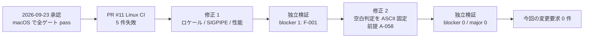

# as-built summary(eff24f55 slot ごとのジョブマップを定義する / Linux CI 修正と F-001 修正の後の attempt 6)

- 対象: `validate-config.sh --job-map`(tier-facade のみ)
- 位置づけ: 2026-09-23 の承認済み実装が PR #11 の Linux CI で 5 件失敗したため、同じ attempt 6 内で実装を修正した後の記録
  - 修正 1(commit 90fb05c): UTF-8 ロケールの read の行結合 / SIGPIPE 無視環境の tr の終了状態 / 5,000 行の性能
  - 修正 2(commit 0a193cb): 独立検証の blocker F-001(`key=value` / `key: value` の空白判定がロケール依存)。前提 A-058 を追加
- 結論: **未解決の仕様起因の要求は 0 件**。今回も変更要求の draft を作らない
- 根拠:
  - `docs/impl/latest/eff24f55/stages/attempt-6/S5_verify.tier-facade.findings.yaml`(blocker 0 / major 0 / minor 30)
  - `docs/impl/latest/eff24f55/stages/attempt-6/S4_tier-impl.tier-facade.assumptions.yaml`(前提 24 件)
  - `docs/impl/latest/eff24f55/stages/attempt-6/S4_tier-impl.tier-facade.done.yaml`(`rerun:` 節)
  - `docs/impl/latest/eff24f55/stages/S6_uc-bdd.done.yaml` / `S7_atdd.done.yaml`(新規 issue 0 件)
  - `docs/impl/latest/eff24f55/issues/` の 6 件(前回までにすべて解消済み。新規起票なし)
  - `docs/impl/latest/eff24f55/review/review-notes.md`(`spec_change` の却下 0 件)
- 本ファイルは dist-pipeline への入力ではない

## 1. 全体の状態

| 項目 | 値 |
|---|---|
| ゲート(format / lint / tdd / bdd_tier) | すべて pass(bats 341 件、tier BDD 41 Scenario。bats は macOS と Ubuntu 24.04 の両方) |
| UC BDD | pass(対象 feature 24 Scenario、全体 36 Scenario) |
| ATDD | pass(2 Scenario) |
| 独立検証 | blocker 0 / major 0 / minor 30 |
| 前提の判定 | consistent 2 / spec_absent 22 / contradicts 0 / unlisted 5 |
| 性能(NFR B.2.1.1) | 5,000 行 verbose で Ubuntu arm64 7.06 秒 → 3.16 秒(上限 10 秒) |

## 2. 今回の修正内容と仕様との関係

| # | 症状(Linux CI) | 原因 | 修正 | 仕様との関係 |
|---|---|---|---|---|
| 1 | 行末が切れた UTF-8 先頭バイトを含む行で、エラーの行番号がずれる | UTF-8 ロケールの bash `read` が不完全なマルチバイトの先頭バイトを次行と結合した。C ロケールの macOS 既定では再現しない | スナップショットの読み込みを `LC_ALL=C` に固定(`facade/src/repository/job_map_repo.sh`) | 契約「不正な UTF-8 は行番号つきで拒否」のとおりに動かすための実装起因。仕様の不足ではない |
| 2 | 事前走査(`tr \| sed`)が内部障害になり終了コード 6 | CI runner は SIGPIPE を無視するため、sed が先に終わったとき tr が 141 ではなく 1 で終わる。実装は tr の 1 を tr の失敗と判定した | sed が非 0 のときは tr の終了状態を見ない(前提 A-053 を更新) | 契約 `internal_failure` は「失敗したコマンド名だけ」を求める。パイプライン下流失敗の帰属は spec_absent のまま。要求にしない |
| 3 | 5,000 行の性能テストが 10 秒を超える | O(n²) の連結、位置ごとの CSV 解析、safe-text と setlocale の繰り返し | CSV 解析を IFS 分割へ置換、連結を線形化、setlocale を呼び出し元で 1 回に | NFR B.2.1.1(5,000 行 10 秒)を満たすための実装起因 |
| 4 | Unicode 空白(U+2003)を含む値の区切りが `=` / `: ` でロケールにより変わる(独立検証 F-001、blocker) | `[[:space:]]` を現在のロケールで評価していた | 空白を ASCII 6 種(半角空白・タブ・LF・VT・FF・CR)に固定し `LC_ALL=C` でバイト単位に判定(`facade/src/domain/cli_field.sh`。前提 A-058) | 契約・ui-design は「値に空白を含めば `key: value`」と書くが空白の範囲を定義しない。第 4 節で判断 |

- 修正 1〜3 は CLI 契約の出力・終了コードを変えていない。feature と step 定義は無変更で UC BDD 24 / ATDD 2 が pass した。
- 修正 4 は Unicode 空白を含む値の出力を `key=value` に固定した。BDD に Unicode 空白を含む Scenario は無く、既存 Scenario の結果は変わらない。

## 3. issues の解消判定

| issue | 論点 | 解消の根拠 | 判定 |
|---|---|---|---|
| `20260919_161456_cross-uc-scenarios.md` | UC 横断 Scenario の責務分担の記録 | 仕様疑義ではない(起票時から blocker ではない)。S6 / S7 はハーネス注入なしで pass | 要求不要 |
| `20260919_183305_control-char-notation-and-internal-error-undefined.md` | 制御文字の表記・内部障害の出力 | CLI 契約 `conventions.output_format.control_chars` と `config_input_rules.internal_failure`(1 回目の CR-002 / 003 の反映) | 解消 |
| `20260919_195500_malformed-input-policy-undefined.md` | 入力の守備範囲 | CLI 契約 `config_input_rules`(1 回目の CR-001 の反映) | 解消 |
| `20260919_210000_file-replaced-between-scan-and-parse.md` | 検証中の差し替え | CLI 契約 `config_input_rules.snapshot.validate_config`(単一スナップショット)。UC BDD「検証中に差し替わったファイル」が 5 回連続 pass | 解消 |
| `20260922_120000_duplicate-job-id-lines-contract-vs-bdd.md` | 重複 job_id の `lines=` の列挙対象の矛盾 | CLI 契約 / tier-facade.md / spec.md が「初出行を含む」に統一(2 回目の CR-006 の反映) | 解消 |
| `20260922_120100_credential-ref-warning-boundary-undefined.md` | credential_ref の形式外の値の扱い | CLI 契約 `columns.credential_ref.on_format_violation` と tier-facade.md が「理由を問わず同じ warn で受理、値は出さない」と明記(2 回目の CR-007 案 A の反映) | 解消 |

- 今回の修正サイクル(S4 再実行 2 回、S6 / S7 再実行 2 回)で新規 issue は 0 件。

## 4. 仕様との対応(実装済みの契約)

HTTP endpoint・状態遷移・header は本 UC に無い。CLI の出力と終了コードで整理する。

### 仕様どおり

- 必須 5 列・任意 4 列、列名での対応付け、ホストとユーザーの片方だけの拒否、ヘッダー列名の重複の拒否
- 入力の守備範囲(NUL / 不正な UTF-8 / BOM / CR)の原因別の拒否と hint。行末が切れた UTF-8 もロケールに関係なく正しい行番号で拒否(修正 1)
- 単一スナップショット(TMPDIR、0600、成功・失敗・HUP / INT / TERM で削除)
- 複製の失敗(`config snapshot failed`)と補助コマンドの失敗(`internal command failed commands=<name>`)の区分、終了コード 6。SIGPIPE 無視環境でも誤検知しない(修正 2)
- 重複 job_id の `lines=`(初出行を含む全行番号を出現順)
- credential_ref の形式外の値は同じ warn 1 行で受理し、値は出さない
- 任意入力の制御文字の可視表記、stdout の固定順、終了コード 0 / 2 / 3 / 6
- NFR B.2.1.1: 5,000 行を 10 秒以内(修正 3)

### 仕様の矛盾

- なし(独立検証の contradicts 0 件。前回の F-001 は実装側で解消し `resolved_previous_findings` に記録)

### 仕様の不足

- 要求が必要な不足はなし
- 「空白」の定義(A-058)は仕様に無いが、次の理由で**仕様変更要求にはせず、実装前提として承認を取る**
  1. 契約の他の箇所の「空白」は半角空白・タブ・空白区切りの意味で使われ、制御文字の規則もコードポイント範囲でバイト単位に定めている。ASCII 限定は契約の書きぶりと整合する(独立検証も contradicts ではなく spec_absent と判定)
  2. Unicode 空白の集合は libc(glibc は U+00A0 / U+202F を含まない)で異なるため、「Unicode 空白も含める」定義を仕様に書くと実装が環境依存に戻る。ロケール・OS に関係なく同じ結果になる定義は ASCII だけで、stdout の消費側(シェル / awk)の分割単位とも一致する
  3. 要求の対象は「人が `spec_change` で却下した前提」だけ。過去 3 回のレビューで同種の出力形式の前提は一括承認されている
  4. 仕様に書くなら、この UC ではなく cross-cutting の出力規約(`conventions.output_format.stdout`)の文言追加であり、UC 実装の blocker ではない。レビューで `spec_change` の却下が出たときだけ refresh で要求にする
- spec_absent の前提 22 件は、出力順・並び順・検証の打ち切り範囲・内部障害の細部であり、要求にしない(第 5 節)

## 5. 原因の分類

| 分類 | 項目 | 扱い | 根拠 |
|---|---|---|---|
| 仕様起因 | なし | - | issues 6 件はすべて解消済み(第 3 節)。findings に contradicts 0 件。`spec_change` の却下 0 件 |
| 実装起因(修正済み) | Linux CI の 5 件失敗(UTF-8 ロケールの read / SIGPIPE 無視の tr / 性能) | attempt 6 内で修正済み(commit 90fb05c)。要求に含めない | S4 done の `rerun:` 節、PR #11 の CI ログ |
| 実装起因(修正済み) | 独立検証 F-001(空白判定のロケール依存) | attempt 6 内で修正済み(commit 0a193cb、A-058)。要求に含めない | 旧 findings(invalidated/20260928_113000_stage_invalidated_eff24f55_f001_fix)と現 findings の `resolved_previous_findings` |
| 環境起因 | 開発機(macOS)の mktemp がテンプレート末尾以外の X を置き換えない | 実装側の互換処理(A-052)で吸収。要求に含めない | attempt-6 findings F-118 |
| 環境起因 | CI runner が SIGPIPE を無視する | 実装側の帰属規則(A-053)で吸収。要求に含めない | attempt-6 findings F-119 |
| 対象外 | 分類差 1 件(F-130。A-019 は error_handling が適切) | verdict と severity は変わらない | attempt-6 findings F-130 |
| 対象外 | 仕様の復唱 2 件(F-106 A-016 / F-121 A-055) | 前提ではなく契約どおり | attempt-6 findings F-106 / F-121 |
| 対象外 | unlisted 5 件(F-125〜F-129。V-001〜V-005) | 前提の記録範囲の解釈差。仕様起因ではない(第 6 節) | attempt-6 findings F-125〜F-129 |

### 要求にしなかったもの

- spec_absent の minor 前提 22 件(F-101〜F-105、F-107〜F-120、F-122〜F-124)
  - 要求の対象は「人が `spec_change` で却下した前提」だけである。`review-notes.md` に `spec_change` の却下は 0 件。
  - 過去 3 回のレビューで、同種の前提は一括承認された。
  - 次のレビューで `spec_change` の却下が出たときだけ、refresh で要求に加える。
- unlisted の V-001〜V-005(CSV の高速経路 / 1024 バイト窓 / fixed_params の早期判定と再利用 / LC_ALL=C の重複設定の省略)
  - 実装者は「外から観測できる挙動を変えない内部の実装選択」として記録しない判断をした(assumptions.yaml 冒頭のコメント)。検証者は「performance は記録対象で、内部選択の除外規定が無い」として unlisted を維持した。
  - どちらも仕様の不足ではなく、前提記録の規則(AssumptionRecord の除外条件)の解釈差である。仕様変更要求の対象外。学びの提案(`learnings/20261006_080400_proposal-skill.md`)に記録した。

### レビューで確認してほしい前提(要求ではない)

- **A-058(confidence medium、今回追加)**: `key=value` / `key: value` の選択に使う「空白」を ASCII 6 種に限定し、Unicode 空白(U+3000 全角空白など)を含む値は `key=value` にする。
  - 推奨: 承認(実装前提として確定)。理由は第 4 節「仕様の不足」の 4 点。
  - 仕様に「Unicode 空白も空白として `key: value` にする」と書きたい場合だけ `spec_change` で却下する。その場合は refresh で cross-cutting の出力規約への要求にする。
- **A-053(内容を更新)**: `tr | sed` の帰属規則に「sed が非 0 なら tr の終了状態を見ない」を追加した。
  - 推奨: 承認。CI runner のように SIGPIPE を無視する環境で tr の派生エラーを tr の失敗と誤認しないための規則。

## 6. 実装者が補った前提の一覧(attempt 6、24 件)

人の判断: 今回のレビューは未実施。「前回」列は 2026-09-23 のレビュー(一括承認)の判断。

| id | カテゴリ | 前提(要約) | 判定 | 前回の判断 |
|---|---|---|---|---|
| A-005 | error_handling | ヘッダーのクォート不正時はクォート不正だけを全件報告 | spec_absent | 一括承認 |
| A-006 | error_handling | ヘッダー不一致時は列検証と重複検査を省く | spec_absent | 一括承認 |
| A-008 | data_format | missing= は契約の列順 | spec_absent | 一括承認 |
| A-010 | error_handling | 解析不能行は列検証・重複検査・版集計の対象外 | spec_absent | 一括承認 |
| A-014 | data_format | fixed_params= の JSON は空白なし、`/` と非 ASCII はエスケープしない | spec_absent | 一括承認 |
| A-016 | data_format | 推奨値 60 との差の専用 info 行を出さない | consistent(復唱) | 案 A で承認 |
| A-017 | data_format | map_version の distinct 値は初出順 | spec_absent | 一括承認 |
| A-018 | data_format | distinct 値の空は `-` で表記 | spec_absent | 一括承認 |
| A-019 | data_format(検証者は error_handling) | info: resolved は検証を通過した行だけ | spec_absent | 一括承認 |
| A-020 | data_format | stderr の種別間の出力順(検証を終えてからまとめて出す) | spec_absent | 一括承認 |
| A-022 | input_validation | 形式違反の job_id も重複検査の対象、空は除外 | spec_absent | 一括承認 |
| A-025 | data_format | 複数の重複 job_id の error 行は初出行の昇順 | spec_absent | 一括承認 |
| A-043 | error_handling | 検証器内部の障害も commands=<関数名> で終了コード 6 | spec_absent | 一括承認 |
| A-044 | error_handling | 補助コマンドの出力の妥当性(行数・並び順・終端証跡)も検査 | spec_absent | 一括承認 |
| A-049 | error_handling | 重複列名と必須列欠落を同時に報告し、データ行の検証はしない | spec_absent | 一括承認 |
| A-050 | error_handling | 守備範囲の違反があれば他の検証を打ち切る | spec_absent | 一括承認 |
| A-051 | data_format | 同一行の複数原因は BOM → NUL → 不正 UTF-8 → CR の順 | spec_absent | 一括承認 |
| A-052 | data_format | BSD 系 mktemp では作業名を pid と乱数で付け直す | spec_absent | 一括承認 |
| A-053 | error_handling | tr / sed パイプラインの commands= の帰属規則(**更新**: sed が非 0 なら tr の終了状態を見ない) | spec_absent | 一括承認(更新前の内容) |
| A-054 | data_format | unknown column は出現ごとに 1 行 | spec_absent | 一括承認 |
| A-055 | error_handling | 複製の削除 rm の失敗は commands=rm で終了コード 6 | consistent(復唱) | 一括承認 |
| A-056 | error_handling | 複製の工程と削除の同時失敗は複製の失敗を優先 | spec_absent | 一括承認 |
| A-057 | data_format | 補助コマンドと削除の同時失敗は失敗順に連結 | spec_absent | 一括承認 |
| A-058 | data_format | **新規**: `key=value` / `key: value` の空白判定は ASCII 6 種・ロケール非依存。Unicode 空白は空白扱いしない | spec_absent | 未判断 |

- 判定の内訳: consistent 2 / spec_absent 22 / contradicts 0 / unlisted 5(V-001〜V-005。前提一覧には無い)
- 前回(23 件)からの増減: A-058 を追加(+1)。A-053 の内容を更新
- 人が `spec_change` で却下した前提: 0 件

## 7. 方針資料との照合

- 今回は要求が 0 件のため、新たに照合する論点は無い。
- 修正 1〜4 はいずれも CLI の出力規約の範囲内で、方針資料(しくみ / 利用イメージ)が定める設定ファイルの検証の意図を変えていない。
