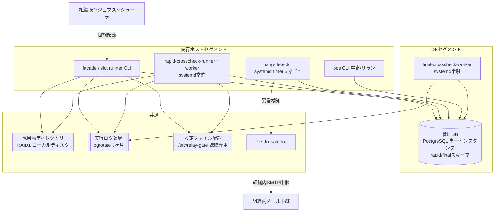
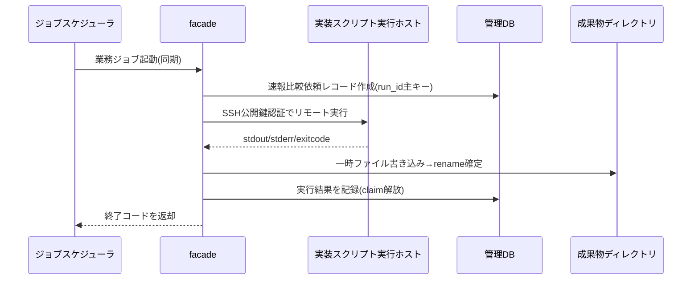
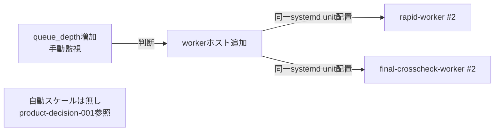
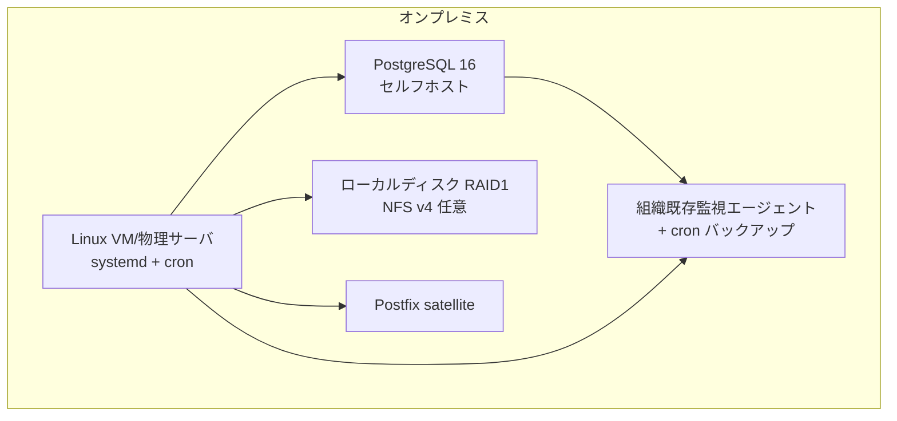

# relay-gate 並行稼働実行基盤 ターゲットアーキテクチャ(オンプレミス)

- workload_model: `product-relay-gate-workload-model`
- mapping: `product-relay-gate-mapping-onprem`
- impl_spec: `product-impl-onprem`
- generated_at: 2026-08-30T20:17:49

## ワークロード全体構成図

## リクエストフロー図

## オートスケーリング構成図

## ベンダー別デプロイメント図

## 適合性サマリ

`product-conformance-onprem` (23要件中: conformant 18, partial 5, non_conformant 0) を参照。
partial評価の5件はいずれも意図した設計判断(手動水平スケール・grepベースログ検索・既存監視統合の前提)であり、
運用開始前確認事項として `docs/todo.md` に記録する。
