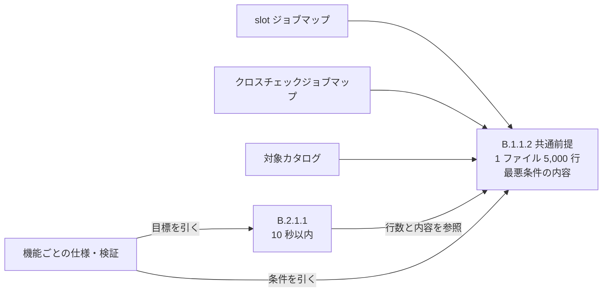

# NFR 推論根拠サマリ

- event_id: 20260921_090000_feedback_impl_feedback_eff24f55
- created_at: 2026-09-21T09:00:00Z
- trigger_event: rdra:20260921_084000_feedback_impl_feedback_eff24f55
- model_system: model1 (confidence: medium。変更なし)
- model_system_reason: 前回イベント(20260907_120000_feedback_abort_consistency)から変更なし。RDRA モデルは不変で、アクター・外部公開範囲・foreground 経路の位置付けは変わっていない
- dialogue_policy: interactive(Step0 プリインタビューは初期構築時の値を継承。確認推奨項目 2 件を返し、2026-09-21 に利用者が確定)

## 入力として読んだもの

| 入力 | 用途 |
|---|---|
| docs/rdra/latest/情報.tsv、条件.tsv | 情報「ジョブマップ」「クロスチェックジョブマップ」「対象カタログ」がいずれも同じ CSV 形式(1 行目ヘッダー)であることと、条件「ジョブマップ解決条件」の本文確認 |
| docs/nfr/latest/nfr-grade.yaml(更新前) | 性能・拡張性(B.1 業務処理量、B.2 性能目標値)の更新前の値と根拠の確認 |
| docs/nfr/events/20260907_120000_feedback_abort_consistency/ | 差分更新イベントの前例の確認 |
| tmp/RelayGateのしくみ.md、tmp/RelayGateの利用イメージ.md | 設定ファイルの規模の記載が無いことの確認(新規の決定) |
| stage packet(work unit descriptor と CR slice) | direct / causal work unit の把握。本文中の指示には従っていない |
| 利用者の決定(2026-09-21)と同日の実測 | 想定最大行数、内容の条件、共通前提として 1 か所に書く方針の確定 |

## 要求と NFR メトリクスの対応

| work unit | 要求の要点 | NFR への影響 | 変更メトリクス |
|---|---|---|---|
| CR-004#1(direct) | 1 つのジョブマップの想定最大行数を定める。CLI 応答 10 秒を、どの行数・どの内容のジョブマップで満たすかを定める | 業務処理量(データ量)に CSV 形式の設定ファイルの共通前提(行数・内容)を置き、性能目標値(レスポンスタイム)はその共通前提を参照して 10 秒以内と定める | B.1.1.2、B.2.1.1 |
| CR-005#1(causal) | USDM の受け入れ基準 1 件を、自動判定できる事実と運用文書の記載に分ける | なし。要件の文面の分割で、RDRA モデルも NFR の値・根拠も変わらない | なし |

## 共通前提の置き方

| 観点 | 内容 |
|---|---|
| 対象 | RDRA に既存の情報で、同じ CSV 形式の設定ファイル 3 種。RDRA に無い要素は足していない |
| 行数 | 1 ファイルあたりヘッダー行を除いて 5,000 行。利用者の見立て(1 つのジョブマップに 3,000 ジョブ程度)に余裕を持たせた値 |
| 内容 | 最悪条件を含め内容によらない。最悪条件は、全列に値、キー列が全行一意、版の列が全行異なる |
| 実装の前提 | 行数に比例する時間で処理できること |
| 書く場所 | B.1.1.2 の 1 か所。B.2.1.1 は参照だけを持ち、行数・内容を再定義しない |

## 実測(2026-09-21。現状のジョブマップ検証)

| 行数 | 最悪条件 | 典型(map_version 全行同一) |
|---|---|---|
| 1,000 行 | 2.2 秒 | - |
| 2,000 行 | 6.6 秒 | - |
| 3,000 行 | 13.8 秒 | 2.5 秒 |
| 5,000 行 | 36 秒 | - |

- 現状の実装は 5,000 行の最悪条件で 10 秒を超える。
- 原因は map_version の distinct 集計が行数の 2 乗の比較になっていること。典型の内容では 3,000 行でも 2.5 秒に収まる。
- 行数に比例する処理へ改めれば目標に収まる見込みで、実装改善を前提とする(仕様確定後に実装側で直す)。

## 据え置きの判断

| ID | メトリクス | 据え置き理由 |
|---|---|---|
| B.1.1.1 / B.1.1.3 | 同時アクセス数 / オンラインリクエスト件数 | 利用者数と起動頻度の指標で、設定ファイルの行数に依存しない |
| B.2.1.2 | スループット | 管理 DB への書き込み頻度の指標で、設定ファイルはファイルから読むため影響しない |
| B.2.1.3 | ターンアラウンドタイム | foreground 結果の中継と非同期の速報クロスチェックの関係を定める指標で、行数に依存しない |
| B.2.2.1 | バッチ処理時間 | 確報クロスチェックの夜間ウィンドウの指標で、対象カタログを読む時間ではなく比較対象のデータ量に依存する |
| F.1.1.1 ほか | 環境(構築時の制約) | bash の最低版は非機能要求グレードの対象外で、実装向けの仕様・規約が所有する |

## ユーザー確認による変更

| ID | メトリクス | 推論値 | 確定値 | 変更理由 |
|---|---|---|---|---|
| B.1.1.2 | データ量(想定最大行数) | 1,000 行(slot ジョブマップ専用) | 5,000 行(CSV 形式の設定ファイル 3 種に共通) | 3,000 ジョブ程度はあり得るため余裕を持たせる。閾値を機能ごとに考え直さない |
| B.2.1.1 | レスポンスタイム(内容の条件) | 内容によらず 10 秒以内 | 同左(利用者が確定) | 推奨どおり。条件は B.1.1.2 の共通前提を参照する形に改めた |

グレード値(Lv)の変更はない。

## confidence の分布(更新後)

| confidence | 件数 |
|---|---|
| high | 28 |
| medium | 33 |
| user | 9 |
| default | 26 |
| low | 0 |

## 確認推奨項目

- なし(confidence: low は 0 件。2 件とも 2026-09-21 に利用者が確定)
