# relay-gate 要求(作り直し入力 2026-08-30)

本入力は、方針資料「RelayGate のしくみ」(仕組みの正本)と「RelayGate の利用イメージ」(適用例)を原文のまま連結したものである。要求・仕様は「RelayGate のしくみ」を正本とし、「利用イメージ」は具体化の参考例として読む。

## 前提

- 本プロダクトは CLI と定期ジョブだけで構成され、UI 画面を持たない。運用者への提示は CLI の標準出力・標準エラー・終了コードと通知メールで行う
- ジョブの実行履歴・監査はジョブスケジューラの責務である。relay-gate はログファイル(Runner Result Contract と各スクリプトの実行ログ)を残す
- `RAPID_CROSSCHECK_MODE` の値は `on` / `off` とする(`on` が資料中の `foreground` / `background` に相当)
- 成果物では特定案件の固有名(製品名・サーバ名・業務名)を中立表現(現行実装 / 新実装 / ジョブスケジューラ / 比較ツール / DB セグメント等)に置き換える。「利用イメージ」の固有名は例示であり要求ではない

---

# RelayGate のしくみ

index
- [目的と境界](#目的と境界)
- [C1 Context](#c1-context)
- [C2 Container](#c2-container)
  - [Hang Detection](#hang-detection)
  - [Background Rerun](#background-rerun)
- [Runner Result Contract](#runner-result-contract)
- [C3 Component](#c3-component)
  - [facade](#facade)
  - [rapid-crosscheck](#rapid-crosscheck)
  - [final-crosscheck](#final-crosscheck)
- [C4 Code](#c4-code)
  - [`hang-detector.sh`](#hang-detectorsh)
  - [`background-rerun.sh`](#background-rerunsh)
  - [`abort-blue.sh` と `abort-green.sh`](#abort-bluesh-と-abort-greensh)
  - [`abort-rapid-crosscheck.sh`](#abort-rapid-crosschecksh)
  - [`abort-final-crosscheck.sh`](#abort-final-crosschecksh)
- [設定契約](#設定契約)
  - [ジョブ解決契約](#ジョブ解決契約)
- [データモデル](#データモデル)
- [ハング検知とbackground側リラン](#ハング検知とbackground側リラン)
- [配置図](#配置図)
- [シーケンス図](#シーケンス図)
- [状態と運用](#状態と運用)
- [拡張点と受入条件](#拡張点と受入条件)
  - [拡張点](#拡張点)
  - [受入条件](#受入条件)

## 目的と境界

RelayGate は、実装を段階的に切り替えるための並行稼働プロダクトです。既存実装と新実装をジョブスケジューラの同じジョブ定義から起動します。

- feature flag 付きストラングラーファサードが blue と green の実装を選択
- foreground の実行結果だけをジョブスケジューラへ返す
- 速報クロスチェックが blue と green の完了結果を非同期に比較
- 確報クロスチェックが全テーブルと全ファイルを比較し、実行結果をジョブスケジューラへ返す
- 実装固有の起動方式、ホスト、OS、プロトコルを slot の runner に閉じ込めます
- ハング監視とbackground側の選択リランは、通常起動の facade から分離します

外部 IF の送受信方針は、適用側で定義します。比較対象の定義は、適用側で定義します。個別製品のネットワーク制約は、適用側で定義します。

## C1 Context

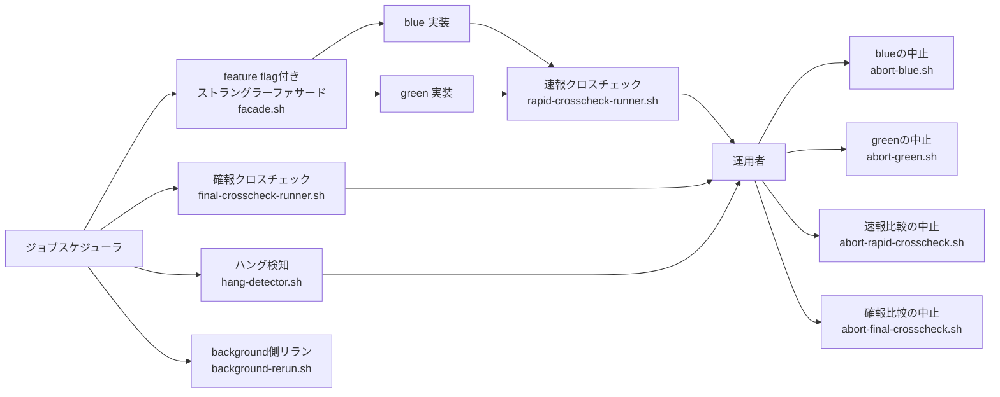

| 要素 | 関係 |
|---|---|
| ジョブスケジューラ | 通常実行、確報、ハング検知、background側リランの専用ジョブ定義から各スクリプトを起動する |
| RelayGate | blue と green の実装選択とジョブスケジューラとの契約を維持する |
| blue と green 実装 | 業務処理を実行して完了事実を通知する |
| 速報クロスチェック | 両系の結果を比較して差分を運用者へ提供する |
| 確報クロスチェック | 全量比較により日次整合性を正式確認する |
| ハング検知 | 実行管理データと成果物を定期監視しハング疑いを運用者へ通知する |
| blueの中止 | 停止確認済みのbackground blue slotを `ABORTED` へ遷移させる |
| greenの中止 | 停止確認済みのbackground green slotを `ABORTED` へ遷移させる |
| 速報比較の中止 | 停止確認済みの速報比較依頼を `ABORTED` へ遷移させ、再実行可能にする |
| 確報比較の中止 | 停止確認済みの確報比較依頼を `ABORTED` へ遷移させる |
| background側リラン | ジョブスケジューラの専用ジョブが元の実行を参照し、background slotまたは速報比較依頼を再作成する |

## C2 Container

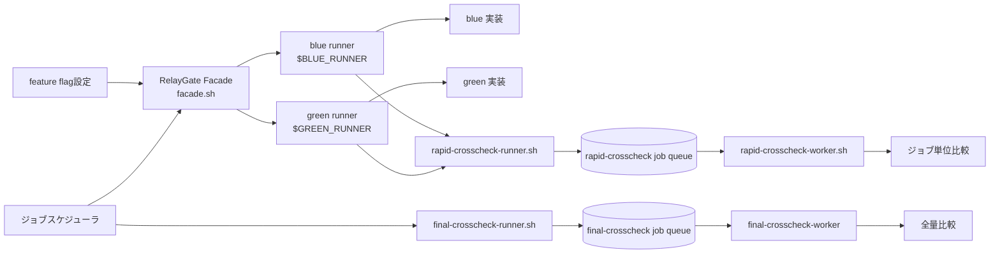

### Hang Detection

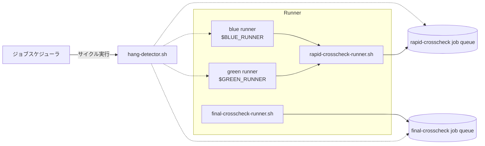

### Background Rerun

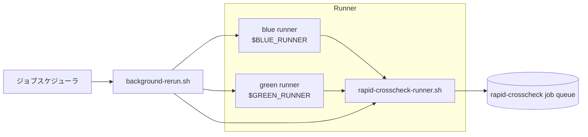

| コンテナ | 責務 |
|---|---|
| RelayGate Facade<br/>`facade.sh` | ・feature flag を読み込む<br/>・blue と green を起動する<br/>・foreground の結果をジョブスケジューラへ返す |
| blue runner<br/>`$BLUE_RUNNER` | ・設定で実体スクリプトを割り当てる<br/>・blue 実装を起動する<br/>・blue 完了を通知する |
| green runner<br/>`$GREEN_RUNNER` | ・設定で実体スクリプトを割り当てる<br/>・green 実装を起動する<br/>・green 完了を通知する |
| `rapid-crosscheck-runner.sh`<br/>dispatcher | ・完了通知を受ける<br/>・比較依頼を一意に作成する |
| `rapid-crosscheck-worker.sh` | ・比較依頼を取得する<br/>・比較を実行する<br/>・結果を登録する |
| rapid-crosscheck job queue | ・blue と green の完了結果を保持する<br/>・比較依頼を保持する<br/>・比較結果を保持する |
| `final-crosscheck-runner.sh` | ・ジョブスケジューラから確報比較の依頼を受ける<br/>・比較依頼を登録する<br/>・完了まで同期 polling する<br/>・stdout、stderr、exitcode をジョブスケジューラへ返す |
| `final-crosscheck-worker.sh` | ・DB セグメントで比較依頼を poll / claim する<br/>・全量比較を実行する<br/>・stdout、stderr、exitcode を保存する |
| final-crosscheck job queue | ・確報比較依頼と対象カタログを保持する<br/>・worker の claim と lease を保持する<br/>・実行結果の stdout、stderr、exitcode を保持する |
| `hang-detector.sh` | ・未完了のbackground成果物を定期走査する<br/>・`hang_detect_limit_minutes` 超過をハング疑いとして通知する<br/>・自動中止と自動再実行はしない |
| `background-rerun.sh` | ・元のbackground slotまたは速報をリランする<br/>・新しい run_id を発行する<br/>・親 run_id と実行設定のスナップショットを保持する |

## Runner Result Contract

blue runner と green runner は、foreground と background のどちらでも実装の終了結果を3ファイルとして出力します。3ファイルは runner の必須成果物です。ジョブスケジューラへの応答、完了通知、障害調査で3ファイルを共通に使用します。

```text
<FACADE_RUN_DIR>/
  execution-spec.json
  <FACADE_RUN_ROLE>/
    started-at.txt
    stdout.log
    stderr.log
    exitcode.txt
```

| 成果物 | 契約 |
|---|---|
| `stdout.log` | 実装の標準出力を保持する |
| `stderr.log` | 実装の標準エラーを保持する |
| `exitcode.txt` | 数値だけを1行で保持する |
| `execution-spec.json` | 実行先と固定引数、ジョブスケジューラから渡された追加引数、マップ版、実装版、roleごとの `hang_detect_limit_minutes` を保持する |
| `started-at.txt` | roleの起動時刻を保持する |
| runner の終了コード | `exitcode.txt` と一致する |
| 公開タイミング | 実行終了後に3ファイルを揃えて公開する |

- 起動失敗、マップ未定義、SSH 失敗でも、可能な限り3ファイルを出力します
- foreground のとき、`facade.sh` は3ファイルを標準出力、標準エラー、終了コードとしてジョブスケジューラへ中継します
- background のときも、同じ3ファイルを残します
- `execution-spec.json` はrun開始時に一度だけ確定し、リラン時の正本として使用します
- `hang-detector.sh` は `started-at.txt`、`exitcode.txt`、`hang_detect_limit_minutes` を使ってbackground実行を判定します
- `rapid-crosscheck-runner.sh` には、`run_id`、終了コード、成果物ディレクトリまたは `artifact_uri` を完了結果として通知します
- 後続処理が書き込み途中のファイルを読まないよう、一時ファイルへ出力してから確定名へリネームできます

## C3 Component

### facade

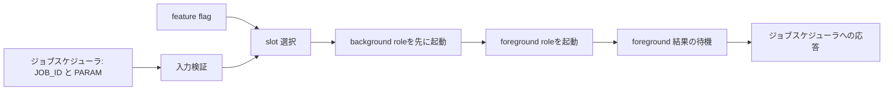

`facade.sh` は RelayGate Facade の実装です。ジョブスケジューラは `JOB_ID [PARAM...]` だけを渡します。RelayGate Facade は、比較対象や実装固有の起動方式を判断しません。slot runner が `JOB_ID` を実装固有のジョブマップで解決します。RelayGate Facade は、slot と mode を選択し、foreground 結果をジョブスケジューラへ応答します。

実行は並走させるため、次の順序を固定します。

1. `background` のblue・green slotをすべて起動し、PIDと成果物ディレクトリを確定する
2. `foreground` のslotを起動する。この時点では待機しない
3. すべてのslotを起動してから、foregroundのPIDだけを待機し、3ファイルをジョブスケジューラへ中継する

この順序により、foregroundが長時間実行中でもbackground slotは同時に実行されます。blueとgreenの両方が `foreground` になる構成は許可しません。

### rapid-crosscheck

速報クロスチェックは、ジョブの実行ごとに、ジョブの出力を比較します。

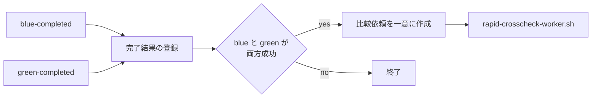

公開 function は、完了した系統ごとに分けます。

```text
blue runner ($BLUE_RUNNER)
  -> rapid-crosscheck-runner.sh blue-completed(run_id, job_id, result)

green runner ($GREEN_RUNNER)
  -> rapid-crosscheck-runner.sh green-completed(run_id, job_id, result)
```

blue / green runner は相手側の状態や比較依頼を判断しません。比較規約は、`rapid-crosscheck-runner.sh` と `rapid-crosscheck-worker.sh` に閉じ込めます。

`RAPID_CROSSCHECK_MODE=off` のとき、blue / green runner は `rapid-crosscheck-runner.sh` へ完了通知しません。速報管理DBへの接続、完了結果、比較依頼、比較結果の書込みを行わないため、速報クロスチェック用のDB接続設定なしでslot実行できます。

### final-crosscheck

確報クロスチェックは、速報クロスチェックと異なるデータモデルを持ちます。日次処理が落ち着いた時点に、ジョブスケジューラの別ジョブ定義から `final-crosscheck-runner.sh` を起動します。全テーブルと全ファイルを対象にします。

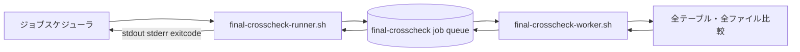

`final-crosscheck-runner.sh` は比較依頼を登録後、対象依頼の完了を同期 polling します。完了した依頼に保存された `stdout`、`stderr`、`exitcode` を、そのまま標準出力、標準エラー、終了コードとしてジョブスケジューラへ返します。

`final-crosscheck-worker.sh` は DB セグメントで依頼を poll / claim し、クロスチェック実装を起動します。worker は起動した実装の `stdout`、`stderr`、`exitcode` を依頼レコードへ保存します。チェック結果、差分件数、レポート URI などをジョブスケジューラへの応答の連携データとして追加しません。

依頼の `SUCCEEDED`、`FAILED`、`ABORTED` は管理DB内の実行状態です。`final-crosscheck-runner.sh` は終端状態を待ちますが、その状態名をジョブスケジューラへ返しません。ジョブスケジューラへ返すのはworkerが保存した `stdout`、`stderr`、`exitcode` だけです。

## C4 Code

### `hang-detector.sh`

`hang-detector.sh` は、RelayGateを配置したディレクトリから定期実行するbackground実行の監視スクリプトです。未完了のbackground roleについて、`started-at.txt` と `execution-spec.json` の `hang_detect_limit_minutes` から経過時間を判定し、ハング疑いを記録して通知します。終了済みのbackground roleは `exitcode.txt` を確認し、非0終了を通知します。速報クロスチェックは依頼状態と終了コードを確認し、`FAILED` または比較NGを通知します。

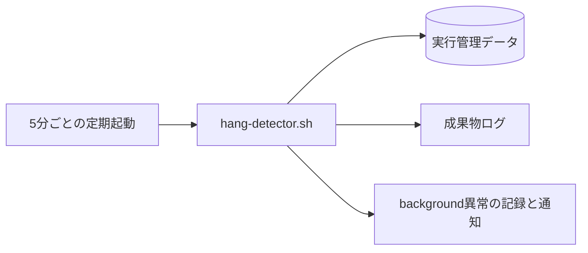

- `RUNNING` を `ABORTED` へ変更しません
- 実行プロセスを停止しません
- 新しい実行依頼を作成しません

### `background-rerun.sh`

`background-rerun.sh` は、ジョブスケジューラのbackground側リラン専用ジョブから起動するスクリプトです。完了済みまたは明示中止済みのbackground slot実行または速報比較依頼を読み取り、新しい `run_id` を発行して再実行します。新しい実行の `parent_run_id` には直前のリラン元 `run_id` を設定します。foreground実行は、ジョブスケジューラから正規の `facade.sh` ジョブを再実行します。

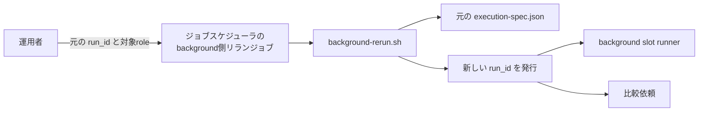

- `RUNNING` の実行は受け付けません
- 中止済み実行は、新しい `run_id` と `parent_run_id` で再実行します
- 最新のjob mapではなく、元の `execution-spec.json` を使用します
- 実行パラメータ、ホスト、実行ユーザー、スクリプト、作業ディレクトリは元の `execution-spec.json` から復元します

| 事前検証 | `background-rerun.sh` の動作 |
|---|---|
| `--role` が `blue` または `green` で元のslot modeが `background` | 新しい `run_id` を発行してリラン |
| `--role` が `blue` または `green` で元のslot modeが `foreground` または `off` | リランせず、呼び出し元の専用ジョブをエラー終了 |
| `--role` が `rapid-crosscheck` | 比較依頼だけを新規作成 |
| 未対応のroleまたは元の実行が見つからない | リランせず、呼び出し元の専用ジョブをエラー終了 |
| 元の実行が `RUNNING` または中止未確認 | リランせず、呼び出し元の専用ジョブをエラー終了 |

### `abort-blue.sh` と `abort-green.sh`

`abort-blue.sh` と `abort-green.sh` は、運用者がRelayGateの配置ディレクトリから直接起動するbackground slotの中止スクリプトです。対象の実行プロセスを停止したことを対話確認した後、対象slotを `ABORTED` へ遷移させます。

```text
abort-blue.sh --run-id RUN_ID
abort-green.sh --run-id RUN_ID
```

- 対象slotが `background` かつ `RUNNING` のときだけ中止できます
- 対象slotが `foreground` または `off` の場合、状態を変更せずエラー終了します
- 現在状態を表示後、`対象ジョブのプロセスは強制終了してありますか？ [yes/no]` と対話確認します
- `yes` 以外の場合、状態を変更せず終了します
- プロセス、Pod、SSH接続先の処理を停止しません

### `abort-rapid-crosscheck.sh`

`abort-rapid-crosscheck.sh` は、運用者がRelayGateの配置ディレクトリから直接起動する速報比較依頼の中止スクリプトです。プロセスを強制終了せず、対話確認で停止を確認した後に `rapid_crosscheck_request` を `ABORTED` へ遷移させます。

```text
abort-rapid-crosscheck.sh --run-id RUN_ID
```

- 現在状態を表示後、`対象ジョブのプロセスは強制終了してありますか？ [yes/no]` と対話確認します
- `yes` 以外の場合、状態を変更せず終了します
- 速報比較依頼が `RUNNING` でない場合、状態を変更せずエラー終了します
- プロセス、Pod、SSH接続先の処理を停止しません

### `abort-final-crosscheck.sh`

`abort-final-crosscheck.sh` は、運用者がRelayGateの配置ディレクトリから直接起動する確報比較依頼の中止スクリプトです。プロセスを強制終了せず、対話確認で停止を確認した後に `final_crosscheck_request` を `ABORTED` へ遷移させます。

```text
abort-final-crosscheck.sh --run-id RUN_ID
```

- 現在状態を表示後、`対象ジョブのプロセスは強制終了してありますか？ [yes/no]` と対話確認します
- `yes` 以外の場合、状態を変更せず終了します
- 確報比較依頼が `RUNNING` でない場合、状態を変更せずエラー終了します
- プロセス、Pod、SSH接続先の処理を停止しません


## 設定契約

```env
# RelayGate Facade の実行モード。
# foreground: 終了を待ち、ジョブスケジューラへ結果を返す。
# background: 起動後に facade は戻る。
# off:        起動しない。
BLUE_MODE=foreground
GREEN_MODE=background
RAPID_CROSSCHECK_MODE=background

BLUE_IMPL=legacy
GREEN_IMPL=next
BLUE_RUNNER=./blue-runner.sh
GREEN_RUNNER=./green-runner.sh
RAPID_CROSSCHECK_RUNNER=./rapid-crosscheck-runner.sh
RAPID_CROSSCHECK_WORKER=./rapid-crosscheck-worker.sh
```

`RAPID_CROSSCHECK_MODE` は、facade が起動する速報クロスチェックの制御に限ります。確報クロスチェックは `final-crosscheck-runner.sh` をジョブスケジューラから直接起動するため、facade の設定には含めません。

| `RAPID_CROSSCHECK_MODE` | 完了通知と速報管理DB |
|---|---|
| `foreground` / `background` | runner が完了通知を送信し、速報管理DBへ完了結果と比較依頼を書き込む |
| `off` | 完了通知を送信せず、速報管理DBへ接続も書込みもしない |

`$BLUE_RUNNER` と `$GREEN_RUNNER` は適用ごとに実体を割り当てます。`rapid-crosscheck-runner.sh` は dispatcherを持つ一回ごとの起動スクリプト、`rapid-crosscheck-worker.sh` はキューを継続的に処理する worker スクリプトです。既存の `crosscheck-runner.sh` は暫定の汎用実装であり、目標構成の `rapid-crosscheck-runner.sh` とは区別します。

### ジョブ解決契約

ジョブスケジューラに登録するジョブ定義は、実際に動かす処理のホスト名、実行ユーザー、スクリプトパスを持ちません。持つのはfacade.shの呼び出し定義だけです。ジョブスケジューラは `JOB_ID [PARAM...]` を渡し、slot runner が実装固有のジョブマップから実行先を解決します。

| 解決する情報 | 所有者 |
|---|---|
| 実装スロットと runner | RelayGate の feature flag |
| ホスト、実行ユーザー、スクリプト、作業ディレクトリ | 該当 slot の job map |
| 固定引数、`hang_detect_limit_minutes` | 該当 slot の job map |
| 比較対象と対象カタログ | クロスチェックの job map |

- job map の固定引数の後ろに、ジョブスケジューラから渡された `PARAM...` を順序を変えずに連結します
- job map を変更しても、実行済みまたはリラン対象の設定を上書きしません
- 起動時に、解決済みのホスト、スクリプト、作業ディレクトリ、固定引数、ジョブスケジューラから渡された追加引数、マップ版、実装版、roleごとの `hang_detect_limit_minutes` を `facade/<run_id>/execution-spec.json` として保存します
- 認証情報そのものは保存せず、認証情報の参照名だけを保存します

| 運用モード | BLUE | GREEN | CROSSCHECK | ジョブスケジューラに返す結果 |
|---|---|---|---|---|
| 並行稼働 | foreground | background | background | blue |
| 新実装の単独本番 | off | foreground | off | green |
| 次世代実装との並行稼働 | background | foreground | background | green |

## データモデル

`run_id` は、1回の並行稼働を相関付ける識別子です。速報と確報の比較規約は、それぞれ別ドメインが所有します。

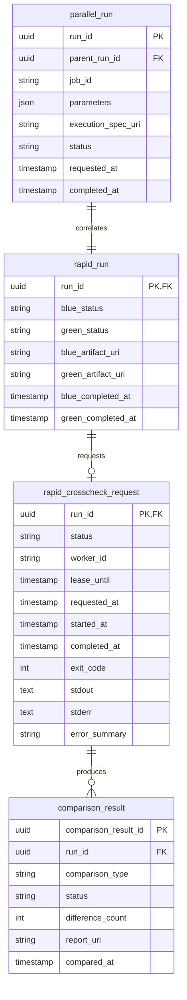

確報側は、速報側の `rapid_run` や `rapid_crosscheck_request` を再利用しません。確報の起動と結果返却は、次の別モデルで管理します。

```text
final_crosscheck_request
  ・final_crosscheck_id
  ・business_date
  ・対象カタログの版
  ・status: REQUESTED / CLAIMED / RUNNING / SUCCEEDED / FAILED / ABORTED
  ・worker_id
  ・lease_until
  ・requested_at / started_at / completed_at
  ・exit_code
  ・stdout
  ・stderr
  ・error_summary
```

`execution-spec.json` は、ジョブマップから解決した実行設定の正本です。速報クロスチェックを有効にする場合、管理DBの `parallel_run.execution_spec_uri` はこの成果物ファイルを参照します。`RAPID_CROSSCHECK_MODE=off` の場合は `parallel_run` を作成せず、slot実行とbackground側リランは成果物ファイルだけで動作します。

複数回リランする場合、各新規実行の `parent_run_id` には直前にリラン元として指定した `run_id` を設定します。このため、最新の `run_id` から `parent_run_id` をたどると、元の実行まで数珠つなぎに追跡できます。

## ハング検知とbackground側リラン

`hang-detector.sh` は、5分ごとなどの定期ジョブとして実行します。background roleの成果物と速報比較依頼を走査し、background異常をアラートします。`RAPID_CROSSCHECK_MODE=off` の場合も、slot成果物だけで監視します。

- 導入時は全ジョブの `hang_detect_limit_minutes` を60分に設定します
- 通知後に正常終了した実行についても、警告した経過時間を記録して通常処理の警告傾向を確認します
- 正常終了パターンの警告が出そろった時点で、ジョブごとに最後の警告の経過時間を基準として `hang_detect_limit_minutes` を調整します

| 検知条件 | 判定 |
|---|---|
| `exitcode.txt` が存在し、終了コードが0 | 正常終了として対象外 |
| `exitcode.txt` が存在し、終了コードが非0 | background実行エラーとして通知 |
| `exitcode.txt` がなく、経過時間が `hang_detect_limit_minutes` 以内 | 実行中として継続監視 |
| `exitcode.txt` がなく、経過時間が `hang_detect_limit_minutes` を超過 | ハング疑いとして通知 |
| 速報比較依頼が `FAILED` または比較NG | 速報クロスチェック異常として通知 |

- 監視は `monitor_status`、`hang_suspected_at`、`alerted_at` を記録して運用者へ通知します
- 実行依頼の状態は `RUNNING` のまま保持し、監視ジョブは `ABORTED` へ遷移させません
- `RUNNING` の自動再実行はしません

`background-rerun.sh` は、ジョブスケジューラのbackground側リラン専用ジョブから、完了済みまたは明示中止済みのbackground slot実行または速報比較依頼を選択してリランします。

```text
background-rerun.sh --source-run-id RUN_ID --role blue
background-rerun.sh --source-run-id RUN_ID --role green
background-rerun.sh --source-run-id RUN_ID --role rapid-crosscheck
```

- blue / green のうち、元の実行でbackgroundだったslotだけが元の `execution-spec.json` から新しい `run_id` を発行して起動します
- rapid-crosscheck は業務ジョブを再実行せず、比較依頼だけを新規作成します
- `RUNNING` のrapid-crosscheckは、運用者が `ABORTED` に更新してから比較依頼を再作成します
- foreground slot実行とfinal-crosscheckは `background-rerun.sh` を使用せず、ジョブスケジューラの正規ジョブを直接再実行します
- `RUNNING` のbackground実行は、運用者が明示中止してからリランします
- foregroundまたは `off` だったslotを指定した場合は、リランせず、呼び出し元の専用ジョブをエラー終了します

## 配置図

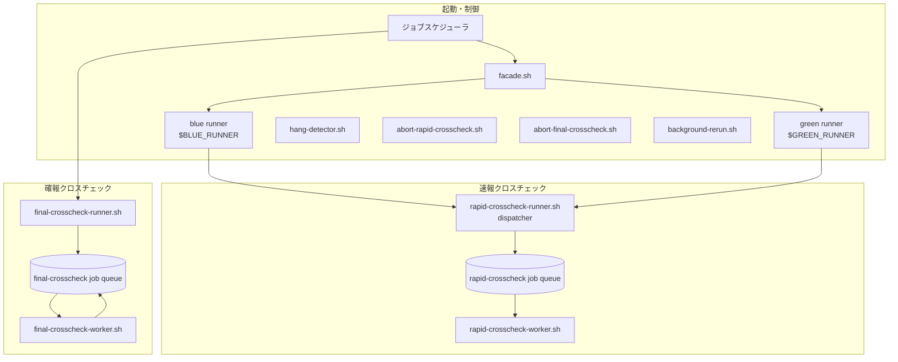

実装固有のホスト配置は、適用文書で定義します。

## シーケンス図

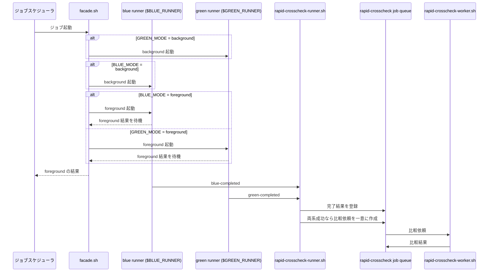

## 状態と運用

速報と確報は、同じクロスチェック依頼ライフサイクルを持ちます。worker は終了時に `stdout`、`stderr`、`exitcode` を依頼へ保存します。`exitcode = 0` なら `SUCCEEDED`、非0または実行エラーなら `FAILED` とします。

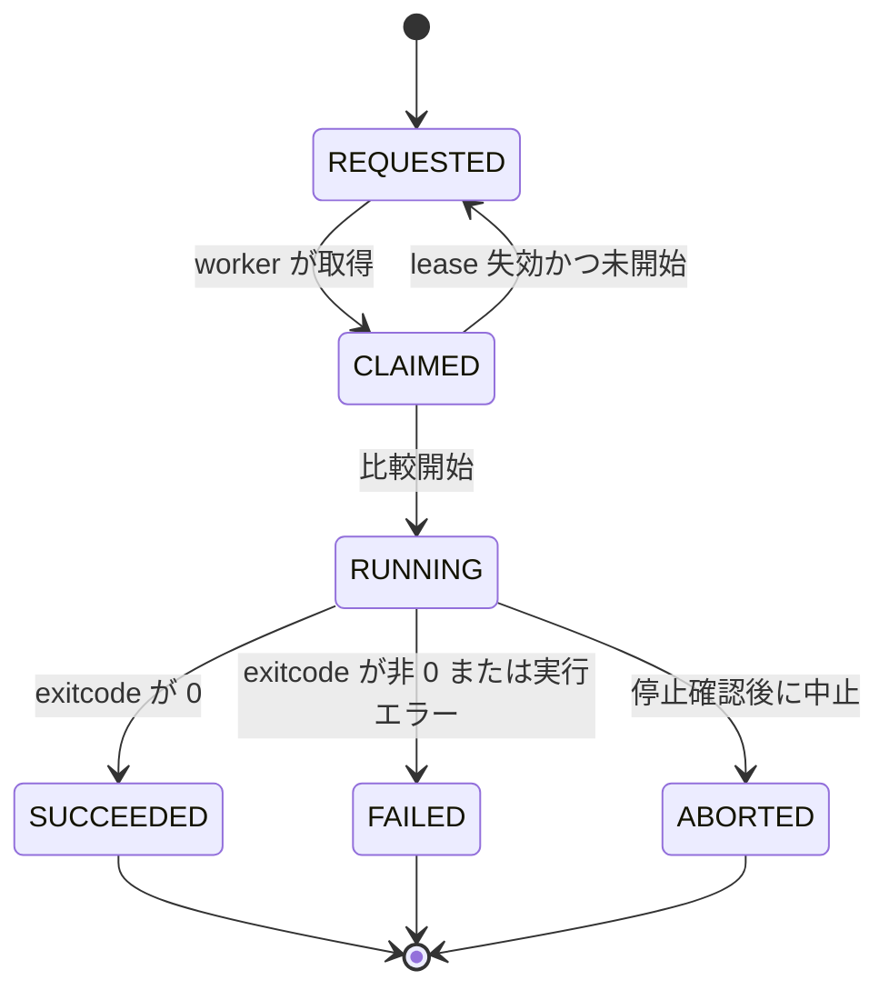

STFWで実装した場合の終了コードと状態の対応例は、次のとおりです。

| STFWの結果 | STFWのexitcode | クロスチェック依頼の状態 | ジョブスケジューラの確報ジョブへ返すexitcode |
|---|---|---|---|
| 比較OK | `0` | `SUCCEEDED` | `0` |
| 比較NG | `3` | `FAILED` | `3` 警告終了 |
| 実行エラー | `6` | `FAILED` | `6` エラー終了 |

- 速報クロスチェックはbackground処理のため、上記のexitcodeを通常業務ジョブの結果としてジョブスケジューラへ返しません
- 確報はworkerが保存したexitcodeをそのままジョブスケジューラへ中継します
- STFW以外の比較実装を使う場合、exitcodeの値とジョブスケジューラ側の判定はその実装の契約に従います

- 比較差分の詳細は `comparison_result`、`stdout`、`stderr` に保持します。クロスチェック依頼の状態はworkerの `exitcode` に従います
- 速報クロスチェックは、原因調査に使用します
- 日次全量比較は、リリース判断の正本とします
- 確報クロスチェックは、`final-crosscheck-runner.sh` が終端状態まで pollingした後、保存済みの `stdout`、`stderr`、`exitcode` だけをジョブスケジューラへ返します
- 速報クロスチェックが `RUNNING` のとき、監視は状態を変更せずハング疑いとして通知します
- 停止確認後に、運用者が対象の速報または確報比較依頼を `ABORTED` に更新します

## 拡張点と受入条件

### 拡張点

- blue / green の runner を差し替えて、異なる世代の実装を並行稼働できます
- `RAPID_CROSSCHECK_MODE=off` で、facade から起動する速報クロスチェックを停止できます
- 比較定義は、`job_id` ごとに差し替えられます

### 受入条件

- ジョブスケジューラの同じジョブ定義で、並行稼働と単独本番を設定だけで切り替えられます
- ジョブスケジューラは、foreground の標準出力、標準エラー、終了コードを受け取れます
- ジョブスケジューラは、確報クロスチェックでも `final-crosscheck-runner.sh` から標準出力、標準エラー、終了コードを受け取れます
- blue / green の完了順にかかわらず、比較依頼は一件だけ作られます
- 速報クロスチェックの失敗は、foreground のジョブスケジューラへの応答を変更しません
- 確報クロスチェックの比較結果は、stdout、stderr、exitcode 以外の連携データとしてジョブスケジューラへ返さない


---

# RelayGate の利用イメージ

index
- [RelayGate の利用イメージ](#relaygate-の利用イメージ)
  - [目的と境界](#目的と境界)
  - [方針](#方針)
  - [C1 Context](#c1-context)
  - [C2 Container](#c2-container)
  - [C3 Component](#c3-component)
    - [windows-server slot](#windows-server-slot)
    - [beam slot](#beam-slot)
    - [rapid-crosscheck](#rapid-crosscheck)
    - [final-crosscheck](#final-crosscheck)
  - [クロスチェックパターン](#クロスチェックパターン)
    - [DB 比較](#db-比較)
    - [IF ファイル比較](#if-ファイル比較)
    - [exitcode の扱い](#exitcode-の扱い)
  - [RelayGate Facadeへの適用](#relaygate-facadeへの適用)
    - [設定](#設定)
    - [blue/green runner](#bluegreen-runner)
  - [Runner Result の適用内容](#runner-result-の適用内容)
  - [データモデル](#データモデル)
  - [配置図](#配置図)
  - [シーケンス図](#シーケンス図)
    - [slot 実行と完了通知](#slot-実行と完了通知)
    - [クロスチェック](#クロスチェック)
  - [障害とハング時のハンドリング](#障害とハング時のハンドリング)
    - [対応サマリー](#対応サマリー)
    - [ハンドリングパターン](#ハンドリングパターン)
    - [手順を忘れてハングをリランした時のナビフロー ※最悪のパターン](#手順を忘れてハングをリランした時のナビフロー-最悪のパターン)
  - [状態](#状態)
  - [background 実行の運用](#background-実行の運用)
    - [監視](#監視)
    - [リラン](#リラン)

---

## 目的と境界

本書は、[RelayGate のしくみ](RelayGateのしくみ.md) を BB督促の Windows Server 現行処理と Beam Batch に適用する構成を定義します。

- blue slot は `現行: windows-server` として実装
- green slot は `新: beam` として実装
- Windows Server 2008 R2 の督促 BT サーバは DB セグメントから起動
  - 督促 BT の起動には、`db-segment-runner.sh` と `db-segment-worker.sh` をカスタム実装
- 速報クロスチェックは、DB セグメントで SQL Server、PostgreSQL、現新 IF バックアップを比較
- 確報クロスチェックは、速報と同じ構成で、全テーブル・全IFファイルを比較

Beam v1 の正式稼働後は、Windows Server 固有のアダプタを削除します。RelayGateのしくみ、Beam呼び出しの実装・クロスチェックの設定は残します。これらは Beam v2 との並行稼働にも再利用できる想定です。

## 方針

- 督促 AP と督促 BT のいずれの現行ジョブでも、foreground の結果をジョブスケジューラへ返す
- 督促 BT は、AP セグメントから直接 SSH しない
  - DB セグメントの worker が督促 BT へ SSH 実行
- 新側 ESB を OFF にした状態で並行稼働
  - 外部 IF out を転送しない
  - 外部 IF in は、ESB File Transfer の複数受信サーバ設定で並行稼働
    - 一部 file-pubsub を利用
- 速報クロスチェック が、ジョブ単位の DB・IF 比較を stfw で実行
- 確報クロスチェック が、日次で全テーブル・全ファイル比較

## C1 Context

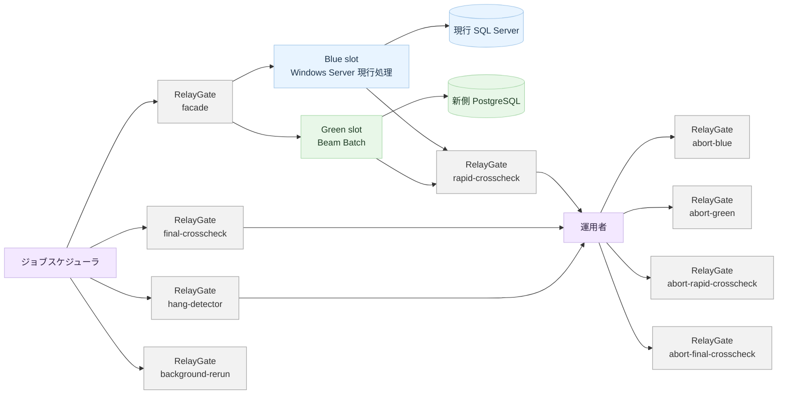

| 要素 | 今回の役割 |
|---|---|
| ジョブスケジューラ | facade、確報、ハング検知、background側リランをRelayGateのジョブとして起動する |
| Blue: windows-server | 現行 bat を督促 AP または督促 BT で実行する |
| Green: beam | SDI 3.5 Kubernetes 上の Beam Batch を起動する |
| 速報クロスチェック | stfw でジョブ単位の DB・IF 出力を比較する |
| 確報クロスチェック | stfw で全体の DB・IF 出力を比較する |
| ハング検知 | background実行の異常を運用者へ通知する |
| background側リラン | 中止済みのbackground slotまたは速報比較依頼を再実行する |
| blue・greenの中止 | 停止確認済みのbackground slotを `ABORTED` に更新する |
| 速報・確報比較の中止 | 停止確認済みの比較依頼を `ABORTED` に更新する |
## C2 Container

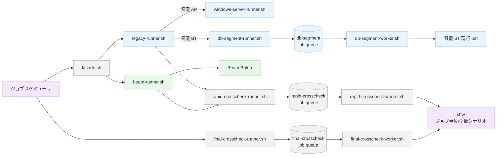

| コンテナ | 今回の実装 |
|---|---|
| RelayGate Facade<br/>`facade.sh` | `BLUE_MODE=foreground` と `GREEN_MODE=background` で slot を制御する |
| `legacy-runner.sh` | `legacy_host` から督促 AP 直接実行と督促 BT の DB セグメント実行を選択する |
| `db-segment-runner.sh` | BT 実行依頼を登録して同期 polling する |
| `db-segment-worker.sh` | FileBackup サーバで poll / claim し、BT へ SSH 実行する |
| `beam-runner.sh` | Kubernetes Job を起動して Beam 完了を確認する |
| `rapid-crosscheck-runner.sh` | blue / green 完了通知から比較依頼を作成する |
| `rapid-crosscheck-worker.sh` | stfw で収集、比較を実行し、stdout、stderr、exitcodeと比較結果を登録する |
| `final-crosscheck-runner.sh` | ジョブスケジューラから確報比較を受け、DB キューへ依頼を登録し、完了を同期 polling して stdout、stderr、exitcode を返す |
| `final-crosscheck-worker.sh` | FileBackup サーバで依頼を poll / claim し、stfw の全量比較を実行して stdout、stderr、exitcode を DB へ保存する |
| `hang-detector.sh` | RelayGateと並行稼働独自データを定期走査し、background実行を含むハング疑いを通知する |
| `background-rerun.sh` | 元のbackground slotまたは速報を選択リランする |
| `abort-rapid-crosscheck.sh` | 停止確認済みの `rapid_crosscheck_request` を `ABORTED` に更新する速報比較の中止処理 |
| `abort-final-crosscheck.sh` | 停止確認済みの `final_crosscheck_request` を `ABORTED` に更新する確報比較の中止処理 |
| `db-segment-abort.sh` | 停止確認済みの `db_segment_request` を `ABORTED` に更新するカスタム中止処理 |

## C3 Component

### windows-server slot

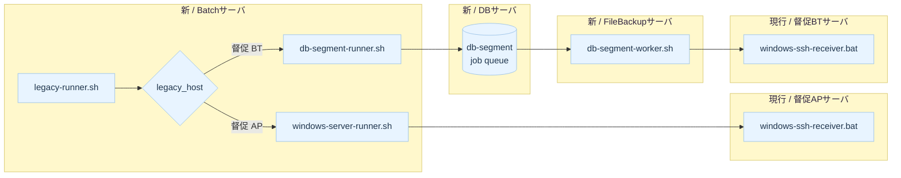

督促 AP の SSH 実行は既存経路を使用します。督促 BT は、督促APサーバから直接到達しません。そのため、新 / FileBackupサーバ上の worker が SSH を実行します。

### beam slot

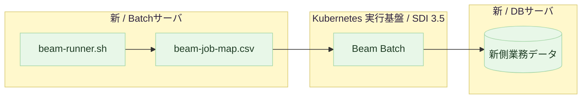

### rapid-crosscheck

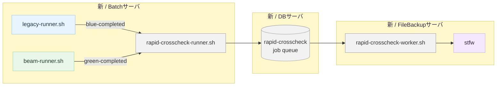

### final-crosscheck

確報クロスチェックは、日次処理が落ち着いた時点でジョブスケジューラの専用ジョブで起動します。

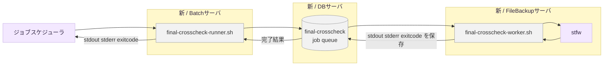

- runner は確報比較依頼を登録し、対象依頼が完了するまで同期 polling します
- worker は新 / FileBackupサーバで依頼を poll / claim してクロスチェック実装を起動します
- worker は起動した実装の stdout、stderr、exitcode を依頼レコードへ保存します
- runner は保存済みの stdout、stderr、exitcode だけをジョブスケジューラへ中継します
- チェック結果、差分件数、などはstfwのstdoutに出力されて、ジョブスケジューラから参照できるようになります。

## クロスチェックパターン

rapid クロスチェックと final クロスチェックは、同じ stfw の収集・比較パターンを使用します。違いは、対象テーブルと対象ファイルの量です。

### DB 比較

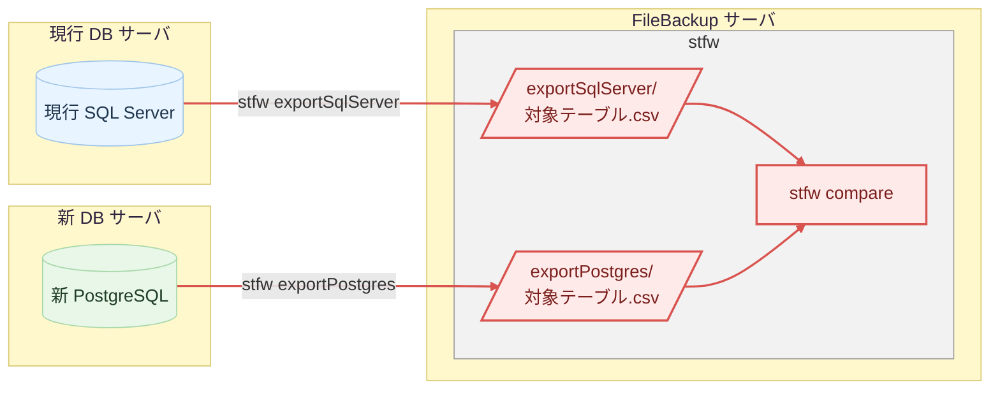

### IF ファイル比較

```mermaid
graph LR
  subgraph LEGACY_DB[現行 DB サーバ]
    LEGACY_IF[/現行 IF<br/>バックアップファイル/]
  end

  subgraph FILE_BACKUP[FileBackup サーバ]
    NEW_IF[/新 IF<br/>バックアップファイル/]
    subgraph stfw[stfw]
      LEGACY_COLLECT[/collectFile/<br/>対象ファイル/]
      NEW_COLLECT[/collectFile/<br/>対象ファイル/]
      CHECK[stfw compare]
    end
  end

  style LEGACY_DB fill:#fff8cc,stroke:#d9ca73,stroke-width:1px,color:#2f2440
  style FILE_BACKUP fill:#fff8cc,stroke:#d9ca73,stroke-width:1px,color:#2f2440
  style LEGACY_IF fill:#e8f4ff,stroke:#9fc5e8,stroke-width:1px,color:#20364d
  style NEW_IF fill:#e8f7e8,stroke:#a7d7a9,stroke-width:1px,color:#1f3d25
  style stfw fill:#f2f2f2,stroke:#9e9e9e,stroke-width:1px
  style CHECK fill:#ffeaea,stroke:#d9534f,stroke-width:2px,color:#7a1f1c
  style LEGACY_COLLECT fill:#ffeaea,stroke:#d9534f,stroke-width:2px,color:#7a1f1c
  style NEW_COLLECT fill:#ffeaea,stroke:#d9534f,stroke-width:2px,color:#7a1f1c

  LEGACY_IF -->|stfw collectFile| LEGACY_COLLECT
  NEW_IF -->|stfw collectFile| NEW_COLLECT
  LEGACY_COLLECT --> CHECK
  NEW_COLLECT --> CHECK
  linkStyle 0,1,2,3 stroke:#d9534f,stroke-width:2px
```

### exitcode の扱い

STFWを使用する今回の終了コードとクロスチェック依頼の状態は、次のように対応します。

| STFWの結果 | STFWのexitcode | クロスチェック依頼の状態 | ジョブスケジューラの確報ジョブへ返すexitcode |
|---|---|---|---|
| 比較OK | `0` | `SUCCEEDED` | `0` |
| 比較NG | `3` | `FAILED` | `3` 警告終了 |
| 実行エラー | `6` | `FAILED` | `6` エラー終了 |

- `rapid-crosscheck-worker.sh` と `final-crosscheck-worker.sh` は、STFWの stdout、stderr、exitcode を依頼へ保存します
- 速報クロスチェックはbackground処理のため、上記のexitcodeを通常業務ジョブの結果としてジョブスケジューラへ返しません
- 確報は、workerが保存したstdout、stderr、exitcodeだけをジョブスケジューラへ中継します。依頼の `SUCCEEDED`、`FAILED`、`ABORTED` は管理状態であり、ジョブスケジューラへ返しません

## RelayGate Facadeへの適用

### 設定

```env
BLUE_MODE=foreground
GREEN_MODE=background
RAPID_CROSSCHECK_MODE=background

BLUE_IMPL=windows-server
GREEN_IMPL=beam
BLUE_RUNNER=./legacy-runner.sh
GREEN_RUNNER=./beam-runner.sh
RAPID_CROSSCHECK_RUNNER=./rapid-crosscheck-runner.sh
RAPID_CROSSCHECK_WORKER=./rapid-crosscheck-worker.sh
LEGACY_JOB_MAP_CSV=./legacy-job-map.csv
BEAM_JOB_MAP_CSV=./beam-job-map.csv
```

- `RAPID_CROSSCHECK_MODE=off` の場合
  - `legacy-runner.sh` と `beam-runner.sh` は速報完了通知を送信しない
    - → RelayGateデータの速報管理レコードを作成しない
  - Beam切り替え後は、速報クロスチェックのDB接続情報を不要にできる
- モードの切り替えイメージ

  | 運用モード | BLUE | GREEN | CROSSCHECK | ジョブスケジューラに返す結果 |
  |---|---|---|---|---|
  | 今回の並行稼働 | windows-server foreground | beam background | background | windows-server |
  | Beam v1 単独本番 | off | beam foreground | off | beam |

### blue/green runner

- ジョブスケジューラは `facade.sh JOB_ID [PARAM...]` を起動
- ジョブスケジューラからの引数
  - `legacy-runner.sh` / `beam-runner.sh` は、ジョブマップの静的な設定を解決した
  - 解決後、 `fixed_params` の後ろに `ジョブスケジューラから渡された追加引数をそのまま連結`
  - ※ジョブスケジューラのジョブ定義に残る引数は、ジョブ定義内でしか表現できない連番などを想定

    ```text
    ジョブスケジューラのジョブ定義
      path/to/relay_gate/facade.sh JOB_ID paramA paramB

    legacy-job-map の解決結果
      host: 督促AP
      user: saiken
      work_dir: G:\scripts
      script: G:\scripts\xxx.bat
      fixed_params: param1 param2 param3
      hang_detect_limit_minutes: 60

    legacy-runner.sh から windows-server-runner.sh へ渡す引数
      G:\scripts\xxx.bat param1 param2 param3 paramA paramB
    ```


- `legacy-runner.sh`がジョブIDからマッピングする内容

  | `legacy-job-map` の項目 | 用途 |
  |---|---|
  | `host` | 督促APまたは督促BTの接続先 |
  | `user` | SSH実行ユーザーまたは認証参照 |
  | `work_dir` | 既存batの作業ディレクトリ |
  | `script` | Windows側の既存bat |
  | `fixed_params` | 既存batへの固定引数 |
  | `hang_detect_limit_minutes` | 分単位のハング検知上限 |

  - イメージ

    | job_id | host | user | work_dir | script | fixed_params | hang_detect_limit_minutes |
    |---|---|---|---|---|---|---|
    | TOMM0410010100 | 督促AP | saiken | `G:\scripts` | `G:\scripts\xxx.bat` | `["param1","param2","param3"]` | 60 |

  - csv

    ```csv
    job_id,host,user,work_dir,script,fixed_params,hang_detect_limit_minutes
    TOMM0410010100,督促AP,saiken,G:\scripts,G:\scripts\xxx.bat,"[""param1"",""param2"",""param3""]",60
    ```

- `beam-runner.sh`がジョブIDからマッピングする内容 ※ローカルスクリプトを想定

  | `beam-job-map` の項目 | 用途 |
  |---|---|
  | `work_dir` | 作業ディレクトリ |
  | `script` | Beam Batch起動スクリプト |
  | `fixed_params` | 固定引数 |
  | `hang_detect_limit_minutes` | 分単位のハング検知上限 |

  - イメージ

    | job_id | work_dir | script | fixed_params | hang_detect_limit_minutes |
    |---|---|---|---|---|
    | TOMM0410010100 | `./beam-batches` | `./beam-batches/TOMM0410010100.sh` | `["param1","param2","param3"]` | 60 |

  - csv

    ```csv
    job_id,work_dir,script,fixed_params,hang_detect_limit_minutes
    TOMM0410010100,./beam-batches,./beam-batches/TOMM0410010100.sh,"[""param1"",""param2"",""param3""]",60
    ```

- `fixed_params` はJSON配列を格納するCSVセル
  - 固定引数の数と各引数に含まれる空白・カンマを維持
  - 空の固定引数は `[]` 
- リランでは最新のマップを再解決しない
  - 元の `execution-spec.json` を使用します

## Runner Result の適用内容

```text
facade/<run_id>/
  execution-spec.json
  blue/
    stdout.log
    stderr.log
    exitcode.txt
  green/
    stdout.log
    stderr.log
    exitcode.txt
```

| slot | runner | 3ファイルの作り方 |
|---|---|---|
| blue: 督促 AP | `windows-server-runner.sh` | ・Windows 側の `stdout.log`、`stderr.log`、`exitcode.txt` を SCP で回収する<br/>・Linux 側の `facade/<run_id>/blue/` へ配置する |
| blue: 督促 BT | `db-segment-runner.sh` | ・`db-segment-worker.sh` が SSH 実行結果を db-segment<br/>job queue へ登録する<br/>・runner が同期 polling して3ファイルを `blue/` へ確定する |
| green: Beam | `beam-runner.sh` | ・Beam Batch の標準出力と標準エラーを `green/` に出力する<br/>・終了コードを `exitcode.txt` に出力する |

- `BLUE_MODE=foreground` の今回構成では、`facade.sh` が `blue` のファイルをジョブスケジューラに中継
  - `blue/stdout.log` → 標準出力
  - `blue/stderr.log` → 標準エラー
  - `blue/exitcode.txt` → 終了コード
- `GREEN_MODE=background` でも、`green/` の3ファイルを残します

## データモデル

| ドメイン | 所有データ |
|---|---|
| db-segment-runner.sh | ・BT 実行依頼を保持する<br/>・claim と lease を保持する<br/>・実行結果を保持する |
| rapid-crosscheck | ・blue と green の完了結果を保持する<br/>・比較依頼を保持する<br/>・比較結果を保持する |
| final-crosscheck | ・日次全量比較の依頼と対象カタログを保持する<br/>・claim と lease を保持する<br/>・stdout、stderr、exitcode を保持する |

```mermaid
erDiagram
  parallel_run ||--o| db_segment_request : "correlates"
  parallel_run ||--|| rapid_run : "correlates"
  rapid_run ||--o| rapid_crosscheck_request : "requests"
  rapid_crosscheck_request ||--o{ comparison_result : "produces"
  final_crosscheck_request ||--o{ final_crosscheck_target : "uses"

  parallel_run {
    uuid run_id PK
    string job_id
    json parameters
    string status
    timestamp requested_at
    timestamp completed_at
  }

  db_segment_request {
    uuid run_id PK, FK
    string status
    string legacy_host
    json parameters
    string worker_id
    timestamp lease_until
    timestamp started_at
    timestamp completed_at
    int exit_code
    text stdout
    text stderr
    string artifact_uri
    string error_summary
  }

  rapid_run {
    uuid run_id PK, FK
    string blue_status
    string green_status
    string blue_artifact_uri
    string green_artifact_uri
    timestamp blue_completed_at
    timestamp green_completed_at
  }

  rapid_crosscheck_request {
    uuid run_id PK, FK
    string status
    string worker_id
    timestamp lease_until
    timestamp requested_at
    timestamp started_at
    timestamp completed_at
    int exit_code
    text stdout
    text stderr
    string error_summary
  }

  comparison_result {
    uuid comparison_result_id PK
    uuid run_id FK
    string comparison_type
    string status
    int difference_count
    string report_uri
    timestamp compared_at
  }

  final_crosscheck_request {
    uuid final_crosscheck_id PK
    date business_date
    string target_catalog_version
    string status
    string worker_id
    timestamp lease_until
    timestamp requested_at
    timestamp started_at
    timestamp completed_at
    int exit_code
    text stdout
    text stderr
    string error_summary
  }

  final_crosscheck_target {
    uuid final_crosscheck_id FK
    string target_type
    string target_identifier
  }
```

## 配置図

```mermaid
flowchart TD
  subgraph AP[APセグメント]
    subgraph Batch[Batchサーバ]
      Facade[facade.sh]
      LegacyRunner[legacy-runner.sh]
      BeamRunner[beam-runner.sh]
      FinalRunner[final-crosscheck-runner.sh]
    end
    subgraph Kubernetes[SDI 3.5 Kubernetes]
      Beam[Beam Batch]
    end
    subgraph LegacyAp[督促 AP サーバ]
      ApReceiver[windows-ssh-receiver.bat]
      ApBat[現行 bat]
    end
  end

  subgraph DB[DBセグメント]
    subgraph FileBackup[FileBackup サーバ]
      DbWorker[db-segment-worker.sh]
      subgraph Crosscheck[クロスチェック実行基盤]
        RapidWorker[rapid-crosscheck-worker.sh]
        FinalWorker[final-crosscheck-worker.sh]
        Stfw[stfw]

      end
      NewIf[/新 IF バックアップ/]
    end
    subgraph LegacyBt[督促 BT サーバ]
      BtReceiver[windows-ssh-receiver.bat]
      BtBat[現行 bat]
    end
    subgraph LegacyDb[現行 DB サーバ]
      SqlServer[(SQL Server)]
      LegacyIf[/現行 IF バックアップ/]
    end
    subgraph NewDb[新 DB サーバ]
      BusinessPostgres[(PostgreSQL<br/>業務データ)]
      RelayGatePostgres[(PostgreSQL<br/>RelayGateデータ)]
      ParallelPostgres[(PostgreSQL<br/>並行稼働独自データ)]
    end
  end

  Facade --> LegacyRunner
  LegacyRunner --> ApReceiver
  LegacyRunner ----> ParallelPostgres

  Facade --> BeamRunner
  BeamRunner ---> Beam

  LegacyRunner --> RelayGatePostgres
  BeamRunner --> RelayGatePostgres

  FinalRunner -----> RelayGatePostgres

  ApReceiver --> ApBat
  DbWorker ---> BtReceiver
  BtReceiver --> BtBat
  ApBat --> SqlServer
  BtBat --> SqlServer
  Beam --> BusinessPostgres
  ParallelPostgres -->|poll / 結果| DbWorker
  RelayGatePostgres -->|poll / 結果| RapidWorker
  RelayGatePostgres -->|poll / 結果| FinalWorker
  RapidWorker --> Stfw
  FinalWorker --> Stfw


  style AP fill:#fff8cc,stroke:#d9ca73,stroke-width:1px,color:#2f2440
  style Batch fill:#fff8cc,stroke:#d9ca73,stroke-width:1px,color:#2f2440
  style Kubernetes fill:#fff8cc,stroke:#d9ca73,stroke-width:1px,color:#2f2440
  style LegacyAp fill:#fff8cc,stroke:#d9ca73,stroke-width:1px,color:#2f2440
  style DB fill:#fff8cc,stroke:#d9ca73,stroke-width:1px,color:#2f2440
  style FileBackup fill:#fff8cc,stroke:#d9ca73,stroke-width:1px,color:#2f2440
  style Crosscheck fill:#fff8cc,stroke:#d9ca73,stroke-width:1px,color:#2f2440
  style LegacyBt fill:#fff8cc,stroke:#d9ca73,stroke-width:1px,color:#2f2440
  style LegacyDb fill:#fff8cc,stroke:#d9ca73,stroke-width:1px,color:#2f2440
  style NewDb fill:#fff8cc,stroke:#d9ca73,stroke-width:1px,color:#2f2440
  style LegacyRunner fill:#e8f4ff,stroke:#9fc5e8,stroke-width:1px,color:#20364d
  style BeamRunner fill:#e8f7e8,stroke:#a7d7a9,stroke-width:1px,color:#1f3d25
  style Beam fill:#e8f7e8,stroke:#a7d7a9,stroke-width:1px,color:#1f3d25
  style ApReceiver fill:#e8f4ff,stroke:#9fc5e8,stroke-width:1px,color:#20364d
  style ApBat fill:#e8f4ff,stroke:#9fc5e8,stroke-width:1px,color:#20364d
  style DbWorker fill:#e8f4ff,stroke:#9fc5e8,stroke-width:1px,color:#20364d
  style BtReceiver fill:#e8f4ff,stroke:#9fc5e8,stroke-width:1px,color:#20364d
  style BtBat fill:#e8f4ff,stroke:#9fc5e8,stroke-width:1px,color:#20364d
  style ParallelPostgres fill:#e8f4ff,stroke:#9fc5e8,stroke-width:1px,color:#20364d

  style Facade fill:#f2f2f2,stroke:#9e9e9e,stroke-width:1px
  style FinalRunner fill:#f2f2f2,stroke:#9e9e9e,stroke-width:1px
  style RelayGatePostgres fill:#f2f2f2,stroke:#9e9e9e,stroke-width:1px
  style RapidWorker fill:#f2f2f2,stroke:#9e9e9e,stroke-width:1px
  style FinalWorker fill:#f2f2f2,stroke:#9e9e9e,stroke-width:1px
  style Stfw fill:#ffeaea,stroke:#d9534f,stroke-width:2px,color:#7a1f1c
  style SqlServer fill:#ffeaea,stroke:#d9534f,stroke-width:2px,color:#7a1f1c
  style BusinessPostgres fill:#ffeaea,stroke:#d9534f,stroke-width:2px,color:#7a1f1c
  style LegacyIf fill:#ffeaea,stroke:#d9534f,stroke-width:2px,color:#7a1f1c
  style NewIf fill:#ffeaea,stroke:#d9534f,stroke-width:2px,color:#7a1f1c
```

## シーケンス図

### slot 実行と完了通知

```mermaid
sequenceDiagram
  participant Scheduler as ジョブスケジューラ
  participant Facade as facade.sh #f2f2f2
  participant Legacy as legacy-runner
  participant ApRunner as windows-server-runner.sh
  participant Ap as 督促 AP 現行 bat
  participant DbRunner as db-segment-runner.sh
  participant DbQueue as db-segment<br/>job queue
  participant DbWorker as db-segment-worker.sh
  participant Bt as 督促 BT 現行 bat
  participant BeamRunner as beam-runner
  participant Beam as Beam Batch
  participant RapidRunner as rapid-crosscheck-runner.sh #f2f2f2

  Scheduler->>Facade: ジョブ起動
  par blue: windows-server
    Facade->>Legacy: foreground 起動
    alt legacy_host = 督促 AP
      Legacy->>ApRunner: run(run_id, job_id, parameters)
      ApRunner->>Ap: SSH 経由で実行
      Ap-->>ApRunner: stdout stderr exitcode
      ApRunner-->>Legacy: stdout stderr exitcode
    else legacy_host = 督促 BT
      Legacy->>DbRunner: run(run_id, job_id, parameters)
      DbRunner->>DbQueue: 実行依頼を登録
      DbQueue->>DbWorker: poll / claim
      DbWorker->>Bt: SSH 経由で実行
      Bt-->>DbWorker: stdout stderr exitcode
      DbWorker->>DbQueue: 結果を登録
      DbRunner->>DbQueue: 同期 polling
      DbQueue-->>DbRunner: stdout stderr exitcode
      DbRunner-->>Legacy: stdout stderr exitcode
    end
    Legacy->>RapidRunner: blue-completed
    Legacy-->>Facade: foreground 結果
  and green: beam
    Facade->>BeamRunner: background 起動
    BeamRunner->>Beam: Kubernetes Job を起動
    Beam-->>BeamRunner: 終了結果
    BeamRunner->>RapidRunner: green-completed
  end
  Facade-->>Scheduler: windows-server の結果
```

### クロスチェック

```mermaid
sequenceDiagram
  participant Scheduler as ジョブスケジューラ
  participant RapidRunner as rapid-crosscheck-runner.sh #f2f2f2
  participant RapidQueue as rapid-crosscheck<br/>job queue #f2f2f2
  participant RapidWorker as rapid-crosscheck-worker.sh #f2f2f2
  participant FinalRunner as final-crosscheck-runner.sh #f2f2f2
  participant FinalQueue as final-crosscheck<br/>job queue #f2f2f2
  participant FinalWorker as final-crosscheck-worker.sh #f2f2f2

  Note over RapidRunner: blue-completed と green-completed を受信済み
  RapidRunner->>RapidQueue: 完了結果を登録
  RapidRunner->>RapidQueue: 両系成功なら比較依頼を一意に作成
  RapidQueue->>RapidWorker: poll / claim
  RapidWorker->>RapidQueue: DB と IF の比較結果を登録
  Scheduler->>FinalRunner: 日次確報クロスチェック起動
  FinalRunner->>FinalQueue: 全量比較依頼を登録
  FinalQueue->>FinalWorker: poll / claim
  FinalWorker->>FinalWorker: stfw で全テーブルと全ファイルを比較
  FinalWorker->>FinalQueue: stdout stderr exitcode を保存
  FinalRunner->>FinalQueue: 同期 polling
  FinalQueue-->>FinalRunner: stdout stderr exitcode
  FinalRunner-->>Scheduler: stdout stderr exitcode
```

## 障害とハング時のハンドリング

### 対応サマリー

- 現行 と 確報クロスチェック は、ジョブスケジューラで制御できる
- Beam と 速報クロスチェック は、background実行の考慮が必要
  - 通知の経路が、ハング検知のサイクルジョブからの障害メール
  - リラン方法が、backgroundリランの専用ジョブ
- 現行 督促BT でハングした場合は、リラン時に考慮が必要

### ハンドリングパターン

| 事象 | 記録 | ジョブスケジューラへの影響 | detect | abort | rerun |
|---|---|---|---|---|---|
| **エラー** |  |  |  |  |  |
| 現行APがエラー終了 | `windows-server-runner.sh` が結果をファイル保存 | ジョブスケジューラへ失敗を返す | ジョブステータスがエラー | 不要 | 原因解消後にジョブスケジューラのジョブを再実行 |
| 現行BTがエラー終了 | `db-segment-worker.sh` が結果を依頼テーブル保存 | `db-segment-runner.sh` 経由でジョブスケジューラへ失敗を返す | ジョブステータスがエラー | 不要 | 原因解消後にジョブスケジューラのジョブを再実行 |
| 新Beamがエラー終了 | `beam-runner.sh` が結果をファイル保存 | 不要 | `hang-detector.sh` のアラート | 不要 | `background-rerun.sh --role green` |
| 速報クロスチェックがエラー終了 | `rapid-crosscheck-worker.sh` が結果を依頼テーブル保存 | 不要 | `hang-detector.sh` のアラート | 不要 | `background-rerun.sh --role rapid-crosscheck` |
| 確報クロスチェックがエラー終了 | `final-crosscheck-worker.sh` が結果を依頼テーブル保存 | ジョブスケジューラへ失敗を返す | ジョブステータスがエラー | 不要 | 原因解消後にジョブスケジューラのジョブを再実行 |
| **ハング** |  |  |  |  |  |
| 現行APがハング | runnerの完了待機が継続 | ジョブスケジューラのジョブへ何も返さない | ジョブステータスが実行中のまま継続 | 現行APの実行プロセスを停止 | ジョブスケジューラのジョブを再実行 |
| 現行BTがハング | 依頼テーブルを `RUNNING` で保持 | ジョブスケジューラのジョブへ何も返さない | ジョブステータスが実行中のまま継続 | 現行BTの実行プロセスを停止<br/>`db-segment-abort.sh` | ジョブスケジューラのジョブを再実行 |
| 新Beamがハング | Beam Jobの完了待機が継続 | 不要 | `hang-detector.sh` のアラート | JobとPodを停止して中止状態を記録 | `background-rerun.sh --role green` |
| 速報クロスチェックがハング | 依頼テーブルを `RUNNING` で保持 | 不要 | `hang-detector.sh` のアラート | workerとstfw停止<br/>`abort-rapid-crosscheck.sh` | `background-rerun.sh --role rapid-crosscheck` |
| 確報クロスチェックがハング | 依頼テーブルを `RUNNING` で保持 | ジョブスケジューラのジョブへ何も返さない | ジョブステータスが実行中のまま継続 | workerとstfw停止<br/>`abort-final-crosscheck.sh` | ジョブスケジューラのジョブを再実行 |
| **比較NG** |  |  |  |  |  |
| 速報クロスチェックが比較NG | `rapid-crosscheck-worker.sh` が結果を依頼テーブル保存 | 不要 | 不要 | 不要 | 不要 |
| 確報クロスチェックが比較NG | `final-crosscheck-worker.sh` が結果を依頼テーブル保存 | ジョブスケジューラへ exitcode=3 を返す | ジョブステータスが警告終了 | 不要 | 原因解消後にジョブスケジューラのジョブを再実行 |

### 手順を忘れてハングをリランした時のナビフロー ※最悪のパターン

- 業務ジョブ or backgroundリラン専用ジョブ をキック
  - → エラー終了: `処理が実行中だからリランできません。abortしてね`
- abortスクリプトをキック
  - → 実行前にユーザー確認: `実行中のプロセスは強制終了しましたか？ Y or n: `
- プロセスを強制終了

## 状態

- `db_segment_request.status` は、DBセグメントで非同期に実行する 現行BT の状態を表す
  - RelayGateの `rapid-crosscheck`、`final-crosscheck`と同じ

```mermaid
stateDiagram-v2
  [*] --> REQUESTED
  REQUESTED --> CLAIMED: worker が取得
  CLAIMED --> RUNNING: SSH 実行開始
  CLAIMED --> REQUESTED: lease 失効 かつ 未開始
  RUNNING --> SUCCEEDED: 終了コード 0
  RUNNING --> FAILED: 終了コード非0または実行エラー
  RUNNING --> ABORTED: 停止確認後に中止
  SUCCEEDED --> [*]
  FAILED --> [*]
  ABORTED --> [*]
```

- ハング疑いでも、状態は `RUNNING` のまま
  - 強制終了と原因解消後にジョブスケジューラのジョブをリラン
- ジョブスケジューラからのリランが重複実行エラーになった場合、運用者は `db-segment-abort.sh --run-id RUN_ID` を直接実行
  - `db-segment-abort.sh` は停止確認済みの `RUNNING` を `ABORTED` に更新するだけ

## background 実行の運用

### 監視

- `hang-detector.sh` を`5分ごとなどのサイクルジョブ`として実行
  - ジョブスケジューラ上のジョブ実行結果に現れないbackground roleの以下の状況を`background異常`として通知
    - 非0の `exitcode.txt`
    - `hang_detect_limit_minutes` 超過
    - 速報比較依頼の `比較NG` または `比較エラー`
  - 通知は、`warining、errorでメール`を飛ばし、`静観してもらう`運用を想定
- `hang detect limit`の調整イメージ
  - 導入時は全ジョブの `hang_detect_limit_minutes` を`60分など`に仮置き 
    - ※foregroundは 0 でdetect除外。見たいのはbackgroundの異常検知。
  - 通常通りジョブを運用し、`メールから経過時間を判断`して、正常終了時の処理時間傾向を確認します
    - 現行処理ならジョブスケジューラの実行履歴で分かるが、Beamは初めて動かす
    - background実行でも傾向をつかめるようにしたい
  - 正常終了パターンの警告が出そろったら、`hang_detect_limit_minutes` を調整
    - ここから、本当に遅延が検出できるようになる
    - ここまででも、異常終了や比較NGは検知できている想定
- `正常終了の時間が設定された後`の実運用イメージ
  - アラートが出たら、処理の状況を確認
    - 結果によるが、強制終了してリランなどが考えられる
    - 強制終了した後、リランするには、status `RUNNING` -> `ABORTED` への変更が必要
  - 例: BeamBatch が遅延した場合
    - BeamBatchを強制終了
      - 必要に応じてデータをパッチ
    - `abort-green.sh --run-id RUN_ID` を実行して `ABORTED` に更新
    - `background-rerun.sh --source-run-id RUN_ID --role green` でリラン
      - `RUNNING` のまま rerun を実行すると、エラー終了させます

### リラン

- `background-rerun.sh` は、`role` と `run_id` を指定して起動
  - role: `green =beam` | `rapid-crosscheck`
    - `foreground` または `off` を指定した場合は、リランせずエラー終了
    - foreground と 確報クロスチェック は、ジョブスケジューラのジョブでリランできる
  - ホスト、実行ユーザー、作業ディレクトリ、bat、実行パラメータ は元の `execution-spec.json` から復元
