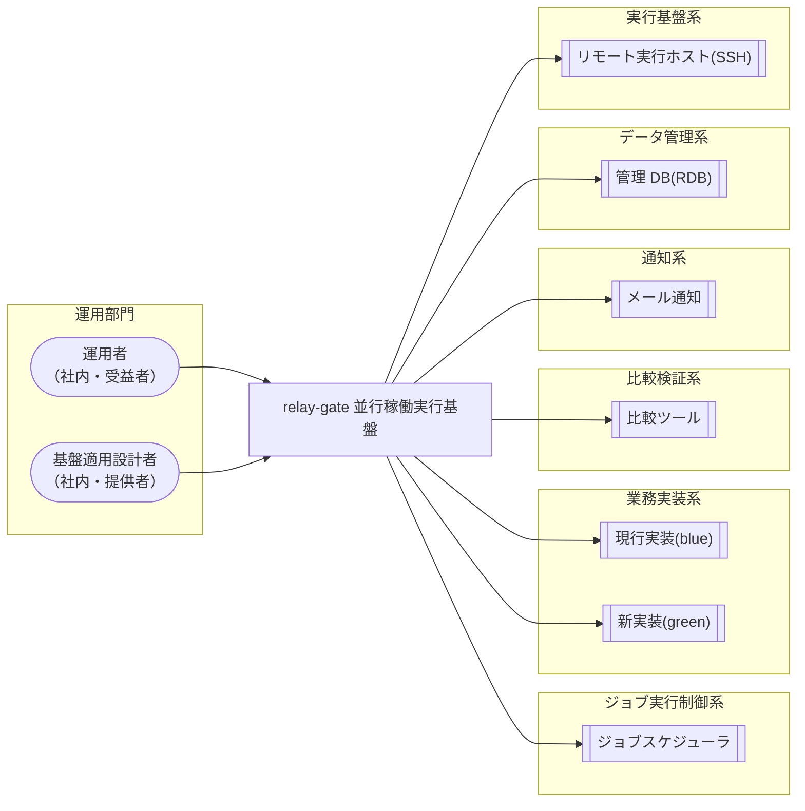

<!-- generateRdraMd.js による自動生成ファイル。手動編集しないこと。元データ: docs/rdra/latest/*.tsv -->

# システムコンテキスト

RDRA システム価値レイヤー。システムに関わるアクターと外部システムの全体像。

> 凡例: `(丸角)` アクター / `[四角]` システム / `[[二重枠]]` 外部システム

## アクター

| アクター群 | アクター | 役割 | 社内外 | 立場 | 主担当業務 |
|---|---|---|---|---|---|
| 運用部門 | 運用者 | ジョブスケジューラの実行結果と通知メールで background 実行の異常(ハング疑い・実行エラー・速報クロスチェック異常)を受け取り、静観か対処かを判断する。プロセス停止を確認した上で中止スクリプトで実行を ABORTED へ遷移させ、専用ジョブから background 側リランを起動して復旧する。速報比較結果で差分の原因を調査し、日次全量比較(確報)の結果をリリース判断の正本として用いる。監視記録を基に hang_detect_limit_minutes をジョブごとに調整し、基盤適用設計者が定義した運用モードで業務ジョブを実行する | 社内 | 受益者 | 実装切替業務、クロスチェック業務、実行監視業務、実行復旧業務、適用構成業務 |
| 運用部門 | 基盤適用設計者 | feature flag(slot 実行モード・runner 割り当て・RAPID_CROSSCHECK_MODE)を設定して並行稼働・単独本番・次世代実装との並行稼働を切り替える。案件固有の事項(実装固有の起動方式・ホスト配置・実行ユーザー・固定引数・hang_detect_limit_minutes・比較対象と対象カタログ・比較定義)を runner 実体スクリプト・slot ジョブマップ・クロスチェックジョブマップとして定義し、relay-gate のスクリプトを変更せずに新しい案件や次世代実装へ適用する | 社内 | 提供者 | 適用構成業務 |

## 外部システム

| 外部システム群 | 外部システム | 役割 |
|---|---|---|
| ジョブ実行制御系 | ジョブスケジューラ | 同一ジョブ定義から facade を JOB_ID [PARAM...] で起動し、標準出力・標準エラー・終了コードを受け取って実行結果を判定・記録する。確報クロスチェック runner・ハング検知定期ジョブ・background 側リラン専用ジョブ・中止スクリプトも別ジョブ定義から起動し、実行履歴・監査を保持する |
| 業務実装系 | 現行実装(blue) | blue slot の runner から起動される既存の業務処理実装。ジョブマップで解決されたホスト・実行ユーザー・スクリプトで実行され、終了結果を Runner Result(stdout.log / stderr.log / exitcode.txt)として残す |
| 業務実装系 | 新実装(green) | green slot の runner から起動される新しい業務処理実装。blue と並行稼働または単独本番で実行され、終了結果を Runner Result として残す。runner の差し替えにより次世代実装へ置き換えられる |
| 比較検証系 | 比較ツール | 速報クロスチェック worker からジョブ単位の比較、確報クロスチェック worker から全テーブル・全ファイルの日次全量比較を起動される。比較 OK=0 / 比較 NG=3 / 実行エラー=6 などの終了コードと stdout・stderr で比較結果を返す |
| 通知系 | メール通知 | ハング検知が検出したハング疑い・background 実行エラー・速報クロスチェック異常を warning / error のメールとして運用者へ送信する |
| データ管理系 | 管理 DB(RDB) | ジョブキュー兼管理 DB。速報側(parallel_run / rapid_run / rapid_crosscheck_request / comparison_result)と確報側(final_crosscheck_request / 対象カタログ)の依頼状態・lease・結果を保持し、worker の poll / claim による多重実行防止と監視記録の保存を担う |
| 実行基盤系 | リモート実行ホスト(SSH) | ジョブマップで解決された実行先ホストに実行ユーザーで SSH 接続し、実装スクリプトを作業ディレクトリ・固定引数・追加引数付きで実行する接続先。DB セグメント経由の実行など案件固有の配置を吸収する |
