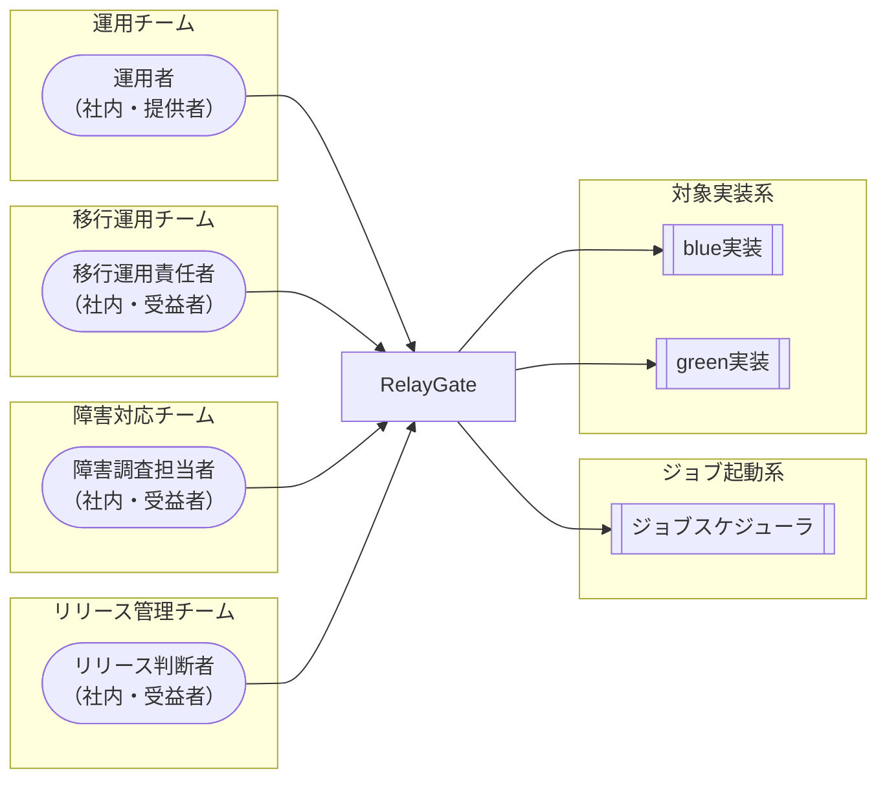

<!-- generateRdraMd.js による自動生成ファイル。手動編集しないこと。元データ: docs/rdra/latest/*.tsv -->

# システムコンテキスト

RDRA システム価値レイヤー。システムに関わるアクターと外部システムの全体像。

> 凡例: `(丸角)` アクター / `[四角]` システム / `[[二重枠]]` 外部システム

## アクター

| アクター群 | アクター | 役割 | 社内外 | 立場 | 主担当業務 |
|---|---|---|---|---|---|
| 運用チーム | 運用者 | background実行・速報比較依頼の中止確認、リラン実行、ハング検知通知の受領と対応を行う | 社内 | 提供者 | ハング監視フロー、blue中止フロー、green中止フロー、速報比較中止フロー、確報比較中止フロー、background側リランフロー |
| 移行運用チーム | 移行運用責任者 | 並行稼働の実行結果を確認し段階的切替を判断する。background実行の未完了・非0終了・速報比較異常を定期的に検知し、運用者へ通知する | 社内 | 受益者 | 並行稼働実行フロー |
| 障害対応チーム | 障害調査担当者 | ジョブ単位の速報クロスチェック結果を確認し、早期の差分検知に活用する | 社内 | 受益者 | 速報クロスチェックフロー |
| リリース管理チーム | リリース判断者 | 日次の確報クロスチェック結果を確認し、リリース判断の正本として利用する | 社内 | 受益者 | 確報クロスチェックフロー |

## 外部システム

| 外部システム群 | 外部システム | 役割 |
|---|---|---|
| ジョブ起動系 | ジョブスケジューラ | 共通のジョブ定義からJOB_IDと追加引数を渡してfacadeを起動し、foreground実行結果（標準出力・標準エラー・終了コード）だけを受け取る |
| 対象実装系 | blue実装 | 既存実装（strangler対象）として、facadeから起動されるslotの一方を担い、Runner Result Contractに従った実行結果を出力する |
| 対象実装系 | green実装 | 新実装（strangler移行先）として、facadeから起動されるslotの一方を担い、Runner Result Contractに従った実行結果を出力する |
