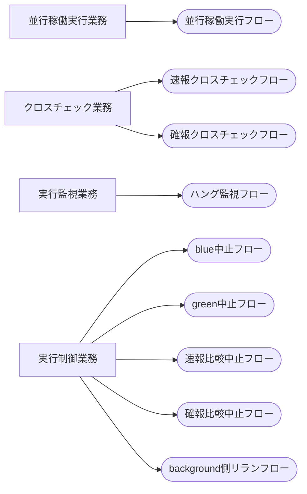

<!-- generateRdraMd.js による自動生成ファイル。手動編集しないこと。元データ: docs/rdra/latest/*.tsv -->

# 業務構成

RDRA システム外部環境レイヤー。業務とビジネスユースケース（BUC）の構成。

> 凡例: `[四角]` 業務 / `(丸角)` BUC

## BUC 一覧

| 業務 | BUC | アクティビティ数 | UC 数 |
|---|---|---|---|
| 並行稼働実行業務 | 並行稼働実行フロー | 4 | 4 |
| クロスチェック業務 | 速報クロスチェックフロー | 3 | 3 |
| クロスチェック業務 | 確報クロスチェックフロー | 3 | 3 |
| 実行監視業務 | ハング監視フロー | 3 | 3 |
| 実行制御業務 | blue中止フロー | 2 | 2 |
| 実行制御業務 | green中止フロー | 2 | 2 |
| 実行制御業務 | 速報比較中止フロー | 2 | 2 |
| 実行制御業務 | 確報比較中止フロー | 2 | 2 |
| 実行制御業務 | background側リランフロー | 2 | 2 |
