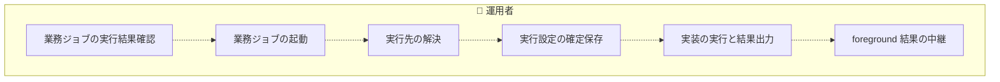
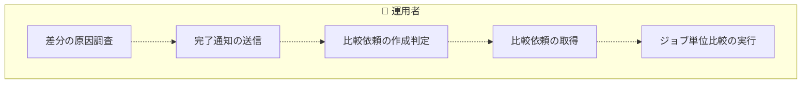
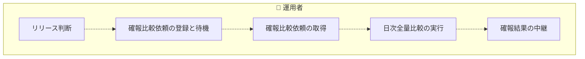
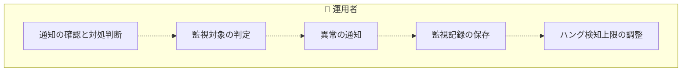
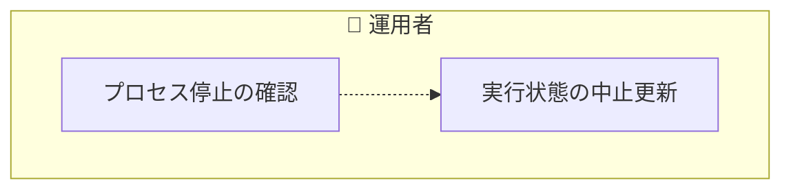
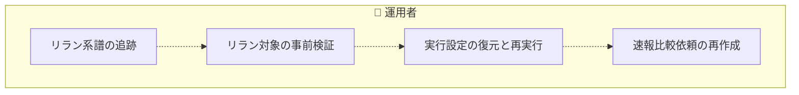
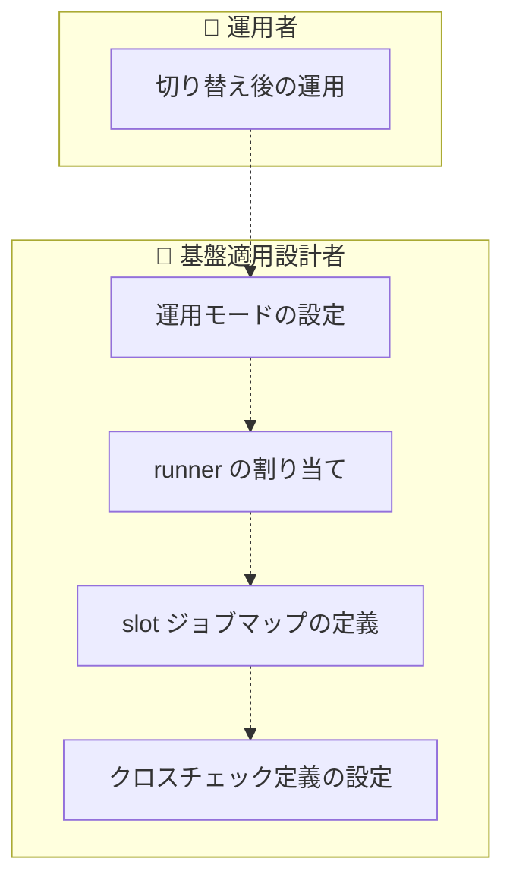

<!-- generateRdraMd.js による自動生成ファイル。手動編集しないこと。元データ: docs/rdra/latest/*.tsv -->

# 業務フロー

RDRA システム外部環境レイヤー。BUC ごとのアクティビティの流れ。
担当（アクター）ごとのレーンに分けて表示する。

## 実装切替業務

### 実装切替ジョブ実行フロー

> 点線矢印は TSV の行順にもとづく推定順序（`先`/`次` 未指定のため）。

| アクティビティ | 担当 | UC | 説明 |
|---|---|---|---|
| 業務ジョブの実行結果確認 | 運用者 | 業務ジョブの実行結果を確認する | ジョブスケジューラに中継された foreground slot の標準出力・標準エラー・終了コードをジョブスケジューラの実行結果として確認する。速報クロスチェックの失敗や background slot の結果は含まれず、並行稼働中も単独本番中も同じ見え方で結果を判定できる |
| 業務ジョブの起動 | 運用者 | slot 実行モードを選択して runner を起動する | ジョブスケジューラから JOB_ID [PARAM...] で起動された facade が feature flag 設定を読み込み、blue / green slot ごとに foreground / background / off の実行モードを選択する。両 slot が foreground の構成は入力検証でエラー終了する。background slot をすべて起動してから foreground slot を起動し、foreground の PID だけを待機する。速報クロスチェック有効時は run_id を発行して parallel_run を STARTED から RUNNING へ遷移させる |
| 実行先の解決 | 運用者 | ジョブマップで JOB_ID から実行先を解決する | slot runner が実装固有のジョブマップから JOB_ID に対応するホスト・実行ユーザー・スクリプト・作業ディレクトリ・固定引数(JSON 配列)・hang_detect_limit_minutes を解決する。固定引数の後ろにジョブスケジューラから渡された PARAM... を順序を変えずに連結する。ジョブマップ未定義の場合も Runner Result の 3 ファイルを可能な限り出力して異常終了する |
| 実行設定の確定保存 | 運用者 | execution-spec.json を確定保存する | run 開始時に解決済みの実行設定・追加引数・マップ版・実装版・role ごとの hang_detect_limit_minutes を execution-spec.json として一時ファイル経由で一度だけ確定保存する。認証情報は値を保存せず参照名だけを保存する。run 開始後にジョブマップを変更しても同じ run の execution-spec.json は上書きしない |
| 実装の実行と結果出力 | 運用者 | 実装スクリプトを実行して Runner Result を出力する | slot runner が解決済みの実行先ホストへ実行ユーザーで SSH 接続し、現行実装または新実装のスクリプトを作業ディレクトリ・固定引数・追加引数付きで実行する。foreground / background を問わず started-at.txt・stdout.log・stderr.log・exitcode.txt を成果物ディレクトリに一時ファイル経由で原子的に出力し、起動失敗や SSH 失敗でも可能な限り 3 ファイルを揃える。exitcode.txt が 0 なら slot 実行を SUCCEEDED、非 0 なら FAILED とする |
| foreground 結果の中継 | 運用者 | foreground slot の結果をジョブスケジューラへ中継する | facade が foreground slot の stdout.log・stderr.log・exitcode.txt をそのまま標準出力・標準エラー・終了コードとしてジョブスケジューラへ返す。background slot の完了や速報クロスチェックの結果は応答に含めず待機もしない。中継が完了すると parallel_run を COMPLETED へ遷移させる |

## クロスチェック業務

### 速報クロスチェックフロー

> 点線矢印は TSV の行順にもとづく推定順序（`先`/`次` 未指定のため）。

| アクティビティ | 担当 | UC | 説明 |
|---|---|---|---|
| 差分の原因調査 | 運用者 | 速報比較結果を参照する | 管理 DB に登録された comparison_result(comparison_type・status・difference_count・report_uri・compared_at)と依頼レコードの stdout・stderr・exitcode を run_id で参照し、blue / green の差分の原因を調査する。速報の結果は原因調査に使用し、リリース判断の正本には用いない |
| 完了通知の送信 | 運用者 | 速報クロスチェック runner へ完了通知を送信する | blue / green runner が完了時に系統ごとの公開 function(blue-completed / green-completed)で run_id・job_id・結果を速報クロスチェック runner へ通知して終了する。runner は相手側の状態や比較依頼の要否を判断しない。RAPID_CROSSCHECK_MODE=off のときは完了通知を送信せず、速報管理 DB への接続・書き込みも行わない |
| 比較依頼の作成判定 | 運用者 | 両系成功時に速報比較依頼を作成する | 速報クロスチェック runner が完了通知を受けて rapid_run の blue_status / green_status を更新し、速報実行の完了状況を両系未完了 → 片系完了 → 両系成功 / いずれか失敗へ進める。blue と green の両方が成功したときに限り、完了順にかかわらず rapid_crosscheck_request を REQUESTED で 1 件だけ一意に作成して比較依頼作成済みとする。いずれかが失敗した場合は比較依頼を作成せず終了する |
| 比較依頼の取得 | 運用者 | 速報比較依頼を claim する | 速報クロスチェック worker が管理 DB をジョブキューとして poll し、REQUESTED の速報比較依頼を worker_id と lease_until 付きで CLAIMED にする。CLAIMED で lease が失効しかつ未開始の依頼は REQUESTED に戻し、別の worker が再取得できるようにして多重実行を防ぐ |
| ジョブ単位比較の実行 | 運用者 | 比較ツールでジョブ単位比較を実行して結果を登録する | 速報クロスチェック worker が依頼を RUNNING にし、クロスチェックのジョブマップにある job_id ごとの比較定義に従って比較ツールでジョブ単位の比較を非同期に実行する。比較ツールの stdout・stderr・exitcode を依頼レコードへ保存し、exitcode 0 なら SUCCEEDED、非 0(比較 NG=3・実行エラー=6 など)なら FAILED として comparison_result を管理 DB に登録する。結果はジョブスケジューラへの応答に影響させない |

### 確報クロスチェックフロー

> 点線矢印は TSV の行順にもとづく推定順序（`先`/`次` 未指定のため）。

| アクティビティ | 担当 | UC | 説明 |
|---|---|---|---|
| リリース判断 | 運用者 | 確報クロスチェック結果を確認する | ジョブスケジューラの確報ジョブの実行結果(標準出力・標準エラー・終了コード)で business_date 単位の全テーブル・全ファイルの日次整合性を確認し、リリース判断の正本として用いる。終了コード以外の連携データは無いため、ジョブスケジューラの標準的な仕組みだけで判定する |
| 確報比較依頼の登録と待機 | 運用者 | 確報比較依頼を登録して終端状態まで待機する | ジョブスケジューラの別ジョブ定義から起動された確報クロスチェック runner が、business_date と対象カタログの版で final_crosscheck_request を REQUESTED で登録し、SUCCEEDED / FAILED / ABORTED の終端状態になるまで同期 polling する。確報の制御は feature flag に含めず、rapid_run や rapid_crosscheck_request を再利用しない |
| 確報比較依頼の取得 | 運用者 | 確報比較依頼を claim する | 確報クロスチェック worker が DB セグメントで管理 DB を poll し、REQUESTED の確報比較依頼を worker_id と lease_until 付きで CLAIMED にする。lease が失効しかつ未開始なら REQUESTED に戻し、速報と同じライフサイクルで多重実行を防ぐ |
| 日次全量比較の実行 | 運用者 | 比較ツールで日次全量比較を実行して結果を保存する | 確報クロスチェック worker が依頼を RUNNING にし、対象カタログに従って比較ツールで全テーブル・全ファイルの日次全量比較を起動する。起動した実装の stdout・stderr・exitcode を依頼レコードへ保存し、exitcode 0 なら SUCCEEDED、非 0 または実行エラーなら FAILED とする |
| 確報結果の中継 | 運用者 | 保存済みの確報結果をジョブスケジューラへ返す | 確報クロスチェック runner が終端状態になった依頼に保存された stdout・stderr・exitcode をそのまま標準出力・標準エラー・終了コードとしてジョブスケジューラへ返す。チェック結果・差分件数・レポート URI・依頼の管理状態名などの連携データは追加しない |

## 実行監視業務

### background 実行監視フロー

> 点線矢印は TSV の行順にもとづく推定順序（`先`/`次` 未指定のため）。

| アクティビティ | 担当 | UC | 説明 |
|---|---|---|---|
| 通知の確認と対処判断 | 運用者 | background 異常の通知メールを受け取る | ハング検知が送信した warning / error のメールでハング疑い・background 実行エラー・速報クロスチェック異常を受け取り、静観するか実行中止・リランで対処するかを判断する。ジョブスケジューラのジョブステータスに現れない background 異常を見落とさないための別経路の通知である |
| 監視対象の判定 | 運用者 | background 実行の経過時間と終了状態を判定する | ジョブスケジューラの定期ジョブ(5 分ごとなど)として起動されたハング検知スクリプトが、未完了の background slot 実行と速報比較依頼を走査する。started-at.txt と execution-spec.json の hang_detect_limit_minutes から経過時間を判定し、hang_detect_limit_minutes が 0 の role と foreground role は監視対象外とする。exitcode.txt が 0 なら正常終了、非 0 なら実行エラー、未出力で上限超過ならハング疑い、速報比較依頼が FAILED または比較 NG なら比較異常と判定する。RAPID_CROSSCHECK_MODE=off の場合は管理 DB なしで slot 成果物だけを走査する |
| 異常の通知 | 運用者 | ハング疑い・実行エラー・比較異常を通知する | 判定結果に応じて、ハング疑いを warning、background 実行エラーと速報クロスチェック異常を error のメールとして運用者へ送信する。速報比較依頼が RUNNING のときは状態を変更せずハング疑いとして通知する。監視は通知のみで、RUNNING を ABORTED へ変更せず、実行プロセスを停止せず、新しい実行依頼を作成しない |
| 監視記録の保存 | 運用者 | 監視記録を保存する | background 実行ごとに monitor_status(監視対象外 / 監視中 / ハング疑い通知済み / 実行エラー通知済み / 比較異常通知済み / 正常終了)と hang_suspected_at・alerted_at を記録する。通知後に正常終了した実行についても警告時の経過時間を記録し、通常処理の警告傾向を確認できるようにする |
| ハング検知上限の調整 | 運用者 | hang_detect_limit_minutes をジョブごとに調整する | 導入時は全ジョブ 60 分とし、正常終了パターンの警告が出そろった時点で監視記録の警告時経過時間を基準に slot ジョブマップの hang_detect_limit_minutes をジョブごとに調整する。foreground role は 0 に設定して検知対象から除外する。調整は以後の run の execution-spec.json に反映され、実行済みの run には影響しない |

## 実行復旧業務

### 実行中止フロー

> 点線矢印は TSV の行順にもとづく推定順序（`先`/`次` 未指定のため）。

| アクティビティ | 担当 | UC | 説明 |
|---|---|---|---|
| プロセス停止の確認 | 運用者 | 現在状態を確認して停止確認に応答する | 通知や実行結果から中止対象の run_id を特定し、対象ジョブのプロセス・Pod・SSH 接続先の処理を運用者自身が強制終了したことを確認する。中止スクリプトが表示する現在状態を見て、プロセス強制終了の対話確認に yes または yes 以外で応答する |
| 実行状態の中止更新 | 運用者 | 実行を ABORTED へ遷移させる | abort-blue / abort-green / abort-rapid-crosscheck / abort-final-crosscheck を --run-id 付きで起動し、対象の現在状態を表示してプロセス強制終了を対話確認する。yes のときに限り、background かつ RUNNING の slot 実行または RUNNING の比較依頼を ABORTED へ更新し、並行稼働実行も ABORTED にする。対象 slot が foreground または off、あるいは RUNNING 以外の場合は状態を変更せずエラー終了する。スクリプト自身はプロセスを停止せず状態更新だけを行い、二重実行を防ぐ |

### background 側リランフロー

> 点線矢印は TSV の行順にもとづく推定順序（`先`/`次` 未指定のため）。

| アクティビティ | 担当 | UC | 説明 |
|---|---|---|---|
| リラン系譜の追跡 | 運用者 | リラン結果を parent_run_id で追跡する | リランで発行された新しい run_id の実行結果を、parent_run_id をたどって元の実行まで数珠つなぎに追跡し、障害対応の経緯と結果の対応関係を管理 DB と成果物ディレクトリで確認する |
| リラン対象の事前検証 | 運用者 | リラン対象を検証する | ジョブスケジューラの専用ジョブから --source-run-id と --role(blue / green / rapid-crosscheck)付きで起動された background-rerun が、元の実行の execution-spec.json と管理 DB の状態を確認する。元の slot mode が foreground または off、未対応の role、元の実行が見つからない、元の実行が RUNNING または中止未確認の場合はリランせずエラー終了する。foreground slot 実行と確報クロスチェックはジョブスケジューラの正規ジョブを直接再実行する |
| 実行設定の復元と再実行 | 運用者 | 元の execution-spec.json から復元して新しい run_id で起動する | --role が blue または green のとき、最新のジョブマップを再解決せず、元の execution-spec.json から実行パラメータ・ホスト・実行ユーザー・スクリプト・作業ディレクトリを復元し、新しい run_id を発行して background slot を再実行する。新しい parallel_run の parent_run_id には直前のリラン元 run_id を設定し、Runner Result を新しい成果物ディレクトリへ出力する |
| 速報比較依頼の再作成 | 運用者 | 速報比較依頼だけを新規作成する | --role が rapid-crosscheck のとき、業務ジョブを再実行せず、元の run の blue / green の成果物を対象とする速報比較依頼を新しい run_id で REQUESTED として作成し、parent_run_id で元の実行に紐付ける。作成後は速報クロスチェック worker の通常の claim と比較実行に委ねる |

## 適用構成業務

### 適用構成定義フロー

> 点線矢印は TSV の行順にもとづく推定順序（`先`/`次` 未指定のため）。

| アクティビティ | 担当 | UC | 説明 |
|---|---|---|---|
| 切り替え後の運用 | 運用者 | 切り替えた運用モードで業務ジョブを実行する | 基盤適用設計者が定義した feature flag・runner・ジョブマップ・比較定義に基づき、ジョブスケジューラのジョブ定義を変更せずに並行稼働・新実装の単独本番・次世代実装との並行稼働の各運用モードで業務ジョブを実行し、その結果と通知を受け取る |
| 運用モードの設定 | 基盤適用設計者 | feature flag を設定する | slot(blue / green)ごとの実行モード(foreground / background / off)と runner 割り当て、RAPID_CROSSCHECK_MODE(on / off)を feature flag 設定として定義する。両 slot が foreground にならない組み合わせで並行稼働・単独本番・次世代実装との並行稼働を表現し、ジョブ定義の改修なしで運用モードを切り替える |
| runner の割り当て | 基盤適用設計者 | slot runner の実体スクリプトを割り当てる | blue / green slot に現行実装・新実装・次世代実装の起動方式・ホスト・OS・プロトコルを閉じ込めた runner 実体スクリプトを割り当てる。runner の差し替えだけで facade と比較規約を変更せずに異なる世代の実装を並行稼働できるようにする |
| slot ジョブマップの定義 | 基盤適用設計者 | slot ごとのジョブマップを定義する | slot ごとに JOB_ID から解決するホスト・実行ユーザー・スクリプト・作業ディレクトリ・固定引数(JSON 配列)・hang_detect_limit_minutes(導入時 60 分、foreground role は 0)をジョブマップとして定義する。認証情報は参照名で指定し、ジョブスケジューラ側のジョブ定義には実行先を持たせない |
| クロスチェック定義の設定 | 基盤適用設計者 | クロスチェックのジョブマップと比較定義を定義する | 速報クロスチェック用に job_id ごとの比較対象と比較定義、確報クロスチェック用に対象カタログとその版をクロスチェックのジョブマップとして定義する。比較ツールの終了コード契約に従い、外部 IF の送受信方針・ネットワーク制約・ホスト配置は適用文書で定義して、facade・クロスチェック runner / worker・ハング検知・リラン・中止のスクリプトを変更せずに新しい案件や次世代実装へ適用する |
