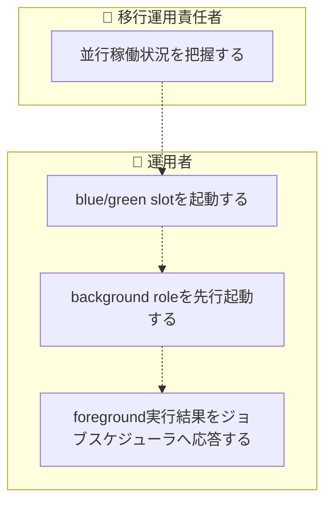
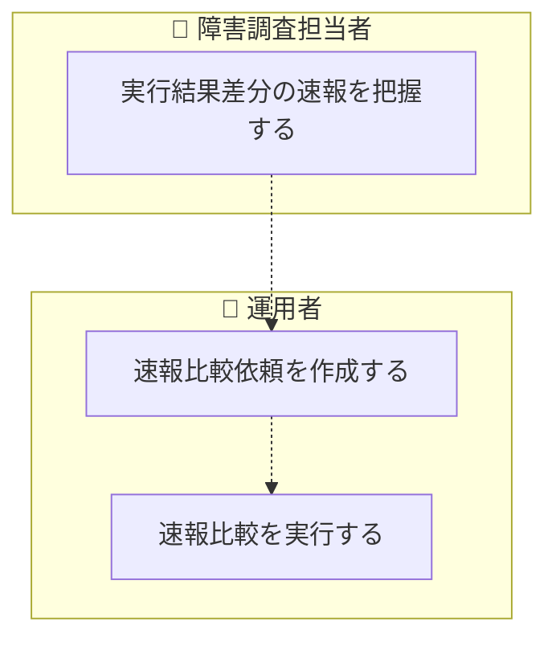
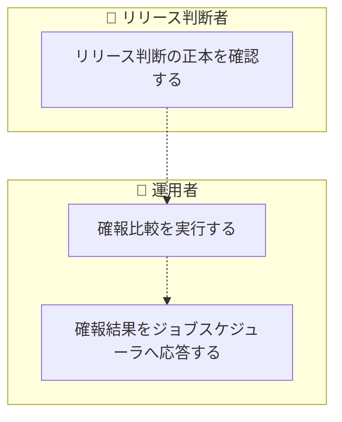
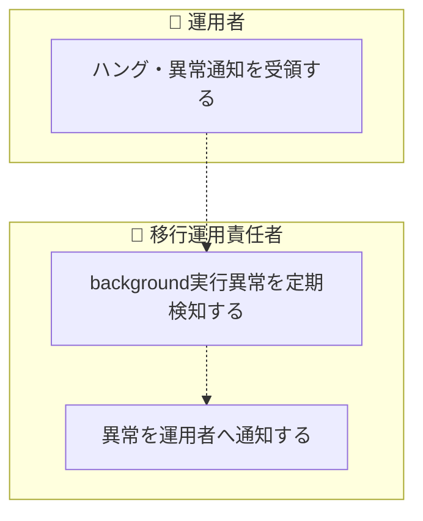
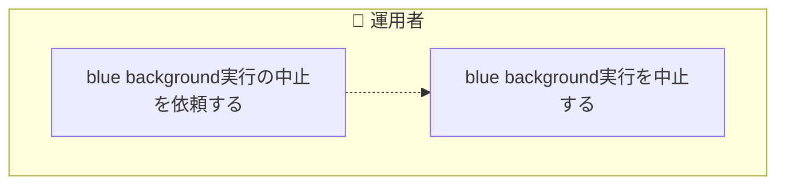
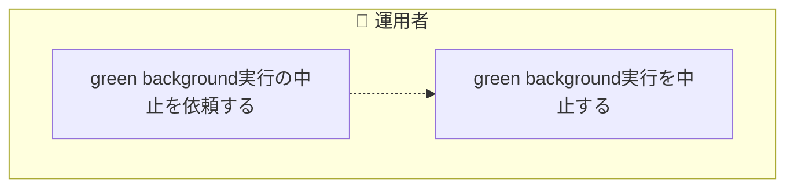
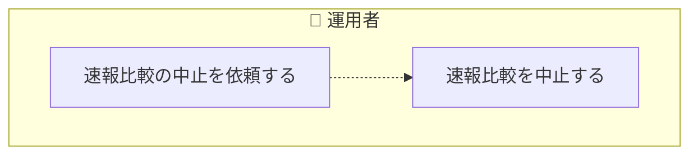
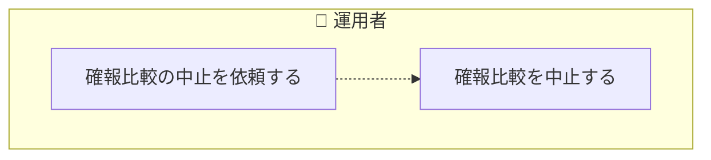
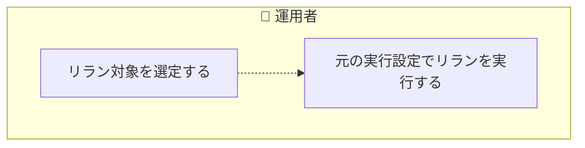

<!-- generateRdraMd.js による自動生成ファイル。手動編集しないこと。元データ: docs/rdra/latest/*.tsv -->

# 業務フロー

RDRA システム外部環境レイヤー。BUC ごとのアクティビティの流れ。
担当（アクター）ごとのレーンに分けて表示する。

## 並行稼働実行業務

### 並行稼働実行フロー

> 点線矢印は TSV の行順にもとづく推定順序（`先`/`次` 未指定のため）。

| アクティビティ | 担当 | UC | 説明 |
|---|---|---|---|
| 並行稼働状況を把握する | 移行運用責任者 | 並行稼働実行結果を確認する | 移行運用責任者がblue/green並行稼働の実行結果を確認し、段階的切替の判断材料とする |
| blue/green slotを起動する | 運用者 | feature flag設定に基づきslotを選択して起動する | feature flag設定を参照し、blue/green実装のうちどちらのslotを起動するか選択し起動する |
| background roleを先行起動する | 運用者 | background roleを起動する | foreground roleの実行に先立ちbackground roleを起動し、background slot実行状態をRUNNINGへ遷移させる |
| foreground実行結果をジョブスケジューラへ応答する | 運用者 | foreground roleの標準出力・標準エラー・終了コードを応答する | foreground roleの標準出力・標準エラー・終了コードだけをジョブスケジューラへ応答する |

## クロスチェック業務

### 速報クロスチェックフロー

> 点線矢印は TSV の行順にもとづく推定順序（`先`/`次` 未指定のため）。

| アクティビティ | 担当 | UC | 説明 |
|---|---|---|---|
| 実行結果差分の速報を把握する | 障害調査担当者 | 速報クロスチェック結果を確認する | 障害調査担当者がジョブ単位の速報比較結果を確認し、早期の差分検知に活用する |
| 速報比較依頼を作成する | 運用者 | blue/green runnerの完了通知を受けて速報比較依頼を作成する | blue/green runnerの完了通知を受けてジョブ単位に速報比較依頼を作成し、速報比較依頼状態をREQUESTEDへ遷移させる |
| 速報比較を実行する | 運用者 | 速報クロスチェックを実行し差分を検知する | 日次の全量比較を待たずに実行結果の差分を検知し、速報比較依頼状態をSUCCEEDED/FAILEDへ遷移させる |

### 確報クロスチェックフロー

> 点線矢印は TSV の行順にもとづく推定順序（`先`/`次` 未指定のため）。

| アクティビティ | 担当 | UC | 説明 |
|---|---|---|---|
| リリース判断の正本を確認する | リリース判断者 | 確報クロスチェック結果を確認する | リリース判断者が日次の確報比較結果を確認し、リリース判断の正本として利用する |
| 確報比較を実行する | 運用者 | 全テーブル・全ファイルを対象に確報クロスチェックを実行する | 日次で全テーブル・全ファイルを対象に整合性を確認し、確報比較依頼状態をSUCCEEDED/FAILEDへ遷移させる |
| 確報結果をジョブスケジューラへ応答する | 運用者 | 確報クロスチェック結果をstdout/stderr/exitcodeで応答する | 比較結果・差分件数・レポートURIなどを含めず、標準出力・標準エラー・終了コードのみに限定して応答する |

## 実行監視業務

### ハング監視フロー

> 点線矢印は TSV の行順にもとづく推定順序（`先`/`次` 未指定のため）。

| アクティビティ | 担当 | UC | 説明 |
|---|---|---|---|
| ハング・異常通知を受領する | 運用者 | ハング疑い・異常の通知を確認する | 運用者が定期検知されたハング疑いや異常の通知を受け取り、対応要否を判断する |
| background実行異常を定期検知する | 移行運用責任者 | background実行の未完了・非0終了・速報比較異常を定期検知する | background実行の未完了・非0終了・速報クロスチェック異常を定期的に検知する |
| 異常を運用者へ通知する | 移行運用責任者 | ハング疑い・異常を運用者へ通知する | 検知したハング疑いや異常を運用者へ通知する |

## 実行制御業務

### blue中止フロー

> 点線矢印は TSV の行順にもとづく推定順序（`先`/`次` 未指定のため）。

| アクティビティ | 担当 | UC | 説明 |
|---|---|---|---|
| blue background実行の中止を依頼する | 運用者 | blue background実行の中止を依頼する | 停止確認済みのblue background実行について中止を発意する |
| blue background実行を中止する | 運用者 | 対話確認のうえblue background実行をABORTEDへ遷移させる | 対話確認により実プロセスの停止を確認したうえで、blue background slot実行状態をABORTEDへ明示的に遷移させる |

### green中止フロー

> 点線矢印は TSV の行順にもとづく推定順序（`先`/`次` 未指定のため）。

| アクティビティ | 担当 | UC | 説明 |
|---|---|---|---|
| green background実行の中止を依頼する | 運用者 | green background実行の中止を依頼する | 停止確認済みのgreen background実行について中止を発意する |
| green background実行を中止する | 運用者 | 対話確認のうえgreen background実行をABORTEDへ遷移させる | 対話確認により実プロセスの停止を確認したうえで、green background slot実行状態をABORTEDへ明示的に遷移させる |

### 速報比較中止フロー

> 点線矢印は TSV の行順にもとづく推定順序（`先`/`次` 未指定のため）。

| アクティビティ | 担当 | UC | 説明 |
|---|---|---|---|
| 速報比較の中止を依頼する | 運用者 | RUNNING中の速報比較依頼の中止を依頼する | RUNNING中の速報比較依頼について中止を発意する |
| 速報比較を中止する | 運用者 | 対話確認のうえ速報比較依頼をABORTEDへ遷移させる | 対話確認のうえRUNNING中の速報比較依頼をABORTED状態へ明示的に遷移させる |

### 確報比較中止フロー

> 点線矢印は TSV の行順にもとづく推定順序（`先`/`次` 未指定のため）。

| アクティビティ | 担当 | UC | 説明 |
|---|---|---|---|
| 確報比較の中止を依頼する | 運用者 | RUNNING中の確報比較依頼の中止を依頼する | RUNNING中の確報比較依頼について中止を発意する |
| 確報比較を中止する | 運用者 | 対話確認のうえ確報比較依頼をABORTEDへ遷移させる | 対話確認のうえRUNNING中の確報比較依頼をABORTED状態へ明示的に遷移させる |

### background側リランフロー

> 点線矢印は TSV の行順にもとづく推定順序（`先`/`次` 未指定のため）。

| アクティビティ | 担当 | UC | 説明 |
|---|---|---|---|
| リラン対象を選定する | 運用者 | 再実行対象のbackground実行・速報比較依頼を選択する | 完了済みまたは中止済みのbackground実行や速報比較依頼から再実行対象を選択的に指定する |
| 元の実行設定でリランを実行する | 運用者 | execution-spec.jsonの実行設定を保ったまま再実行する | 元のexecution-spec.jsonの実行設定を保ったまま、選択したbackground実行または速報比較依頼を再実行する |
