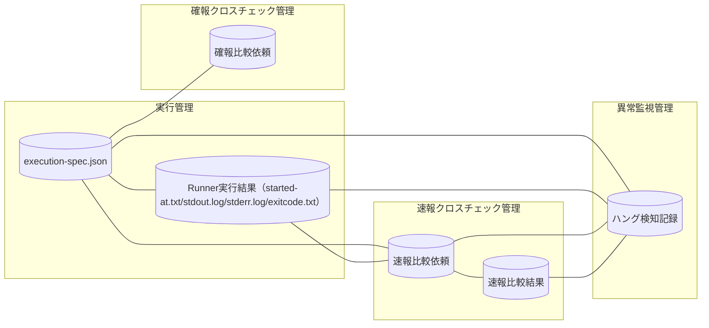

<!-- generateRdraMd.js による自動生成ファイル。手動編集しないこと。元データ: docs/rdra/latest/*.tsv -->

# 情報モデル

RDRA システム内部レイヤー。コンテキストごとの情報と情報間の関連。

> 凡例: `[(円柱)]` 情報 / `[四角]` 情報.tsv 未定義の参照。実線は関連情報。

## 情報一覧

| コンテキスト | 情報 | 属性 | 状態モデル | バリエーション | 説明 |
|---|---|---|---|---|---|
| 実行管理 | execution-spec.json | run_id、parent_run_id、JOB_ID、ホスト、実行ユーザー、スクリプト、作業ディレクトリ、固定引数、追加引数、マップ版、実装版、hang_detect_limit_minutes、認証情報参照名 |  |  | 起動時に解決済みのホスト・実行ユーザー・スクリプト・作業ディレクトリ・固定引数・追加引数・マップ版・実装版・hang_detect_limit_minutesなどrunの実行設定を一度だけ確定して保存し、リラン時の設定復元やparent_run_idによる実行系譜の追跡の基準とするため。認証情報は参照名のみを保存し実値は保存しない |
| 実行管理 | Runner実行結果（started-at.txt/stdout.log/stderr.log/exitcode.txt） | run_id、slot種別（blue/green）、role区分（foreground/background/rapid-crosscheck）、開始時刻（started-at）、標準出力（stdout）、標準エラー（stderr）、終了コード（exitcode）、実行状態（RUNNING/SUCCEEDED/FAILED/ABORTED） | background slot実行状態 | slot種別、role区分 | blue/green runnerのforeground・background実行結果を共通形式で保持し、ジョブスケジューラへの応答・完了通知・障害調査の3用途に使い回すため。exitcode.txtの有無と終了コードの値から実行状態（RUNNING/SUCCEEDED/FAILED）を判定し、対話確認を経た場合のみABORTEDへ遷移する |
| 速報クロスチェック管理 | 速報比較依頼 | run_id、JOB_ID、依頼日時、状態（REQUESTED/CLAIMED/RUNNING/SUCCEEDED/FAILED/ABORTED）、lease期限、worker識別子 | 速報比較依頼状態 | クロスチェック種別 | blueとgreenの完了通知を受けて作成する、ジョブ単位で非同期に行う速報クロスチェックの比較実行依頼であり、run_idで相関付けて実行状態を一意に管理するため。CLAIMED状態でlease失効かつ未開始の場合はREQUESTEDへ戻す |
| 速報クロスチェック管理 | 速報比較結果 | run_id、比較判定結果（OK/NG）、差分件数、差分詳細（レポートURI）、比較完了日時 |  |  | 速報クロスチェックの比較結果を保持し、hang-detectorによる速報クロスチェック異常の検知・運用者への通知に用いるため |
| 確報クロスチェック管理 | 確報比較依頼 | run_id、対象日、状態（REQUESTED/CLAIMED/RUNNING/SUCCEEDED/FAILED/ABORTED）、lease期限、worker識別子、対象テーブル・対象ファイル一覧 | 確報比較依頼状態 | クロスチェック種別 | 日次で全テーブル・全ファイルを対象に行う確報クロスチェックの比較実行依頼であり、速報側のエンティティと独立してrun_idで相関付け、リリース判断の正本とする実行状態を管理するため。応答はstdout/stderr/exitcodeの3項目のみに限定する |
| 異常監視管理 | ハング検知記録 | run_id、異常検知種別（ハング疑い/background実行エラー/速報クロスチェック異常）、検知日時、検知しきい値（hang_detect_limit_minutes）、対象slot種別（blue/green）、通知先 |  | 異常検知種別、slot種別 | background実行の未完了超過（ハング疑い）・非0終了エラー・速報クロスチェック異常を記録し、定期的な監視と運用者への通知に用いるため |
