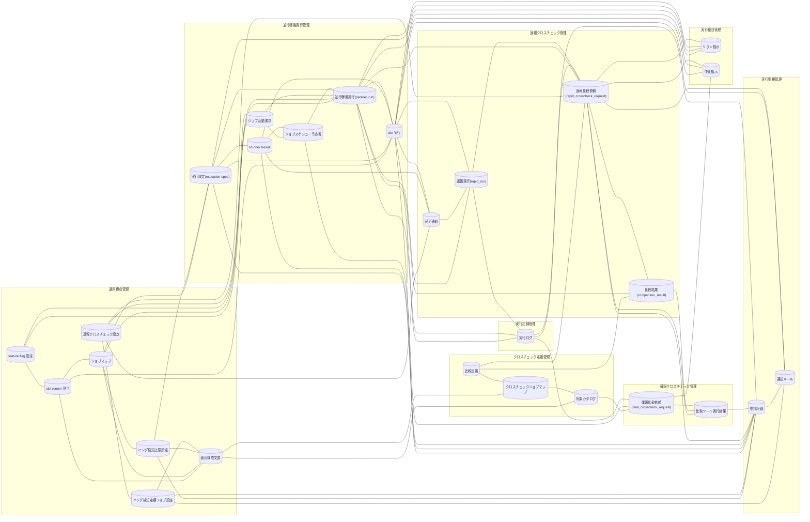

<!-- generateRdraMd.js による自動生成ファイル。手動編集しないこと。元データ: docs/rdra/latest/*.tsv -->

# 情報モデル

RDRA システム内部レイヤー。コンテキストごとの情報と情報間の関連。

> 凡例: `[(円柱)]` 情報 / `[四角]` 情報.tsv 未定義の参照。実線は関連情報。

## 情報一覧

| コンテキスト | 情報 | 属性 | 状態モデル | バリエーション | 説明 |
|---|---|---|---|---|---|
| 適用構成管理 | feature flag 設定 | BLUE_MODE(foreground / background / off)、GREEN_MODE(foreground / background / off)、RAPID_CROSSCHECK_MODE(foreground / background / off)、BLUE_IMPL(実装版)、GREEN_IMPL(実装版)、BLUE_RUNNER(runner 実体スクリプト)、GREEN_RUNNER(runner 実体スクリプト)、RAPID_CROSSCHECK_RUNNER(完了通知の送信先)、RAPID_CROSSCHECK_WORKER(速報クロスチェック worker の実体パス) |  | 実装スロット、slot 実行モード、運用モード、速報クロスチェックモード、設定所有区分 | ジョブスケジューラのジョブ定義を変更せずに、slot(blue / green)ごとの実行モード、実装版、runner 実体スクリプト、速報クロスチェックの制御を切り替える正本。元の方針資料の設定契約どおり 9 キー(BLUE_MODE / GREEN_MODE / RAPID_CROSSCHECK_MODE / BLUE_IMPL / GREEN_IMPL / BLUE_RUNNER / GREEN_RUNNER / RAPID_CROSSCHECK_RUNNER / RAPID_CROSSCHECK_WORKER)で構成し、設定版は持たない。RAPID_CROSSCHECK_MODE は foreground / background で runner が完了通知を送信して速報管理 DB へ書き込み、off で完了通知を送信せず速報管理 DB へ接続も書込みもしない。BLUE_IMPL / GREEN_IMPL は execution-spec.json の実装版の出所、RAPID_CROSSCHECK_RUNNER は slot runner が完了通知(blue-completed / green-completed)を送る先、RAPID_CROSSCHECK_WORKER は速報クロスチェック worker の実体パスとして扱う。並行稼働・新実装の単独本番・次世代実装との並行稼働を feature flag の組み合わせだけで表現する。blue と green の両方を foreground にする構成は入力検証で拒否する。基盤適用設計者が定義し、facade が起動のたびに読み込む |
| 適用構成管理 | slot runner 割当 | slot(blue / green)、runner 実体スクリプトパス、対応するジョブマップの所在 |  | 実装スロット、設定所有区分 | 実装固有の起動方式・ホスト・OS・プロトコルを slot の runner に閉じ込め、runner を差し替えることで facade と比較規約を変更せずに異なる世代の実装を並行稼働させるための割当。feature flag が所有し、基盤適用設計者が現行実装・新実装・次世代実装の runner 実体スクリプトを slot に割り当てる |
| 適用構成管理 | ジョブマップ | slot(blue / green)、job_id、host(ローカル実行の slot では省略可)、user(ローカル実行の slot では省略可)、work_dir、script、fixed_params(JSON 配列を格納する CSV セル)、hang_detect_limit_minutes、credential_ref(末尾の任意列)、map_version(末尾の任意列) |  | 実装スロット、設定所有区分、ハング検知上限設定 | JOB_ID から host・user・script・work_dir・fixed_params・hang_detect_limit_minutes を slot ごとに解決する実行先の正本。ジョブスケジューラ側の定義を実装非依存に保つ。形式は CSV(1 行目ヘッダー、1 行 1 job_id)で、列名は元資料の job_id,host,user,work_dir,script,fixed_params,hang_detect_limit_minutes を用いる。fixed_params は JSON 配列文字列を格納する CSV セルで、二重引用符で囲みセル内の二重引用符は二重化する。固定引数の数と各引数内の空白・カンマを維持し、空は [] とし、その後ろに PARAM を順序を変えずに連結する。host と user はローカル実行の slot では省略できる。credential_ref(認証情報の参照名。値は置かない)と map_version(マップ版)は元資料に無いため末尾の任意列として許容し、必須にしない。実装版はジョブマップに持たず feature flag(BLUE_IMPL / GREEN_IMPL)が所有する。run 開始時に解決した内容は実行設定(execution-spec)として確定保存され、以後のジョブマップ変更は実行済みの run に影響しない |
| 適用構成管理 | ハング検知上限設定 | job_id、role(blue / green / rapid-crosscheck)、hang_detect_limit_minutes(導入時 60 分、foreground role は 0 で対象外) |  | ハング検知上限設定、run role(成果物ディレクトリ区分) | ハング疑いの判定上限をジョブ・role ごとに保持する設定。ジョブマップの一部として所有され、導入時は全ジョブ 60 分とし、正常終了パターンの警告が出そろった時点で監視記録の警告時経過時間を基準に運用者が調整する。foreground role は 0 に設定して検知対象から除外する。調整の記録(調整日時・調整根拠となる警告時経過時間)はジョブマップの列に持たず適用構成文書に残す。調整は以後の run の execution-spec.json に反映され、実行済みの run には影響しない |
| 適用構成管理 | 適用構成文書 | 案件識別、外部 IF の送受信方針、ネットワーク制約、ホスト配置、実行ユーザー方針、DB セグメント構成、runner 実体の所在、文書版、運用者の調整記録(hang_detect_limit_minutes の調整日時、調整根拠となる警告時経過時間) |  | 設定所有区分 | relay-gate の仕組みに含めない案件固有事項(外部 IF の送受信方針・ネットワーク制約・ホスト配置・実行ユーザー方針・DB セグメント構成)を適用側が定義する文書。runner・ジョブマップ・比較定義の差し替えだけで新しい案件や次世代実装へ適用し、facade・クロスチェック runner / worker・ハング検知・リラン・中止のスクリプトを変更不要に保つ根拠となる。hang_detect_limit_minutes をジョブごとに調整した記録(調整日時・調整根拠となる警告時経過時間)もこの文書またはそのコミット履歴に残す |
| 適用構成管理 | ハング検知定期ジョブ設定 | 通知先メールアドレス(ALERT_MAIL_TO)、送信コマンド(ALERT_MAIL_CMD)、件名プレフィックス(ALERT_SUBJECT_PREFIX)、管理 DB 接続参照名(HANG_DB_CONN_REF。値は置かず参照名のみ) |  | 設定所有区分、通知レベル、速報クロスチェックモード | ハング検知定期ジョブ(hang-detector)が通知メールを送るための通知先メールアドレス・送信コマンド・件名プレフィックスと、速報クロスチェック有効時に監視で参照する管理 DB の接続参照名を保持する hang-detector 用 env 設定ファイル(hang-detector.env)。基盤適用設計者が所有し、認証情報は値を置かず参照名のみとする。RAPID_CROSSCHECK_MODE=off では管理 DB 接続参照名を使用せず slot 成果物だけで監視する |
| 適用構成管理 | 速報クロスチェック設定 | 管理 DB 接続参照名(RAPID_DB_CONN_REF。値は置かず参照名のみ)、lease 期間(秒。RAPID_LEASE_SEC)、worker の poll 間隔(秒。RAPID_POLL_INTERVAL_SEC) |  | 設定所有区分、速報クロスチェックモード、速報クロスチェックのプロセス役割 | 速報クロスチェックが管理 DB(ジョブキュー兼管理 DB)へ接続するための接続参照名と、依頼の claim に付与する lease 期間、worker が依頼を poll する間隔を保持する速報クロスチェック用 env 設定ファイル(rapid-crosscheck.env)。facade・slot runner・速報クロスチェック runner・速報クロスチェック worker が読み込む。基盤適用設計者が所有し、認証情報は値を置かず参照名のみとする。RAPID_CROSSCHECK_MODE=off ではこの設定を必要とせず、slot 実行は設定なしで動作する。ハング検知定期ジョブ設定(hang-detector.env)と同型だが、所有する項目と読み手が異なるため別の設定ファイルとする |
| クロスチェック定義管理 | 比較定義 | job_id、比較種別(comparison_type)、比較対象(テーブル・ファイル)、比較ツール起動コマンド、比較オプション、定義版 |  | 比較種別、対象カタログの対象種別 | 速報クロスチェック worker が job_id ごとにどの比較を比較ツールで実行するかを決める定義。適用側(基盤適用設計者)が job_id ごとに差し替え、比較ツールの終了コード契約(0 / 3 / 6)に従って結果を判定する |
| クロスチェック定義管理 | クロスチェックジョブマップ | 比較対象一覧、対象カタログ参照、job_id ごとの比較定義参照、マップ版 |  | 設定所有区分、クロスチェック種別 | 比較対象と対象カタログの所有者を feature flag・slot ジョブマップと分離し、クロスチェックの正本を適用側が job_id ごとに定義するマップ。設定所有者の分離の原則に基づき、速報クロスチェック用の job_id ごとの比較定義と、確報クロスチェック用の対象カタログとその版を保持する。形式は slot ジョブマップと同じ CSV(1 行目ヘッダー、1 行 1 job_id。セルは二重引用符で囲み、セル内の二重引用符は二重化する)に統一する |
| クロスチェック定義管理 | 対象カタログ | カタログ版、target_type(テーブル / ファイル)、target_identifier、比較条件、business_date の扱い |  | 対象カタログの対象種別、比較種別 | 確報クロスチェックが比較する全テーブル・全ファイルを target_type・target_identifier と版で定義するカタログ。確報比較依頼に版を紐付けてリリース判断の正本となる全量比較の対象を確定する。適用側が版管理して定義する。形式は slot ジョブマップと同じ CSV(1 行目ヘッダー、1 行 1 対象。セルは二重引用符で囲み、セル内の二重引用符は二重化する)に統一する |
| 並行稼働実行管理 | ジョブ起動要求 | JOB_ID、PARAM...(追加引数、順序保持)、起動元ジョブ定義、起動日時 |  | ジョブスケジューラ起動ジョブ種別 | ジョブスケジューラの業務ジョブが facade に渡す JOB_ID と PARAM...。ジョブ定義は facade の呼び出しと JOB_ID・PARAM だけを持ち、実行先を持たない。facade が feature flag で slot と mode を選択し、runner がジョブマップで実行先を解決して固定引数の後ろに PARAM を順序を変えずに連結する |
| 並行稼働実行管理 | 実行設定(execution-spec) | run_id、job_id、slot、role、ホスト、実行ユーザー、スクリプトパス、作業ディレクトリ、固定引数、追加引数(PARAM)、マップ版、実装版、role ごとの hang_detect_limit_minutes、認証情報参照名、確定保存日時、保存先 URI(facade/<run_id>/execution-spec.json) |  | 実装スロット、run role(成果物ディレクトリ区分)、ハング検知上限設定 | run 開始時に解決済みの実行設定を facade/<run_id>/execution-spec.json として一時ファイル経由で一度だけ確定保存したもの。後からジョブマップを変更しても上書きしない。ハング検知の判定基準(hang_detect_limit_minutes)、background-rerun 時の再現性(最新ジョブマップを再解決せず復元する)、障害調査の根拠として使用する。認証情報は値を保存せず参照名のみを保持する。実装版は feature flag の BLUE_IMPL / GREEN_IMPL を出所とし、マップ版はジョブマップ側の版(map_version)を出所とする |
| 並行稼働実行管理 | Runner Result | run_id、slot、成果物ディレクトリ、started-at.txt(開始時刻)、stdout.log、stderr.log、exitcode.txt(数値 1 行)、aborted.txt(中止日時 1 行。中止時のみ生成)、確定リネーム完了フラグ |  | Runner Result 成果物種別、実装スロット、run role(成果物ディレクトリ区分) | slot 実行の終了結果を started-at.txt / stdout.log / stderr.log / exitcode.txt として成果物ディレクトリに残す外部 IF の正本(Runner Result Contract)。ジョブスケジューラへの応答・完了通知・ハング検知・障害調査で共通に使用する。異常時(起動失敗・SSH 失敗・ジョブマップ未定義)も可能な限り 3 ファイルを揃え、一時ファイルへ出力してから確定名へリネームして書き込み途中の読み取りを防ぐ。slot 実行の状態はファイル正本(exitcode.txt / aborted.txt の有無と値)から導出し、速報クロスチェック有効時は管理 DB にも同じ状態を保持する。abort-blue / abort-green は成果物ディレクトリに aborted.txt を書くことで RAPID_CROSSCHECK_MODE=off でも中止を記録できる |
| 並行稼働実行管理 | ジョブスケジューラ応答 | run_id、標準出力(foreground の stdout.log)、標準エラー(foreground の stderr.log)、終了コード(foreground の exitcode.txt) |  | slot 実行モード、ジョブスケジューラ起動ジョブ種別 | facade が foreground slot の Runner Result をそのまま標準出力・標準エラー・終了コードとしてジョブスケジューラへ無加工で中継する応答。速報クロスチェックの失敗や background slot の結果は応答に含めず待機もしない。確報クロスチェック runner も依頼レコードに保存済みの stdout・stderr・exitcode を同じ形で中継し、終了コード以外の連携データを追加しない。運用者はこの応答を業務ジョブ・確報ジョブの実行結果として確認する。応答は時刻を持たず、実行日時の履歴はジョブスケジューラの責務とする |
| 並行稼働実行管理 | 並行稼働実行(parallel_run) | run_id({ローカルタイムゾーンの yyyymmddThhmmss}-{job_id}-{8 桁 hex 乱数}。例 20260830T203000-JOB001-3f9a1c2e)、parent_run_id、job_id、parameters、execution_spec_uri、status(STARTED / RUNNING / COMPLETED / ABORTED)、requested_at、completed_at | 並行稼働実行 | 再実行経路 | 1 回の並行稼働を run_id で相関付ける管理レコード。run_id は {ローカルタイムゾーンの yyyymmddThhmmss}-{job_id}-{8 桁 hex 乱数} の形式(例 20260830T203000-JOB001-3f9a1c2e。時刻部はホストのローカルタイムゾーンでタイムゾーン指示子は付けない)で facade が発行し、成果物ディレクトリ名と管理 DB の run_id は同じ値とする。管理 DB なし(RAPID_CROSSCHECK_MODE=off)でも facade 単独で発行できる。速報クロスチェック有効時に facade が parallel_run を作成し、成果物ディレクトリ・rapid_run・比較依頼・比較結果を run_id で紐付ける。parent_run_id によりリラン系譜を元の実行まで数珠つなぎに追跡する。foreground 結果の中継完了で COMPLETED、運用者の明示中止で STARTED / RUNNING のどちらからでも ABORTED となる。リラン由来の parallel_run は、速報比較依頼だけを新規作成した場合は依頼の終端時に worker が、background slot をリランした場合は slot の終端時に runner が COMPLETED にする |
| 並行稼働実行管理 | slot 実行 | run_id、slot(blue / green)、mode(foreground / background / off)、PID、成果物ディレクトリ、状態(RUNNING / SUCCEEDED / FAILED / ABORTED)、開始時刻、終了時刻 | slot 実行 | 実装スロット、slot 実行モード、run role(成果物ディレクトリ区分)、中止対象種別 | run_id ごとの blue / green 各 slot の実行(mode、PID、成果物ディレクトリ、状態)を識別する単位。facade は background slot をすべて起動してから foreground slot を起動し、foreground の PID だけを待機する。状態は成果物のファイル正本から導出し、exitcode.txt が 0 なら SUCCEEDED、非 0 なら FAILED、exitcode.txt が無く aborted.txt があれば ABORTED、どちらも無ければ RUNNING とし、ハング検知・中止(abort-blue / abort-green)・background 側リランの対象を特定する |
| 速報クロスチェック管理 | 完了通知 | run_id、job_id、slot(blue / green)、通知種別(blue-completed / green-completed)、終了コード、成果物ディレクトリまたは artifact_uri、完了日時 |  | 実装スロット、速報クロスチェックモード、速報クロスチェックのプロセス役割 | blue / green runner が完了時に系統ごとの公開 function(blue-completed / green-completed)で速報クロスチェック runner へ送る一方向の完了結果。runner は相手側の状態や比較依頼の要否を判断せず、自 slot の中止状態(aborted.txt の有無)も判断しない。中止後に実装が走り切って exitcode.txt を公開した場合も通常どおり送る。RAPID_CROSSCHECK_MODE=off のときは送信せず、速報管理 DB への接続・書き込みも行わない |
| 速報クロスチェック管理 | 速報実行(rapid_run) | run_id、blue_status、green_status、blue_artifact_uri、green_artifact_uri、blue_completed_at、green_completed_at、完了状況(両系未完了 / 片系完了 / 両系成功 / いずれか失敗 / 比較依頼作成済み) | 速報実行の完了状況 | 実装スロット、速報クロスチェックのプロセス役割 | run_id ごとに blue・green の完了通知を集約して両系成功判定を行うレコード。速報クロスチェック runner が完了通知を受けて blue_status / green_status を更新し、完了順にかかわらず両方が成功したときに限り速報比較依頼を 1 件だけ一意に作成する。いずれかが失敗した場合は作成しない。中止済み run(並行稼働実行(parallel_run)が ABORTED、または完了通知の対象 slot の slot 実行が ABORTED。条件「中止済み run の比較依頼作成除外」)では、完了通知を受けても blue_status / green_status と成果物 URI の完了事実だけを記録し、速報比較依頼は作成せず実行ログに警告を残す(判断主体は速報クロスチェック runner) |
| 速報クロスチェック管理 | 速報比較依頼(rapid_crosscheck_request) | run_id(主キー)、job_id、status(REQUESTED / CLAIMED / RUNNING / SUCCEEDED / FAILED / ABORTED)、worker_id、lease_until、requested_at、started_at、completed_at、exit_code、stdout、stderr、error_summary | クロスチェック依頼 | クロスチェック種別、クロスチェック依頼状態、比較種別、中止対象種別、リラン対象 role、速報クロスチェックのプロセス役割 | blue と green が両方成功したときに run_id を主キーとして 1 件だけ作成される、管理 DB 上のジョブキューのレコード。速報クロスチェック worker が poll / claim し、worker_id と lease_until で多重実行を防ぎ、lease 失効かつ未開始なら REQUESTED に戻す。比較ツールの stdout・stderr・exitcode を保存して SUCCEEDED / FAILED を決める。FAILED や比較 NG はハング検知が速報クロスチェック異常として通知し、background-rerun(--role rapid-crosscheck)で新しい run_id の依頼として再作成できる。REQUESTED で未着手(worker が claim していない)の依頼は、対象 run の abort-blue / abort-green でも ABORTED になる。abort-rapid-crosscheck は REQUESTED / CLAIMED / RUNNING のいずれの依頼も、運用者が worker の停止を確認した上で条件付き UPDATE により ABORTED にできる。CLAIMED の依頼が ABORTED になった場合、claim 済みの worker は RUNNING への条件付き UPDATE が 0 件となり比較を開始しない |
| 速報クロスチェック管理 | 比較結果(comparison_result) | comparison_result_id、run_id、comparison_type、status、difference_count、report_uri、compared_at |  | 比較結果ステータス、比較種別 | 速報比較の結果(comparison_type・status・difference_count・report_uri・compared_at)を管理 DB に保持するレコード。運用者が run_id で依頼レコードの stdout・stderr・exitcode とあわせて参照し、並行稼働中の整合性の早期確認と両実装の差分の原因調査に使用する。リリース判断の正本には用いない |
| 確報クロスチェック管理 | 確報比較依頼(final_crosscheck_request) | final_crosscheck_id、business_date、対象カタログの版、status(REQUESTED / CLAIMED / RUNNING / SUCCEEDED / FAILED / ABORTED)、worker_id、lease_until、requested_at、started_at、completed_at、exit_code、stdout、stderr、error_summary | クロスチェック依頼 | クロスチェック種別、クロスチェック依頼状態、比較種別、中止対象種別、再実行経路 | ジョブスケジューラの別ジョブ定義から直接起動された確報クロスチェック runner が business_date と対象カタログの版で登録し、終端状態(SUCCEEDED / FAILED / ABORTED)まで同期 polling する依頼レコード。確報クロスチェック worker が DB セグメントで claim / lease し、全テーブル・全ファイルの日次全量比較を実行して stdout・stderr・exitcode を保存する。runner は保存済みの結果をそのままジョブスケジューラへ中継する。速報側の rapid_run・rapid_crosscheck_request とは別ドメインのデータモデルとして分離し、確報の制御は feature flag に含めない。再実行はジョブスケジューラの正規ジョブを直接再実行する |
| 確報クロスチェック管理 | 比較ツール実行結果 | 依頼 ID(run_id または final_crosscheck_id)、比較種別(速報 / 確報)、stdout、stderr、exitcode(0=比較 OK / 3=比較 NG / 6=実行エラー)、実行開始日時、実行終了日時 |  | 比較ツール終了コード、クロスチェック種別、比較種別 | 速報・確報の worker が比較ツールを起動して得た stdout・stderr・exitcode。比較ツールの終了コード契約に従い exitcode 0 を SUCCEEDED、非 0(3=比較 NG・6=実行エラー)または実行エラーを FAILED として依頼状態を決定する。速報では comparison_result の登録元となり、確報ではジョブスケジューラへ無加工で中継される |
| 実行監視管理 | 監視記録 | 監視対象 ID(run_id + role)、監視対象種別(background slot / 速報比較依頼)、monitor_status(監視対象外 / 監視中 / ハング疑い通知済み / 実行エラー通知済み / 比較異常通知済み / 正常終了)、開始時刻(started-at.txt)、経過時間、hang_detect_limit_minutes、hang_suspected_at、alerted_at、警告時の経過時間、判定日時 | 監視状態 | 監視状態、ハング検知判定結果、速報クロスチェック監視判定、run role(成果物ディレクトリ区分)、ハング検知上限設定、速報クロスチェックモード | ジョブスケジューラの定期ジョブ(5 分ごとなど)として起動されたハング検知スクリプトが、未完了の background slot 実行と速報比較依頼について記録するレコード。started-at.txt と execution-spec.json の hang_detect_limit_minutes から経過時間を判定し、exitcode.txt の有無・値と依頼状態から正常終了 / 実行エラー / ハング疑い / 比較異常を判定する。監視は通知のみで実行状態を変更せず、プロセスを停止せず、新しい実行依頼を作成しない。通知後に正常終了した実行の警告時経過時間は hang_detect_limit_minutes の調整根拠に使う。RAPID_CROSSCHECK_MODE=off では管理 DB なしで slot 成果物ファイルだけを走査する。monitor_status の値は状態モデル「監視状態」の 6 値と一致する。ハング疑い通知後に対象が終端した場合は再判定して正常終了 / 実行エラー通知済み / 比較異常通知済みへ遷移し、監視対象が ABORTED(aborted.txt あり)になった場合は中止済みとして正常終了で終端する |
| 実行監視管理 | 通知メール | 通知 ID、重要度(warning / error)、通知種別(ハング疑い / background 実行エラー / 速報クロスチェック異常)、run_id、job_id、role、経過時間、宛先(ハング検知定期ジョブ設定の通知先メールアドレス。運用者)、送信日時、本文 |  | 通知レベル、ハング検知判定結果、速報クロスチェック監視判定 | ハング検知がハング疑いを warning、background 実行エラーと速報クロスチェック異常を error として運用者へ送るメール。ジョブスケジューラのジョブステータスに現れない background 異常を見落とさないための別経路の通知であり、運用者はこれを受けて静観するか実行中止・リランで対処するかを判断する。宛先・送信コマンド・件名プレフィックスはハング検知定期ジョブ設定から取得する |
| 実行復旧管理 | リラン指示 | source_run_id(--source-run-id)、role(--role: blue / green / rapid-crosscheck)、新 run_id、parent_run_id、起動元専用ジョブ、指示日時、事前検証結果(元の mode / 元の状態 / role 妥当性) |  | リラン対象 role、再実行経路、slot 実行モード、ジョブスケジューラ起動ジョブ種別 | ジョブスケジューラの専用ジョブから background-rerun に渡す --source-run-id と --role。元の実行の execution-spec.json と管理 DB の状態を事前検証し、元の mode が foreground / off、未対応の role、元の実行が見つからない、元の実行が RUNNING または中止未確認ならリランせずエラー終了する。blue / green は最新のジョブマップを再解決せず元の execution-spec.json から実行設定を復元して新しい run_id で background slot を再実行し、rapid-crosscheck は業務ジョブを再実行せず元の run の成果物を対象とする速報比較依頼だけを新規作成する。新しい parallel_run の parent_run_id に直前のリラン元 run_id を設定し、元の実行まで数珠つなぎに追跡する |
| 実行復旧管理 | 中止指示 | run_id(--run-id)、中止対象種別(abort-blue / abort-green / abort-rapid-crosscheck / abort-final-crosscheck)、表示した現在状態、停止確認応答(yes / no)、指示者(運用者)、指示日時、更新後状態(ABORTED) |  | 中止対象種別、停止確認応答、run role(成果物ディレクトリ区分)、クロスチェック依頼状態 | 各中止スクリプトに渡す --run-id と、表示された現在状態に対する運用者の停止確認応答。運用者がプロセス・Pod・SSH 接続先の処理を自身で強制終了したことを確認して yes と答えたときに限り、background かつ RUNNING の slot 実行、REQUESTED / CLAIMED / RUNNING の速報比較依頼、または RUNNING の確報比較依頼を ABORTED へ更新し、並行稼働実行も ABORTED にする。abort-blue / abort-green は対象 run に REQUESTED で未着手の速報比較依頼があればそれも ABORTED にする(競合窓の保険。CLAIMED / RUNNING の依頼は abort-rapid-crosscheck で中止する)。対象 slot が foreground または off、あるいは中止できる状態以外なら状態を変更せずエラー終了する。スクリプト自身はプロセスを停止せず状態更新だけを行い、二重実行を防ぐ |
| 実行記録管理 | 実行ログ | スクリプト名(facade / runner / クロスチェック runner・worker / ハング検知 / background-rerun / 中止スクリプト)、run_id、ログファイルパス、出力日時、ログレベル、メッセージ |  | ジョブスケジューラ起動ジョブ種別、速報クロスチェックのプロセス役割 | 各スクリプトが残す実行ログファイル。実行履歴・監査はジョブスケジューラの責務とし、relay-gate 側では run_id をキーにした追跡・障害調査の補助資料として残す |
