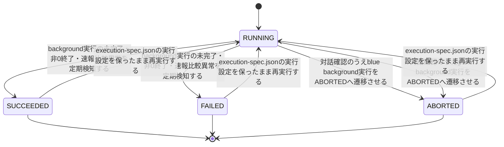
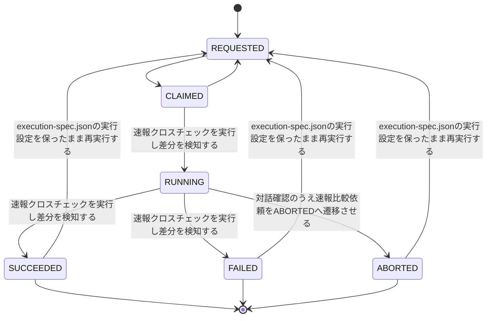
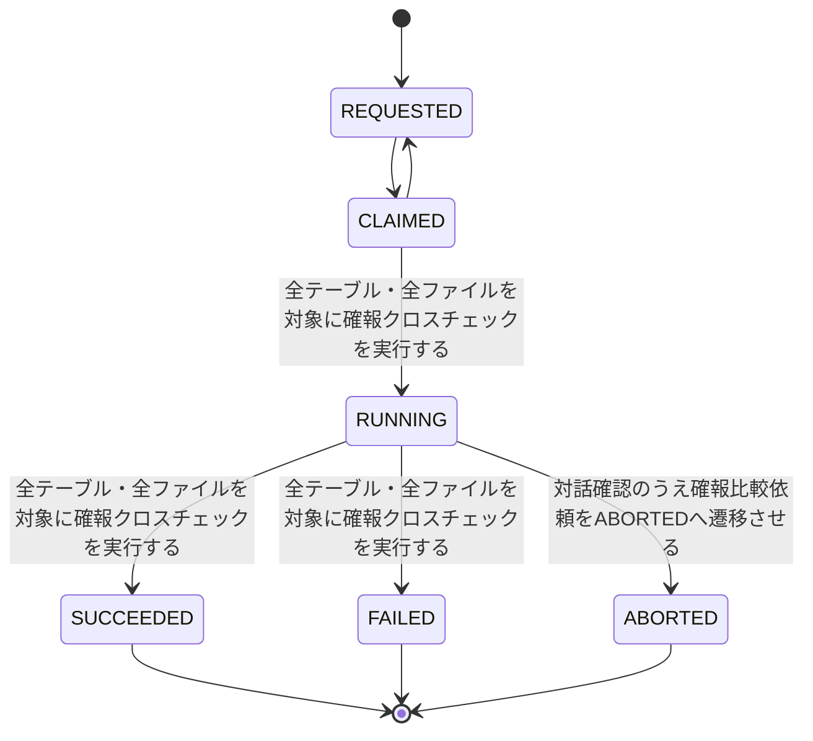

<!-- generateRdraMd.js による自動生成ファイル。手動編集しないこと。元データ: docs/rdra/latest/*.tsv -->

# 状態モデル

RDRA システム内部レイヤー。状態モデルごとの状態遷移。遷移ラベルは UC。

## background slot実行状態（実行管理）

| 状態 | 遷移UC | 遷移先状態 | 説明 |
|---|---|---|---|
|  |  | RUNNING | background roleの実行を開始する |
| RUNNING | background実行の未完了・非0終了・速報比較異常を定期検知する | SUCCEEDED | hang-detectorがexitcode.txtの終了コード0を検知し完了と判定する |
| RUNNING | background実行の未完了・非0終了・速報比較異常を定期検知する | FAILED | hang-detectorがexitcode.txtの非0終了コードを検知し異常と判定する |
| RUNNING | 対話確認のうえblue background実行をABORTEDへ遷移させる | ABORTED | 停止確認済みのblue background実行を運用者の対話確認を経て中止状態へ明示的に遷移させる(blue中止フロー) |
| RUNNING | 対話確認のうえgreen background実行をABORTEDへ遷移させる | ABORTED | 停止確認済みのgreen background実行を運用者の対話確認を経て中止状態へ明示的に遷移させる(green中止フロー) |
| SUCCEEDED | execution-spec.jsonの実行設定を保ったまま再実行する | RUNNING | 元のexecution-spec.jsonの実行設定を保ったまま完了済みのbackground実行を選択的に再実行する(background側リランフロー) |
| FAILED | execution-spec.jsonの実行設定を保ったまま再実行する | RUNNING | 元のexecution-spec.jsonの実行設定を保ったまま完了済みのbackground実行を選択的に再実行する(background側リランフロー) |
| ABORTED | execution-spec.jsonの実行設定を保ったまま再実行する | RUNNING | 元のexecution-spec.jsonの実行設定を保ったまま中止済みのbackground実行を選択的に再実行する(background側リランフロー) |
| SUCCEEDED |  |  | 正常終了としてforeground結果の応答・完了通知・障害調査のための実行結果を確定する |
| FAILED |  |  | 異常終了としてforeground結果の応答・ハング監視での検知対象となる実行結果を確定する |
| ABORTED |  |  | 中止済みとして実行系譜の追跡対象となる実行結果を確定する |

## 速報比較依頼状態（速報クロスチェック管理）

| 状態 | 遷移UC | 遷移先状態 | 説明 |
|---|---|---|---|
|  |  | REQUESTED | blue/green runnerの完了通知を受けて速報比較依頼を作成する |
| REQUESTED |  | CLAIMED | workerが速報比較依頼を取得(lease取得)する |
| CLAIMED |  | REQUESTED | leaseが失効し、かつworkerが未着手の場合に依頼を差し戻し重複実行を防ぐ |
| CLAIMED | 速報クロスチェックを実行し差分を検知する | RUNNING | workerが速報比較の実行を開始する |
| RUNNING | 速報クロスチェックを実行し差分を検知する | SUCCEEDED | workerのexitcodeが0であることを確定する |
| RUNNING | 速報クロスチェックを実行し差分を検知する | FAILED | workerのexitcodeが非0であることを確定する |
| RUNNING | 対話確認のうえ速報比較依頼をABORTEDへ遷移させる | ABORTED | RUNNING中の速報比較依頼を運用者の対話確認を経て中止状態へ明示的に遷移させる(速報比較中止フロー) |
| SUCCEEDED | execution-spec.jsonの実行設定を保ったまま再実行する | REQUESTED | 元の実行設定を保ったまま完了済みの速報比較依頼を選択的に再実行する(background側リランフロー) |
| FAILED | execution-spec.jsonの実行設定を保ったまま再実行する | REQUESTED | 元の実行設定を保ったまま完了済みの速報比較依頼を選択的に再実行する(background側リランフロー) |
| ABORTED | execution-spec.jsonの実行設定を保ったまま再実行する | REQUESTED | 元の実行設定を保ったまま中止済みの速報比較依頼を選択的に再実行する(background側リランフロー) |
| SUCCEEDED |  |  | 速報クロスチェックの正常完了として速報比較結果を確定し保持する |
| FAILED |  |  | 速報クロスチェックの異常完了としてハング検知記録・運用者への通知の対象とする |
| ABORTED |  |  | 中止済みとして依頼の履歴を保持する |

## 確報比較依頼状態（確報クロスチェック管理）

| 状態 | 遷移UC | 遷移先状態 | 説明 |
|---|---|---|---|
|  |  | REQUESTED | 日次バッチにより全テーブル・全ファイルを対象とした確報比較依頼を作成する |
| REQUESTED |  | CLAIMED | workerが確報比較依頼を取得(lease取得)する |
| CLAIMED |  | REQUESTED | leaseが失効し、かつworkerが未着手の場合に依頼を差し戻し重複実行を防ぐ |
| CLAIMED | 全テーブル・全ファイルを対象に確報クロスチェックを実行する | RUNNING | workerが確報比較の実行を開始する |
| RUNNING | 全テーブル・全ファイルを対象に確報クロスチェックを実行する | SUCCEEDED | workerのexitcodeが0であることを確定する |
| RUNNING | 全テーブル・全ファイルを対象に確報クロスチェックを実行する | FAILED | workerのexitcodeが非0であることを確定する |
| RUNNING | 対話確認のうえ確報比較依頼をABORTEDへ遷移させる | ABORTED | RUNNING中の確報比較依頼を運用者の対話確認を経て中止状態へ明示的に遷移させる(確報比較中止フロー) |
| SUCCEEDED |  |  | 確報クロスチェックの正常完了としてrunnerがstdout/stderr/exitcodeのみジョブスケジューラへ中継し、リリース判断の正本とする |
| FAILED |  |  | 確報クロスチェックの異常完了としてrunnerがstdout/stderr/exitcodeのみジョブスケジューラへ中継する |
| ABORTED |  |  | 中止済みとして依頼の履歴を保持する |
