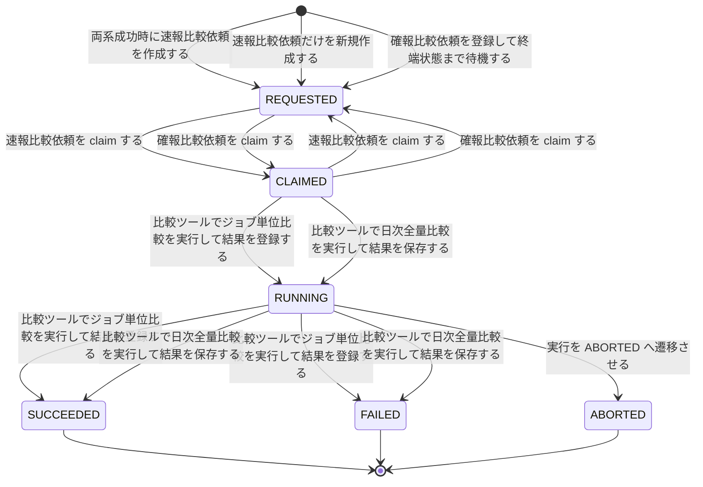
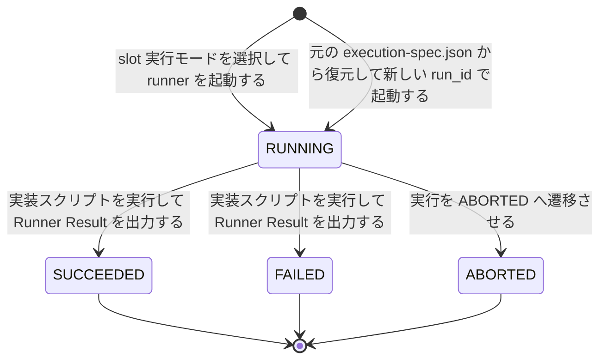
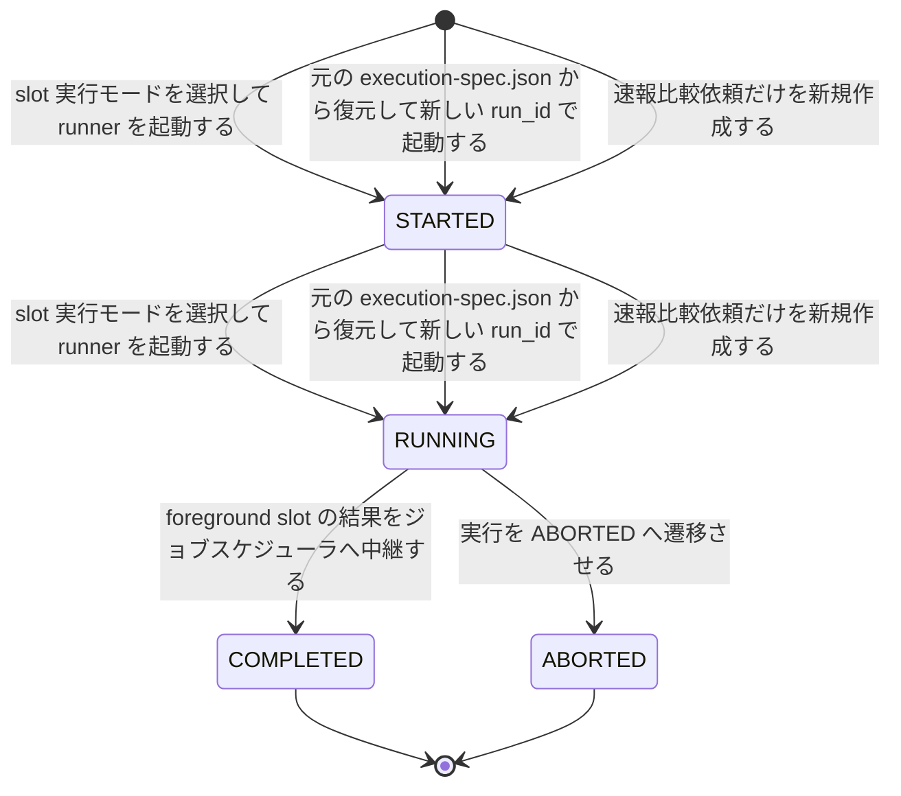
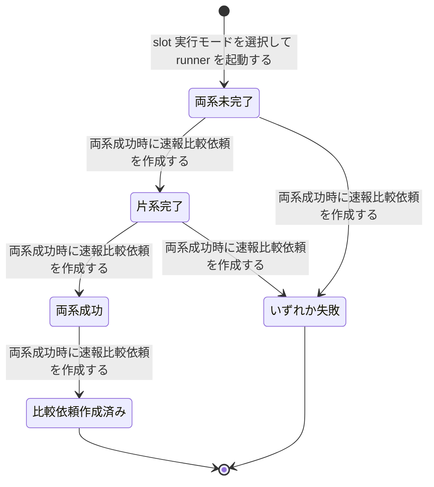
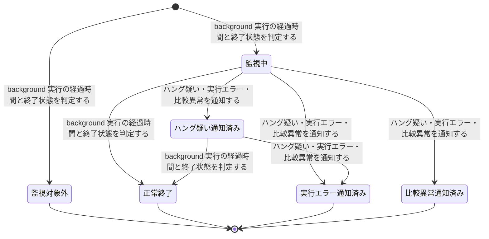

<!-- generateRdraMd.js による自動生成ファイル。手動編集しないこと。元データ: docs/rdra/latest/*.tsv -->

# 状態モデル

RDRA システム内部レイヤー。状態モデルごとの状態遷移。遷移ラベルは UC。

## クロスチェック依頼（速報クロスチェック管理）

| 状態 | 遷移UC | 遷移先状態 | 説明 |
|---|---|---|---|
|  | 両系成功時に速報比較依頼を作成する | REQUESTED | 速報クロスチェック runner が両系成功を判定したときに限り、速報比較依頼(rapid_crosscheck_request)を run_id 主キーで 1 件だけ REQUESTED で作成し、worker の取得待ちにする。管理 DB をジョブキューとして使い、比較の要否判定と比較の実行を分離するために必要 |
|  | 速報比較依頼だけを新規作成する | REQUESTED | background-rerun(--role rapid-crosscheck)が元の run の blue / green 成果物を対象とする速報比較依頼を新しい run_id で REQUESTED として作成し、parent_run_id で元の実行に紐付ける。作成後は通常の claim と比較実行に委ねる |
|  | 確報比較依頼を登録して終端状態まで待機する | REQUESTED | ジョブスケジューラの別ジョブ定義から起動された確報クロスチェック runner が business_date と対象カタログの版で確報比較依頼(final_crosscheck_request)を REQUESTED で登録し、終端状態まで同期 polling を開始する。速報と同じライフサイクルを別モデルの依頼レコードで管理する |
| REQUESTED | 速報比較依頼を claim する | CLAIMED | 速報クロスチェック worker が管理 DB を poll し、REQUESTED の速報比較依頼を worker_id と lease_until 付きで CLAIMED にする。claim と lease で多重実行を防ぐために必要 |
| REQUESTED | 確報比較依頼を claim する | CLAIMED | 確報クロスチェック worker が DB セグメントで管理 DB を poll し、REQUESTED の確報比較依頼を worker_id と lease_until 付きで CLAIMED にする |
| CLAIMED | 速報比較依頼を claim する | REQUESTED | lease が失効しかつ比較が未開始の速報比較依頼を REQUESTED に戻し、別の worker が再取得できるようにする。worker 障害時の再取得を統一するために必要 |
| CLAIMED | 確報比較依頼を claim する | REQUESTED | lease が失効しかつ比較が未開始の確報比較依頼を REQUESTED に戻し、別の worker が再取得できるようにする。速報と同じ規則で多重実行を防ぐ |
| CLAIMED | 比較ツールでジョブ単位比較を実行して結果を登録する | RUNNING | claim した速報クロスチェック worker が依頼を RUNNING にし、クロスチェックジョブマップの job_id ごとの比較定義に従って比較ツールでジョブ単位の比較を開始する |
| CLAIMED | 比較ツールで日次全量比較を実行して結果を保存する | RUNNING | claim した確報クロスチェック worker が依頼を RUNNING にし、対象カタログに従って比較ツールで全テーブル・全ファイルの日次全量比較を開始する |
| RUNNING | 比較ツールでジョブ単位比較を実行して結果を登録する | SUCCEEDED | 比較ツールの exitcode が 0 で終了し、stdout・stderr・exitcode を速報比較依頼に保存して comparison_result を管理 DB に登録する。比較ツールの終了コード契約に従う |
| RUNNING | 比較ツールでジョブ単位比較を実行して結果を登録する | FAILED | 比較ツールの exitcode が非 0(比較 NG=3・実行エラー=6 など)または実行エラーで終了し、結果を速報比較依頼に保存する。FAILED はハング検知が速報クロスチェック異常として通知し、ジョブスケジューラへの応答には影響させない |
| RUNNING | 比較ツールで日次全量比較を実行して結果を保存する | SUCCEEDED | 比較ツールの exitcode が 0 で終了し、stdout・stderr・exitcode を確報比較依頼に保存する。runner は保存済みの結果をそのままジョブスケジューラへ中継する |
| RUNNING | 比較ツールで日次全量比較を実行して結果を保存する | FAILED | 比較ツールの exitcode が非 0 または実行エラーで終了し、結果を確報比較依頼に保存する。runner は保存済みの結果をそのままジョブスケジューラへ返し、再実行はジョブスケジューラの正規ジョブで行う |
| RUNNING | 実行を ABORTED へ遷移させる | ABORTED | 運用者が worker プロセスの停止を確認し、abort-rapid-crosscheck / abort-final-crosscheck を --run-id 付きで実行して yes と答えたときだけ RUNNING の依頼を明示中止する。ハング検知はこの遷移を行わない |
| SUCCEEDED |  |  | 比較結果が管理 DB に登録され依頼が終端する。速報比較依頼は background-rerun の対象になれる |
| FAILED |  |  | 依頼が終端する。速報比較依頼は background-rerun で新しい依頼として再実行できる。確報はジョブスケジューラの正規ジョブを直接再実行する |
| ABORTED |  |  | 明示中止で終端する。速報比較依頼は中止確認済みとして background-rerun の対象になれる |

## slot 実行（並行稼働実行管理）

| 状態 | 遷移UC | 遷移先状態 | 説明 |
|---|---|---|---|
|  | slot 実行モードを選択して runner を起動する | RUNNING | facade が feature flag 設定に従い background slot をすべて起動してから foreground slot を起動し、runner が started-at.txt を出力して slot 実行を RUNNING にする。ジョブスケジューラのジョブステータスに現れない background 実行を追跡するために必要 |
|  | 元の execution-spec.json から復元して新しい run_id で起動する | RUNNING | background-rerun(--role blue / green)が元の execution-spec.json から実行設定を復元し、新しい run_id で background slot を再起動して RUNNING にする。最新のジョブマップは再解決しない |
| RUNNING | 実装スクリプトを実行して Runner Result を出力する | SUCCEEDED | runner が Runner Result Contract に従い exitcode.txt に 0 を一時ファイル経由で原子的に公開し、速報クロスチェック有効時は完了通知(blue-completed / green-completed)を送る |
| RUNNING | 実装スクリプトを実行して Runner Result を出力する | FAILED | runner が exitcode.txt に非 0 を公開する。起動失敗や SSH 失敗でも可能な限り 3 ファイルを揃える。ハング検知は background 実行エラーとして運用者へ通知し、完了通知を受けても速報比較依頼は作成されない |
| RUNNING | 実行を ABORTED へ遷移させる | ABORTED | 運用者がプロセスの強制終了を確認し、abort-blue / abort-green を --run-id 付きで実行して yes と答えたときだけ、background かつ RUNNING の slot 実行を明示中止する。スクリプト自身はプロセスを停止しない |
| SUCCEEDED |  |  | 完了済みとして終端する。元の slot mode が background なら background-rerun の対象になれる |
| FAILED |  |  | 完了済みとして終端する。元の slot mode が background なら background-rerun で元の execution-spec.json から新しい run_id で再実行できる |
| ABORTED |  |  | 明示中止済みとして終端する。中止確認済みのため background-rerun の対象になれる。RUNNING のままではリランを拒否してエラー終了する |

## 並行稼働実行（並行稼働実行管理）

| 状態 | 遷移UC | 遷移先状態 | 説明 |
|---|---|---|---|
|  | slot 実行モードを選択して runner を起動する | STARTED | 速報クロスチェック有効時に facade が run_id を発行し、ジョブマップで解決した実行設定を execution-spec.json として一度だけ確定保存して parallel_run を作成する。run_id で成果物・rapid_run・比較依頼を相関付けるために必要 |
|  | 元の execution-spec.json から復元して新しい run_id で起動する | STARTED | background-rerun が新しい run_id で parallel_run を作成し、parent_run_id に直前のリラン元 run_id を設定する。リラン系譜を元の実行まで数珠つなぎに追跡するために必要 |
|  | 速報比較依頼だけを新規作成する | STARTED | background-rerun(--role rapid-crosscheck)が業務ジョブを再実行せず、速報比較依頼の再作成用に新しい run_id の parallel_run を作成し、parent_run_id で元の実行に紐付ける |
| STARTED | slot 実行モードを選択して runner を起動する | RUNNING | facade が background slot をすべて起動してから foreground slot を起動し、foreground の PID だけを待機する |
| STARTED | 元の execution-spec.json から復元して新しい run_id で起動する | RUNNING | background-rerun が復元した実行設定で background slot を起動し、リランの parallel_run を RUNNING にする |
| STARTED | 速報比較依頼だけを新規作成する | RUNNING | background-rerun が速報比較依頼を REQUESTED で作成し、以降の追跡を速報クロスチェック worker の通常の claim と比較実行に委ねる |
| RUNNING | foreground slot の結果をジョブスケジューラへ中継する | COMPLETED | facade が foreground slot の stdout.log・stderr.log・exitcode.txt を無加工でジョブスケジューラへ中継し終える。background slot の完了や速報クロスチェックの結果は応答に含めず待機もしない |
| RUNNING | 実行を ABORTED へ遷移させる | ABORTED | 運用者が中止スクリプトで slot 実行または比較依頼を明示中止したとき、並行稼働実行も ABORTED にする。リラン時は新しい run_id で parallel_run を作成し parent_run_id で元の run を追跡する |
| COMPLETED |  |  | 1 回の並行稼働が終端する。実行履歴・監査はジョブスケジューラの責務とし、relay-gate は成果物とログを残すだけにする |
| ABORTED |  |  | 明示中止で終端する。parent_run_id の数珠つなぎでリラン系譜を追跡できる |

## 速報実行の完了状況（速報クロスチェック管理）

| 状態 | 遷移UC | 遷移先状態 | 説明 |
|---|---|---|---|
|  | slot 実行モードを選択して runner を起動する | 両系未完了 | 速報クロスチェック有効時に facade が run を開始し rapid_run を作成した時点で、blue / green いずれの完了通知も未受領。両系成功時に限り速報比較依頼を 1 件だけ作成するために必要 |
| 両系未完了 | 両系成功時に速報比較依頼を作成する | 片系完了 | 速報クロスチェック runner が先に完了した側の完了通知(blue-completed または green-completed)を受け取り、その側が成功(exitcode 0)であるため blue_status / green_status を更新する |
| 両系未完了 | 両系成功時に速報比較依頼を作成する | いずれか失敗 | 先に完了した側が非 0 で終了した。以降は比較依頼を作成しない |
| 片系完了 | 両系成功時に速報比較依頼を作成する | 両系成功 | 後に完了した側も成功であり、完了順にかかわらず両系成功と判定する |
| 片系完了 | 両系成功時に速報比較依頼を作成する | いずれか失敗 | 後に完了した側が非 0 で終了した。失敗結果同士や片方失敗の比較を防ぐため比較依頼を作成しない |
| 両系成功 | 両系成功時に速報比較依頼を作成する | 比較依頼作成済み | 速報クロスチェック runner が速報比較依頼を run_id 主キーで 1 件だけ一意に作成する。重複作成を防ぐためにこの状態で判定する |
| 比較依頼作成済み |  |  | 比較依頼の作成が完了し、以降の追跡はクロスチェック依頼の状態モデルに引き継ぐ |
| いずれか失敗 |  |  | 比較依頼を作成せず終了する。background 側の失敗はハング検知の実行エラー通知で運用者へ伝わる |

## 監視状態（実行監視管理）

| 状態 | 遷移UC | 遷移先状態 | 説明 |
|---|---|---|---|
|  | background 実行の経過時間と終了状態を判定する | 監視対象外 | ハング検知の定期ジョブが監視記録を作成する際、hang_detect_limit_minutes が 0 の role または foreground role は検知対象から除外する |
|  | background 実行の経過時間と終了状態を判定する | 監視中 | background slot 実行または速報比較依頼で hang_detect_limit_minutes が 0 より大きく、exitcode.txt が未出力かつ started-at.txt からの経過時間が上限以内である。ジョブスケジューラの実行結果に現れない background 異常を見落とさないために必要 |
| 監視中 | ハング疑い・実行エラー・比較異常を通知する | ハング疑い通知済み | exitcode.txt が未出力のまま経過時間が上限を超過し、hang_suspected_at と alerted_at を記録して warning メールを運用者へ通知する。実行状態は変更しない |
| 監視中 | ハング疑い・実行エラー・比較異常を通知する | 実行エラー通知済み | exitcode.txt が非 0 で出力されており、background 実行エラーとして error メールを運用者へ通知する |
| 監視中 | ハング疑い・実行エラー・比較異常を通知する | 比較異常通知済み | 速報比較依頼が FAILED または比較 NG であり、速報クロスチェック異常として error メールを運用者へ通知する |
| 監視中 | background 実行の経過時間と終了状態を判定する | 正常終了 | exitcode.txt が 0 で出力され、上限以内に正常終了したと判定する |
| ハング疑い通知済み | background 実行の経過時間と終了状態を判定する | 正常終了 | 通知後に exitcode.txt が 0 で出力された。警告時の経過時間を監視記録に残し、hang_detect_limit_minutes のジョブごとの調整に使用する |
| ハング疑い通知済み | ハング疑い・実行エラー・比較異常を通知する | 実行エラー通知済み | 通知後に exitcode.txt が非 0 で出力され、background 実行エラーとして error メールを追加通知する |
| 監視対象外 |  |  | 監視対象外のまま終端する。監視記録は残すが通知しない |
| 正常終了 |  |  | 監視を終了する。監視は通知のみで自動中止・自動再実行を行わない |
| 実行エラー通知済み |  |  | 通知を終え監視を終了する。対処(中止・リラン)は運用者の判断に委ねる |
| 比較異常通知済み |  |  | 通知を終え監視を終了する。差分の原因調査とリランは運用者の判断に委ねる |
