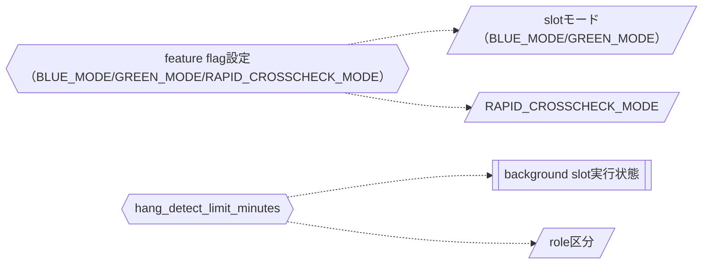

<!-- generateRdraMd.js による自動生成ファイル。手動編集しないこと。元データ: docs/rdra/latest/*.tsv -->

# 条件・バリエーション

RDRA システム内部レイヤー。判断条件（ビジネスルール）と区分・種別の一覧。

## 条件（ビジネスルール）

> 凡例: `{{六角}}` 条件 / `[[二重枠]]` 状態モデル / `[/斜め/]` バリエーション

| コンテキスト | 条件 | 条件の説明 | バリエーション | 状態モデル |
|---|---|---|---|---|
| 実行管理 | feature flag設定（BLUE_MODE/GREEN_MODE/RAPID_CROSSCHECK_MODE） | BLUE_MODE/GREEN_MODEはforeground・background・offのいずれかを設定する。両方を同時にforegroundにする組み合わせは許可しない。RAPID_CROSSCHECK_MODEはon/offを設定し、offの場合はblue/green runnerからの完了通知送信、速報管理DBへの接続・書込みを行わない。facadeがJOB_IDを受け取ってblue/greenの各slotを起動する際に、どの実装をどの役割（foreground/background/off）で動かすかを判定し、ジョブ定義を変更せずに運用モード（並行稼働／新実装単独本番／次世代実装との並行稼働）や速報クロスチェックの有効・無効を切り替えるために用いる。 | slotモード（BLUE_MODE/GREEN_MODE）、RAPID_CROSSCHECK_MODE |  |
| 異常監視管理 | hang_detect_limit_minutes | background roleごとに設定する、未完了状態を許容する経過時間のしきい値（分）。実行先のジョブマップで解決され、execution-spec.jsonに保存される。定期起動のhang-detectorが、exitcode.txtを出力していないbackground roleについてstarted-at.txtからの経過時間を判定し、しきい値を超過した場合にハング疑いとして運用者へ通知するために用いる。 | role区分 | background slot実行状態 |

## バリエーション

| コンテキスト | バリエーション | 値 | 説明 |
|---|---|---|---|
| システム運用管理 | 運用モード | 並行稼働、新実装単独本番、次世代実装との並行稼働 | ジョブ定義を変更せず設定だけで切り替えるシステム運用フェーズの区分 |
| 実行管理 | slotモード（BLUE_MODE/GREEN_MODE） | off、background、foreground | blue/green各slotの起動方式を指定する区分。blueとgreenの両方をforegroundにする組合せは許可しない |
| 実行管理 | RAPID_CROSSCHECK_MODE | on、off | 速報クロスチェックの有効・無効を切り替える区分。offの場合はblue/green runnerが完了通知や速報管理DBへの接続・書込みを行わない |
| 実行管理 | role区分 | foreground、background、rapid-crosscheck | slot runnerが担う実行役割の種別。foregroundはジョブスケジューラへの応答対象、backgroundは非同期実行、rapid-crosscheckは速報比較専用 |
| 速報クロスチェック管理 | クロスチェック種別 | 速報クロスチェック、確報クロスチェック | 実行結果の整合性確認の粒度・タイミングによる区分。速報はジョブ単位で非同期に比較し、確報は全テーブル・全ファイルを日次で正式確認する |
| 実行管理 | slot種別 | blue、green | 並行稼働する実装（既存実装／新実装）の系統を表す区分 |
| 異常監視管理 | 異常検知種別 | ハング疑い、background実行エラー、速報クロスチェック異常 | hang-detectorが定期監視で検知し運用者へ通知する異常の種類 |
