<!-- generateRdraMd.js による自動生成ファイル。手動編集しないこと。元データ: docs/rdra/latest/*.tsv -->

# 条件・バリエーション

RDRA システム内部レイヤー。判断条件（ビジネスルール）と区分・種別の一覧。

## 条件（ビジネスルール）

```mermaid
graph LR
  CD1{{"foreground slot 排他"}}
  VR1[/"実装スロット"/]
  VR2[/"slot 実行モード"/]
  VR3[/"運用モード"/]
  CD2{{"slot 起動可否判定"}}
  SM1[["slot 実行"]]
  CD3{{"slot 起動順序"}}
  SM2[["並行稼働実行"]]
  CD4{{"ジョブスケジューラ応答の決定"}}
  VR4[/"Runner Result 成果物種別"/]
  CD5{{"確報クロスチェック非起動"}}
  VR5[/"クロスチェック種別"/]
  VR6[/"ジョブスケジューラ起動ジョブ種別"/]
  CD6{{"Runner Result 完備条件"}}
  CD7{{"成果物公開判定"}}
  CD8{{"ジョブマップ解決条件"}}
  VR7[/"設定所有区分"/]
  CD9{{"引数連結規則"}}
  CD10{{"実行設定の確定条件"}}
  VR8[/"run role(成果物ディレクトリ区分)"/]
  VR9[/"ハング検知上限設定"/]
  CD11{{"認証情報の非保存"}}
  CD12{{"設定所有区分"}}
  CD13{{"速報クロスチェック有効判定"}}
  VR10[/"速報クロスチェックモード"/]
  CD14{{"完了通知の系統独立"}}
  VR11[/"速報クロスチェックのプロセス役割"/]
  CD15{{"両系成功判定"}}
  SM3[["速報実行の完了状況"]]
  CD16{{"比較依頼の一意性"}}
  SM4[["クロスチェック依頼"]]
  CD17{{"比較定義の選択"}}
  VR12[/"比較種別"/]
  CD18{{"速報結果の位置付け"}}
  VR13[/"比較結果ステータス"/]
  CD19{{"確報依頼の登録条件"}}
  VR14[/"クロスチェック依頼状態"/]
  CD20{{"確報結果の中継制約"}}
  VR15[/"比較ツール終了コード"/]
  CD21{{"速報と確報のモデル分離"}}
  CD22{{"依頼状態遷移規則"}}
  CD23{{"lease 失効判定"}}
  CD24{{"claim 排他"}}
  CD25{{"比較ツール終了コードの対応"}}
  CD26{{"ハング検知判定"}}
  SM5[["監視状態"]]
  VR16[/"ハング検知判定結果"/]
  CD27{{"ハング検知対象の除外"}}
  CD28{{"速報比較依頼の異常判定"}}
  VR17[/"速報クロスチェック監視判定"/]
  CD29{{"監視は通知のみ"}}
  CD30{{"警告傾向の記録"}}
  VR18[/"監視状態"/]
  CD31{{"ハング検知上限の調整基準"}}
  CD32{{"通知レベルの判定"}}
  VR19[/"通知レベル"/]
  CD33{{"リラン事前検証"}}
  VR20[/"リラン対象 role"/]
  CD34{{"リランの実行設定復元"}}
  CD35{{"リラン系譜の追跡"}}
  CD36{{"復旧手段の選択"}}
  VR21[/"再実行経路"/]
  CD37{{"slot 中止可否判定"}}
  VR22[/"中止対象種別"/]
  CD38{{"依頼中止可否判定"}}
  CD39{{"停止確認応答"}}
  VR23[/"停止確認応答"/]
  CD40{{"facade の責務限定"}}
  CD41{{"実装固有事項の runner への閉じ込め"}}
  CD42{{"適用側で定義する事項"}}
  VR24[/"対象カタログの対象種別"/]
  CD43{{"CLI とメールによる提示"}}
  CD44{{"実行履歴はジョブスケジューラの責務"}}
  CD1 -.-> VR1
  CD1 -.-> VR2
  CD1 -.-> VR3
  CD2 -.-> SM1
  CD2 -.-> VR1
  CD2 -.-> VR2
  CD3 -.-> SM2
  CD3 -.-> SM1
  CD3 -.-> VR2
  CD4 -.-> SM2
  CD4 -.-> VR2
  CD4 -.-> VR4
  CD5 -.-> VR5
  CD5 -.-> VR6
  CD6 -.-> SM1
  CD6 -.-> VR4
  CD6 -.-> VR1
  CD7 -.-> VR4
  CD8 -.-> VR1
  CD8 -.-> VR7
  CD10 -.-> SM2
  CD10 -.-> VR8
  CD10 -.-> VR9
  CD12 -.-> VR7
  CD13 -.-> SM2
  CD13 -.-> VR10
  CD14 -.-> SM1
  CD14 -.-> VR1
  CD14 -.-> VR11
  CD15 -.-> SM3
  CD15 -.-> VR1
  CD16 -.-> SM3
  CD16 -.-> SM4
  CD16 -.-> VR1
  CD17 -.-> VR12
  CD17 -.-> VR5
  CD18 -.-> VR5
  CD18 -.-> VR13
  CD19 -.-> SM4
  CD19 -.-> VR5
  CD19 -.-> VR14
  CD19 -.-> VR6
  CD20 -.-> SM4
  CD20 -.-> VR15
  CD21 -.-> VR5
  CD22 -.-> SM4
  CD22 -.-> VR14
  CD22 -.-> VR5
  CD22 -.-> VR15
  CD23 -.-> SM4
  CD23 -.-> VR14
  CD24 -.-> SM4
  CD24 -.-> VR14
  CD24 -.-> VR11
  CD25 -.-> SM4
  CD25 -.-> VR15
  CD25 -.-> VR14
  CD25 -.-> VR13
  CD26 -.-> SM5
  CD26 -.-> SM1
  CD26 -.-> VR16
  CD26 -.-> VR4
  CD26 -.-> VR9
  CD27 -.-> SM5
  CD27 -.-> VR9
  CD27 -.-> VR8
  CD27 -.-> VR2
  CD28 -.-> SM5
  CD28 -.-> SM4
  CD28 -.-> VR17
  CD28 -.-> VR14
  CD28 -.-> VR13
  CD29 -.-> SM5
  CD30 -.-> SM5
  CD30 -.-> VR18
  CD31 -.-> VR9
  CD31 -.-> VR8
  CD32 -.-> SM5
  CD32 -.-> VR19
  CD32 -.-> VR16
  CD32 -.-> VR17
  CD33 -.-> SM1
  CD33 -.-> SM4
  CD33 -.-> VR20
  CD33 -.-> VR2
  CD34 -.-> VR20
  CD35 -.-> SM2
  CD36 -.-> VR21
  CD36 -.-> VR8
  CD36 -.-> VR2
  CD36 -.-> VR5
  CD37 -.-> SM1
  CD37 -.-> SM2
  CD37 -.-> VR22
  CD37 -.-> VR2
  CD37 -.-> VR1
  CD38 -.-> SM4
  CD38 -.-> VR22
  CD38 -.-> VR14
  CD38 -.-> VR5
  CD39 -.-> SM1
  CD39 -.-> SM4
  CD39 -.-> SM2
  CD39 -.-> VR23
  CD39 -.-> VR22
  CD40 -.-> VR6
  CD40 -.-> VR2
  CD41 -.-> VR1
  CD41 -.-> VR3
  CD42 -.-> VR7
  CD42 -.-> VR24
  CD43 -.-> VR6
  CD43 -.-> VR19
  CD44 -.-> VR4
```

> 凡例: `{{六角}}` 条件 / `[[二重枠]]` 状態モデル / `[/斜め/]` バリエーション

| コンテキスト | 条件 | 条件の説明 | バリエーション | 状態モデル |
|---|---|---|---|---|
| 適用構成管理 | foreground slot 排他 | blue と green の両方が foreground に設定された構成は許可しない。facade は入力検証でこの構成を検出し、どの slot も起動せずエラー終了する。縦軸を blue の実行モード、横軸を green の実行モードとし、foreground × foreground の組合せのみ拒否する | 実装スロット、slot 実行モード、運用モード |  |
| 並行稼働実行管理 | slot 起動可否判定 | slot 実行モードが off の slot は runner を起動しない。foreground または background の slot だけを起動する。実装スロット × slot 実行モードの表で起動要否を決める | 実装スロット、slot 実行モード | slot 実行 |
| 並行稼働実行管理 | slot 起動順序 | background の slot をすべて起動して PID と成果物ディレクトリを確定してから foreground slot を起動し、すべての slot 起動後に foreground の PID だけを待機する。並行稼働実行は STARTED から RUNNING へ遷移する | slot 実行モード | 並行稼働実行、slot 実行 |
| 並行稼働実行管理 | ジョブスケジューラ応答の決定 | ジョブスケジューラへ返す標準出力・標準エラー・終了コードは foreground slot の Runner Result(stdout.log / stderr.log / exitcode.txt)をそのまま中継したものとし、background slot と速報クロスチェックの結果は応答に反映しない。中継完了で並行稼働実行を COMPLETED にする | slot 実行モード、Runner Result 成果物種別 | 並行稼働実行 |
| 並行稼働実行管理 | 確報クロスチェック非起動 | 確報クロスチェックの制御は feature flag に含めず、facade は確報クロスチェックを起動しない。確報はジョブスケジューラの別ジョブ定義から直接起動する | クロスチェック種別、ジョブスケジューラ起動ジョブ種別 |  |
| 並行稼働実行管理 | Runner Result 完備条件 | slot 実行が終了したとき成果物ディレクトリに stdout.log、stderr.log、exitcode.txt が揃って存在する。exitcode.txt は数値 1 行で、runner の終了コードと一致する。起動失敗・ジョブマップ未定義・SSH 失敗などの異常でも可能な限り 3 ファイルを出力する。exitcode.txt が 0 なら slot 実行を SUCCEEDED、非 0 なら FAILED とする | Runner Result 成果物種別、実装スロット | slot 実行 |
| 並行稼働実行管理 | 成果物公開判定 | 成果物は一時ファイルへ出力してから確定名へリネームする。確定名のファイルが存在するときのみ書き込み完了とみなし、書き込み途中の確定名ファイルは存在しない | Runner Result 成果物種別 |  |
| 適用構成管理 | ジョブマップ解決条件 | slot のジョブマップに JOB_ID の行が存在するときのみ実行先(ホスト・実行ユーザー・スクリプト・作業ディレクトリ・固定引数・hang_detect_limit_minutes)を解決できる。JOB_ID が未定義なら runner は非 0 の exitcode.txt と原因を含む stderr.log を出力して終了する | 実装スロット、設定所有区分 |  |
| 適用構成管理 | 引数連結規則 | 実装へ渡す引数は、ジョブマップの固定引数(JSON 配列)の後ろにジョブスケジューラから渡された PARAM... を順序を変えずに連結する。引数の数と各引数内の空白・カンマを維持し、空の固定引数は [] とする |  |  |
| 並行稼働実行管理 | 実行設定の確定条件 | run 開始時に解決済みの実行設定・追加引数・マップ版・実装版・role ごとの hang_detect_limit_minutes を execution-spec.json として一度だけ保存する。run 開始後にジョブマップを変更しても同じ run の execution-spec.json は上書きしない。並行稼働実行の STARTED 遷移時に保存する | run role(成果物ディレクトリ区分)、ハング検知上限設定 | 並行稼働実行 |
| 並行稼働実行管理 | 認証情報の非保存 | execution-spec.json には認証情報の値を保存せず、参照名だけを保存する |  |  |
| 適用構成管理 | 設定所有区分 | 実装スロットと runner の割当は feature flag が、実行先とハング検知上限は該当 slot のジョブマップが、比較対象と対象カタログはクロスチェックのジョブマップが、外部 IF 方針・ネットワーク制約・ホスト配置は適用文書が所有する。縦軸を設定項目、横軸を設定所有区分とする表で正本を一意に定める | 設定所有区分 |  |
| 速報クロスチェック管理 | 速報クロスチェック有効判定 | RAPID_CROSSCHECK_MODE=on のときのみ runner は完了通知を送信し、速報管理 DB に完了結果と比較依頼を書き込む。off のときは完了通知を送信せず、速報管理 DB への接続・書き込みを行わず、parallel_run も作成しない | 速報クロスチェックモード | 並行稼働実行 |
| 速報クロスチェック管理 | 完了通知の系統独立 | blue / green runner は完了時に自系統の公開 function(blue-completed / green-completed)で run_id・job_id・結果を通知するだけで、相手側の状態や比較依頼の要否を判断しない | 実装スロット、速報クロスチェックのプロセス役割 | slot 実行 |
| 速報クロスチェック管理 | 両系成功判定 | blue と green の両方が成功(終了コード 0)で完了したときに限り速報比較依頼を作成する。いずれかが非 0 で終了した場合は比較依頼を作成せず終了する。縦軸を blue の結果、横軸を green の結果とし、成功 × 成功のみ両系成功とする | 実装スロット | 速報実行の完了状況 |
| 速報クロスチェック管理 | 比較依頼の一意性 | blue / green の完了順にかかわらず、1 つの run_id に対する速報比較依頼は 1 件だけ作成する。後に完了した側の通知で依頼を作成し、重複作成しない。両系成功から比較依頼作成済みへの遷移で判定する | 実装スロット | 速報実行の完了状況、クロスチェック依頼 |
| クロスチェック定義管理 | 比較定義の選択 | 速報比較は job_id ごとの比較定義に従って比較ツールを実行する。job_id ごとに比較定義が差し替えられている場合はその job_id の定義を使う | 比較種別、クロスチェック種別 |  |
| 速報クロスチェック管理 | 速報結果の位置付け | 速報クロスチェックの exitcode や失敗は通常業務ジョブの結果としてジョブスケジューラへ返さない。速報の比較結果は原因調査に使用し、リリース判断の正本には確報(日次全量比較)を用いる | クロスチェック種別、比較結果ステータス |  |
| 確報クロスチェック管理 | 確報依頼の登録条件 | 確報クロスチェック runner はジョブスケジューラから起動されたとき、business_date と対象カタログの版を持つ確報比較依頼を REQUESTED で登録し、依頼が終端状態(SUCCEEDED / FAILED / ABORTED)になるまで同期 polling する | クロスチェック種別、クロスチェック依頼状態、ジョブスケジューラ起動ジョブ種別 | クロスチェック依頼 |
| 確報クロスチェック管理 | 確報結果の中継制約 | 確報クロスチェック runner は依頼に保存された stdout・stderr・exitcode だけをジョブスケジューラへそのまま返す。チェック結果・差分件数・レポート URI などの追加連携データや依頼の状態名(SUCCEEDED / FAILED / ABORTED)は返さない | 比較ツール終了コード | クロスチェック依頼 |
| 確報クロスチェック管理 | 速報と確報のモデル分離 | 確報クロスチェックは final_crosscheck_request と対象カタログを用い、rapid_run や rapid_crosscheck_request を作成・変更しない | クロスチェック種別 |  |
| 速報クロスチェック管理 | 依頼状態遷移規則 | 依頼は REQUESTED で作成され、worker の取得で CLAIMED、比較開始で RUNNING、exitcode 0 で SUCCEEDED、非 0 または実行エラーで FAILED、停止確認後の中止で ABORTED に遷移する。速報と確報で同一のライフサイクルを用いる | クロスチェック依頼状態、クロスチェック種別、比較ツール終了コード | クロスチェック依頼 |
| 速報クロスチェック管理 | lease 失効判定 | CLAIMED の依頼で lease_until が経過し、かつ比較が未開始なら依頼を REQUESTED に戻し、別の worker が再取得できる | クロスチェック依頼状態 | クロスチェック依頼 |
| 速報クロスチェック管理 | claim 排他 | worker が依頼を claim すると worker_id と lease_until が設定され、lease 有効中は他の worker が同じ依頼を取得できない | クロスチェック依頼状態、速報クロスチェックのプロセス役割 | クロスチェック依頼 |
| 確報クロスチェック管理 | 比較ツール終了コードの対応 | 依頼状態は比較ツールの終了コード契約に従う。比較 OK=0 は SUCCEEDED、比較 NG=3 は FAILED(警告終了)、実行エラー=6 は FAILED(エラー終了)とし、確報では保存した exitcode をそのままジョブスケジューラへ中継する。縦軸を比較ツール終了コード、横軸を依頼状態とする対応表 | 比較ツール終了コード、クロスチェック依頼状態、比較結果ステータス | クロスチェック依頼 |
| 実行監視管理 | ハング検知判定 | 未完了の background role について started-at.txt と execution-spec.json の hang_detect_limit_minutes から経過時間を判定する。exitcode.txt があり 0 なら対象外、非 0 なら background 実行エラーとして通知、exitcode.txt がなく経過時間が上限以内なら継続監視、上限超過ならハング疑いとして通知する。縦軸を exitcode.txt の有無・値、横軸を経過時間と上限の関係とする判定表 | ハング検知判定結果、Runner Result 成果物種別、ハング検知上限設定 | 監視状態、slot 実行 |
| 実行監視管理 | ハング検知対象の除外 | hang_detect_limit_minutes が 0 の role は検知対象から除外する。foreground role は 0 を設定して除外できる | ハング検知上限設定、run role(成果物ディレクトリ区分)、slot 実行モード | 監視状態 |
| 実行監視管理 | 速報比較依頼の異常判定 | 速報比較依頼が FAILED または比較 NG のとき速報クロスチェック異常として通知する。RUNNING のときは状態を変更せずハング疑いとして通知する。縦軸を依頼状態、横軸を監視判定とする対応表 | 速報クロスチェック監視判定、クロスチェック依頼状態、比較結果ステータス | 監視状態、クロスチェック依頼 |
| 実行監視管理 | 監視は通知のみ | ハング検知は RUNNING を ABORTED へ変更せず、実行プロセスを停止せず、新しい実行依頼を作成しない。自動中止・自動再実行は行わない |  | 監視状態 |
| 実行監視管理 | 警告傾向の記録 | 監視は monitor_status、hang_suspected_at、alerted_at を記録する。通知後に正常終了した実行についても警告時の経過時間を記録する | 監視状態 | 監視状態 |
| 適用構成管理 | ハング検知上限の調整基準 | hang_detect_limit_minutes は導入時に全ジョブ 60 分とし、正常終了パターンの警告が出そろった時点でジョブごとに最後の警告の経過時間を基準に調整する。変更は次回以降の run の execution-spec.json に反映される | ハング検知上限設定、run role(成果物ディレクトリ区分) |  |
| 実行監視管理 | 通知レベルの判定 | ハング検知の通知は warning / error のメールで送信し、運用者が静観するか対処するかを判断できるようにする。ハング疑いは warning、background 実行エラーと速報クロスチェック異常は error とする。縦軸を判定結果、横軸を通知レベルとする対応表 | 通知レベル、ハング検知判定結果、速報クロスチェック監視判定 | 監視状態 |
| 実行復旧管理 | リラン事前検証 | --role が blue / green で元の slot mode が background なら新しい run_id でリランする。元の slot mode が foreground または off ならリランせずエラー終了する。--role が rapid-crosscheck なら業務ジョブを再実行せず比較依頼だけを新規作成する。未対応の role、元の実行が見つからない、元の実行が RUNNING または中止未確認の場合はリランせずエラー終了する。縦軸をリラン対象 role、横軸を元の slot 実行モードと元の状態とする判定表 | リラン対象 role、slot 実行モード | slot 実行、クロスチェック依頼 |
| 実行復旧管理 | リランの実行設定復元 | リランは最新のジョブマップを再解決せず、元の execution-spec.json から実行パラメータ・ホスト・実行ユーザー・スクリプト・作業ディレクトリを復元して起動する | リラン対象 role |  |
| 実行復旧管理 | リラン系譜の追跡 | リランで発行した新しい run_id の parent_run_id には直前のリラン元 run_id を設定する。最新の run_id から parent_run_id をたどると元の実行まで数珠つなぎに追跡できる |  | 並行稼働実行 |
| 実行復旧管理 | 復旧手段の選択 | foreground slot 実行と確報クロスチェックは background-rerun を使用せず、ジョブスケジューラの正規ジョブを直接再実行する。background slot 実行と速報比較依頼は専用ジョブの background-rerun で再実行する。縦軸を復旧対象、横軸を再実行経路とする対応表 | 再実行経路、run role(成果物ディレクトリ区分)、slot 実行モード、クロスチェック種別 |  |
| 実行復旧管理 | slot 中止可否判定 | abort-blue / abort-green は対象 slot が background かつ RUNNING のときだけ ABORTED へ遷移できる。foreground または off の場合は状態を変更せずエラー終了する。縦軸を slot 実行モード、横軸を slot 実行の状態とする判定表 | 中止対象種別、slot 実行モード、実装スロット | slot 実行、並行稼働実行 |
| 実行復旧管理 | 依頼中止可否判定 | abort-rapid-crosscheck / abort-final-crosscheck は対象の比較依頼が RUNNING のときだけ ABORTED へ遷移できる。RUNNING でない場合は状態を変更せずエラー終了する | 中止対象種別、クロスチェック依頼状態、クロスチェック種別 | クロスチェック依頼 |
| 実行復旧管理 | 停止確認応答 | 中止スクリプトは現在状態を表示後に「対象ジョブのプロセスは強制終了してありますか？ [yes/no]」と対話確認し、yes のときだけ状態を ABORTED に更新する。yes 以外なら状態を変更せず終了する。スクリプト自身はプロセス・Pod・SSH 接続先の処理を停止しない | 停止確認応答、中止対象種別 | slot 実行、クロスチェック依頼、並行稼働実行 |
| 並行稼働実行管理 | facade の責務限定 | ジョブスケジューラは facade に JOB_ID [PARAM...] だけを渡す。facade は比較対象や実装固有の起動方式を判断せず、slot と mode の選択と foreground 結果の応答だけを行う | ジョブスケジューラ起動ジョブ種別、slot 実行モード |  |
| 適用構成管理 | 実装固有事項の runner への閉じ込め | 実装固有の起動方式・ホスト・OS・プロトコルは slot の runner に閉じ込め、facade は設定された runner を起動するだけとする。runner を差し替えることで異なる世代の実装を並行稼働できる | 実装スロット、運用モード |  |
| 適用構成管理 | 適用側で定義する事項 | 比較対象と対象カタログはクロスチェックのジョブマップで適用側が定義する。外部 IF の送受信方針・ネットワーク制約・ホスト配置は適用文書で定義し、relay-gate の仕組みには含めない | 設定所有区分、対象カタログの対象種別 |  |
| 実行記録管理 | CLI とメールによる提示 | すべてのスクリプトは CLI として起動され、結果を標準出力・標準エラー・終了コードで返す。運用者への通知はメールで行い、UI 画面は提供しない | ジョブスケジューラ起動ジョブ種別、通知レベル |  |
| 実行記録管理 | 実行履歴はジョブスケジューラの責務 | ジョブの実行履歴・監査はジョブスケジューラの責務とし、relay-gate は Runner Result Contract の成果物と各スクリプトの実行ログをファイルとして残すだけとする | Runner Result 成果物種別 |  |

## バリエーション

| コンテキスト | バリエーション | 値 | 説明 |
|---|---|---|---|
| 適用構成管理 | 実装スロット | blue、green | 並行稼働の対象となる実装系統の区分。blue が現行実装、green が新実装を指し、runner・成果物ディレクトリ・完了通知の系統を識別する |
| 適用構成管理 | slot 実行モード | foreground、background、off | feature flag(BLUE_MODE / GREEN_MODE)で slot ごとに指定する実行方式。foreground は結果をジョブスケジューラへ返す系統、background は同時実行のみ、off は起動しない。foreground は同時に 1 slot だけ許可される |
| 適用構成管理 | 運用モード | 並行稼働、新実装の単独本番、次世代実装との並行稼働 | feature flag の組み合わせで表現する段階的切替の運用形態。並行稼働は blue foreground / green background / 速報 on、単独本番は blue off / green foreground / 速報 off、次世代並行稼働は blue background / green foreground / 速報 on |
| 適用構成管理 | 速報クロスチェックモード | on、off | feature flag(RAPID_CROSSCHECK_MODE)で速報クロスチェックの有効・無効を切り替える区分。off のとき runner は完了通知を送らず速報管理 DB へ接続・書き込みしない |
| クロスチェック定義管理 | クロスチェック種別 | 速報クロスチェック、確報クロスチェック | 比較の位置付けの区分。速報はジョブ実行ごとに非同期で行い原因調査に使う。確報は日次全量比較でリリース判断の正本となり、ジョブスケジューラの別ジョブから起動する |
| 速報クロスチェック管理 | クロスチェック依頼状態 | REQUESTED、CLAIMED、RUNNING、SUCCEEDED、FAILED、ABORTED | 速報・確報の比較依頼に共通するライフサイクルの状態区分。worker の claim / lease による多重実行防止と、中止・リランの前提判断に用いる |
| 確報クロスチェック管理 | 比較ツール終了コード | 0(比較 OK)、3(比較 NG・警告終了)、6(実行エラー・エラー終了) | 比較ツールの終了コードと依頼状態の対応区分。0 は SUCCEEDED、3 と 6 は FAILED に対応し、確報では保存した終了コードをそのままジョブスケジューラへ中継する |
| 並行稼働実行管理 | Runner Result 成果物種別 | started-at.txt、stdout.log、stderr.log、exitcode.txt | slot runner が成果物ディレクトリへ出力するファイルの種別。3 ファイル(stdout / stderr / exitcode)はジョブスケジューラへの応答・完了通知・障害調査に共通利用し、started-at.txt はハング検知の経過時間判定に用いる |
| 並行稼働実行管理 | run role(成果物ディレクトリ区分) | blue、green、rapid-crosscheck、final-crosscheck | 1 回の run の中で成果物ディレクトリと監視・リラン・中止の対象を識別する役割区分。background-rerun や abort 系スクリプトの対象指定に用いる |
| 実行復旧管理 | リラン対象 role | blue、green、rapid-crosscheck | background-rerun の --role で指定できる対象区分。blue / green は元 slot が background のときのみ業務ジョブを再実行し、rapid-crosscheck は比較依頼のみ新規作成する |
| 実行復旧管理 | 再実行経路 | background 側リラン、ジョブスケジューラ正規ジョブ再実行 | 復旧手段の区分。background slot と速報比較依頼は background-rerun で元の execution-spec.json から再実行し、foreground slot と確報クロスチェックはジョブスケジューラの正規ジョブを直接再実行する |
| 実行復旧管理 | 中止対象種別 | background slot 実行、速報比較依頼、確報比較依頼 | abort-blue / abort-green / abort-rapid-crosscheck / abort-final-crosscheck で明示中止できる対象の区分。いずれもプロセス停止を運用者が確認したうえで RUNNING を ABORTED へ更新する |
| 実行復旧管理 | 停止確認応答 | yes、no | 中止スクリプトの対話確認「対象ジョブのプロセスは強制終了してありますか？」への応答区分。yes のときだけ状態を ABORTED に更新し、それ以外は状態を変更せず終了する |
| 実行監視管理 | ハング検知判定結果 | 対象外(正常終了)、background 実行エラー、継続監視、ハング疑い | ハング検知が background role ごとに exitcode.txt の有無・値と経過時間から下す判定区分。実行エラーとハング疑いのみ運用者へ通知する |
| 実行監視管理 | 速報クロスチェック監視判定 | 速報クロスチェック異常(FAILED / 比較 NG)、ハング疑い(RUNNING 継続)、正常 | ハング検知が速報比較依頼の状態と終了コードから下す判定区分。状態は変更せず通知のみ行う |
| 実行監視管理 | 監視状態 | 未検知、ハング疑い、通知済み、通知後正常終了 | 監視記録(monitor_status / hang_suspected_at / alerted_at)が持つ状態区分。通知後に正常終了した実行は警告時の経過時間を記録し、hang_detect_limit_minutes の調整根拠にする |
| 実行監視管理 | 通知レベル | warning、error | ハング検知が運用者へ送るメール通知の重要度区分。ハング疑いは warning、background 実行エラー・速報クロスチェック異常は error として運用者が静観・対処を判断する |
| 適用構成管理 | ハング検知上限設定 | 60 分(導入時既定)、ジョブごとの調整値、0(検知対象外) | ジョブマップの hang_detect_limit_minutes の設定区分。導入時は全ジョブ 60 分、警告傾向が出そろった後にジョブごとに調整し、foreground role は 0 で検知対象から除外する |
| クロスチェック定義管理 | 比較種別 | ジョブ単位比較、全テーブル・全ファイル比較 | 比較ツールに依頼する比較範囲の区分。速報は job_id ごとの比較定義に従うジョブ単位比較、確報は対象カタログに基づく全量比較を行う |
| 速報クロスチェック管理 | 比較結果ステータス | 比較 OK、比較 NG、FAILED | comparison_result の status として記録する比較の結果区分。比較 NG と FAILED はハング検知により速報クロスチェック異常として通知される |
| クロスチェック定義管理 | 対象カタログの対象種別 | テーブル、ファイル | 確報クロスチェックの対象カタログ(target_type / target_identifier)が扱う比較対象の区分。適用側が版管理して定義する |
| 適用構成管理 | 設定所有区分 | feature flag、slot ジョブマップ、クロスチェックジョブマップ、適用文書 | 実行設定の正本をどこが所有するかの区分。実装スロットと runner は feature flag、ホスト・実行ユーザー・スクリプト・作業ディレクトリ・固定引数・hang_detect_limit_minutes は slot ジョブマップ、比較対象と対象カタログはクロスチェックジョブマップ、外部 IF 方針・ネットワーク制約・ホスト配置は適用文書が所有する |
| 並行稼働実行管理 | ジョブスケジューラ起動ジョブ種別 | 業務ジョブ(facade)、確報クロスチェックジョブ、ハング検知定期ジョブ、background リラン専用ジョブ | ジョブスケジューラのジョブ定義として登録する relay-gate の起動口の区分。業務ジョブは facade に JOB_ID と PARAM のみ渡し、確報・監視・リランはそれぞれ別ジョブ定義から起動する |
| 速報クロスチェック管理 | 速報クロスチェックのプロセス役割 | runner(dispatcher)、worker | 速報クロスチェックを構成するプロセスの役割区分。runner は blue-completed / green-completed の完了通知を受け両系成功時に比較依頼を一意に作成し、worker は依頼を poll / claim して比較を実行する |
