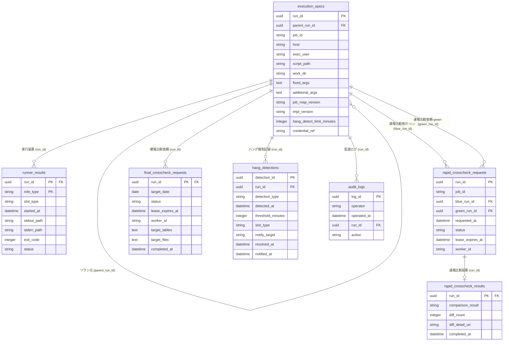

# データストアスキーマ

## サマリー

| データストア | 項目数 |
|------------|:------:|
| RDB テーブル | 7 |
| RDB インデックス | 19 |
| RDB 外部キー | 8 |

## RDB

### ER 図

### テーブル一覧

| テーブル名 | RDRA 情報 | 説明 | カラム数 | インデックス数 | 利用 UC 数 |
|-----------|----------|------|:-------:|:----------:|:--------:|
| execution_specs | execution-spec.json | 起動時に解決済みのホスト・実行ユーザー・スクリプト・作業ディレクトリ・固定引数・追加引数・マップ版・実装版・hang_detect_limit_minutesなどrunの実行設定を一度だけ確定して保存する。リラン時の設定復元やparent_run_idによる実行系譜の追跡の基準となる。認証情報は参照名のみを保存し実値は保存しない | 13 | 2 | 5 |
| runner_results | Runner実行結果（started-at.txt/stdout.log/stderr.log/exitcode.txt） | blue/green runnerのforeground・background・rapid-crosscheck実行結果を共通形式で保持し、ジョブスケジューラへの応答・完了通知・障害調査の3用途に使い回す。exitcode.txtの有無と終了コードの値から実行状態（RUNNING/SUCCEEDED/FAILED）を判定し、対話確認を経た場合のみABORTEDへ遷移する。UC側では一部 runner_execution_results という表記揺れが見られたため runner_results に正規化した | 8 | 3 | 12 |
| rapid_crosscheck_requests | 速報比較依頼 | blueとgreenの完了通知を受けて作成する、ジョブ単位で非同期に行う速報クロスチェックの比較実行依頼。run_idで相関付けて実行状態を一意に管理する。CLAIMED状態でlease失効かつ未着手の場合はREQUESTEDへ戻す。レビュー修正によりblue_run_id/green_run_idカラムが追加されており、本スキーマは最新のUC定義を正としている | 8 | 4 | 7 |
| rapid_crosscheck_results | 速報比較結果 | 速報クロスチェックの比較結果を保持し、hang-detectorによる速報クロスチェック異常の検知・運用者への通知に用いる | 5 | 1 | 3 |
| final_crosscheck_requests | 確報比較依頼 | 日次で全テーブル・全ファイルを対象に行う確報クロスチェックの比較実行依頼。速報側のエンティティと独立してrun_idで相関付け、リリース判断の正本とする実行状態を管理する。応答はstdout/stderr/exitcodeの3項目のみに限定する | 8 | 3 | 5 |
| hang_detections | ハング検知記録 | background実行の未完了超過（ハング疑い）・非0終了エラー・速報クロスチェック異常を記録し、定期的な監視と運用者への通知に用いる | 9 | 5 | 3 |
| audit_logs | 該当なし（RDRAに明示定義なし。CTP-005監査ログ要件・CTP-004実行系譜トレーサビリティから導出） | リラン・中止（abort/abort_confirm）等、運用者による重要操作の監査証跡を記録する。RDRA情報モデルに明示エンティティはないが、CTP-005監査ログ要件から全UC横断で導出される | 5 | 1 | 5 |

### execution_specs

**RDRA 情報**: execution-spec.json
**説明**: 起動時に解決済みのホスト・実行ユーザー・スクリプト・作業ディレクトリ・固定引数・追加引数・マップ版・実装版・hang_detect_limit_minutesなどrunの実行設定を一度だけ確定して保存する。リラン時の設定復元やparent_run_idによる実行系譜の追跡の基準となる。認証情報は参照名のみを保存し実値は保存しない

#### カラム

| カラム名 | 型 | NULL | 説明 |
|---------|---|:----:|------|
| **run_id** (PK) | uuid | NO | 実行を一意に識別するUUID。起動時に新規発番される。runner_results・rapid_crosscheck_requests（blue_run_id/green_run_id経由）・final_crosscheck_requests・hang_detections・audit_logsから参照される |
| parent_run_id | uuid | YES | リラン元となった元のrun_id。リラン実行でない通常起動の場合はNULL。CTP-004実行系譜トレーサビリティの追跡に用いる（自己参照） |
| job_id | string | NO | ジョブマップ上のジョブ識別子（CLI引数 --job-id の値）。同一job_idに紐づくblue/greenの実行結果を相関取得するために用いる |
| host | string | NO | 実行対象ホスト。ジョブマップ解決結果 |
| exec_user | string | NO | 実行ユーザー。ジョブマップ解決結果 |
| script_path | string | NO | 実行スクリプトのパス。ジョブマップ解決結果 |
| work_dir | string | NO | 実行時の作業ディレクトリ。ジョブマップ解決結果 |
| fixed_args | text | YES | ジョブマップに固定された起動引数 |
| additional_args | text | YES | CLI実行時に追加指定された引数 |
| job_map_version | string | NO | 解決に使用したジョブマップのバージョン |
| impl_version | string | NO | 選択されたslotの実装バージョン |
| hang_detect_limit_minutes | integer | NO | ハング疑い判定のしきい値（分）。hang_detections.threshold_minutesに引き継がれる |
| credential_ref | string | YES | 認証情報の参照名のみを保存する（実値は保存しない） |

#### 外部キー

| カラム | 参照先テーブル | 参照先カラム | ON DELETE |
|-------|-------------|------------|----------|
| parent_run_id | execution_specs | run_id | SET NULL |

#### インデックス

| 名前 | カラム | UNIQUE | 理由 | 利用 UC |
|------|-------|:------:|------|--------|
| idx_execution_specs_parent_run_id | parent_run_id | NO | CTP-004実行系譜トレーサビリティ。親run_idからの子run_id一覧参照を高速化する | execution-spec.jsonの実行設定を保ったまま再実行する |
| idx_execution_specs_job_id | job_id | NO | 同一job_idに紐づくblue/green双方の実行結果・依頼を相関取得するため | feature flag設定に基づきslotを選択して起動する, blue/green runnerの完了通知を受けて速報比較依頼を作成する, 並行稼働実行結果を確認する |

#### 利用 UC

| UC | 操作 |
|---|------|
| feature flag設定に基づきslotを選択して起動する | INSERT |
| background roleを起動する | SELECT |
| blue/green runnerの完了通知を受けて速報比較依頼を作成する | SELECT |
| 全テーブル・全ファイルを対象に確報クロスチェックを実行する | SELECT |
| execution-spec.jsonの実行設定を保ったまま再実行する | SELECT, INSERT |

### runner_results

**RDRA 情報**: Runner実行結果（started-at.txt/stdout.log/stderr.log/exitcode.txt）
**説明**: blue/green runnerのforeground・background・rapid-crosscheck実行結果を共通形式で保持し、ジョブスケジューラへの応答・完了通知・障害調査の3用途に使い回す。exitcode.txtの有無と終了コードの値から実行状態（RUNNING/SUCCEEDED/FAILED）を判定し、対話確認を経た場合のみABORTEDへ遷移する。UC側では一部 runner_execution_results という表記揺れが見られたため runner_results に正規化した

#### カラム

| カラム名 | 型 | NULL | 説明 |
|---------|---|:----:|------|
| **run_id** (PK) | uuid | NO | 対象実行のrun_id。execution_specs.run_idを参照する複合主キーの一部 |
| slot_type | string | NO | 実行slot種別。値: blue, green |
| **role_type** (PK) | string | NO | 実行役割区分。値: foreground, background, rapid-crosscheck。複合主キーの一部 |
| started_at | datetime | NO | 実行開始時刻 |
| stdout_path | string | YES | 標準出力ログ（stdout.log）のパス参照。ログ本体はファイルシステム上に保持し、本カラムはパスのみを保存する |
| stderr_path | string | YES | 標準エラーログ（stderr.log）のパス参照。ログ本体はファイルシステム上に保持し、本カラムはパスのみを保存する |
| exit_code | integer | YES | プロセス終了コード（exitcode.txtの内容）。未完了（RUNNING）時はNULL |
| status | string | NO | 実行状態。値: RUNNING, SUCCEEDED, FAILED, ABORTED。exitcode.txtの有無と値から判定し、対話確認を経た場合のみABORTEDへ遷移する |

#### 外部キー

| カラム | 参照先テーブル | 参照先カラム | ON DELETE |
|-------|-------------|------------|----------|
| run_id | execution_specs | run_id | CASCADE |

#### インデックス

| 名前 | カラム | UNIQUE | 理由 | 利用 UC |
|------|-------|:------:|------|--------|
| idx_runner_results_role_type_status | role_type, status | NO | hang-detectorがRUNNING状態かつrole_type='background'のレコードを高頻度でポーリングするため、また速報比較依頼作成・リラン候補選定でも同条件検索を行うため | background実行の未完了・非0終了・速報比較異常を定期検知する, blue/green runnerの完了通知を受けて速報比較依頼を作成する, 再実行対象のbackground実行・速報比較依頼を選択する |
| idx_runner_results_slot_type | slot_type | NO | --slotフィルタによるblue/green絞り込みを高速化するため | 再実行対象のbackground実行・速報比較依頼を選択する |
| idx_runner_results_run_id_slot_type_role_type | run_id, slot_type, role_type | NO | blue/green中止フローにおけるrun_id+slot_type+role_type完全一致での対象一意特定を高速化する（主キーはrun_id+role_typeだが、slot_type条件を含む検索パターンが多いため複合インデックスとして保持） | blue background実行の中止を依頼する, 対話確認のうえblue background実行をABORTEDへ遷移させる, green background実行の中止を依頼する, 対話確認のうえgreen background実行をABORTEDへ遷移させる |

#### 利用 UC

| UC | 操作 |
|---|------|
| background roleを起動する | INSERT |
| execution-spec.jsonの実行設定を保ったまま再実行する | INSERT |
| blue/green runnerの完了通知を受けて速報比較依頼を作成する | SELECT |
| 速報クロスチェックを実行し差分を検知する | SELECT |
| background実行の未完了・非0終了・速報比較異常を定期検知する | SELECT, UPDATE |
| 再実行対象のbackground実行・速報比較依頼を選択する | SELECT |
| blue background実行の中止を依頼する | SELECT |
| 対話確認のうえblue background実行をABORTEDへ遷移させる | SELECT, UPDATE |
| green background実行の中止を依頼する | SELECT |
| 対話確認のうえgreen background実行をABORTEDへ遷移させる | SELECT, UPDATE |
| foreground roleの標準出力・標準エラー・終了コードを応答する | SELECT |
| 並行稼働実行結果を確認する | SELECT |

### rapid_crosscheck_requests

**RDRA 情報**: 速報比較依頼
**説明**: blueとgreenの完了通知を受けて作成する、ジョブ単位で非同期に行う速報クロスチェックの比較実行依頼。run_idで相関付けて実行状態を一意に管理する。CLAIMED状態でlease失効かつ未着手の場合はREQUESTEDへ戻す。レビュー修正によりblue_run_id/green_run_idカラムが追加されており、本スキーマは最新のUC定義を正としている

#### カラム

| カラム名 | 型 | NULL | 説明 |
|---------|---|:----:|------|
| **run_id** (PK) | uuid | NO | 速報比較依頼を一意に識別するUUID。rapid_crosscheck_resultsから1:1で参照される |
| job_id | string | NO | 対象ジョブのjob_id（execution_specs.job_idに対応）。同一job_idへの重複依頼作成防止に用いる |
| blue_run_id | uuid | NO | 比較対象のblue slot側runner_results.run_id（role_type=background）。execution_specs.run_idを参照する |
| green_run_id | uuid | NO | 比較対象のgreen slot側runner_results.run_id（role_type=background）。execution_specs.run_idを参照する |
| requested_at | datetime | NO | 依頼作成日時（CronJob実行時刻） |
| status | string | NO | 依頼状態。値: REQUESTED, CLAIMED, RUNNING, SUCCEEDED, FAILED, ABORTED |
| lease_expires_at | datetime | YES | workerがCLAIMEDにした際のlease期限（claim時刻+約10分）。lease失効かつ未着手の場合はREQUESTEDへ差し戻され、その際本カラムはNULLに戻る |
| worker_id | string | YES | leaseを取得したworkerの識別子。REQUESTEDへの差し戻し時はNULL |

#### 外部キー

| カラム | 参照先テーブル | 参照先カラム | ON DELETE |
|-------|-------------|------------|----------|
| blue_run_id | execution_specs | run_id | RESTRICT |
| green_run_id | execution_specs | run_id | RESTRICT |

#### インデックス

| 名前 | カラム | UNIQUE | 理由 | 利用 UC |
|------|-------|:------:|------|--------|
| uq_rapid_crosscheck_requests_job_id | job_id | YES | ユニーク制約: 同一job_idへの重複依頼作成を防止するため（CTP-006冪等性方針）。blue/green双方の完了ペアリングが揃った時点でjob_id単位に1件のみ作成する | blue/green runnerの完了通知を受けて速報比較依頼を作成する |
| idx_rapid_crosscheck_requests_status_lease_expires_at | status, lease_expires_at | NO | REQUESTED取得およびCLAIMEDのlease失効判定の双方で高頻度に参照するため。リラン対象選定でもstatus絞り込みに使用する | 速報クロスチェックを実行し差分を検知する, 再実行対象のbackground実行・速報比較依頼を選択する |
| fk_rapid_crosscheck_requests_execution_specs_blue_run_id | blue_run_id | NO | 外部キーインデックス: blue_run_idからexecution_specs.run_idへの参照整合性チェックを高速化する | blue/green runnerの完了通知を受けて速報比較依頼を作成する |
| fk_rapid_crosscheck_requests_execution_specs_green_run_id | green_run_id | NO | 外部キーインデックス: green_run_idからexecution_specs.run_idへの参照整合性チェックを高速化する | blue/green runnerの完了通知を受けて速報比較依頼を作成する |

#### 利用 UC

| UC | 操作 |
|---|------|
| blue/green runnerの完了通知を受けて速報比較依頼を作成する | INSERT |
| 速報クロスチェックを実行し差分を検知する | SELECT, UPDATE |
| 速報クロスチェック結果を確認する | SELECT |
| execution-spec.jsonの実行設定を保ったまま再実行する | SELECT, UPDATE |
| 再実行対象のbackground実行・速報比較依頼を選択する | SELECT |
| RUNNING中の速報比較依頼の中止を依頼する | SELECT |
| 対話確認のうえ速報比較依頼をABORTEDへ遷移させる | SELECT, UPDATE |

### rapid_crosscheck_results

**RDRA 情報**: 速報比較結果
**説明**: 速報クロスチェックの比較結果を保持し、hang-detectorによる速報クロスチェック異常の検知・運用者への通知に用いる

#### カラム

| カラム名 | 型 | NULL | 説明 |
|---------|---|:----:|------|
| **run_id** (PK) | uuid | NO | 対応する速報比較依頼のrun_id。rapid_crosscheck_requestsと1:1関係 |
| comparison_result | string | NO | 比較判定結果。値: OK, NG。diff_count=0なら'OK'、1件以上なら'NG' |
| diff_count | integer | NO | blue/green比較の不一致行数 |
| diff_detail_uri | string | YES | NG時のみ設定される差分詳細レポートのURI |
| completed_at | datetime | NO | 比較完了日時 |

#### 外部キー

| カラム | 参照先テーブル | 参照先カラム | ON DELETE |
|-------|-------------|------------|----------|
| run_id | rapid_crosscheck_requests | run_id | CASCADE |

#### インデックス

| 名前 | カラム | UNIQUE | 理由 | 利用 UC |
|------|-------|:------:|------|--------|
| idx_rapid_crosscheck_results_comparison_result | comparison_result | NO | hang-detectorがNG判定のレコードを高頻度でポーリングするため | background実行の未完了・非0終了・速報比較異常を定期検知する |

#### 利用 UC

| UC | 操作 |
|---|------|
| 速報クロスチェックを実行し差分を検知する | INSERT |
| 速報クロスチェック結果を確認する | SELECT |
| background実行の未完了・非0終了・速報比較異常を定期検知する | SELECT |

### final_crosscheck_requests

**RDRA 情報**: 確報比較依頼
**説明**: 日次で全テーブル・全ファイルを対象に行う確報クロスチェックの比較実行依頼。速報側のエンティティと独立してrun_idで相関付け、リリース判断の正本とする実行状態を管理する。応答はstdout/stderr/exitcodeの3項目のみに限定する

#### カラム

| カラム名 | 型 | NULL | 説明 |
|---------|---|:----:|------|
| **run_id** (PK) | uuid | NO | 確報比較依頼を一意に識別するUUID |
| target_date | date | NO | 確報クロスチェックの対象日 |
| status | string | NO | 依頼状態。値: REQUESTED, CLAIMED, RUNNING, SUCCEEDED, FAILED, ABORTED |
| lease_expires_at | datetime | YES | claim時刻+lease期限。lease失効時はREQUESTEDへ差し戻され本カラムはNULLに戻る |
| worker_id | string | YES | claimを実行したworkerの識別子。差し戻し時はNULL |
| target_tables | text | NO | 確報クロスチェックの対象テーブル一覧 |
| target_files | text | NO | 確報クロスチェックの対象ファイル一覧 |
| completed_at | datetime | YES | SUCCEEDED/FAILED確定時刻。未完了時はNULL |

#### 外部キー

| カラム | 参照先テーブル | 参照先カラム | ON DELETE |
|-------|-------------|------------|----------|
| run_id | execution_specs | run_id | RESTRICT |

#### インデックス

| 名前 | カラム | UNIQUE | 理由 | 利用 UC |
|------|-------|:------:|------|--------|
| idx_final_crosscheck_requests_status_target_date | status, target_date | NO | workerがREQUESTED状態の依頼を対象日順にポーリングするため | 全テーブル・全ファイルを対象に確報クロスチェックを実行する |
| idx_final_crosscheck_requests_status_lease_expires_at | status, lease_expires_at | NO | lease失効かつ未着手の依頼を検出しREQUESTEDへ差し戻すため | 全テーブル・全ファイルを対象に確報クロスチェックを実行する |
| idx_final_crosscheck_requests_target_date | target_date | NO | リリース判断者が対象日単位で確報比較依頼を照会するため | 確報クロスチェック結果を確認する |

#### 利用 UC

| UC | 操作 |
|---|------|
| 全テーブル・全ファイルを対象に確報クロスチェックを実行する | SELECT, UPDATE |
| 確報クロスチェック結果をstdout/stderr/exitcodeで応答する | SELECT |
| 確報クロスチェック結果を確認する | SELECT |
| RUNNING中の確報比較依頼の中止を依頼する | SELECT |
| 対話確認のうえ確報比較依頼をABORTEDへ遷移させる | SELECT, UPDATE |

### hang_detections

**RDRA 情報**: ハング検知記録
**説明**: background実行の未完了超過（ハング疑い）・非0終了エラー・速報クロスチェック異常を記録し、定期的な監視と運用者への通知に用いる

#### カラム

| カラム名 | 型 | NULL | 説明 |
|---------|---|:----:|------|
| **detection_id** (PK) | uuid | NO | ハング検知記録を一意に識別するUUID |
| run_id | uuid | NO | 検知対象のrun_id。execution_specs.run_idを参照する |
| detection_type | string | NO | 異常検知種別。値: ハング疑い, background実行エラー, 速報クロスチェック異常 |
| detected_at | datetime | NO | 検知処理実行時刻 |
| threshold_minutes | integer | YES | ハング疑い検知時のみ設定されるしきい値（execution_specs.hang_detect_limit_minutesの値） |
| slot_type | string | YES | 検知対象のslot種別。値: blue, green |
| notify_target | string | NO | 通知先。固定値「運用者」 |
| resolved_at | datetime | YES | 検知内容が解消した日時。初期値NULL（未解消）。同一run_id・detection_typeの重複検知抑止判定に使用する |
| notified_at | datetime | YES | 運用者への通知送信日時。初期値NULL（未通知） |

#### 外部キー

| カラム | 参照先テーブル | 参照先カラム | ON DELETE |
|-------|-------------|------------|----------|
| run_id | execution_specs | run_id | CASCADE |

#### インデックス

| 名前 | カラム | UNIQUE | 理由 | 利用 UC |
|------|-------|:------:|------|--------|
| fk_hang_detections_execution_specs | run_id | NO | 外部キーインデックス。ハング検知記録から対象run_idへの追跡（障害調査・後続通知UC）で参照するため | background実行の未完了・非0終了・速報比較異常を定期検知する, ハング疑い・異常の通知を確認する |
| idx_hang_detections_detected_at | detected_at | NO | 検知日時順スキャン・降順ソートに用いるため | ハング疑い・異常の通知を確認する |
| idx_hang_detections_run_id_detection_type_resolved_at | run_id, detection_type, resolved_at | NO | ユニーク制約検討: 同一run_id・同一detection_typeの未解消（resolved_at IS NULL）レコードが重複しないことをINSERT前に確認するため。厳密な部分ユニーク制約（WHERE resolved_at IS NULL）はRDB製品依存のため見送り、アプリケーション側の存在チェックで担保する | background実行の未完了・非0終了・速報比較異常を定期検知する |
| idx_hang_detections_notified_at_detected_at | notified_at, detected_at | NO | 通知済みレコードを検知日時降順で取得する照会UCの主要アクセスパターンのため | ハング疑い・異常の通知を確認する |
| idx_hang_detections_notified_at | notified_at | NO | 通知バッチが未通知レコード（notified_at IS NULL）を高頻度でポーリングするため | ハング疑い・異常を運用者へ通知する |

#### 利用 UC

| UC | 操作 |
|---|------|
| background実行の未完了・非0終了・速報比較異常を定期検知する | SELECT, INSERT |
| ハング疑い・異常の通知を確認する | SELECT |
| ハング疑い・異常を運用者へ通知する | SELECT, UPDATE |

### audit_logs

**RDRA 情報**: 該当なし（RDRAに明示定義なし。CTP-005監査ログ要件・CTP-004実行系譜トレーサビリティから導出）
**説明**: リラン・中止（abort/abort_confirm）等、運用者による重要操作の監査証跡を記録する。RDRA情報モデルに明示エンティティはないが、CTP-005監査ログ要件から全UC横断で導出される

#### カラム

| カラム名 | 型 | NULL | 説明 |
|---------|---|:----:|------|
| **log_id** (PK) | uuid | NO | 監査ログを一意に識別するUUID |
| operator | string | NO | 操作者。RELAYGATE_OPERATOR（または RELAYGATE_OPERATOR）環境変数の値 |
| operated_at | datetime | NO | 操作日時 |
| run_id | uuid | NO | 操作対象のrun_id。execution_specs.run_idを参照する（rerun時はfacade側は新規発行run_id、worker側は差し戻し対象run_id） |
| action | string | NO | 操作種別。値: rerun, abort, abort_confirm |

#### 外部キー

| カラム | 参照先テーブル | 参照先カラム | ON DELETE |
|-------|-------------|------------|----------|
| run_id | execution_specs | run_id | RESTRICT |

#### インデックス

| 名前 | カラム | UNIQUE | 理由 | 利用 UC |
|------|-------|:------:|------|--------|
| fk_audit_logs_execution_specs | run_id | NO | 外部キーインデックス。run_id単位の操作履歴追跡（CTP-004実行系譜トレーサビリティ）で高頻度に参照するため | execution-spec.jsonの実行設定を保ったまま再実行する, 対話確認のうえblue background実行をABORTEDへ遷移させる, 対話確認のうえgreen background実行をABORTEDへ遷移させる, 対話確認のうえ確報比較依頼をABORTEDへ遷移させる, 対話確認のうえ速報比較依頼をABORTEDへ遷移させる |

#### 利用 UC

| UC | 操作 |
|---|------|
| execution-spec.jsonの実行設定を保ったまま再実行する | INSERT |
| 対話確認のうえblue background実行をABORTEDへ遷移させる | INSERT |
| 対話確認のうえgreen background実行をABORTEDへ遷移させる | INSERT |
| 対話確認のうえ確報比較依頼をABORTEDへ遷移させる | INSERT |
| 対話確認のうえ速報比較依頼をABORTEDへ遷移させる | INSERT |
