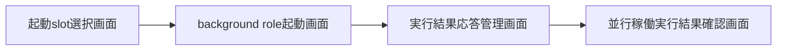
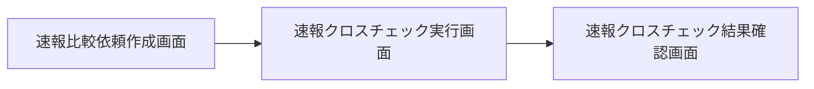
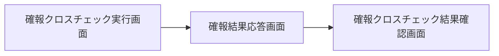
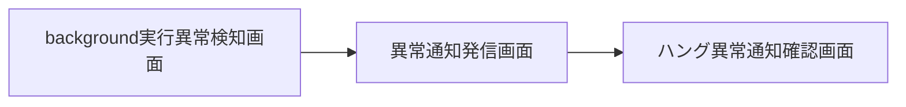
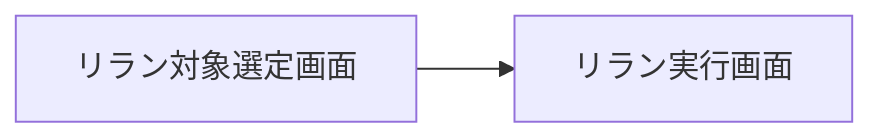
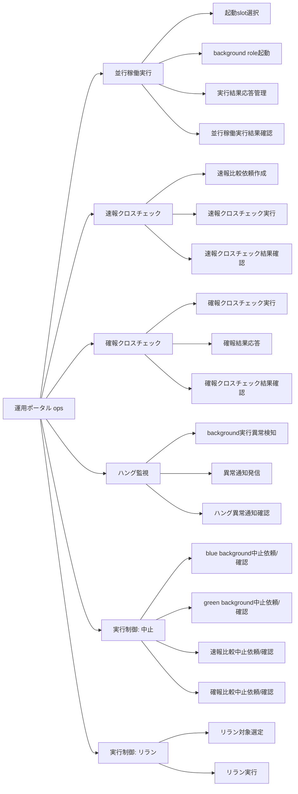

# UX デザイン仕様（RelayGate）

> 前提: RelayGate は Web UI を持たない CLI/バッチ運用基盤である。本書がいう「画面」は
> design-event.yaml の `運用ポータル（CLI出力／将来運用ダッシュボード）`（portal id: `ops`）を指し、
> 実体は (1) CLI 実行時の標準出力・標準エラー・終了コード、(2) 構造化ログ・監査ログの参照、
> (3) 将来導入しうる運用ダッシュボード（本デザインシステムはその先行設計を兼ねる）の3形態を統合的に表現したものである。
> ユーザーフローの「画面遷移」は CLI コマンド呼び出しの連鎖またはログ参照操作として読み替える。

## ユーザーフロー

### 並行稼働実行業務: 並行稼働実行フロー

**アクター**: 運用者、移行運用責任者
**ゴール**: feature flag設定に基づきblue/greenのslotを起動し、foreground実行結果をジョブスケジューラへ応答しつつ、並行稼働の実行結果を確認できる状態にする

**タッチポイント**:
| ステップ | 画面 | UC | 感情 | 改善機会 |
|---------|------|---|------|---------|
| slot起動 | 起動slot選択画面 | feature flag設定に基づきslotを選択して起動する | ニュートラル | BLUE_MODE/GREEN_MODE同時foregroundの拒否理由を即時表示し手戻りを防ぐ |
| background先行起動 | background role起動画面 | background roleを起動する | ニュートラル | 起動対象run_idを起動直後に明示し追跡しやすくする |
| foreground応答 | 実行結果応答管理画面 | foreground roleの標準出力・標準エラー・終了コードを応答する | ポジティブ（応答完了） | stdout/stderr/exitcodeの3項目に絞った簡潔な表示で認知負荷を下げる |
| 結果確認 | 並行稼働実行結果確認画面 | 並行稼働実行結果を確認する | ニュートラル〜ポジティブ | slot間（blue/green）の結果比較を横並びで提示する |

### クロスチェック業務: 速報クロスチェックフロー

**アクター**: 運用者、障害調査担当者
**ゴール**: blue/green runnerの完了通知を受けて速報比較依頼を作成・実行し、ジョブ単位の差分を早期に検知する

**タッチポイント**:
| ステップ | 画面 | UC | 感情 | 改善機会 |
|---------|------|---|------|---------|
| 依頼作成 | 速報比較依頼作成画面 | blue/green runnerの完了通知を受けて速報比較依頼を作成する | ニュートラル | REQUESTED状態への遷移を即時反映する |
| 実行 | 速報クロスチェック実行画面 | 速報クロスチェックを実行し差分を検知する | ネガティブになりうる（NG検出時） | OK/NGの判定結果を最初に提示し詳細を後段に配置する（Progressive Disclosure） |
| 結果確認 | 速報クロスチェック結果確認画面 | 速報クロスチェック結果を確認する | ネガティブ〜ニュートラル | 差分件数・レポートURIへの動線を明確にする |

### クロスチェック業務: 確報クロスチェックフロー

**アクター**: 運用者、リリース判断者
**ゴール**: 日次で全テーブル・全ファイルを対象に確報クロスチェックを実行し、リリース判断の正本として確報結果をジョブスケジューラへ応答する

**タッチポイント**:
| ステップ | 画面 | UC | 感情 | 改善機会 |
|---------|------|---|------|---------|
| 実行 | 確報クロスチェック実行画面 | 全テーブル・全ファイルを対象に確報クロスチェックを実行する | ニュートラル | 全量比較の進捗（対象テーブル数/完了数）を可視化する |
| 応答 | 確報結果応答画面 | 確報クロスチェック結果をstdout/stderr/exitcodeで応答する | ニュートラル | 比較結果・差分件数・レポートURIを応答に含めない制約を画面上でも明示し誤解を防ぐ |
| 結果確認 | 確報クロスチェック結果確認画面 | 確報クロスチェック結果を確認する | リリース判断に直結するため緊張を伴う | SUCCEEDED/FAILEDを最上部に大きく提示し、リリース判断の唯一の根拠であることを明記する |

### 実行監視業務: ハング監視フロー

**アクター**: 移行運用責任者、運用者
**ゴール**: background実行の未完了・非0終了・速報比較異常を定期検知し、運用者へ通知して対応要否を判断できるようにする

**タッチポイント**:
| ステップ | 画面 | UC | 感情 | 改善機会 |
|---------|------|---|------|---------|
| 定期検知 | background実行異常検知画面 | background実行の未完了・非0終了・速報比較異常を定期検知する | ニュートラル | hang_detect_limit_minutesしきい値超過までの残り時間を表示し予兆を掴めるようにする |
| 通知発信 | 異常通知発信画面 | ハング疑い・異常を運用者へ通知する | ネガティブ（異常検知） | banner/emailの2チャネルで通知内容を統一し、対象run_id・異常検知種別を即座に識別できるようにする |
| 通知受領 | ハング異常通知確認画面 | ハング疑い・異常の通知を確認する | ネガティブ〜ニュートラル | 通知確認後の次アクション（中止依頼/リラン）への動線を明示する |

### 実行制御業務: 中止フロー群（blue中止・green中止・速報比較中止・確報比較中止）

**アクター**: 運用者
**ゴール**: 停止確認済みの対象について中止を依頼し、対話確認のうえ明示的にABORTED状態へ遷移させる（誤操作防止のため対話確認を必須とする）

**タッチポイント**:
| ステップ | 画面 | UC | 感情 | 改善機会 |
|---------|------|---|------|---------|
| 中止依頼 | blue/green background中止依頼画面、速報/確報比較中止依頼画面 | {対象}の中止を依頼する | ニュートラル〜緊張 | 対象run_idと現在状態を依頼直前に再確認表示する |
| 対話確認 | blue/green background中止確認画面、速報/確報比較中止確認画面 | 対話確認のうえ{対象}をABORTEDへ遷移させる | 緊張（取消不可） | AbortConfirmDialogで対象・影響範囲・取消不可であることを明示し、y/nの二択のみ許可する（誤操作防止のためショートカット確認を設けない） |

### 実行制御業務: background側リランフロー

**アクター**: 運用者
**ゴール**: 完了済みまたは中止済みのbackground実行・速報比較依頼から再実行対象を選択し、元の実行設定を保ったまま再実行する

**タッチポイント**:
| ステップ | 画面 | UC | 感情 | 改善機会 |
|---------|------|---|------|---------|
| 対象選定 | リラン対象選定画面 | 再実行対象のbackground実行・速報比較依頼を選択する | ニュートラル | SUCCEEDED/FAILED/ABORTEDのフィルターで選択対象を絞り込みやすくする |
| リラン実行 | リラン実行画面 | execution-spec.jsonの実行設定を保ったまま再実行する | ニュートラル〜ポジティブ | 元のexecution-spec.jsonの内容（ExecutionSpecCard）を実行前に確認表示し設定の意図しない変化がないことを保証する |

## 情報アーキテクチャ（IA）

### サイトマップ

### ナビゲーション構造

| ポータル | プライマリナビ | セカンダリナビ |
|---------|-------------|-------------|
| 運用ポータル（ops） | 並行稼働実行 / 速報クロスチェック / 確報クロスチェック / ハング監視 / 実行制御 | 各セクション内の CLI サブコマンド（`select-slot` / `run` / `result` / `respond` / `abort` / `rerun` 等。design-event.yaml の route 末尾セグメントに対応） |

### ページ間の遷移ルール

- 中止確認画面（AbortConfirmDialog を用いる画面）へは、必ず対応する中止依頼画面を経由してのみ到達する。直接遷移（URL/コマンド直叩き）による対話確認スキップは許可しない
- 確報クロスチェック結果確認画面はリリース判断の正本であるため、速報クロスチェック結果確認画面とは独立した動線に配置し、混同を避ける
- リラン実行画面へは、リラン対象選定画面で対象run_idを選択した状態でのみ遷移可能とする（対象未選択での直接遷移は不可）

## UX 心理学に基づくインタラクション設計原則

### 適用する原則

| 原則 | 適用場面 | 具体的な設計 |
|------|---------|-----------|
| Progressive Disclosure（段階的開示） | 速報/確報クロスチェック結果確認画面 | OK/NG・SUCCEEDED/FAILEDの判定結果を最上部に提示し、差分詳細・対象テーブル一覧は展開操作の後段に配置する |
| Peak-End Rule | 中止確認・リラン実行完了時 | 操作完了直後に結果（ABORTEDへの遷移完了、リラン開始完了）を明確なBannerで提示し、操作の記憶をポジティブな終端で締める |
| Loss Aversion（損失回避） | AbortConfirmDialog | 「取消不可」であることを明示し、対象run_id・影響範囲を提示することで意図しない中止操作を抑止する |
| Recognition over Recall（再認優位） | ExecutionSpecCard、CrossCheckRequestRow | run_id・状態・実行設定を毎回全文入力させず、一覧・カード表示から選択させる |
| Status Visibility（システム状態の可視性） | StatusBadge、RunnerResultPanel | RUNNING/SUCCEEDED/FAILED/ABORTED等の状態を色分けバッジで常時可視化し、現在状態の把握コストを下げる |

（`references/specs/ux-psychology-glossary.md` を参照して適用する原則を選定した）

## アクセシビリティ方針

- **WCAG 準拠レベル**: AA（将来運用ダッシュボード化した場合を想定した基準。現行の主インターフェースはCLI/ログのため、色のみに依存しない状態表現（StatusBadgeのラベル併記）を優先する）
- **キーボード操作**: 将来ダッシュボードにおいてもCLI由来の操作性を尊重し、全操作をキーボードのみで完結できるようにする（マウス操作を必須にしない）
- **スクリーンリーダー**: StatusBadge・Bannerには状態ラベルをテキストとして併記し、色のみでの状態伝達を行わない
- **色覚多様性**: RUNNING(blue)/SUCCEEDED(green)/FAILED(red)/ABORTED(gray)の状態色は、色覚多様性に配慮しラベルテキストとアイコン形状（outline-minimal, stroke-based）を併用して区別する
