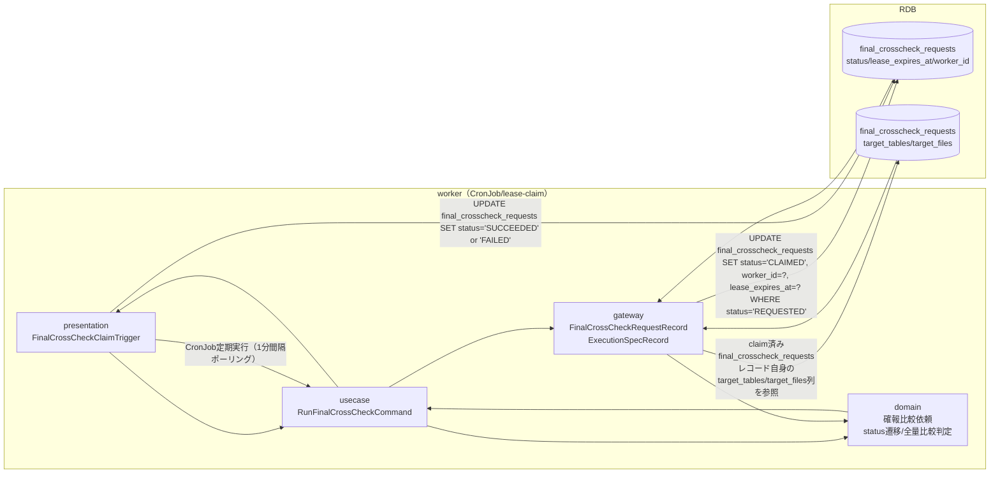
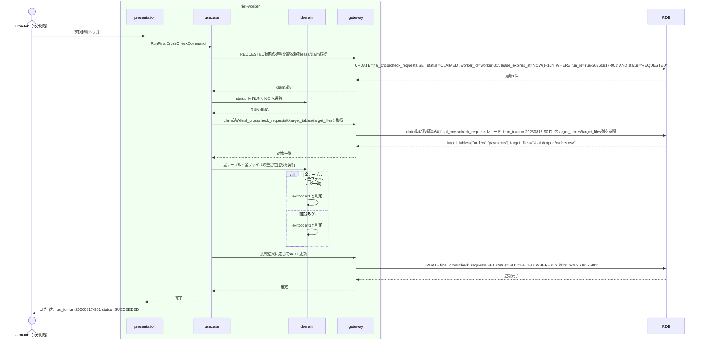

# 全テーブル・全ファイルを対象に確報クロスチェックを実行する

## 概要

日次バッチで作成されたREQUESTED状態の確報比較依頼をtier-workerがlease/claim取得し、final_crosscheck_requestsが保持する対象テーブル・対象ファイルの全量を対象に整合性比較を実行する。実行結果に応じて確報比較依頼状態をSUCCEEDED/FAILEDへ遷移させる。速報クロスチェックとは異なりジョブ単位ではなく全テーブル・全ファイルが対象であり、リリース判断の正本となる。

**前提条件（外部依存）**: final_crosscheck_requestsへのREQUESTED行の生成（対象日・target_tables・target_filesの決定を含む）は、本仕様群の対象外である日次バッチ（RDRA上「日次バッチにより全テーブル・全ファイルを対象とした確報比較依頼を作成する」と記載される、遷移UC欄が空の外部プロセス）が担う。本UCはREQUESTED状態のレコードが既に存在することを前提とする。

## データフロー



| レイヤー | データモデル | 変換内容 |
|---------|------------|---------|
| WK presentation | FinalCrossCheckClaimTrigger | CronJobトリガー受信 → RunFinalCrossCheckCommand変換 |
| WK usecase | RunFinalCrossCheckCommand | lease/claim取得、全テーブル・全ファイル比較実行、結果反映のフロー制御 |
| WK domain | 確報比較依頼（status: CLAIMED→RUNNING→SUCCEEDED/FAILED） | 全量比較判定ロジック適用、状態遷移ルール適用 |
| WK gateway | UPDATE final_crosscheck_requests | lease/claim更新、claim済みレコード自身のtarget_tables/target_files参照、比較結果反映 |

## 処理フロー



## バリエーション一覧

| バリエーション名 | 値 | 処理内容 | 適用 tier | 適用箇所 |
|----------------|---|---------|----------|---------|
| クロスチェック種別 | 確報クロスチェック | 全テーブル・全ファイルを対象とする日次バッチ比較として実行される（速報クロスチェックのジョブ単位比較とは独立） | tier-worker | RunFinalCrossCheckCommand |

## 分岐条件一覧

| 条件名 | 判定ルール | 適用 tier | 適用箇所 | BDD Scenario |
|--------|----------|----------|---------|-------------|
| lease失効かつ未着手判定 | status=CLAIMEDかつlease_expires_atが現在時刻より過去、かつRUNNINGへ未遷移の場合はREQUESTEDへ差し戻す | tier-worker | RunFinalCrossCheckCommand（lease/claim取得処理） | lease失効時にREQUESTEDへ差し戻される |
| 全量比較判定 | target_tables/target_filesの全項目が一致すればexitcode=0（SUCCEEDED）、1件でも不一致があればexitcode非0（FAILED） | tier-worker | 確報比較実行ロジック | 全テーブル・全ファイルの整合性比較が完了しSUCCEEDEDへ遷移する |

## 計算ルール一覧

| 計算名 | 入力情報 | 計算式/ロジック | 出力情報 | 適用 tier |
|--------|---------|---------------|---------|----------|
| 全量比較判定 | final_crosscheck_requestsのtarget_tables/target_files | target_tables・target_filesの全項目についてblue/green実装のデータを突合し、不一致0件ならOK、1件以上ならNG | 確報比較依頼のstatus（SUCCEEDED/FAILED） | tier-worker |

## 状態遷移一覧

| 状態モデル | 遷移元 | 遷移先 | トリガー | 事前条件 | 事後処理 | 適用 tier |
|-----------|--------|--------|---------|---------|---------|----------|
| 確報比較依頼状態 | REQUESTED | CLAIMED | workerが確報比較依頼を取得（lease取得） | statusがREQUESTED | worker_id・lease_expires_atを設定 | tier-worker |
| 確報比較依頼状態 | CLAIMED | REQUESTED | leaseが失効し、かつworkerが未着手 | lease_expires_at < 現在時刻、かつRUNNING未到達 | worker_id・lease_expires_atをクリア | tier-worker |
| 確報比較依頼状態 | CLAIMED | RUNNING | workerが確報比較の実行を開始する | statusがCLAIMED | 実行開始ログ記録 | tier-worker |
| 確報比較依頼状態 | RUNNING | SUCCEEDED | workerのexitcodeが0であることを確定する | 全テーブル・全ファイル一致 | 完了日時を記録、runnerがSUCCEEDEDのみ中継 | tier-worker |
| 確報比較依頼状態 | RUNNING | FAILED | workerのexitcodeが非0であることを確定する | 1件以上の不一致 | 完了日時を記録、runnerがFAILEDのみ中継 | tier-worker |

## 関連 RDRA モデル

| モデル種別 | 要素名 | 関連 |
|-----------|--------|------|
| 業務 | クロスチェック業務 | このUCが属する業務 |
| BUC | 確報クロスチェックフロー | このUCを含むBUC |
| アクター | 運用者 | 実行画面を確認するアクター |
| 情報 | 確報比較依頼、execution-spec.json | 更新・参照する情報 |
| 状態 | 確報比較依頼状態 | REQUESTED→CLAIMED→RUNNING→SUCCEEDED/FAILEDの遷移 |
| 条件 | - | 該当なし（hang_detect_limit_minutesは監視業務側の条件） |
| 外部システム | - | 該当なし（blue/green実装は速報比較依頼作成UCで連携済みの比較対象データを参照） |

## E2E 完了条件（BDD）

### 正常系

```gherkin
Feature: 全テーブル・全ファイルを対象に確報クロスチェックを実行する

  Scenario: 全テーブル・全ファイルが一致しSUCCEEDEDへ遷移する
    Given target_date "2026-08-17" の確報比較依頼 run_id "run-20260817-901" が status "REQUESTED" で存在し、target_tables ["orders","payments"] target_files ["/data/export/orders.csv"] が設定されている
    When CronJobがworker "worker-01" として run_id "run-20260817-901" をlease/claim取得し全量比較を実行する
    Then blue/green実装の全テーブル・全ファイルの内容が一致し、確報比較依頼 run_id "run-20260817-901" のstatusが "SUCCEEDED" へ遷移する

  Scenario: 差分検出によりFAILEDへ遷移する
    Given target_date "2026-08-17" の確報比較依頼 run_id "run-20260817-902" が status "CLAIMED" でworker_id "worker-02" により保持されている
    When worker "worker-02" が全量比較を実行しtarget_tables "orders" に1件の不一致を検出する
    Then 確報比較依頼 run_id "run-20260817-902" のstatusが "FAILED" へ遷移する
```

### 異常系

```gherkin
  Scenario: lease失効かつ未着手の依頼はREQUESTEDへ差し戻される
    Given 確報比較依頼 run_id "run-20260817-903" が status "CLAIMED" でlease_expires_at "2026-08-17T02:00:00+09:00" が現在時刻 "2026-08-17T02:15:00+09:00" より過去であり、RUNNINGへ未到達である
    When CronJobがlease/claim取得処理を実行する
    Then 確報比較依頼 run_id "run-20260817-903" のstatusが "REQUESTED" へ差し戻され、worker_idとlease_expires_atがクリアされる

  Scenario: 比較結果の書き戻し中にRDB接続エラーが発生する
    Given 確報比較依頼 run_id "run-20260817-904" が status "RUNNING" で全量比較処理中である
    When gatewayがfinal_crosscheck_requestsテーブルへの比較結果UPDATE（status="SUCCEEDED"またはstatus="FAILED"への確定）実行時にRDB接続エラーを検知する
    Then usecase層で技術例外を1回だけログ出力し、確報比較依頼のstatusは "RUNNING" のまま次回のlease失効判定に委ねられる
```

## ティア別仕様

- [tier-worker（バックエンドワーカーティア）](tier-worker.md)

### 統合 API Spec

- [CLI コマンド契約](../../../_cross-cutting/api/cli-command-contract.yaml)（全 UC 統合。HTTP APIは存在しないためOpenAPIは生成しない）
