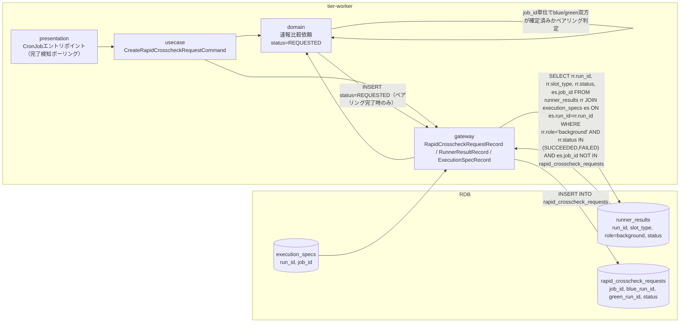
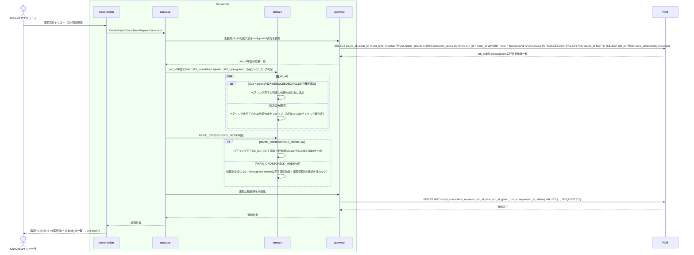

# blue/green runnerの完了通知を受けて速報比較依頼を作成する

## 概要

blue実装・green実装の両background runnerが完了（Runner実行結果のexit_code確定）したジョブについて、job_id単位でblue/green双方のRunner実行結果（role=background）がSUCCEEDED/FAILEDで揃ったことを確認したうえで速報比較依頼を作成し、速報比較依頼状態をREQUESTEDへ遷移させるUC。job_idはrunner_results自体には存在しないため、run_idを介してexecution-spec.json（execution_specsテーブル）からJOINして取得する。RAPID_CROSSCHECK_MODEがoffの場合は依頼作成を行わない。

## データフロー



| レイヤー | データモデル | 変換内容 |
|---------|------------|---------|
| worker presentation | CronJobトリガー（引数なし） | 定期実行起点。完了検知ポーリングの開始 |
| worker gateway (read) | runner_results と execution_specs を run_id でJOINしてSELECT（role=background, status確定済み, job_id未依頼） | run_idからjob_idを引き当て、job_id単位でblue（slot_type=blue）・green（slot_type=green）双方のbackground role完了状況を抽出 |
| worker domain | 速報比較依頼(status=REQUESTED) | job_id単位でblue/green双方のRunner実行結果（role=background）がSUCCEEDED/FAILEDで揃っている（ペアリング完了）場合のみ、RAPID_CROSSCHECK_MODE=on の場合にREQUESTEDで生成。片方のみ完了の場合は生成せず次回サイクルで再判定する。offの場合は生成しない |
| worker gateway (write) | rapid_crosscheck_requests への INSERT | job_id（execution_specsからJOINして取得）/blue_run_id/green_run_id/requested_at/status=REQUESTEDを新規登録 |

## 処理フロー



## バリエーション一覧

| バリエーション名 | 値 | 処理内容 | 適用 tier | 適用箇所 |
|----------------|---|---------|----------|---------|
| クロスチェック種別 | 速報クロスチェック | 生成する依頼レコードのクロスチェック種別を速報として固定する | tier-worker | 速報比較依頼作成処理 |
| slotモード（BLUE_MODE/GREEN_MODE） | background | background role完了のみを検知対象とする（foreground完了は対象外） | tier-worker | 完了検知ポーリング |

## 分岐条件一覧

| 条件名 | 判定ルール | 適用 tier | 適用箇所 | BDD Scenario |
|--------|----------|----------|---------|-------------|
| feature flag設定（RAPID_CROSSCHECK_MODE） | onの場合のみ速報比較依頼を新規作成する。offの場合はblue/green runnerからの完了通知送信・速報管理DBへの接続・書込みを行わないため依頼を作成しない | tier-worker | CreateRapidCrosscheckRequestCommand | RAPID_CROSSCHECK_MODE=offのため速報比較依頼を作成しない |
| blue/greenペアリング完了判定 | 同一job_idのblue（slot_type=blue）・green（slot_type=green）双方のRunner実行結果（role=background）がSUCCEEDED/FAILEDで確定していること。片方のみ確定の場合は依頼作成をスキップし次回CronJobサイクルで再判定する | tier-worker | CreateRapidCrosscheckRequestCommand | blue/green双方のbackground実行完了で速報比較依頼を新規作成する |

## 計算ルール一覧

本UCは既存の完了状態を条件抽出するのみで、値の計算・集計は行わない。

| 計算名 | 入力情報 | 計算式/ロジック | 出力情報 | 適用 tier |
|--------|---------|---------------|---------|----------|
| 該当なし | - | - | - | - |

## 状態遷移一覧

| 状態モデル | 遷移元 | 遷移先 | トリガー | 事前条件 | 事後処理 | 適用 tier |
|-----------|--------|--------|---------|---------|---------|----------|
| 速報比較依頼状態 | （新規） | REQUESTED | blue/green runnerの完了通知を受けて速報比較依頼を作成する | 対象job_idについて、blue/green双方のRunner実行結果（role=background）がSUCCEEDED/FAILEDで確定済み（ペアリング完了）、かつ未依頼、かつRAPID_CROSSCHECK_MODE=on | 速報比較依頼レコードを新規作成しrequested_atを記録 | tier-worker |

## 関連 RDRA モデル

| モデル種別 | 要素名 | 関連 |
|-----------|--------|------|
| 業務 | クロスチェック業務 | このUCが属する業務 |
| BUC | 速報クロスチェックフロー | このUCを含むBUC |
| アクター | 運用者 | 生成された依頼作成画面を参照するアクター（社内・提供者） |
| 情報 | 速報比較依頼 | 新規作成する情報 |
| 情報 | Runner実行結果（started-at.txt/stdout.log/stderr.log/exitcode.txt） | 完了判定の入力情報 |
| 情報 | execution-spec.json | run_idからjob_idを引き当てるためJOIN参照する情報（runner_resultsにはjob_id属性が存在しないため） |
| 状態 | 速報比較依頼状態 | （新規）→REQUESTEDの遷移 |
| 条件 | feature flag設定（BLUE_MODE/GREEN_MODE/RAPID_CROSSCHECK_MODE） | RAPID_CROSSCHECK_MODEによる依頼作成可否判定 |
| 外部システム | blue実装 | blue実装background完了通知イベントの送信元 |
| 外部システム | green実装 | green実装background完了通知イベントの送信元 |

## E2E 完了条件（BDD）

### 正常系

```gherkin
Feature: blue/green runnerの完了通知を受けて速報比較依頼を作成する

  Scenario: blue/green双方のbackground実行完了で速報比較依頼を新規作成する
    Given execution-spec.json run_id "run-20260817-010" job_id "JOB-BATCH-10" が存在する
    And execution-spec.json run_id "run-20260817-011" job_id "JOB-BATCH-10" が存在する
    And Runner実行結果 run_id "run-20260817-010" job_id "JOB-BATCH-10" slot_type "blue" role "background" status "SUCCEEDED" が確定済みである
    And Runner実行結果 run_id "run-20260817-011" job_id "JOB-BATCH-10" slot_type "green" role "background" status "SUCCEEDED" が確定済みである
    And job_id "JOB-BATCH-10" に対応する速報比較依頼が存在しない
    And feature flag設定 RAPID_CROSSCHECK_MODE が "on" である
    When CronJobが `relaygate rapid-crosscheck create` を定期実行する
    Then rapid_crosscheck_requests に job_id "JOB-BATCH-10" blue_run_id "run-20260817-010" green_run_id "run-20260817-011" status "REQUESTED" が新規作成される

  Scenario: blue側のみ完了しgreen側が未完了の場合は依頼を作成せず次回サイクルまで待機する
    Given Runner実行結果 run_id "run-20260817-013" job_id "JOB-BATCH-13" slot_type "blue" role "background" status "SUCCEEDED" が確定済みである
    And 同一job_id "JOB-BATCH-13" のslot_type "green" のRunner実行結果はstatus "RUNNING"でまだ確定していない
    And job_id "JOB-BATCH-13" に対応する速報比較依頼が存在しない
    And feature flag設定 RAPID_CROSSCHECK_MODE が "on" である
    When CronJobが `relaygate rapid-crosscheck create` を定期実行する
    Then job_id "JOB-BATCH-13" の速報比較依頼はこの実行では作成されない

  Scenario: 既に依頼済みのjob_idはスキップする
    Given Runner実行結果 job_id "JOB-BATCH-11" のblue/green background実行がいずれもFAILEDで確定済みである
    And job_id "JOB-BATCH-11" に対応する速報比較依頼が status "SUCCEEDED" で既に存在する
    When CronJobが `relaygate rapid-crosscheck create` を定期実行する
    Then job_id "JOB-BATCH-11" の速報比較依頼は新規作成されず既存レコードのまま維持される
```

### 異常系

```gherkin
  Scenario: RAPID_CROSSCHECK_MODEがoffの場合は依頼を作成しない
    Given Runner実行結果 job_id "JOB-BATCH-12" のblue/green background実行がいずれもSUCCEEDEDで確定済みである
    And job_id "JOB-BATCH-12" に対応する速報比較依頼が存在しない
    And feature flag設定 RAPID_CROSSCHECK_MODE が "off" である
    When CronJobが `relaygate rapid-crosscheck create` を定期実行する
    Then job_id "JOB-BATCH-12" の速報比較依頼は作成されず、処理件数0件がログに記録される

  Scenario: RDB接続エラー時
    Given RDBへの接続が一時的に失敗する状態である
    When CronJobが `relaygate rapid-crosscheck create` を定期実行する
    Then 標準エラーに接続エラーが記録され、終了コード 1 で終了する
```

## ティア別仕様

- [バックエンドワーカーティア](tier-worker.md)

### 統合 API Spec

- 本プロジェクトはHTTP APIを持たない。コマンド契約は `_cross-cutting/api/cli-command-contract.yaml`（全UC統合、Contract First開発用）を参照
