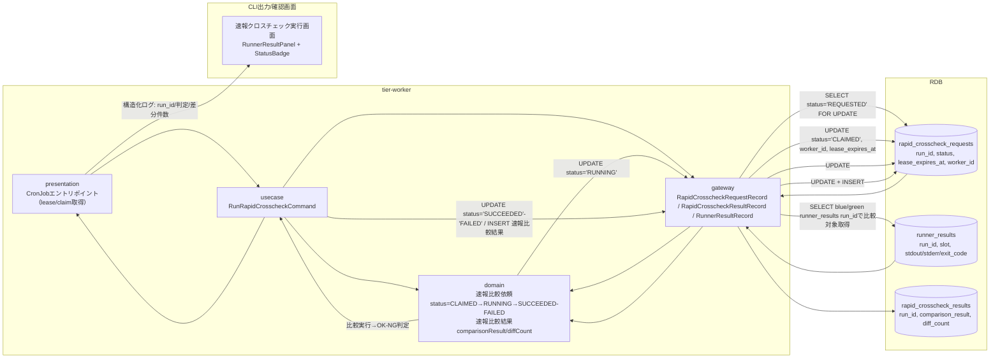

# 速報クロスチェックを実行し差分を検知する

## 概要

workerがREQUESTED状態の速報比較依頼をlease/claim取得し、blue/green実装の実行結果を比較して差分を検知するUC。日次の全量比較（確報クロスチェック）を待たずにジョブ単位で早期に差分を検知し、速報比較依頼状態をSUCCEEDED/FAILEDへ、速報比較結果（OK/NG判定・差分件数）を確定する。

## データフロー



| レイヤー | データモデル | 変換内容 |
|---------|------------|---------|
| worker presentation | CronJobトリガー（引数なし） | 定期実行起点。lease/claim対象の走査開始 |
| worker gateway (claim) | rapid_crosscheck_requests への UPDATE（status=CLAIMED, worker_id, lease_expires_at） | REQUESTED行を排他的に取得し重複実行を防止 |
| worker domain | 速報比較依頼(RUNNING→SUCCEEDED/FAILED)、速報比較結果(comparisonResult/diffCount) | blue/green runner_resultsのstdout/stderr/exit_codeを比較しOK/NG判定・差分件数を算出 |
| worker gateway (write) | rapid_crosscheck_requests UPDATE + rapid_crosscheck_results INSERT | 比較完了後の状態確定と結果永続化 |

## 処理フロー

```mermaid
sequenceDiagram
  actor Cron as CronJobスケジューラ

  box rgb(240,255,240) tier-worker
    participant Pres as presentation
    participant UC as usecase
    participant Domain as domain
    participant GW as gateway
  end

  participant DB as RDB

  Cron->>Pres: 定期実行トリガー（1分間隔想定）
  Pres->>UC: RunRapidCrosscheckCommand
  UC->>GW: REQUESTED状態の速報比較依頼を1件lease取得
  GW->>DB: UPDATE rapid_crosscheck_requests SET status='CLAIMED', worker_id='worker-01', lease_expires_at=now()+5m WHERE run_id=(SELECT run_id FROM rapid_crosscheck_requests WHERE status='REQUESTED' LIMIT 1 FOR UPDATE)
  DB-->>GW: 取得件数
  alt 取得件数0件
    GW-->>UC: 対象なし
    UC-->>Pres: 処理終了（対象なし）
  else 取得成功
    GW-->>UC: run_id
    UC->>GW: status='RUNNING'へ更新
    GW->>DB: UPDATE rapid_crosscheck_requests SET status='RUNNING' WHERE run_id=:run_id
    UC->>GW: blue/green Runner実行結果を取得
    GW->>DB: SELECT * FROM runner_results WHERE run_id=:run_id
    DB-->>GW: blue/green stdout/stderr/exit_code
    GW-->>UC: 比較対象データ
    UC->>Domain: 比較実行
    alt 差分なし
      Domain->>Domain: comparison_result='OK', diff_count=0
    else 差分あり
      Domain->>Domain: comparison_result='NG', diff_count=N, diff_detail_uri生成
    end
    Domain-->>UC: 比較結果
    UC->>GW: 速報比較依頼status確定＋速報比較結果永続化
    GW->>DB: UPDATE rapid_crosscheck_requests SET status='SUCCEEDED' or 'FAILED'; INSERT INTO rapid_crosscheck_results (...)
    DB-->>GW: 登録完了
    GW-->>UC: 完了
    UC-->>Pres: 処理結果
    Pres-->>Cron: 構造化ログ出力, exit code 0
  end
```

## バリエーション一覧

| バリエーション名 | 値 | 処理内容 | 適用 tier | 適用箇所 |
|----------------|---|---------|----------|---------|
| クロスチェック種別 | 速報クロスチェック | ジョブ単位の非同期比較として実行し、確報クロスチェック（全量日次）とは独立して処理する | tier-worker | RunRapidCrosscheckCommand |

## 分岐条件一覧

| 条件名 | 判定ルール | 適用 tier | 適用箇所 | BDD Scenario |
|--------|----------|----------|---------|-------------|
| 速報比較依頼状態（CLAIMED→RUNNING遷移判定） | workerがREQUESTED行をlease取得できた場合のみRUNNINGへ進む。lease失効かつ未着手の場合はREQUESTEDへ差し戻す | tier-worker | RunRapidCrosscheckCommand（lease/claim） | lease失効かつ未着手の速報比較依頼をREQUESTEDへ差し戻す |
| 比較判定（OK/NG） | blue/green runner_resultsのstdout/stderr/exit_codeが一致すればOK、差分があればNGとし差分件数をカウントする | tier-worker | 比較実行ロジック | 差分ありのためNG判定・FAILEDへ遷移する |

## 計算ルール一覧

| 計算名 | 入力情報 | 計算式/ロジック | 出力情報 | 適用 tier |
|--------|---------|---------------|---------|----------|
| 差分件数算出 | blue/green双方のrunner_results（stdout/stderr/exit_code） | blue実装とgreen実装の出力を行単位で比較し不一致行数をカウントする | 速報比較結果.diff_count | tier-worker |
| 比較判定結果算出 | 差分件数 | diff_count=0ならcomparison_result='OK'、1件以上なら'NG' | 速報比較結果.comparison_result | tier-worker |

## 状態遷移一覧

| 状態モデル | 遷移元 | 遷移先 | トリガー | 事前条件 | 事後処理 | 適用 tier |
|-----------|--------|--------|---------|---------|---------|----------|
| 速報比較依頼状態 | REQUESTED | CLAIMED | 速報クロスチェックを実行し差分を検知する（lease取得） | REQUESTED状態の行が存在する | worker_id/lease_expires_atを記録 | tier-worker |
| 速報比較依頼状態 | CLAIMED | RUNNING | 速報クロスチェックを実行し差分を検知する | lease取得成功 | 比較処理を開始 | tier-worker |
| 速報比較依頼状態 | RUNNING | SUCCEEDED | 速報クロスチェックを実行し差分を検知する | 比較処理のexit_codeが0 | 速報比較結果(OK/差分0件)を確定 | tier-worker |
| 速報比較依頼状態 | RUNNING | FAILED | 速報クロスチェックを実行し差分を検知する | 比較処理のexit_codeが非0または差分検出 | 速報比較結果(NG/差分件数)を確定しハング検知記録の対象とする | tier-worker |
| 速報比較依頼状態 | CLAIMED | REQUESTED | lease失効かつworker未着手 | lease_expires_atを経過しRUNNINGへの遷移が発生していない | worker_id/lease_expires_atをクリアし再取得可能にする | tier-worker |

## 関連 RDRA モデル

| モデル種別 | 要素名 | 関連 |
|-----------|--------|------|
| 業務 | クロスチェック業務 | このUCが属する業務 |
| BUC | 速報クロスチェックフロー | このUCを含むBUC |
| アクター | 運用者 | 速報クロスチェック実行画面を参照するアクター（社内・提供者） |
| 情報 | 速報比較依頼 | 更新する情報（status, lease期限, worker識別子） |
| 情報 | Runner実行結果（started-at.txt/stdout.log/stderr.log/exitcode.txt） | 比較対象として参照する情報 |
| 情報 | 速報比較結果 | 新規作成する情報 |
| 状態 | 速報比較依頼状態 | REQUESTED→CLAIMED→RUNNING→SUCCEEDED/FAILED、CLAIMED→REQUESTED差し戻し |
| 条件 | 該当なし | 本UCの実行トリガー自体には条件.tsvの条件は適用されない（作成時のRAPID_CROSSCHECK_MODEはUC2で判定済み） |
| 外部システム | 該当なし | 本UCは外部システムと直接連携しない（比較対象はRDB上のRunner実行結果） |

## E2E 完了条件（BDD）

### 正常系

```gherkin
Feature: 速報クロスチェックを実行し差分を検知する

  Scenario: 差分なしでSUCCEEDEDへ遷移する
    Given rapid_crosscheck_requests に run_id "run-20260817-030" status "REQUESTED" が存在する
    And runner_results に run_id "run-20260817-030" のblue/green双方の実行結果が一致して存在する
    When workerが `relaygate rapid-crosscheck run` を定期実行しrun_id "run-20260817-030" をlease取得する
    Then rapid_crosscheck_requests の status が "CLAIMED"→"RUNNING"→"SUCCEEDED" と遷移し、rapid_crosscheck_results に comparison_result "OK" diff_count 0 が作成される

  Scenario: 差分ありでFAILEDへ遷移する
    Given rapid_crosscheck_requests に run_id "run-20260817-031" status "REQUESTED" が存在する
    And runner_results に run_id "run-20260817-031" のblue/green実行結果で3行の差分がある
    When workerが `relaygate rapid-crosscheck run` を定期実行しrun_id "run-20260817-031" をlease取得する
    Then rapid_crosscheck_requests の status が "RUNNING"→"FAILED" と遷移し、rapid_crosscheck_results に comparison_result "NG" diff_count 3 が作成される
```

### 異常系

```gherkin
  Scenario: lease失効かつ未着手のためREQUESTEDへ差し戻す
    Given rapid_crosscheck_requests に run_id "run-20260817-032" status "CLAIMED" worker_id "worker-01" lease_expires_at "2026-08-17T15:00:00+09:00" が存在する
    And 現在時刻が "2026-08-17T15:10:00+09:00" でありlease_expires_atを経過し、かつstatusがRUNNINGへ遷移していない
    When workerが `relaygate rapid-crosscheck run` を定期実行しlease失効を検知する
    Then run_id "run-20260817-032" の status が "REQUESTED" へ差し戻され worker_id・lease_expires_at がクリアされる

  Scenario: 比較対象のRunner実行結果が未確定（片方未完了）の場合
    Given rapid_crosscheck_requests に run_id "run-20260817-033" status "REQUESTED" が存在する
    And runner_results に run_id "run-20260817-033" のblue実行結果は存在するがgreen実行結果が未確定である
    When workerが `relaygate rapid-crosscheck run` を実行しrun_id "run-20260817-033" をlease取得する
    Then 比較処理は実行されず、標準エラーに "比較対象のRunner実行結果が揃っていません: run-20260817-033" が記録され、status は "CLAIMED" のまま次回lease失効判定に委ねられる
```

## ティア別仕様

- [バックエンドワーカーティア](tier-worker.md)

### 統合 API Spec

- 本プロジェクトはHTTP APIを持たない。コマンド契約は `_cross-cutting/api/cli-command-contract.yaml`（全UC統合、Contract First開発用）を参照
