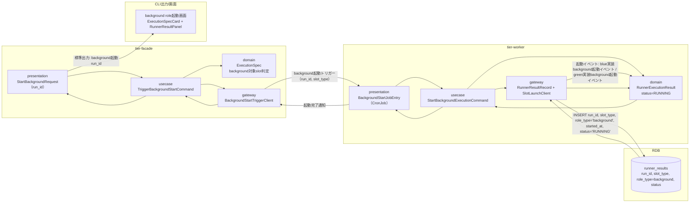
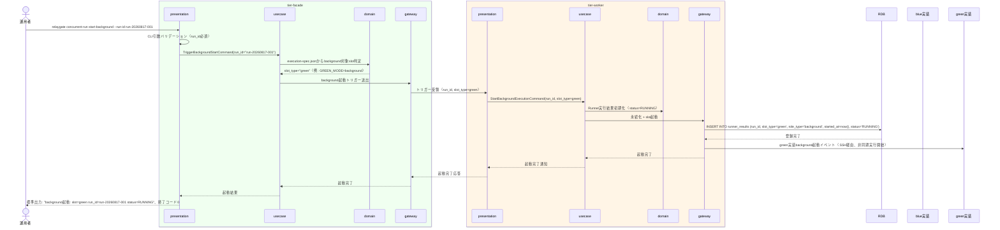

# background roleを起動する

## 概要

foreground roleの実行に先立ち、facade（tier-facade）がbackground役割に割り当てられたslot（blue/green）の起動をトリガーし、実際の非同期実行はworker（tier-worker）が引き受けてbackground slot実行状態をRUNNINGへ遷移させる。facadeは起動トリガーの送出とexecution-spec.jsonの参照までを担い、workerはCronJob/常駐プロセスとしてRDBのlease/claim機構を用いてbackground実行を開始し、Runner実行結果を記録する。

## データフロー



| レイヤー | データモデル | 変換内容 |
|---------|------------|---------|
| facade presentation | StartBackgroundRequest(run_id) | execution-spec.jsonからbackground対象slotを特定しCommand変換 |
| facade usecase | TriggerBackgroundStartCommand | background起動トリガー送出のフロー制御 |
| worker presentation | BackgroundStartJobEntry | CronJob/常駐プロセスのエントリポイント。トリガー受領 |
| worker gateway | runner_resultsへのINSERT | background role実行結果レコード作成（status=RUNNING） |
| Response | background起動run_id・実行状態 | 並行稼働実行結果確認UCへの入力となる |

## 処理フロー



## バリエーション一覧

| バリエーション名 | 値 | 処理内容 | 適用 tier | 適用箇所 |
|----------------|---|---------|----------|---------|
| slotモード（BLUE_MODE/GREEN_MODE） | off、background、foreground | background指定されたslotのみ本UCの起動対象とする | tier-facade, tier-worker | background起動対象slot判定 |
| slot種別 | blue、green | 起動先実装（blue実装/green実装）を切り替える | tier-worker | SlotLaunchClientの起動先分岐 |

## 分岐条件一覧

該当なし（本UCはexecution-spec.jsonで確定済みのbackground対象slotをそのまま起動する処理であり、追加の分岐条件は発生しない。BLUE_MODE/GREEN_MODEの排他判定はUC「feature flag設定に基づきslotを選択して起動する」で完了済み）。

## 計算ルール一覧

該当なし。

## 状態遷移一覧

| 状態モデル | 遷移元 | 遷移先 | トリガー | 事前条件 | 事後処理 | 適用 tier |
|-----------|--------|--------|---------|---------|---------|----------|
| background slot実行状態 | (未作成) | RUNNING | background roleを起動する | execution-spec.jsonが確定済みでbackground対象slotが判定されていること | Runner実行結果レコード作成（status=RUNNING, started_at記録） | tier-facade（トリガー送出）, tier-worker（実行開始・永続化） |

## 関連 RDRA モデル

| モデル種別 | 要素名 | 関連 |
|-----------|--------|------|
| 業務 | 並行稼働実行業務 | このUCが属する業務 |
| BUC | 並行稼働実行フロー | このUCを含むBUC |
| アクター | 運用者 | 操作するアクター |
| 情報 | execution-spec.json、Runner実行結果（started-at.txt/stdout.log/stderr.log/exitcode.txt） | 参照・作成する情報 |
| 状態 | background slot実行状態 | RUNNINGへ遷移させる |
| 条件 | なし | - |
| 外部システム | blue実装、green実装 | 連携する外部システム（background起動イベント送出先） |

## E2E 完了条件（BDD）

### 正常系

```gherkin
Feature: background roleを起動する

  Scenario: green slotをbackground役割で起動しRUNNINGへ遷移する
    Given run_id "run-20260817-001" のexecution-spec.jsonでGREEN_MODE=backgroundが確定している
    When 運用者が `relaygate concurrent-run start-background --run-id run-20260817-001` を実行する
    Then 終了コード 0 で終了する
    And runner_resultsに run_id "run-20260817-001", slot_type "green", role_type "background", status "RUNNING" のレコードが作成される
    And 標準出力に "background起動: slot=green run_id=run-20260817-001 status=RUNNING" が出力される
```

### 異常系

```gherkin
  Scenario: execution-spec.jsonにbackground対象slotが存在しない
    Given run_id "run-20260817-002" のexecution-spec.jsonでBLUE_MODE=off, GREEN_MODE=foregroundが確定している（background対象なし）
    When 運用者が `relaygate concurrent-run start-background --run-id run-20260817-002` を実行する
    Then 終了コード 1 で終了する
    And 標準エラーに "background対象のslotが存在しません: run_id=run-20260817-002" が出力される

  Scenario: 起動先実装への接続に失敗する
    Given run_id "run-20260817-003" のexecution-spec.jsonでGREEN_MODE=backgroundが確定している
    And green実装ホストへのSSH接続が失敗する状態である
    When 運用者が `relaygate concurrent-run start-background --run-id run-20260817-003` を実行する
    Then 終了コード 1 で終了する
    And runner_resultsにrole_type="background"のレコードは作成されない
    And 標準エラーに "green実装への接続に失敗しました: run_id=run-20260817-003" が出力される
```

## ティア別仕様

- [tier-facade](tier-facade.md)
- [tier-worker](tier-worker.md)

### 統合 API Spec

- [CLI コマンド契約](../../_cross-cutting/api/cli-command-contract.yaml)（全 UC 統合、CLI/ファイル/DB契約の正本）
