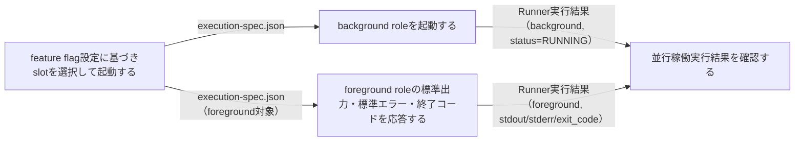
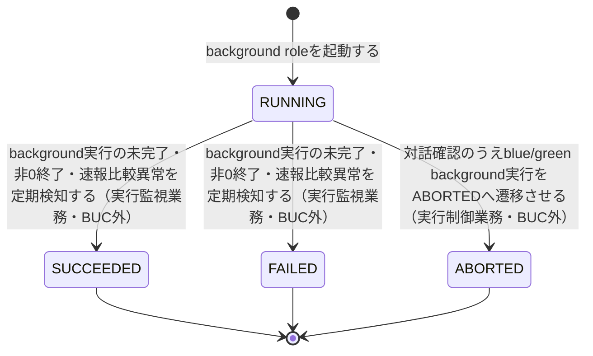

# 並行稼働実行フロー

## 概要

feature flag設定（BLUE_MODE/GREEN_MODE/RAPID_CROSSCHECK_MODE）に基づきblue/green実装のslotを選択して起動し、background roleを非同期実行、foreground roleの標準出力・標準エラー・終了コードのみをジョブスケジューラへ応答する。移行運用責任者はRunner実行結果を確認し、段階的切替の判断材料とする。

## 所属 UC 一覧

| UC名 | アクター | 主な操作 | 関連情報 |
|------|---------|---------|---------|
| [feature flag設定に基づきslotを選択して起動する](feature flag設定に基づきslotを選択して起動する/spec.md) | 運用者（ジョブスケジューラ起動契機） | feature flag設定を参照しexecution-spec.jsonを確定・blue/green起動 | execution-spec.json |
| [background roleを起動する](background roleを起動する/spec.md) | 運用者 | background対象slotの起動トリガー送出・非同期実行開始 | execution-spec.json、Runner実行結果 |
| [foreground roleの標準出力・標準エラー・終了コードを応答する](foreground roleの標準出力・標準エラー・終了コードを応答する/spec.md) | 運用者（ジョブスケジューラ） | foreground実行結果を3項目に限定してジョブスケジューラへ中継 | Runner実行結果 |
| [並行稼働実行結果を確認する](並行稼働実行結果を確認する/spec.md) | 移行運用責任者 | blue/green双方のRunner実行結果をslot別に横並び確認 | Runner実行結果 |

## UC 横断データフロー

feature flag設定に基づく起動UCがexecution-spec.jsonを確定し、それを起点にbackground起動UCとforeground応答UCがそれぞれRunner実行結果を作成・参照する。移行運用責任者向けの確認UCは両者のRunner実行結果を横断的に参照する。

### データフロー図

### 情報 CRUD マトリクス

| 情報名 | feature flag設定に基づきslotを選択して起動する | background roleを起動する | foreground roleの標準出力・標準エラー・終了コードを応答する | 並行稼働実行結果を確認する |
|--------|:-------:|:-------:|:-------:|:-------:|
| execution-spec.json | C | R | R | |
| Runner実行結果（started-at.txt/stdout.log/stderr.log/exitcode.txt） | | C | R | R |

## 状態遷移全体図

background slot実行状態は「background roleを起動する」でRUNNINGへ遷移する。並行稼働実行フロー内ではSUCCEEDED/FAILEDへの遷移（ハング監視業務が担当）やABORTEDへの遷移（実行制御業務のblue/green中止フローが担当）は本BUCの範囲外だが、業務全体の状態遷移経路の起点として明示する。

### 状態遷移 UC マッピング

| 状態モデル | 遷移元 | 遷移先 | 担当 UC |
|-----------|--------|--------|--------|
| background slot実行状態 | (未作成) | RUNNING | [background roleを起動する](background roleを起動する/spec.md) |
| background slot実行状態 | RUNNING | RUNNING（参照のみ、状態変化なし） | [並行稼働実行結果を確認する](並行稼働実行結果を確認する/spec.md) |

補足: RUNNING→SUCCEEDED/FAILEDはハング監視業務「background実行の未完了・非0終了・速報比較異常を定期検知する」、RUNNING→ABORTEDは実行制御業務「blue中止フロー」「green中止フロー」がそれぞれ担当し、本BUCの所属UCではない。

## BUC 内共有条件一覧

| 条件名 | 条件の説明 | 適用 UC |
|--------|----------|--------|
| feature flag設定（BLUE_MODE/GREEN_MODE/RAPID_CROSSCHECK_MODE） | BLUE_MODE/GREEN_MODEはforeground/background/offのいずれかを設定し、両方を同時にforegroundにする組み合わせは許可しない。RAPID_CROSSCHECK_MODEはon/offで速報クロスチェックの有効・無効を切り替える | feature flag設定に基づきslotを選択して起動する（判定・分岐条件として適用）、background roleを起動する（判定結果であるslotモードをバリエーションとして参照） |

## BUC 内共有バリエーション一覧

| バリエーション名 | 値 | 適用 UC |
|----------------|---|--------|
| slotモード（BLUE_MODE/GREEN_MODE） | off、background、foreground | feature flag設定に基づきslotを選択して起動する、background roleを起動する |
| slot種別 | blue、green | 並行稼働実行結果を確認する、background roleを起動する |
| role区分 | foreground、background、rapid-crosscheck | 並行稼働実行結果を確認する、foreground roleの標準出力・標準エラー・終了コードを応答する |
