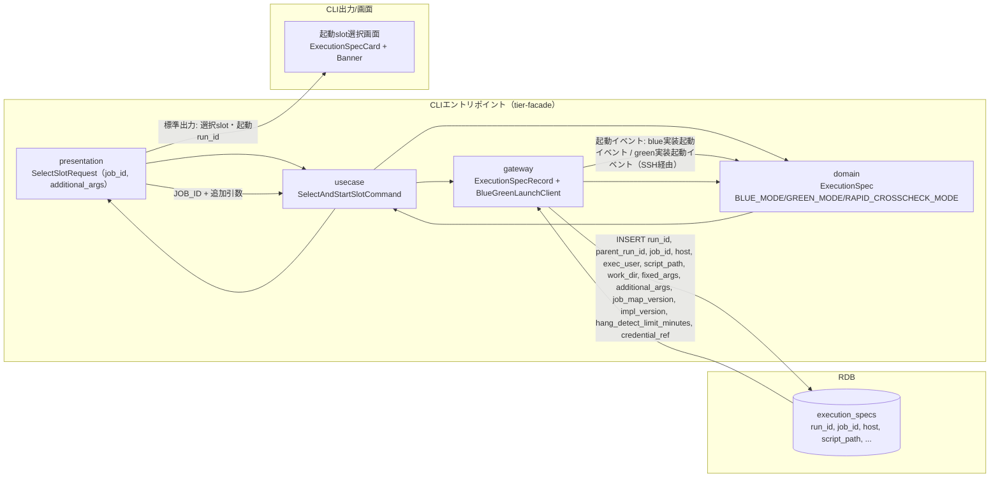
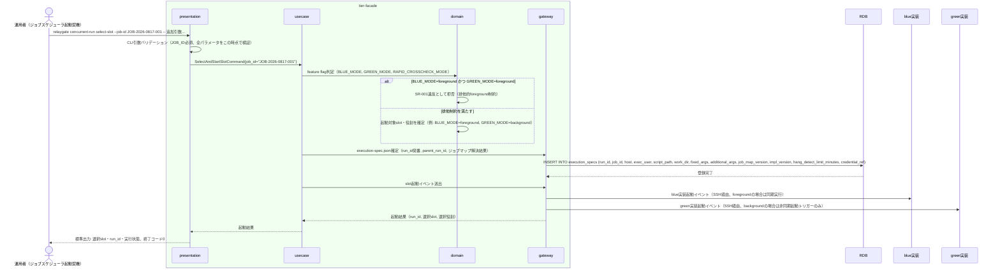

# feature flag設定に基づきslotを選択して起動する

## 概要

運用者（実体はジョブスケジューラからfacadeが起動される契機）が、feature flag設定（BLUE_MODE/GREEN_MODE/RAPID_CROSSCHECK_MODE）を参照し、blue/green実装のうちどちらのslotをどの役割（foreground/background/off）で起動するかを判定し、execution-spec.jsonを一度だけ確定して保存したうえで起動する。BLUE_MODE/GREEN_MODEを同時にforegroundにする組み合わせは拒否する。

## データフロー



| レイヤー | データモデル | 変換内容 |
|---------|------------|---------|
| CLI presentation | SelectSlotRequest(job_id, additional_args) | ジョブスケジューラ由来のJOB_ID・追加引数のCLI解析 → Command変換 |
| CLI usecase | SelectAndStartSlotCommand | ジョブマップ解決 → feature flag判定 → execution-spec.json確定 → 起動 |
| CLI gateway | execution_specsへのINSERT + SSH経由起動 | execution-spec.jsonレコード作成、blue/green実装への起動イベント送出 |
| Response | 選択slot・起動run_id・実行状態 | 移行運用責任者の並行稼働実行結果確認への入力となる |

## 処理フロー



## バリエーション一覧

| バリエーション名 | 値 | 処理内容 | 適用 tier | 適用箇所 |
|----------------|---|---------|----------|---------|
| slotモード（BLUE_MODE/GREEN_MODE） | off、background、foreground | 各slotをどの役割で起動するかを決定する | tier-facade | `relaygate concurrent-run select-slot` のslot選択ロジック |
| RAPID_CROSSCHECK_MODE | on、off | offの場合は完了通知送信・速報管理DB接続/書込みを行わない起動フラグをexecution-spec.jsonに記録する | tier-facade | execution-spec.json確定処理 |
| 運用モード | 並行稼働、新実装単独本番、次世代実装との並行稼働 | ジョブ定義を変更せずBLUE_MODE/GREEN_MODEの組み合わせのみで表現される運用フェーズの区分。BLUE_MODE=foreground・GREEN_MODE=background（またはその逆）は「並行稼働」、BLUE_MODE=off・GREEN_MODE=foregroundは「新実装単独本番」、GREEN_MODE=foregroundかつ将来追加される次世代実装slotがbackground稼働する構成は「次世代実装との並行稼働」に対応する。本UCはこの区分そのものを判定・記録するものではなく、BLUE_MODE/GREEN_MODEの値を確定させることで運用モードを間接的に表現する | tier-facade | execution-spec.json確定処理（BLUE_MODE/GREEN_MODEの値の組み合わせとして表現） |

## 分岐条件一覧

| 条件名 | 判定ルール | 適用 tier | 適用箇所 | BDD Scenario |
|--------|----------|----------|---------|-------------|
| feature flag設定（BLUE_MODE/GREEN_MODE/RAPID_CROSSCHECK_MODE） | BLUE_MODE/GREEN_MODEはforeground/background/offのいずれかを設定する。両方を同時にforegroundにする組み合わせは許可しない。RAPID_CROSSCHECK_MODEはon/offを設定し、offの場合は完了通知送信・速報管理DB接続/書込みを行わない | tier-facade | `relaygate concurrent-run select-slot` のslot選択・起動ロジック | BLUE_MODE/GREEN_MODE同時foregroundを拒否する |

## 計算ルール一覧

該当なし（本UCはfeature flag設定値の参照とexecution-spec.json確定処理が中心であり、数値計算は発生しない）。

## 状態遷移一覧

該当なし（本UCはexecution-spec.jsonの確定までを担い、background slot実行状態の (未作成)→RUNNING 遷移は後続UC「background roleを起動する」が担う）。

## 関連 RDRA モデル

| モデル種別 | 要素名 | 関連 |
|-----------|--------|------|
| 業務 | 並行稼働実行業務 | このUCが属する業務 |
| BUC | 並行稼働実行フロー | このUCを含むBUC |
| アクター | 運用者 | 操作するアクター |
| 情報 | execution-spec.json | 作成・確定する情報 |
| 状態 | なし | 本UCは状態遷移のトリガーではない（background slot実行状態の遷移は「background roleを起動する」UCの責務） |
| 条件 | feature flag設定（BLUE_MODE/GREEN_MODE/RAPID_CROSSCHECK_MODE） | 適用される条件 |
| 外部システム | blue実装、green実装 | 連携する外部システム（起動イベント送出先） |

## E2E 完了条件（BDD）

### 正常系

```gherkin
Feature: feature flag設定に基づきslotを選択して起動する

  Scenario: BLUE_MODE=foreground, GREEN_MODE=backgroundでblue/green両slotを起動する
    Given JOB_ID "JOB-2026-0817-001" のジョブマップにBLUE_MODE=foreground, GREEN_MODE=background, RAPID_CROSSCHECK_MODE=onが設定されている
    When 運用者が `relaygate concurrent-run select-slot --job-id JOB-2026-0817-001` を実行する
    Then 終了コード 0 で終了する
    And execution-spec.jsonがrun_id "run-20260817-001" で確定・保存される
    And 標準出力に "blue: foreground" "green: background" を含む行が出力される

  Scenario: RAPID_CROSSCHECK_MODE=offの場合は速報管理DBへ接続しない
    Given JOB_ID "JOB-2026-0817-002" のジョブマップにRAPID_CROSSCHECK_MODE=offが設定されている
    When 運用者が `relaygate concurrent-run select-slot --job-id JOB-2026-0817-002` を実行する
    Then 終了コード 0 で終了する
    And 速報比較依頼テーブルへのINSERTは発生しない

  Scenario: BLUE_MODE=off, GREEN_MODE=foregroundで新実装単独本番の運用モードとして起動する
    Given JOB_ID "JOB-2026-0817-004" のジョブマップにBLUE_MODE=off, GREEN_MODE=foreground, RAPID_CROSSCHECK_MODE=offが設定されている
    When 運用者が `relaygate concurrent-run select-slot --job-id JOB-2026-0817-004` を実行する
    Then 終了コード 0 で終了する
    And execution-spec.jsonがrun_id "run-20260817-004" で確定・保存される
    And 標準出力に "blue: off" "green: foreground" を含む行が出力される（運用モード: 新実装単独本番に相当する組み合わせ）
```

### 異常系

```gherkin
  Scenario: BLUE_MODEとGREEN_MODEが同時にforegroundに設定されている
    Given JOB_ID "JOB-2026-0817-003" のジョブマップにBLUE_MODE=foreground, GREEN_MODE=foregroundが設定されている
    When 運用者が `relaygate concurrent-run select-slot --job-id JOB-2026-0817-003` を実行する
    Then 終了コード 2 で終了する
    And 標準エラーに "BLUE_MODEとGREEN_MODEを同時にforegroundにすることはできません" が出力される
    And execution-spec.jsonは作成されない

  Scenario: JOB_IDに対応するジョブマップが存在しない
    Given JOB_ID "JOB-UNKNOWN-999" がジョブマップに存在しない
    When 運用者が `relaygate concurrent-run select-slot --job-id JOB-UNKNOWN-999` を実行する
    Then 終了コード 1 で終了する
    And 標準エラーに "JOB_IDに対応するジョブマップが見つかりません: JOB-UNKNOWN-999" が出力される
```

## ティア別仕様

- [tier-facade](tier-facade.md)

### 統合 API Spec

- [CLI コマンド契約](../../_cross-cutting/api/cli-command-contract.yaml)（全 UC 統合、CLI/ファイル/DB契約の正本）
