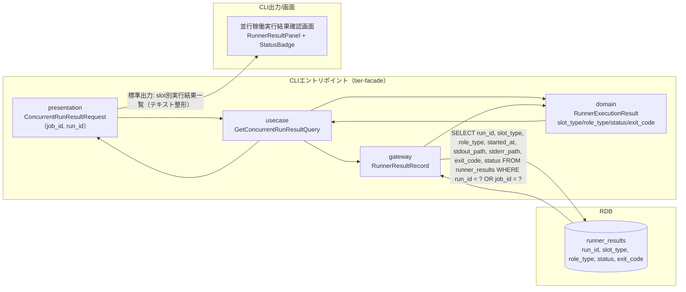
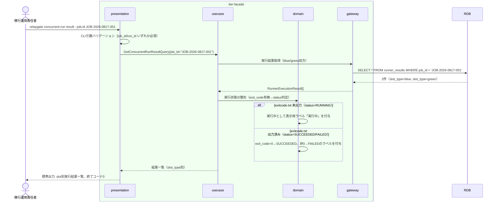

# 並行稼働実行結果を確認する

## 概要

移行運用責任者が、blue/green並行稼働の実行結果（Runner実行結果: started-at.txt/stdout.log/stderr.log/exitcode.txt）を確認し、段階的切替の判断材料とする。CLIコマンドの実行結果として、slot（blue/green）ごとの実行状態（RUNNING/SUCCEEDED/FAILED/ABORTED）を横並びで参照できる。

## データフロー



| レイヤー | データモデル | 変換内容 |
|---------|------------|---------|
| CLI presentation | ConcurrentRunResultRequest(job_id, run_id) | CLI引数解析 + バリデーション → Query変換 |
| CLI usecase | GetConcurrentRunResultQuery | blue/green双方のRunner実行結果取得フロー制御 |
| CLI gateway | runner_results への SELECT | run_id/job_idによるRunner実行結果レコード取得 |
| CLI出力 | slot別実行結果一覧（stdout整形テキスト） | 移行運用責任者が判読しやすいよう slot_type ごとに区切って表示 |

## 処理フロー



## バリエーション一覧

| バリエーション名 | 値 | 処理内容 | 適用 tier | 適用箇所 |
|----------------|---|---------|----------|---------|
| slot種別 | blue、green | 出力時にslot_typeごとにセクション分割して表示する | tier-facade | `relaygate concurrent-run result` の標準出力整形 |
| role区分 | foreground、background、rapid-crosscheck | role_typeごとに実行結果を区別して表示する | tier-facade | `relaygate concurrent-run result` の標準出力整形 |

## 分岐条件一覧

該当なし（本UCは参照系のため業務条件による分岐は発生しない。exitcode.txtの有無・値による状態判定は「関連 RDRA モデル」の情報.tsvに記載の導出ロジックであり、状態モデル側の遷移条件として次節に記載する）。

## 計算ルール一覧

| 計算名 | 入力情報 | 計算式/ロジック | 出力情報 | 適用 tier |
|--------|---------|---------------|---------|----------|
| 実行状態判定 | Runner実行結果.exit_code, Runner実行結果.stdout_path/stderr_path | exitcode.txt が未出力の場合は RUNNING。出力済みかつ exit_code=0 の場合は SUCCEEDED。出力済みかつ exit_code が非0の場合は FAILED。対話確認によりABORTEDへ遷移した場合はその値を優先表示 | Runner実行結果.status（表示用ラベル） | tier-facade |

## 状態遷移一覧

| 状態モデル | 遷移元 | 遷移先 | トリガー | 事前条件 | 事後処理 | 適用 tier |
|-----------|--------|--------|---------|---------|---------|----------|
| background slot実行状態 | - | - | 並行稼働実行結果を確認する | Runner実行結果が存在すること | 状態遷移は発生しない（参照のみ） | tier-facade |

## 関連 RDRA モデル

| モデル種別 | 要素名 | 関連 |
|-----------|--------|------|
| 業務 | 並行稼働実行業務 | このUCが属する業務 |
| BUC | 並行稼働実行フロー | このUCを含むBUC |
| アクター | 移行運用責任者 | 操作するアクター |
| 情報 | Runner実行結果（started-at.txt/stdout.log/stderr.log/exitcode.txt） | 参照する情報 |
| 状態 | background slot実行状態 | 関連する状態遷移（参照のみ） |
| 条件 | なし | - |
| 外部システム | なし | - |

## E2E 完了条件（BDD）

### 正常系

```gherkin
Feature: 並行稼働実行結果を確認する

  Scenario: blue/green両slotの実行結果を確認する
    Given JOB_ID "JOB-2026-0817-001" でblue slot（run_id "run-20260817-blue-001"）がstatus "SUCCEEDED" exit_code 0 で完了している
    And 同一JOB_IDでgreen slot（run_id "run-20260817-green-001"）がstatus "RUNNING" で実行中である
    When 移行運用責任者が `relaygate concurrent-run result --job-id JOB-2026-0817-001` を実行する
    Then 終了コード 0 で終了する
    And 標準出力に "slot: blue" "status: SUCCEEDED" "exit_code: 0" を含む行が出力される
    And 標準出力に "slot: green" "status: RUNNING" を含む行が出力される

  Scenario: run_id指定で単一slotの実行結果を確認する
    Given run_id "run-20260817-blue-001" のRunner実行結果が status "FAILED" exit_code 1 で存在する
    When 移行運用責任者が `relaygate concurrent-run result --run-id run-20260817-blue-001` を実行する
    Then 終了コード 0 で終了する
    And 標準出力に "status: FAILED" "exit_code: 1" を含む行が出力される
```

### 異常系

```gherkin
  Scenario: job_idにもrun_idにも一致するRunner実行結果が存在しない
    Given JOB_ID "JOB-2026-0817-999" のRunner実行結果がRDBに存在しない
    When 移行運用責任者が `relaygate concurrent-run result --job-id JOB-2026-0817-999` を実行する
    Then 終了コード 1 で終了する
    And 標準エラーに "該当するRunner実行結果が見つかりません: job_id=JOB-2026-0817-999" が出力される

  Scenario: job_id・run_idのいずれも指定されない
    When 移行運用責任者が `relaygate concurrent-run result` を引数なしで実行する
    Then 終了コード 2 で終了する
    And 標準エラーに "job_id または run_id のいずれかを指定してください" が出力される
```

## ティア別仕様

- [tier-facade](tier-facade.md)

### 統合 API Spec

- [CLI コマンド契約](../../_cross-cutting/api/cli-command-contract.yaml)（全 UC 統合、CLI/ファイル/DB契約の正本）
