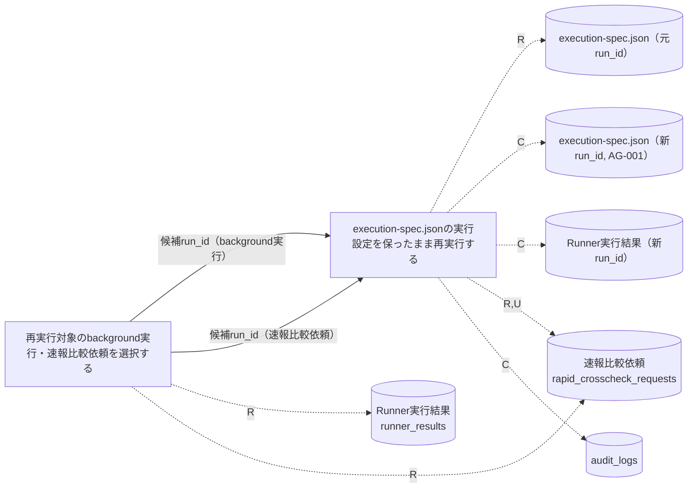
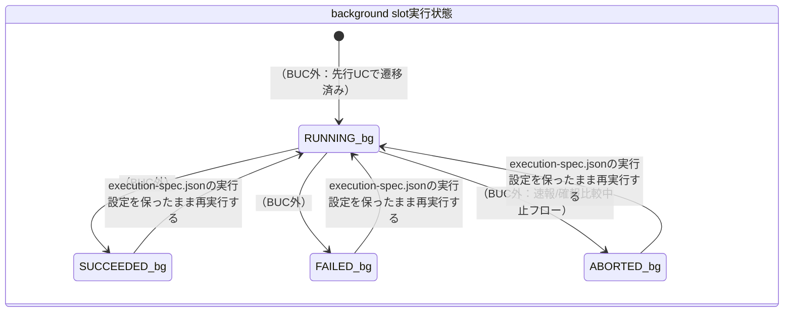
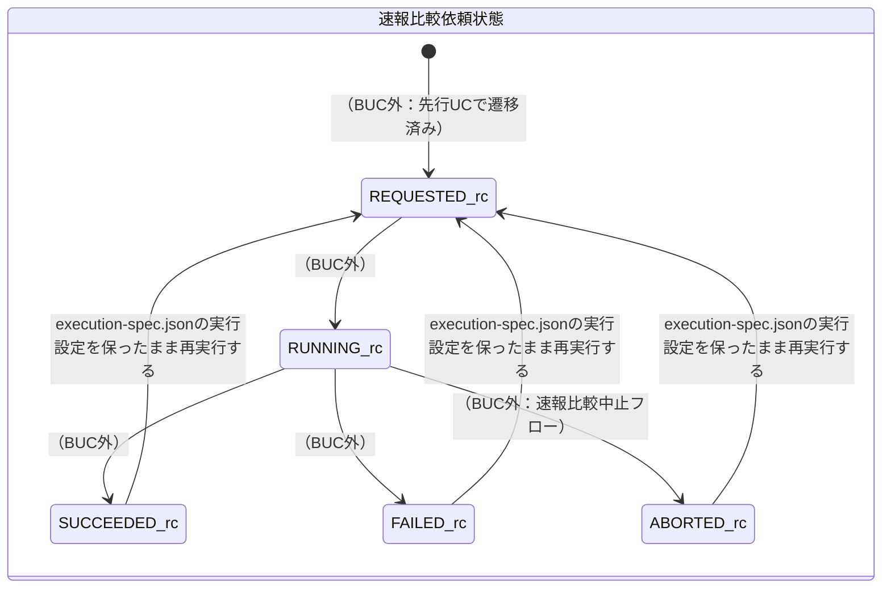

# background側リランフロー

## 概要

完了済み（SUCCEEDED/FAILED）または中止済み（ABORTED）のbackground実行（Runner実行結果, E-002）および速報比較依頼（E-003）から、運用者が再実行対象を選定し、元のexecution-spec.json（AG-001）の実行設定を保ったまま再実行するBUC。tier-facadeとtier-workerの双方に処理が分岐する。

## 所属 UC 一覧

| UC名 | アクター | 主な操作 | 関連情報 |
|------|---------|---------|---------|
| [再実行対象のbackground実行・速報比較依頼を選択する](再実行対象のbackground実行・速報比較依頼を選択する/spec.md) | 運用者 | 完了済み・中止済みのbackground実行（tier-facade）または速報比較依頼（tier-worker）を`--target`オプションで切り替えて一覧提示する（状態遷移なし） | Runner実行結果、速報比較依頼 |
| [execution-spec.jsonの実行設定を保ったまま再実行する](execution-spec.jsonの実行設定を保ったまま再実行する/spec.md) | 運用者 | 選定したrun_idを対象に、background実行は新run_idでexecution-spec.json（AG-001）を複製・再起動、速報比較依頼は同一run_idのままREQUESTEDへ差し戻す | execution-spec.json（AG-001）、Runner実行結果、速報比較依頼、audit_logs |

## UC 横断データフロー

前UCが提示した候補一覧（run_id、slot/target種別、状態、完了日時）を運用者が確認し、後UCの`--run-id`引数へ入力する。tier-facade側はexecution-spec.jsonを新run_idで複製してRunner実行結果を新規作成し、tier-worker側は同一run_idの速報比較依頼をREQUESTEDへ差し戻す。

### データフロー図

### 情報 CRUD マトリクス

| 情報名 | 再実行対象のbackground実行・速報比較依頼を選択する | execution-spec.jsonの実行設定を保ったまま再実行する |
|--------|:--------------------:|:--------------------------------------------------:|
| execution-spec.json（AG-001） | | R（元設定取得）, C（新run_idで複製） |
| Runner実行結果 | R（候補抽出） | C（新run_idで新規作成） |
| 速報比較依頼 | R（候補抽出） | R, U（REQUESTEDへ差し戻し） |
| audit_logs | | C |

## 状態遷移全体図

BUC内には2つの独立した状態モデル（background slot実行状態、速報比較依頼状態）が関与する。いずれも「再実行対象のbackground実行・速報比較依頼を選択する」は状態遷移を発生させず、「execution-spec.jsonの実行設定を保ったまま再実行する」のみが遷移を発生させる。

### 状態遷移 UC マッピング

| 状態モデル | 遷移元 | 遷移先 | 担当 UC |
|-----------|--------|--------|--------|
| background slot実行状態 | - | - | [再実行対象のbackground実行・速報比較依頼を選択する](再実行対象のbackground実行・速報比較依頼を選択する/spec.md)（状態遷移は発生させず、候補一覧提示のみ） |
| 速報比較依頼状態 | - | - | [再実行対象のbackground実行・速報比較依頼を選択する](再実行対象のbackground実行・速報比較依頼を選択する/spec.md)（状態遷移は発生させず、候補一覧提示のみ） |
| background slot実行状態 | SUCCEEDED | RUNNING | [execution-spec.jsonの実行設定を保ったまま再実行する](execution-spec.jsonの実行設定を保ったまま再実行する/spec.md) |
| background slot実行状態 | FAILED | RUNNING | [execution-spec.jsonの実行設定を保ったまま再実行する](execution-spec.jsonの実行設定を保ったまま再実行する/spec.md) |
| background slot実行状態 | ABORTED | RUNNING | [execution-spec.jsonの実行設定を保ったまま再実行する](execution-spec.jsonの実行設定を保ったまま再実行する/spec.md) |
| 速報比較依頼状態 | SUCCEEDED | REQUESTED | [execution-spec.jsonの実行設定を保ったまま再実行する](execution-spec.jsonの実行設定を保ったまま再実行する/spec.md) |
| 速報比較依頼状態 | FAILED | REQUESTED | [execution-spec.jsonの実行設定を保ったまま再実行する](execution-spec.jsonの実行設定を保ったまま再実行する/spec.md) |
| 速報比較依頼状態 | ABORTED | REQUESTED | [execution-spec.jsonの実行設定を保ったまま再実行する](execution-spec.jsonの実行設定を保ったまま再実行する/spec.md) |

## BUC 内共有条件一覧

該当なし（「再実行対象のbackground実行・速報比較依頼を選択する」の条件はリラン対象選定可否（background実行）／リラン対象選定可否（速報比較依頼）、「execution-spec.jsonの実行設定を保ったまま再実行する」の条件はbackground実行リラン対象状態／速報比較依頼リラン対象状態であり、名称・適用箇所が異なる別条件のため、2つ以上のUCで共有される条件は無い）

## BUC 内共有バリエーション一覧

| バリエーション名 | 値 | 適用 UC |
|----------------|---|--------|
| slot種別 | blue、green | 再実行対象のbackground実行・速報比較依頼を選択する, execution-spec.jsonの実行設定を保ったまま再実行する |
| role区分 | background | 再実行対象のbackground実行・速報比較依頼を選択する, execution-spec.jsonの実行設定を保ったまま再実行する |
| クロスチェック種別 | 速報クロスチェック | 再実行対象のbackground実行・速報比較依頼を選択する, execution-spec.jsonの実行設定を保ったまま再実行する |
