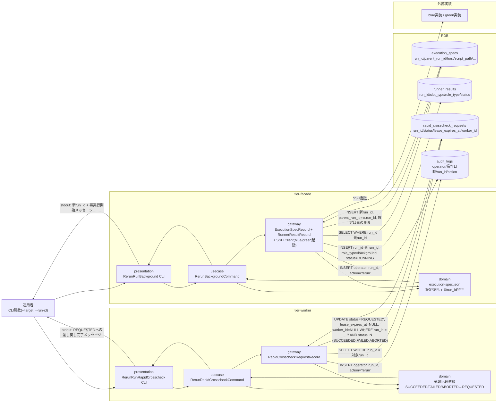
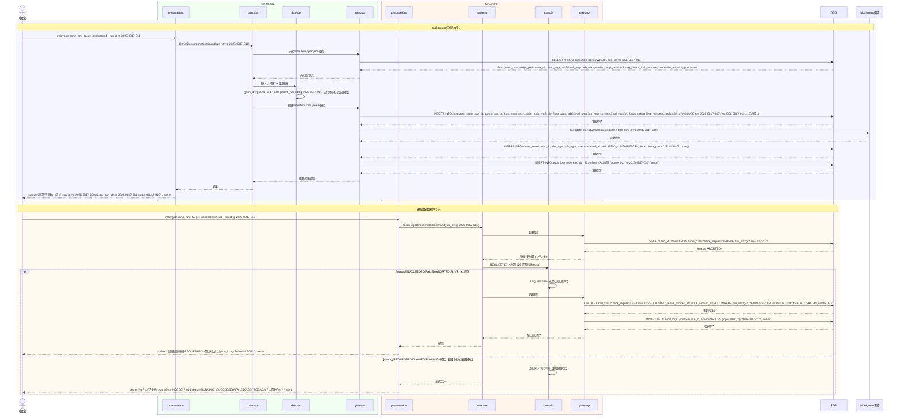

# execution-spec.jsonの実行設定を保ったまま再実行する

## 概要

前UC「再実行対象のbackground実行・速報比較依頼を選択する」で選定したbackground実行または速報比較依頼のrun_idを対象に、元のexecution-spec.jsonの実行設定を保ったまま再実行するUC。対象種別により処理が分岐する。(1) **background実行**の場合はtier-facadeが元のexecution-spec.jsonを取得し、実行設定（host/exec_user/script_path/work_dir/固定引数・追加引数/job_map_version/impl_version/hang_detect_limit_minutes/credential_ref）を保ったまま新しいrun_id（parent_run_id=元のrun_id）でblue/green実装のbackground roleを再起動する。(2) **速報比較依頼**の場合はtier-workerが対象の速報比較依頼を同一run_idのままREQUESTED状態へ差し戻し、workerによる再クレームを可能にする。いずれもRDBのlease/claim機構とrun_id/parent_run_idの相関により重複起動を検知・防止する（CTP-006冪等性方針）。

## データフロー



| レイヤー | データモデル | 変換内容 |
|---------|------------|---------|
| facade presentation | --target=background、--run-id（元run_id） | CLI引数解析 → RerunBackgroundCommand 変換 |
| facade domain | execution-spec.json（AG-001） | 元の実行設定を保持したまま新run_id（parent_run_id=元run_id）を発行。BLUE_MODE/GREEN_MODE同時foreground禁止は本UC対象外（background roleのみ再起動） |
| facade gateway | execution_specs への INSERT + runner_results への INSERT + SSH起動 | 新規run_idでのbackground role再起動 |
| worker presentation | --target=rapid-crosscheck、--run-id（対象run_id） | CLI引数解析 → RerunRapidCrosscheckCommand 変換 |
| worker domain | 速報比較依頼（AG-003） | SUCCEEDED/FAILED/ABORTED→REQUESTEDへの遷移制御。lease_expires_at/worker_idをクリアし再クレーム可能にする |
| worker gateway | rapid_crosscheck_requests への UPDATE | 同一run_idのままREQUESTEDへ差し戻し |

## 処理フロー



## バリエーション一覧

| バリエーション名 | 値 | 処理内容 | 適用 tier | 適用箇所 |
|----------------|---|---------|----------|---------|
| slot種別 | blue、green | リラン対象のexecution-spec.jsonに記録されたslot_typeをそのまま再起動先slotとして使用する | tier-facade | RerunBackgroundCommand |
| role区分 | background | リラン対象はrole_type='background'のRunner実行結果に限定する | tier-facade | RerunBackgroundCommand |
| クロスチェック種別 | 速報クロスチェック | リラン対象は速報比較依頼（rapid_crosscheck_requests）に限定する | tier-worker | RerunRapidCrosscheckCommand |

## 分岐条件一覧

| 条件名 | 判定ルール | 適用 tier | 適用箇所 | BDD Scenario |
|--------|----------|----------|---------|-------------|
| background実行リラン対象状態 | 元のRunner実行結果のstatusがSUCCEEDED/FAILED/ABORTEDのいずれかであることを前提とする（RUNNING中の対象は「再実行対象のbackground実行・速報比較依頼を選択する」UCの候補一覧で既に除外されている） | tier-facade | RerunBackgroundCommand | 元の実行設定を保ったまま新run_idで再実行する |
| 速報比較依頼リラン対象状態 | UPDATE時にWHERE句でstatus IN ('SUCCEEDED','FAILED','ABORTED')を条件とし、更新件数が0の場合は業務エラーとする（重複起動防止、lease/claim整合性保証） | tier-worker | RerunRapidCrosscheckCommand | REQUESTEDへ差し戻す / 処理中・処理待ちの対象はリランを拒否する |

## 計算ルール一覧

該当なし（本UCは元の実行設定の複製と状態遷移制御のみで計算ルールを持たない）

## 状態遷移一覧

| 状態モデル | 遷移元 | 遷移先 | トリガー | 事前条件 | 事後処理 | 適用 tier |
|-----------|--------|--------|---------|---------|---------|----------|
| background slot実行状態 | SUCCEEDED | RUNNING | execution-spec.jsonの実行設定を保ったまま再実行する | 元のexecution-spec.jsonが存在すること | 新run_id（parent_run_id=元run_id）でRunner実行結果を新規作成し、監査ログに記録する | tier-facade |
| background slot実行状態 | FAILED | RUNNING | execution-spec.jsonの実行設定を保ったまま再実行する | 元のexecution-spec.jsonが存在すること | 同上 | tier-facade |
| background slot実行状態 | ABORTED | RUNNING | execution-spec.jsonの実行設定を保ったまま再実行する | 元のexecution-spec.jsonが存在すること | 同上 | tier-facade |
| 速報比較依頼状態 | SUCCEEDED | REQUESTED | execution-spec.jsonの実行設定を保ったまま再実行する | UPDATE時点でstatus IN ('SUCCEEDED','FAILED','ABORTED') | lease_expires_at/worker_idをクリアし、監査ログに記録する | tier-worker |
| 速報比較依頼状態 | FAILED | REQUESTED | execution-spec.jsonの実行設定を保ったまま再実行する | 同上 | 同上 | tier-worker |
| 速報比較依頼状態 | ABORTED | REQUESTED | execution-spec.jsonの実行設定を保ったまま再実行する | 同上 | 同上 | tier-worker |

## 関連 RDRA モデル

| モデル種別 | 要素名 | 関連 |
|-----------|--------|------|
| 業務 | 実行制御業務 | このUCが属する業務 |
| BUC | background側リランフロー | このUCを含むBUC |
| アクター | 運用者 | 操作するアクター |
| 情報 | execution-spec.json | facadeが参照・複製する実行設定 |
| 情報 | Runner実行結果（started-at.txt/stdout.log/stderr.log/exitcode.txt） | facadeが新規作成する実行結果 |
| 情報 | 速報比較依頼 | workerが状態更新する情報 |
| 状態 | background slot実行状態 | SUCCEEDED/FAILED/ABORTED→RUNNINGの遷移 |
| 状態 | 速報比較依頼状態 | SUCCEEDED/FAILED/ABORTED→REQUESTEDの遷移 |
| 条件 | 該当なし | - |
| 外部システム | blue実装 | facadeがSSH経由で再起動するリラン実行イベントの宛先 |
| 外部システム | green実装 | 同上（green slotの場合） |

## E2E 完了条件（BDD）

### 正常系

```gherkin
Feature: execution-spec.jsonの実行設定を保ったまま再実行する

  Scenario: 完了済みのbackground実行を元の実行設定のまま再実行する
    Given execution-spec.json「rg-2026-0817-011」がhost="host-a"、script_path="/opt/blue/run.sh"、hang_detect_limit_minutes=30で保存されている
    And Runner実行結果「rg-2026-0817-011」がstatus=FAILEDである
    When 運用者「opuser01」が relaygate rerun run --target background --run-id rg-2026-0817-011 を実行する
    Then 新規run_id（parent_run_id=rg-2026-0817-011）でexecution-spec.jsonがhost="host-a"、script_path="/opt/blue/run.sh"、hang_detect_limit_minutes=30のまま複製される
    And 新規run_idのRunner実行結果がstatus=RUNNINGで作成される
    And 標準出力に "再実行を開始しました run_id=rg-2026-0817-030 parent_run_id=rg-2026-0817-011 status=RUNNING" が出力され、終了コード0で終了する

  Scenario: 中止済みの速報比較依頼をREQUESTEDへ差し戻す
    Given 速報比較依頼「rg-2026-0817-013」がstatus=ABORTEDである
    When 運用者「opuser01」が relaygate rerun run --target rapid-crosscheck --run-id rg-2026-0817-013 を実行する
    Then 速報比較依頼「rg-2026-0817-013」のstatusがREQUESTEDへ更新され、lease_expires_at・worker_idがクリアされる
    And 標準出力に "速報比較依頼をREQUESTEDへ差し戻しました run_id=rg-2026-0817-013" が出力され、終了コード0で終了する
```

### 異常系

```gherkin
  Scenario: RUNNING中の速報比較依頼はリランできない（重複起動防止）
    Given 速報比較依頼「rg-2026-0817-015」がstatus=RUNNINGである
    When 運用者「opuser01」が relaygate rerun run --target rapid-crosscheck --run-id rg-2026-0817-015 を実行する
    Then 標準エラーに "リランできません run_id=rg-2026-0817-015 status=RUNNING（SUCCEEDED/FAILED/ABORTEDのみリラン可能です）" が出力され、終了コード1で終了する

  Scenario: 元のexecution-spec.jsonが存在しない場合はエラーとする
    Given run_id="rg-not-exist"のexecution-spec.jsonが存在しない
    When 運用者「opuser01」が relaygate rerun run --target background --run-id rg-not-exist を実行する
    Then 標準エラーに "元のexecution-spec.jsonが見つかりません run_id=rg-not-exist" が出力され、終了コード1で終了する

  Scenario: --target/--run-id未指定でコマンドを実行する
    Given 運用者が--targetまたは--run-idを指定せずコマンドを実行しようとしている
    When 運用者「opuser01」が relaygate rerun run --run-id rg-2026-0817-011 を実行する（--target省略）
    Then 標準エラーに "--target は必須です（background または rapid-crosscheck を指定してください）" が出力され、終了コード2で終了する
```

## ティア別仕様

- [tier-facade仕様](tier-facade.md)
- [tier-worker仕様](tier-worker.md)

### 統合 API Spec

- [CLI コマンド契約](../../../_cross-cutting/api/cli-command-contract.yaml)（全 UC 統合。HTTP API は存在しないため OpenAPI ではなく CLI コマンド契約を正本とする）
