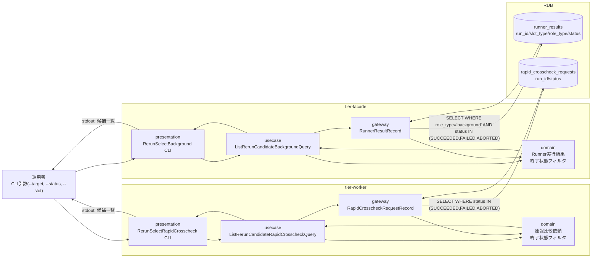
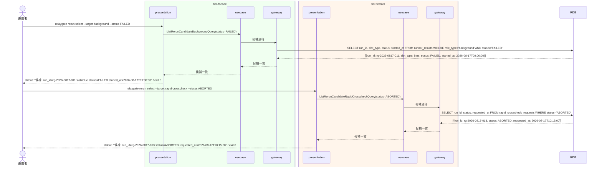

# 再実行対象のbackground実行・速報比較依頼を選択する

## 概要

完了済み（SUCCEEDED/FAILED）または中止済み（ABORTED）のbackground実行（Runner実行結果, E-002）および速報比較依頼（E-003）から、再実行対象を選択的に指定するUC。background実行はtier-facade（BC-001所属）、速報比較依頼はtier-worker（BC-002所属）がそれぞれの読み取りロジックを担当し、`--target`オプションで対象種別を切り替える単一のCLIコマンド `relaygate rerun select` として提供する。本UCは一覧提示のみを行い、状態遷移は発生させない。選定結果（対象run_id）は後続UC「execution-spec.jsonの実行設定を保ったまま再実行する」への入力となる。

## データフロー



| レイヤー | データモデル | 変換内容 |
|---------|------------|---------|
| facade presentation | --target=background、--status、--slotフィルタ | CLI引数解析 → ListRerunCandidateBackgroundQuery 変換 |
| facade gateway | runner_results への SELECT | role_type='background'かつ終了状態（SUCCEEDED/FAILED/ABORTED）の一覧取得 |
| worker presentation | --target=rapid-crosscheck、--statusフィルタ | CLI引数解析 → ListRerunCandidateRapidCrosscheckQuery 変換 |
| worker gateway | rapid_crosscheck_requests への SELECT | 終了状態（SUCCEEDED/FAILED/ABORTED）の一覧取得 |
| stdout | 候補一覧（run_id、slot/target種別、状態、完了日時） | 運用者が次UC「execution-spec.jsonの実行設定を保ったまま再実行する」で指定するrun_idの選定材料 |

## 処理フロー



## バリエーション一覧

| バリエーション名 | 値 | 処理内容 | 適用 tier | 適用箇所 |
|----------------|---|---------|----------|---------|
| slot種別 | blue、green | --slotフィルタでbackground実行候補をslot単位に絞り込む | tier-facade | ListRerunCandidateBackgroundQuery |
| role区分 | background | 候補抽出はrole_type='background'のRunner実行結果に限定する（foreground/rapid-crosscheck roleは対象外） | tier-facade | ListRerunCandidateBackgroundQuery |
| クロスチェック種別 | 速報クロスチェック | 候補抽出は速報比較依頼（rapid_crosscheck_requests）に限定する（確報比較依頼はbackground側リランフローの対象外） | tier-worker | ListRerunCandidateRapidCrosscheckQuery |

## 分岐条件一覧

| 条件名 | 判定ルール | 適用 tier | 適用箇所 | BDD Scenario |
|--------|----------|----------|---------|-------------|
| リラン対象選定可否（background実行） | status IN (SUCCEEDED, FAILED, ABORTED) のRunner実行結果（role_type='background'）のみ候補として提示する。RUNNING状態は候補から除外する | tier-facade | ListRerunCandidateBackgroundQuery | 完了済み・中止済みのbackground実行を候補として提示する |
| リラン対象選定可否（速報比較依頼） | status IN (SUCCEEDED, FAILED, ABORTED) の速報比較依頼のみ候補として提示する。REQUESTED/CLAIMED/RUNNING状態は候補から除外する（重複起動防止） | tier-worker | ListRerunCandidateRapidCrosscheckQuery | 完了済み・中止済みの速報比較依頼を候補として提示する |

## 計算ルール一覧

該当なし（本UCは一覧抽出のみで計算ルールを持たない）

## 状態遷移一覧

該当なし（本UCは状態遷移を発生させない。一覧提示のみ）

## 関連 RDRA モデル

| モデル種別 | 要素名 | 関連 |
|-----------|--------|------|
| 業務 | 実行制御業務 | このUCが属する業務 |
| BUC | background側リランフロー | このUCを含むBUC |
| アクター | 運用者 | 操作するアクター |
| 情報 | Runner実行結果（started-at.txt/stdout.log/stderr.log/exitcode.txt） | facade側で参照する候補情報 |
| 情報 | 速報比較依頼 | worker側で参照する候補情報 |
| 状態 | background slot実行状態 | 候補フィルタ対象の状態モデル |
| 状態 | 速報比較依頼状態 | 候補フィルタ対象の状態モデル |
| 条件 | 該当なし | - |
| 外部システム | 該当なし | - |

## E2E 完了条件（BDD）

### 正常系

```gherkin
Feature: 再実行対象のbackground実行・速報比較依頼を選択する

  Scenario: 完了済みのbackground実行を候補として提示する
    Given Runner実行結果「rg-2026-0817-011」がslot=blue、role_type=background、status=FAILEDである
    When 運用者「opuser01」が relaygate rerun select --target background --status FAILED を実行する
    Then 標準出力に "候補: run_id=rg-2026-0817-011 slot=blue status=FAILED" が出力され、終了コード0で終了する

  Scenario: 中止済みの速報比較依頼を候補として提示する
    Given 速報比較依頼「rg-2026-0817-013」がstatus=ABORTEDである
    When 運用者「opuser01」が relaygate rerun select --target rapid-crosscheck --status ABORTED を実行する
    Then 標準出力に "候補: run_id=rg-2026-0817-013 status=ABORTED" が出力され、終了コード0で終了する
```

### 異常系

```gherkin
  Scenario: 候補が0件の場合はその旨を出力する
    Given status=FAILEDのbackground実行のRunner実行結果が存在しない
    When 運用者「opuser01」が relaygate rerun select --target background --status FAILED を実行する
    Then 標準出力に "該当するリラン候補はありません" が出力され、終了コード0で終了する

  Scenario: --target未指定でコマンドを実行する
    Given 運用者が--targetを指定せずコマンドを実行しようとしている
    When 運用者「opuser01」が relaygate rerun select --status FAILED を実行する
    Then 標準エラーに "--target は必須です（background または rapid-crosscheck を指定してください）" が出力され、終了コード2で終了する
```

## ティア別仕様

- [tier-facade仕様](tier-facade.md)
- [tier-worker仕様](tier-worker.md)

### 統合 API Spec

- [CLI コマンド契約](../../../_cross-cutting/api/cli-command-contract.yaml)（全 UC 統合。HTTP API は存在しないため OpenAPI ではなく CLI コマンド契約を正本とする）
