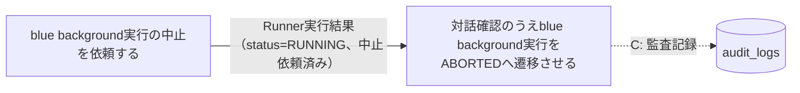
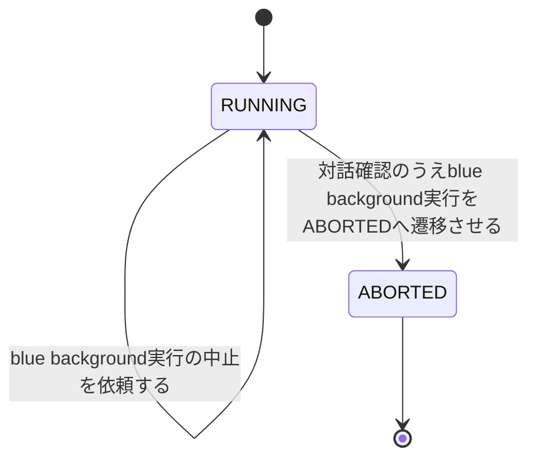

# blue中止フロー

## 概要

停止確認済みのblue background実行について、運用者が中止を発意して中止依頼を発行し、対話確認（y/n二択、取消不可の明示）により実プロセスの停止を確認したうえでblue background slot実行状態を明示的にABORTEDへ遷移させる。

## 所属 UC 一覧

| UC名 | アクター | 主な操作 | 関連情報 |
|------|---------|---------|---------|
| [blue background実行の中止を依頼する](blue background実行の中止を依頼する/spec.md) | 運用者 | RUNNING中のblue background実行に中止依頼を発行し、blue実装へ中止依頼イベントを送出 | Runner実行結果 |
| [対話確認のうえblue background実行をABORTEDへ遷移させる](対話確認のうえblue background実行をABORTEDへ遷移させる/spec.md) | 運用者 | 対話確認（y/n）により実プロセス停止を確認し、状態をABORTEDへ更新・監査ログ記録・中止指示イベント送出 | Runner実行結果、audit_logs |

## UC 横断データフロー

中止依頼UCが対象run_idの妥当性（status=RUNNING）を判定してblue実装へ中止依頼イベントを送出し、後続の対話確認UCがその依頼を前提に対話確認を経てRunner実行結果をABORTEDへ更新するとともに、audit_logsへ監査記録する（監査対象はCTP-005に従い対話確認を経たABORTED遷移UCのみに限定する。中止依頼UC自体はaudit_logsへの記録を行わない）。

### データフロー図

### 情報 CRUD マトリクス

| 情報名 | blue background実行の中止を依頼する | 対話確認のうえblue background実行をABORTEDへ遷移させる |
|--------|:-------:|:-------:|
| Runner実行結果（started-at.txt/stdout.log/stderr.log/exitcode.txt） | R | U |
| audit_logs | | C |

## 状態遷移全体図

### 状態遷移 UC マッピング

| 状態モデル | 遷移元 | 遷移先 | 担当 UC |
|-----------|--------|--------|--------|
| background slot実行状態 | RUNNING | RUNNING（状態は変化しない、中止依頼のみ） | [blue background実行の中止を依頼する](blue background実行の中止を依頼する/spec.md) |
| background slot実行状態 | RUNNING | ABORTED | [対話確認のうえblue background実行をABORTEDへ遷移させる](対話確認のうえblue background実行をABORTEDへ遷移させる/spec.md) |

## BUC 内共有条件一覧

該当なし（両UCとも「分岐条件一覧」はRDRA条件.tsvに定義された業務条件には該当せず、状態モデルの前提条件・CLI操作フロー制御として個別UC Spec側に記載されている）。

## BUC 内共有バリエーション一覧

| バリエーション名 | 値 | 適用 UC |
|----------------|---|--------|
| slot種別 | blue、green | blue background実行の中止を依頼する、対話確認のうえblue background実行をABORTEDへ遷移させる（いずれもslot_type='blue'に限定するフィルタ条件として適用） |
