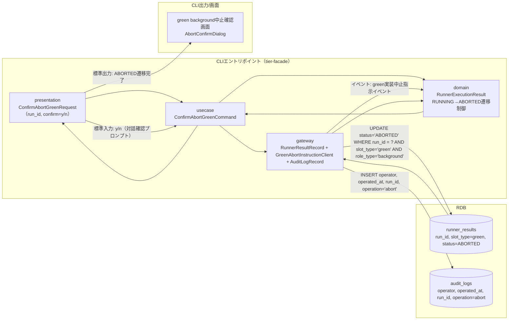
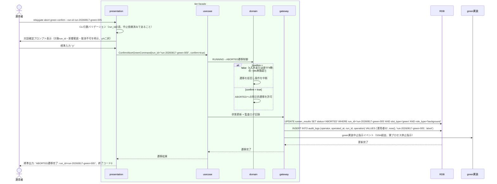

# 対話確認のうえgreen background実行をABORTEDへ遷移させる

## 概要

運用者が、中止依頼済みのgreen background実行について、対話確認（対象・影響範囲・取消不可の明示、y/nの二択）により実プロセスの停止を確認したうえで、green background slot実行状態を明示的にABORTEDへ遷移させる。

## データフロー



| レイヤー | データモデル | 変換内容 |
|---------|------------|---------|
| CLI presentation | ConfirmAbortGreenRequest(run_id, confirm) | 対話確認プロンプト（y/n）の標準入力受付、CLI引数解析 |
| CLI usecase | ConfirmAbortGreenCommand | 対話確認結果によるABORTED遷移フロー制御、監査ログ記録 |
| CLI gateway | runner_resultsへのUPDATE + audit_logsへのINSERT + green実装中止指示イベント送出 | 状態遷移の永続化、監査ログ記録、green実装への中止指示 |
| Response | ABORTED遷移完了結果 | 実行系譜の追跡対象として確定する |

## 処理フロー



## バリエーション一覧

| バリエーション名 | 値 | 処理内容 | 適用 tier | 適用箇所 |
|----------------|---|---------|----------|---------|
| slot種別 | blue、green | 本UCはslot_type='green'のみを対象とする（blue側は別UC） | tier-facade | ABORTED遷移対象のフィルタ条件 |

## 分岐条件一覧

該当なし（対話確認結果（y/n）による分岐は業務条件ではなくCLI操作フロー制御であり、次節「状態遷移一覧」のトリガー・事前条件として記載する）。

## 計算ルール一覧

該当なし。

## 状態遷移一覧

| 状態モデル | 遷移元 | 遷移先 | トリガー | 事前条件 | 事後処理 | 適用 tier |
|-----------|--------|--------|---------|---------|---------|----------|
| background slot実行状態 | RUNNING | ABORTED | 対話確認のうえgreen background実行をABORTEDへ遷移させる | 中止依頼済み（UC「green background実行の中止を依頼する」完了済み）かつ対話確認でy応答を得ていること | green実装への中止指示イベント送出、操作者・操作日時・対象run_idを含む監査ログ記録 | tier-facade |

## 関連 RDRA モデル

| モデル種別 | 要素名 | 関連 |
|-----------|--------|------|
| 業務 | 実行制御業務 | このUCが属する業務 |
| BUC | green中止フロー | このUCを含むBUC |
| アクター | 運用者 | 操作するアクター |
| 情報 | Runner実行結果（started-at.txt/stdout.log/stderr.log/exitcode.txt） | 更新する情報 |
| 状態 | background slot実行状態 | RUNNING→ABORTEDへ遷移させる |
| 条件 | なし | - |
| 外部システム | green実装 | 連携する外部システム（中止指示イベント送出先） |

## E2E 完了条件（BDD）

### 正常系

```gherkin
Feature: 対話確認のうえgreen background実行をABORTEDへ遷移させる

  Scenario: 対話確認でyを応答しABORTEDへ遷移する
    Given run_id "run-20260817-green-005" が中止依頼済みでstatus "RUNNING" である
    When 運用者が `relaygate abort green confirm --run-id run-20260817-green-005` を実行し対話確認で "y" と応答する
    Then 終了コード 0 で終了する
    And runner_resultsのrun_id "run-20260817-green-005" のstatusが "ABORTED" に更新される
    And audit_logsに operator・operated_at・run_id "run-20260817-green-005"・operation "abort" を含む監査ログが記録される
    And 標準出力に "ABORTED遷移完了: run_id=run-20260817-green-005" が出力される
```

### 異常系

```gherkin
  Scenario: 対話確認でnを応答し遷移を中断する
    Given run_id "run-20260817-green-005" が中止依頼済みでstatus "RUNNING" である
    When 運用者が `relaygate abort green confirm --run-id run-20260817-green-005` を実行し対話確認で "n" と応答する
    Then 終了コード 1 で終了する
    And runner_resultsのrun_id "run-20260817-green-005" のstatusは "RUNNING" のまま変化しない
    And 標準エラーに "中止操作を取り消しました: run_id=run-20260817-green-005" が出力される

  Scenario: 非TTY環境で--yesフラグ未指定のためエラー終了する
    Given run_id "run-20260817-green-008" が中止依頼済みでstatus "RUNNING" である
    And 非TTY（バッチ実行）環境である
    When 運用者が `relaygate abort green confirm --run-id run-20260817-green-008` を対話確認プロンプトなしで実行する
    Then 終了コード 2 で終了する
    And 標準エラーに "対話確認が必要です。非TTY環境では --yes フラグを指定してください" が出力される
```

## ティア別仕様

- [tier-facade](tier-facade.md)

### 統合 API Spec

- [CLI コマンド契約](../../_cross-cutting/api/cli-command-contract.yaml)（全 UC 統合、CLI/ファイル/DB契約の正本）
