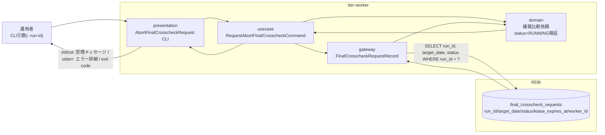
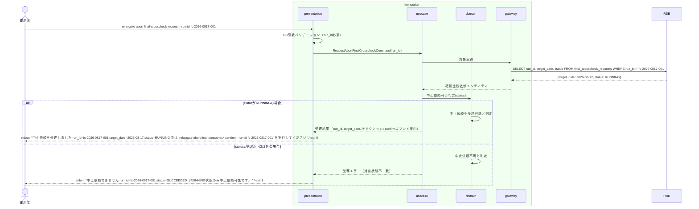

# RUNNING中の確報比較依頼の中止を依頼する

## 概要

RUNNING中の確報比較依頼（E-005, AG-004）について、運用者が中止を発意するUC。確報クロスチェックは全テーブル・全ファイルを対象とする日次バッチであり、リリース判断の正本となるため、中止は慎重な二段階（依頼→対話確認）で行う。本UC自体は状態遷移を発生させず、対象がRUNNING状態であることを検証し中止依頼を受理する。実際のABORTEDへの遷移は後続UC「対話確認のうえ確報比較依頼をABORTEDへ遷移させる」が担う。

## データフロー



| レイヤー | データモデル | 変換内容 |
|---------|------------|---------|
| CLI presentation | run_id（コマンド引数） | CLI引数解析 + バリデーション（run_id必須） → RequestAbortFinalCrosscheckCommand 変換 |
| usecase | RequestAbortFinalCrosscheckCommand | 確報比較依頼のstatus参照 → RUNNING以外なら業務エラー |
| domain | 確報比較依頼（AG-004） | RUNNING状態のみ中止依頼可能というルールの適用（状態遷移は起こさない） |
| gateway | final_crosscheck_requests への SELECT | 対象確認 |
| stdout/stderr | 受理メッセージ／エラーメッセージ | 運用者への次アクション（対話確認コマンド）の提示 |

## 処理フロー



## バリエーション一覧

| バリエーション名 | 値 | 処理内容 | 適用 tier | 適用箇所 |
|----------------|---|---------|----------|---------|
| クロスチェック種別 | 確報クロスチェック | 対象は確報比較依頼（final_crosscheck_requests）に限定する。速報比較依頼は対象外 | tier-worker | RequestAbortFinalCrosscheckCommand |

## 分岐条件一覧

| 条件名 | 判定ルール | 適用 tier | 適用箇所 | BDD Scenario |
|--------|----------|----------|---------|-------------|
| 確報比較依頼状態 | 対象の確報比較依頼.statusがRUNNINGの場合のみ中止依頼を受理する。REQUESTED/CLAIMED/SUCCEEDED/FAILED/ABORTEDの場合は業務エラー（exit 1）とする | tier-worker | RequestAbortFinalCrosscheckCommand | 中止依頼を受理する / RUNNING以外の状態では中止依頼を拒否する |

## 計算ルール一覧

該当なし（本UCは状態参照とバリデーションのみで計算ルールを持たない）

## 状態遷移一覧

| 状態モデル | 遷移元 | 遷移先 | トリガー | 事前条件 | 事後処理 | 適用 tier |
|-----------|--------|--------|---------|---------|---------|----------|
| 確報比較依頼状態 | - | - | 本UCでは状態遷移を発生させない（RUNNING状態の確認のみ） | statusがRUNNING | - | tier-worker |

## 関連 RDRA モデル

| モデル種別 | 要素名 | 関連 |
|-----------|--------|------|
| 業務 | 実行制御業務 | このUCが属する業務 |
| BUC | 確報比較中止フロー | このUCを含むBUC |
| アクター | 運用者 | 操作するアクター |
| 情報 | 確報比較依頼 | 参照する情報（run_id、対象日、状態、lease期限、worker識別子、対象テーブル・対象ファイル） |
| 状態 | 確報比較依頼状態 | RUNNING状態であることを確認する対象 |
| 条件 | 該当なし | - |
| 外部システム | 該当なし | - |

## E2E 完了条件（BDD）

### 正常系

```gherkin
Feature: RUNNING中の確報比較依頼の中止を依頼する

  Scenario: RUNNING中の確報比較依頼の中止を依頼する
    Given 確報比較依頼「fc-2026-0817-001」がtarget_date=2026-08-17、status=RUNNINGでworker「worker-05」により処理中である
    When 運用者「opuser01」が relaygate abort final-crosscheck request --run-id fc-2026-0817-001 を実行する
    Then 標準出力に "中止依頼を受理しました run_id=fc-2026-0817-001 target_date=2026-08-17 status=RUNNING" が出力され、終了コード0で終了する
```

### 異常系

```gherkin
  Scenario: RUNNING以外の状態では中止依頼を拒否する
    Given 確報比較依頼「fc-2026-0816-001」がstatus=SUCCEEDEDで完了済みである
    When 運用者「opuser01」が relaygate abort final-crosscheck request --run-id fc-2026-0816-001 を実行する
    Then 標準エラーに "中止依頼できません run_id=fc-2026-0816-001 status=SUCCEEDED（RUNNING状態のみ中止依頼可能です）" が出力され、終了コード1で終了する

  Scenario: 対象run_idが存在しない
    Given 確報比較依頼テーブルに run_id="fc-not-exist" のレコードが存在しない
    When 運用者「opuser01」が relaygate abort final-crosscheck request --run-id fc-not-exist を実行する
    Then 標準エラーに "対象の確報比較依頼が見つかりません run_id=fc-not-exist" が出力され、終了コード1で終了する

  Scenario: run_id未指定でコマンドを実行する
    Given 運用者がrun_idを指定せずコマンドを実行しようとしている
    When 運用者「opuser01」が relaygate abort final-crosscheck request を実行する
    Then 標準エラーに "run_id は必須です" が出力され、終了コード2で終了する
```

## ティア別仕様

- [tier-worker仕様](tier-worker.md)

### 統合 API Spec

- [CLI コマンド契約](../../../_cross-cutting/api/cli-command-contract.yaml)（全 UC 統合。HTTP API は存在しないため OpenAPI ではなく CLI コマンド契約を正本とする）
