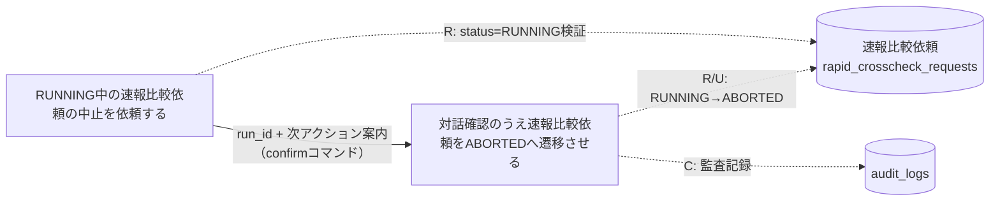
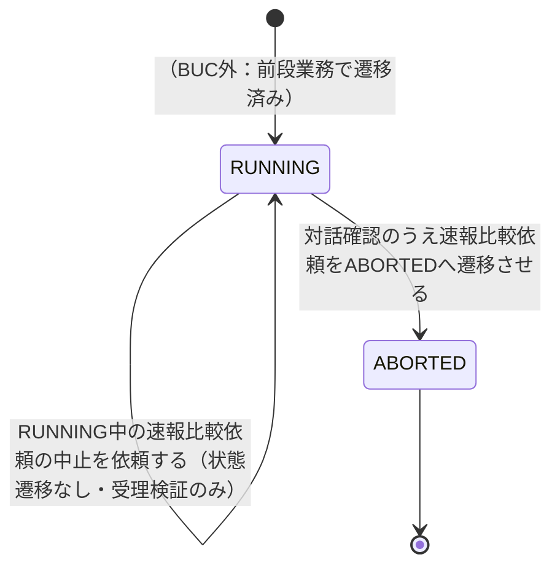

# 速報比較中止フロー

## 概要

RUNNING中の速報比較依頼（E-003, AG-003）を、運用者が「依頼」→「対話確認」の二段階でABORTED状態へ明示的に遷移させるBUC。誤操作防止のため対話確認を必須とし、確認結果に応じて実際の状態遷移とaudit_logsへの監査記録は後段UCのみが行う。

## 所属 UC 一覧

| UC名 | アクター | 主な操作 | 関連情報 |
|------|---------|---------|---------|
| [RUNNING中の速報比較依頼の中止を依頼する](RUNNING中の速報比較依頼の中止を依頼する/spec.md) | 運用者 | RUNNING中の速報比較依頼について中止を発意し、中止依頼可能な状態（RUNNING）であることを検証・受理する（状態遷移は発生させない） | 速報比較依頼 |
| [対話確認のうえ速報比較依頼をABORTEDへ遷移させる](対話確認のうえ速報比較依頼をABORTEDへ遷移させる/spec.md) | 運用者 | 対話確認（y/n、非TTY時は--yes必須）を経てRUNNING→ABORTEDへ明示的に遷移させ、audit_logsへ監査記録する | 速報比較依頼、audit_logs |

## UC 横断データフロー

前UCが受理した中止依頼（run_id・状態確認結果）を運用者が引き継ぎ、後UCの対話確認コマンドへ入力する。DB上は同一の速報比較依頼レコード（rapid_crosscheck_requests）を両UCが参照し、状態の更新（RUNNING→ABORTED）とaudit_logsへの記録は後UCのみが行う。

### データフロー図

### 情報 CRUD マトリクス

| 情報名 | RUNNING中の速報比較依頼の中止を依頼する | 対話確認のうえ速報比較依頼をABORTEDへ遷移させる |
|--------|:-----------------------:|:--------------------------------------------:|
| 速報比較依頼（rapid_crosscheck_requests） | R | R, U |
| audit_logs | | C |

## 状態遷移全体図

### 状態遷移 UC マッピング

| 状態モデル | 遷移元 | 遷移先 | 担当 UC |
|-----------|--------|--------|--------|
| 速報比較依頼状態 | - | - | [RUNNING中の速報比較依頼の中止を依頼する](RUNNING中の速報比較依頼の中止を依頼する/spec.md)（状態遷移は発生させず、RUNNING状態の確認のみ行う） |
| 速報比較依頼状態 | RUNNING | ABORTED | [対話確認のうえ速報比較依頼をABORTEDへ遷移させる](対話確認のうえ速報比較依頼をABORTEDへ遷移させる/spec.md) |

## BUC 内共有条件一覧

| 条件名 | 条件の説明 | 適用 UC |
|--------|----------|--------|
| 速報比較依頼状態 | 対象の速報比較依頼.statusがRUNNINGであることを判定基盤とする条件。「依頼」UCでは受理可否の検証に、「対話確認」UCではUPDATE時のWHERE句条件（更新件数0=競合検知）に、それぞれ適用される | RUNNING中の速報比較依頼の中止を依頼する, 対話確認のうえ速報比較依頼をABORTEDへ遷移させる |

## BUC 内共有バリエーション一覧

| バリエーション名 | 値 | 適用 UC |
|----------------|---|--------|
| クロスチェック種別 | 速報クロスチェック | RUNNING中の速報比較依頼の中止を依頼する, 対話確認のうえ速報比較依頼をABORTEDへ遷移させる |
