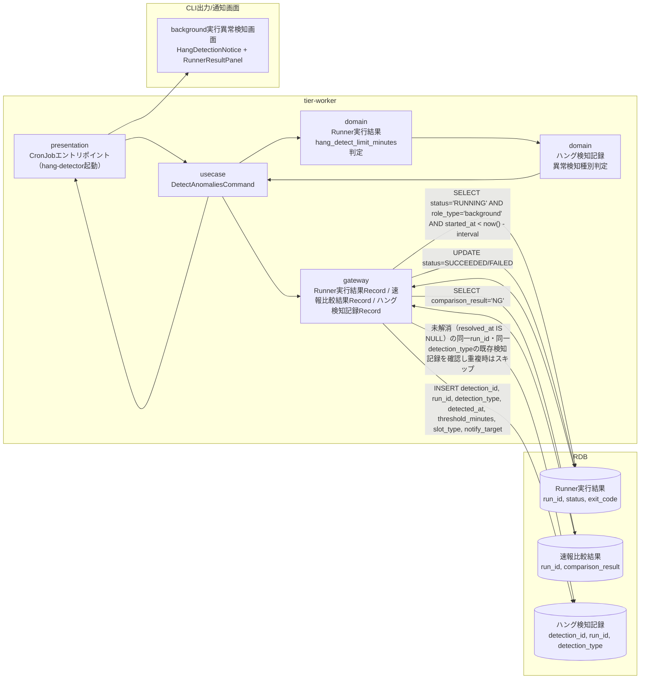
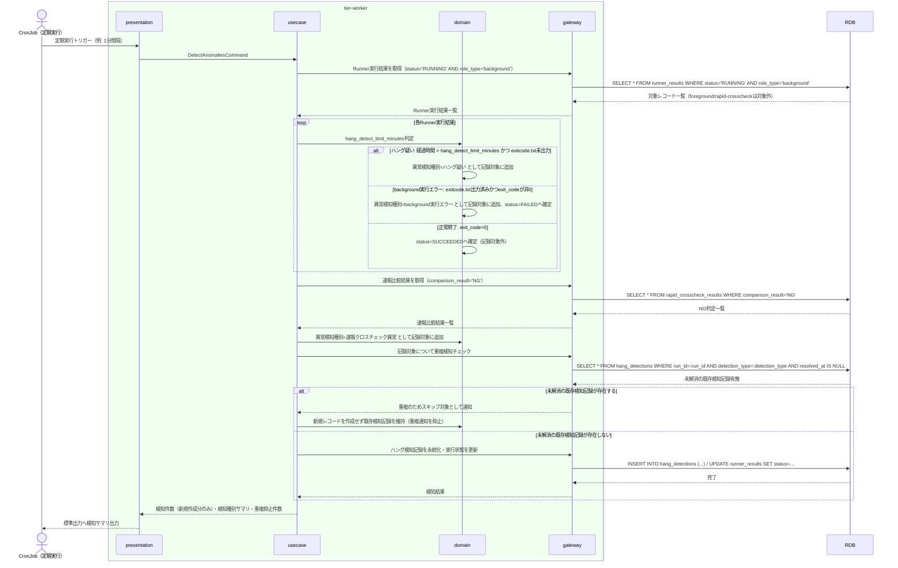

# background実行の未完了・非0終了・速報比較異常を定期検知する

## 概要

hang-detector が定期実行（CronJob）で起動し、Runner実行結果（E-002）の started-at.txt からの経過時間と hang_detect_limit_minutes しきい値を比較してハング疑いを検知し、exitcode.txt の非0終了コードから background実行エラーを検知し、速報比較結果（E-004）の NG 判定から速報クロスチェック異常を検知する。検知結果はハング検知記録（E-006）として記録し、あわせて background slot実行状態を RUNNING から SUCCEEDED/FAILED へ確定する。

## データフロー



| レイヤー | データモデル | 変換内容 |
|---------|------------|---------|
| WK presentation | CronJobトリガー（定期実行間隔） | スケジュール起動 → DetectAnomaliesCommand 生成 |
| WK usecase | DetectAnomaliesCommand | Runner実行結果（role_type='background'限定）・速報比較結果の走査、ハング判定・異常判定の集約 |
| WK domain | Runner実行結果, ハング検知記録 | started_at からの経過時間としきい値比較、exit_code の非0判定、NG判定の集約、同一run_id・同一detection_typeの未解消検知記録の重複排除 |
| WK gateway | ハング検知記録 INSERT, Runner実行結果 UPDATE | 未解消の重複検知記録が存在しない場合のみ検知結果を永続化、実行状態の確定（SUCCEEDED/FAILED） |
| CLI出力 | background実行異常検知画面表示 | HangDetectionNotice + RunnerResultPanel の表示更新 |

## 処理フロー



## バリエーション一覧

| バリエーション名 | 値 | 処理内容 | 適用 tier | 適用箇所 |
|----------------|---|---------|----------|---------|
| 異常検知種別 | ハング疑い、background実行エラー、速報クロスチェック異常 | 検知ロジックの分岐先とハング検知記録の detection_type を決定する | tier-worker | usecase「DetectAnomaliesCommand」、domain「ハング検知記録」 |
| slot種別 | blue、green | ハング検知記録の対象slot種別として記録し、通知先の識別に用いる | tier-worker | domain「ハング検知記録」 |
| role区分 | foreground、background、rapid-crosscheck | 本UCの走査対象をrole_type='background'のRunner実行結果に限定する（foreground/rapid-crosscheckのRUNNING行は検知対象外） | tier-worker | gateway「Runner実行結果Record」 |

## 分岐条件一覧

| 条件名 | 判定ルール | 適用 tier | 適用箇所 | BDD Scenario |
|--------|----------|----------|---------|-------------|
| hang_detect_limit_minutes | background roleごとに設定された未完了許容の経過時間しきい値（分）。started-at.txtからの経過時間がこの値を超過し、かつexitcode.txtが未出力の場合にハング疑いとして検知する | tier-worker | usecase「DetectAnomaliesCommand」、domain「Runner実行結果」 | ハング疑いを検知する |
| role_type='background'限定 | Runner実行結果のRUNNING行走査はrole_type='background'に限定する。foreground/rapid-crosscheckのRUNNING行は本UCの検知対象としない | tier-worker | usecase「DetectAnomaliesCommand」、gateway「Runner実行結果Record」 | role_type='background'以外のRUNNING行を検知対象から除外する |
| 重複検知抑止 | 同一run_id・同一detection_typeについて、未解消（resolved_at IS NULL）の既存ハング検知記録が存在する場合は新規レコードを作成せず重複通知を抑止する | tier-worker | domain「ハング検知記録」、gateway「ハング検知記録Record」 | 継続するハング疑いについて重複した検知記録を作成しない |

## 計算ルール一覧

| 計算名 | 入力情報 | 計算式/ロジック | 出力情報 | 適用 tier |
|--------|---------|---------------|---------|----------|
| ハング疑い判定 | started_at, hang_detect_limit_minutes, 現在時刻 | (現在時刻 - started_at) > hang_detect_limit_minutes分 かつ exitcode.txt未出力 | 異常検知種別=ハング疑い | tier-worker |
| background実行エラー判定 | exit_code | exitcode.txt出力済み かつ exit_code != 0 | 異常検知種別=background実行エラー, status=FAILED | tier-worker |
| 速報クロスチェック異常判定 | comparison_result | comparison_result = 'NG' | 異常検知種別=速報クロスチェック異常 | tier-worker |

## 状態遷移一覧

| 状態モデル | 遷移元 | 遷移先 | トリガー | 事前条件 | 事後処理 | 適用 tier |
|-----------|--------|--------|---------|---------|---------|----------|
| background slot実行状態 | RUNNING | SUCCEEDED | background実行の未完了・非0終了・速報比較異常を定期検知する | hang-detectorがexitcode.txtの終了コード0を検知 | foreground結果応答・完了通知・障害調査用の実行結果として確定 | tier-worker |
| background slot実行状態 | RUNNING | FAILED | background実行の未完了・非0終了・速報比較異常を定期検知する | hang-detectorがexitcode.txtの非0終了コードを検知 | ハング監視での検知対象として異常終了を確定、ハング検知記録を作成 | tier-worker |

## 関連 RDRA モデル

| モデル種別 | 要素名 | 関連 |
|-----------|--------|------|
| 業務 | 実行監視業務 | このUCが属する業務 |
| BUC | ハング監視フロー | このUCを含むBUC |
| アクター | 移行運用責任者 | 定期検知・運用者への通知を主担当するアクター |
| 情報 | ハング検知記録 | このUCが新規作成する情報 |
| 情報 | Runner実行結果（started-at.txt/stdout.log/stderr.log/exitcode.txt） | 検知対象として参照・状態更新する情報 |
| 情報 | 速報比較結果 | NG判定を参照する情報 |
| 状態 | background slot実行状態 | RUNNING→SUCCEEDED/FAILEDの遷移を確定する |
| 条件 | hang_detect_limit_minutes | ハング疑い判定のしきい値条件 |
| 条件 | role区分（role_type） | RUNNING行走査をbackgroundに限定する条件 |

## E2E 完了条件（BDD）

### 正常系

```gherkin
Feature: background実行の未完了・非0終了・速報比較異常を定期検知する

  Scenario: exitcode.txt未出力かつしきい値超過でハング疑いを検知する
    Given run_id "run-20260817-010" のRunner実行結果がslot種別"blue"、role区分"background"、status"RUNNING"、started_at"2026-08-17T09:00:00+09:00"で存在する
    And execution-spec.jsonのhang_detect_limit_minutesが30である
    And 現在時刻が"2026-08-17T09:35:00+09:00"であり、exitcode.txtが未出力である
    When hang-detectorが定期実行トリガー（1分間隔）で起動する
    Then detection_id "det-20260817-001" のハング検知記録がdetection_type"ハング疑い"、run_id"run-20260817-010"、threshold_minutes 30、slot_type"blue"で作成される

  Scenario: role_type='background'以外のRUNNING行を検知対象から除外する
    Given run_id "run-20260817-014" のRunner実行結果がrole区分"foreground"、status"RUNNING"、started_at"2026-08-17T09:00:00+09:00"で存在する
    And run_id "run-20260817-015" のRunner実行結果がrole区分"rapid-crosscheck"、status"RUNNING"、started_at"2026-08-17T09:00:00+09:00"で存在する
    And 現在時刻が"2026-08-17T09:35:00+09:00"であり、いずれもexitcode.txtが未出力である
    When hang-detectorが定期実行トリガーで起動する
    Then run_id "run-20260817-014" および "run-20260817-015" はSELECT対象（role_type='background'）に含まれず、ハング検知記録は作成されない

  Scenario: exitcode.txtの終了コード0を検知し正常終了として確定する
    Given run_id "run-20260817-011" のRunner実行結果がstatus"RUNNING"で存在する
    And exitcode.txtに"0"が出力されている
    When hang-detectorが定期実行トリガーで起動する
    Then run_id "run-20260817-011" のRunner実行結果のstatusが"SUCCEEDED"へ更新される
    And ハング検知記録は作成されない

  Scenario: 速報比較結果NGを速報クロスチェック異常として検知する
    Given run_id "run-20260817-012" の速報比較結果がcomparison_result"NG"、diff_count 3で存在する
    When hang-detectorが定期実行トリガーで起動する
    Then detection_id "det-20260817-002" のハング検知記録がdetection_type"速報クロスチェック異常"、run_id"run-20260817-012"で作成される
```

### 異常系

```gherkin
  Scenario: exitcode.txtの非0終了コードをbackground実行エラーとして検知する
    Given run_id "run-20260817-013" のRunner実行結果がstatus"RUNNING"で存在する
    And exitcode.txtに"1"が出力されている
    When hang-detectorが定期実行トリガーで起動する
    Then run_id "run-20260817-013" のRunner実行結果のstatusが"FAILED"へ更新される
    And detection_id "det-20260817-003" のハング検知記録がdetection_type"background実行エラー"で作成される

  Scenario: 継続するハング疑いについて重複した検知記録を作成しない
    Given run_id "run-20260817-016" のRunner実行結果がstatus"RUNNING"で存在し、しきい値超過が継続している
    And run_id "run-20260817-016" detection_type"ハング疑い"のハング検知記録がdetection_id"det-20260817-004"で既に存在し、resolved_atが未設定（未解消）である
    When hang-detectorが定期実行トリガー（1分間隔）で再度起動する
    Then run_id "run-20260817-016" detection_type"ハング疑い"の新規ハング検知記録は作成されず、既存のdetection_id"det-20260817-004"のみが維持される

  Scenario: 速報比較結果NGが継続する場合も重複した検知記録を作成しない
    Given run_id "run-20260817-017" の速報比較結果がcomparison_result"NG"で存在する
    And run_id "run-20260817-017" detection_type"速報クロスチェック異常"のハング検知記録がdetection_id"det-20260817-005"で既に存在し、resolved_atが未設定（未解消）である
    When hang-detectorが定期実行トリガーで再度起動し、同一run_idのcomparison_result"NG"を再取得する
    Then run_id "run-20260817-017" detection_type"速報クロスチェック異常"の新規ハング検知記録は作成されず、既存のdetection_id"det-20260817-005"のみが維持される

  Scenario: RDB接続断でハング検知処理が中断する
    Given hang-detectorが定期実行トリガーで起動している
    When RunnerResultAdapterへのSELECTがRDB接続断で失敗する
    Then usecaseはgatewayからの技術例外を1回だけログ出力し、当該実行サイクルを終了コード1で終了する
```

## ティア別仕様

- [tier-worker（バックエンドワーカーティア）](tier-worker.md)
