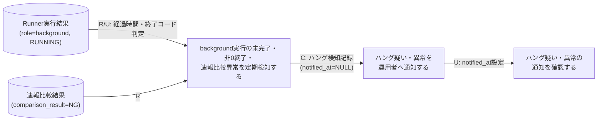
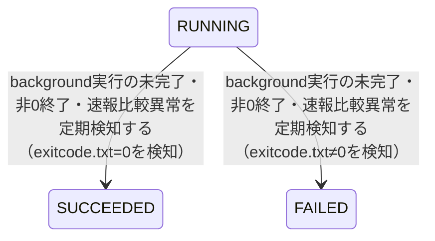

# ハング監視フロー

## 概要

hang-detectorが定期実行（CronJob）でbackground実行の未完了（ハング疑い）・非0終了（background実行エラー）・速報クロスチェック異常（NG判定）を検知しハング検知記録として記録・background slot実行状態を確定したうえで、移行運用責任者から運用者へ通知し、運用者が通知内容を確認して対応要否を判断する一連の流れを扱うBUC。

## 所属 UC 一覧

| UC名 | アクター | 主な操作 | 関連情報 |
|------|---------|---------|---------|
| [background実行の未完了・非0終了・速報比較異常を定期検知する](background実行の未完了・非0終了・速報比較異常を定期検知する/spec.md) | 移行運用責任者（トリガーはCronJob） | Runner実行結果（role=background）の経過時間・終了コード、速報比較結果のNG判定から異常を検知し、ハング検知記録を作成しbackground slot実行状態をSUCCEEDED/FAILEDへ確定する | Runner実行結果, 速報比較結果, ハング検知記録 |
| [ハング疑い・異常を運用者へ通知する](ハング疑い・異常を運用者へ通知する/spec.md) | 移行運用責任者（通知先は運用者） | notified_at未設定のハング検知記録を対象にbanner/emailで通知し、notified_atを更新する | ハング検知記録 |
| [ハング疑い・異常の通知を確認する](ハング疑い・異常の通知を確認する/spec.md) | 運用者 | 通知済み（notified_at設定済み）のハング検知記録を検知日時降順、または対象run_id指定で確認する | ハング検知記録 |

## UC 横断データフロー

検知UCはRunner実行結果と速報比較結果を参照してハング検知記録を新規作成し、あわせてRunner実行結果（background slot実行状態）をSUCCEEDED/FAILEDへ更新する。通知UCは未通知（notified_at IS NULL）のハング検知記録を取得して運用者へ通知しnotified_atを更新する。確認UCは通知済み（notified_at設定済み）のハング検知記録のみを参照する。

### データフロー図

### 情報 CRUD マトリクス

| 情報名 | background実行の未完了・非0終了・速報比較異常を定期検知する | ハング疑い・異常を運用者へ通知する | ハング疑い・異常の通知を確認する |
|--------|:-------:|:-------:|:-------:|
| Runner実行結果（started-at.txt/stdout.log/stderr.log/exitcode.txt） | R/U |  |  |
| 速報比較結果 | R |  |  |
| ハング検知記録 | C | R/U | R |

## 状態遷移全体図

### 状態遷移 UC マッピング

| 状態モデル | 遷移元 | 遷移先 | 担当 UC |
|-----------|--------|--------|--------|
| background slot実行状態 | RUNNING | SUCCEEDED | [background実行の未完了・非0終了・速報比較異常を定期検知する](background実行の未完了・非0終了・速報比較異常を定期検知する/spec.md) |
| background slot実行状態 | RUNNING | FAILED | [background実行の未完了・非0終了・速報比較異常を定期検知する](background実行の未完了・非0終了・速報比較異常を定期検知する/spec.md) |

ハング検知記録には状態モデルが定義されておらず（情報.tsvに状態モデル列なし）、notified_atの有無（NULL/設定済み）で未通知／通知済みを管理する。通知UCはnotified_atをNULLから現在時刻へ更新するのみで、状態遷移UCマッピングの対象外とする。ハング疑い・異常の通知を確認するUCは参照専用であり状態・notified_atのいずれも変更しない。

## BUC 内共有条件一覧

条件.tsv・各UCの分岐条件一覧を突合した結果、本BUC内の2つ以上のUCで共有される条件は存在しない。

| 条件名 | 条件の説明 | 適用 UC |
|--------|----------|--------|
| 該当なし | hang_detect_limit_minutes・role_type='background'限定・重複検知抑止は検知UCのみ、notified_at未設定は通知UCのみ、run_id指定の有無は確認UCのみに適用される | - |

## BUC 内共有バリエーション一覧

| バリエーション名 | 値 | 適用 UC |
|----------------|---|--------|
| 異常検知種別 | ハング疑い、background実行エラー、速報クロスチェック異常 | background実行の未完了・非0終了・速報比較異常を定期検知する, ハング疑い・異常を運用者へ通知する, ハング疑い・異常の通知を確認する |
