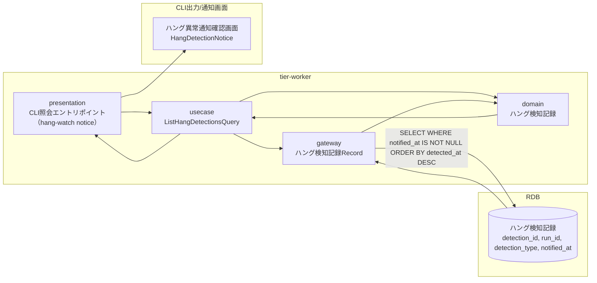
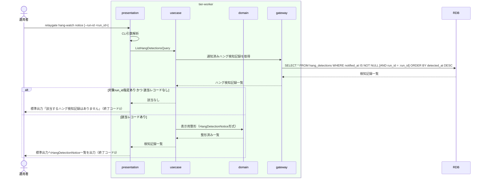

# ハング疑い・異常の通知を確認する

## 概要

運用者が通知済みのハング検知記録を参照し、異常検知種別・対象run_id・検知日時・しきい値・対象slotを確認して対応要否（中止依頼・リラン等）を判断する。

## データフロー



| レイヤー | データモデル | 変換内容 |
|---------|------------|---------|
| WK presentation | CLI引数（対象run_id/期間フィルタ、任意） | コマンド引数解析 → ListHangDetectionsQuery生成 |
| WK usecase | ListHangDetectionsQuery | 通知済みハング検知記録の取得フロー制御 |
| WK domain | ハング検知記録 | 検知日時降順の並び替え、表示用整形 |
| WK gateway | ハング検知記録 SELECT | 通知済みレコードの取得 |
| CLI出力 | ハング異常通知確認画面表示 | HangDetectionNoticeの一覧レンダリング |

## 処理フロー



## バリエーション一覧

| バリエーション名 | 値 | 処理内容 | 適用 tier | 適用箇所 |
|----------------|---|---------|----------|---------|
| 異常検知種別 | ハング疑い、background実行エラー、速報クロスチェック異常 | 一覧表示時のフィルター・ラベル表示に用いる | tier-worker | presentation「hang-watch notice」 |

## 分岐条件一覧

| 条件名 | 判定ルール | 適用 tier | 適用箇所 | BDD Scenario |
|--------|----------|----------|---------|-------------|
| run_id指定の有無 | --run-idオプションが指定された場合は当該run_idのみに絞り込む。未指定時は通知済み全件を検知日時降順で返す | tier-worker | usecase「ListHangDetectionsQuery」 | 対象run_idを指定してハング検知記録を確認する |

## 計算ルール一覧

該当なし（本UCは参照系であり計算ルールを持たない）

## 状態遷移一覧

該当なし（本UCはハング検知記録の状態を変更しない）

## 関連 RDRA モデル

| モデル種別 | 要素名 | 関連 |
|-----------|--------|------|
| 業務 | 実行監視業務 | このUCが属する業務 |
| BUC | ハング監視フロー | このUCを含むBUC |
| アクター | 運用者 | 通知を受け取り対応要否を判断するアクター |
| 情報 | ハング検知記録 | このUCが参照する情報 |

## E2E 完了条件（BDD）

### 正常系

```gherkin
Feature: ハング疑い・異常の通知を確認する

  Scenario: 通知済みのハング検知記録を全件確認する
    Given detection_id "det-20260817-001" のハング検知記録がdetection_type"ハング疑い"、notified_at"2026-08-17T09:36:00+09:00"で存在する
    And detection_id "det-20260817-002" のハング検知記録がdetection_type"速報クロスチェック異常"、notified_at"2026-08-17T10:05:00+09:00"で存在する
    When 運用者が"relaygate hang-watch notice"を実行する
    Then 標準出力にdetection_id"det-20260817-002"がdetection_id"det-20260817-001"より先に表示される（検知日時降順）
    And 終了コードが0で完了する

  Scenario: 対象run_idを指定してハング検知記録を確認する
    Given detection_id "det-20260817-001" のハング検知記録がrun_id"run-20260817-010"、notified_at設定済みで存在する
    When 運用者が"relaygate hang-watch notice --run-id run-20260817-010"を実行する
    Then 標準出力にdetection_id"det-20260817-001"の1件のみが表示される
    And 終了コードが0で完了する
```

### 異常系

```gherkin
  Scenario: 未通知のハング検知記録は確認対象に含まれない
    Given detection_id "det-20260817-005" のハング検知記録がnotified_at未設定で存在する
    When 運用者が"relaygate hang-watch notice"を実行する
    Then 標準出力にdetection_id"det-20260817-005"は表示されない

  Scenario: 指定したrun_idに該当するハング検知記録が存在しない
    Given run_id "run-20260817-999" に紐づくハング検知記録が存在しない
    When 運用者が"relaygate hang-watch notice --run-id run-20260817-999"を実行する
    Then 標準出力に「該当するハング検知記録はありません」が出力され終了コード0で完了する
```

## ティア別仕様

- [tier-worker（バックエンドワーカーティア）](tier-worker.md)
