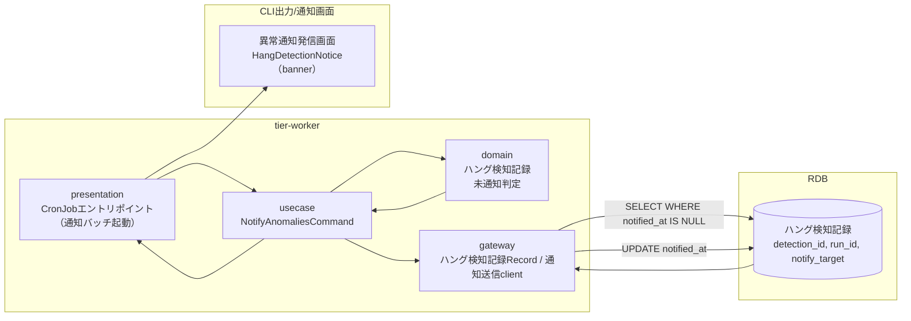
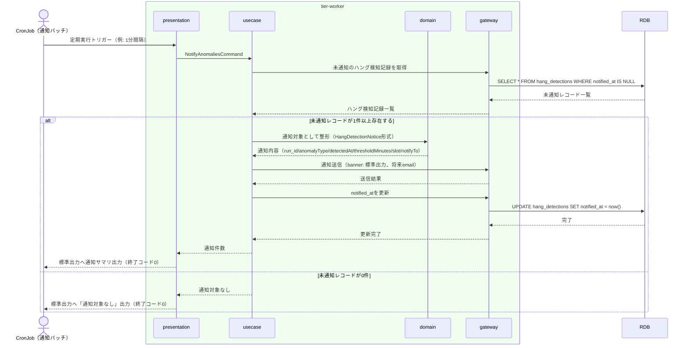

# ハング疑い・異常を運用者へ通知する

## 概要

検知済みのハング検知記録（未通知分）を対象に、移行運用責任者から運用者へ異常検知種別・対象run_id・検知日時・しきい値・対象slotを通知する。banner（CLI標準出力/将来ダッシュボード）とemail（将来のメール通知チャネル）の2 variantで同一の情報構造を用いる。

## データフロー



| レイヤー | データモデル | 変換内容 |
|---------|------------|---------|
| WK presentation | CronJobトリガー（通知バッチ間隔） | スケジュール起動 → NotifyAnomaliesCommand 生成 |
| WK usecase | NotifyAnomaliesCommand | 未通知のハング検知記録を取得し通知対象を集約 |
| WK domain | ハング検知記録 | notified_at IS NULL の未通知レコードのみ抽出 |
| WK gateway | ハング検知記録 UPDATE, 通知送信 | notified_at の記録更新、HangDetectionNotice形式での通知出力 |
| CLI出力 | 異常通知発信画面表示 | HangDetectionNotice（banner variant）のレンダリング |

## 処理フロー



## バリエーション一覧

| バリエーション名 | 値 | 処理内容 | 適用 tier | 適用箇所 |
|----------------|---|---------|----------|---------|
| 異常検知種別 | ハング疑い、background実行エラー、速報クロスチェック異常 | 通知メッセージ本文の異常種別ラベルを決定する | tier-worker | usecase「NotifyAnomaliesCommand」 |

## 分岐条件一覧

| 条件名 | 判定ルール | 適用 tier | 適用箇所 | BDD Scenario |
|--------|----------|----------|---------|-------------|
| notified_at未設定 | ハング検知記録のnotified_atがNULLの場合のみ通知対象とする（重複通知の防止） | tier-worker | usecase「NotifyAnomaliesCommand」 | 未通知のハング検知記録を運用者へ通知する |

## 計算ルール一覧

| 計算名 | 入力情報 | 計算式/ロジック | 出力情報 | 適用 tier |
|--------|---------|---------------|---------|----------|
| 通知対象抽出 | ハング検知記録.notified_at | notified_at IS NULL のレコードを全件抽出 | 通知対象一覧 | tier-worker |

## 状態遷移一覧

該当なし（本UCはハング検知記録の状態モデルを持たず、notified_atの有無で通知済み/未通知を管理する）

## 関連 RDRA モデル

| モデル種別 | 要素名 | 関連 |
|-----------|--------|------|
| 業務 | 実行監視業務 | このUCが属する業務 |
| BUC | ハング監視フロー | このUCを含むBUC |
| アクター | 移行運用責任者 | 検知した異常を運用者へ通知する主体 |
| アクター | 運用者 | 通知の受領者（通知先） |
| 情報 | ハング検知記録 | このUCが参照・notified_at更新する情報 |

## E2E 完了条件（BDD）

### 正常系

```gherkin
Feature: ハング疑い・異常を運用者へ通知する

  Scenario: 未通知のハング検知記録を運用者へ通知する
    Given detection_id "det-20260817-001" のハング検知記録がdetection_type"ハング疑い"、run_id"run-20260817-010"、notified_atが未設定で存在する
    When CronJobが通知バッチトリガーで起動する
    Then detection_id "det-20260817-001" のハング検知記録がHangDetectionNotice（banner）形式で運用者へ通知される
    And 同レコードのnotified_atが現在時刻で更新される

  Scenario: 通知対象が存在しない場合は正常終了する
    Given notified_atが未設定のハング検知記録が0件である
    When CronJobが通知バッチトリガーで起動する
    Then 標準出力に「通知対象なし」が出力され終了コード0で完了する
```

### 異常系

```gherkin
  Scenario: 通知送信の永続化失敗時はnotified_atを更新しない
    Given detection_id "det-20260817-004" のハング検知記録が未通知で存在する
    When 通知送信後のnotified_at更新でRDB接続断が発生する
    Then usecaseは技術例外を1回だけログ出力し終了コード1で終了する
    And 次回通知バッチ実行時に同レコードが再度通知対象として抽出される（冪等性の保証）
```

## ティア別仕様

- [tier-worker（バックエンドワーカーティア）](tier-worker.md)
