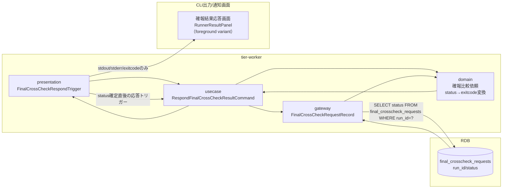
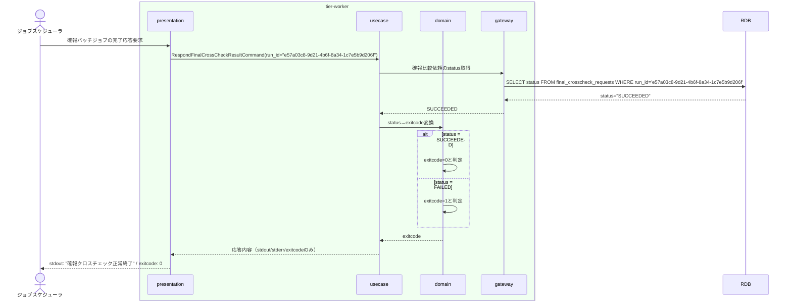

# 確報クロスチェック結果をstdout/stderr/exitcodeで応答する

## 概要

確報比較依頼がSUCCEEDED/FAILEDへ確定した後、runnerが比較結果・差分件数・レポートURIなどの詳細を含めず、標準出力・標準エラー・終了コードの3項目のみに限定してジョブスケジューラへ応答するUC。リリース判断の正本は本UCの応答契約に従い最小限の情報のみで構成される。

## データフロー



| レイヤー | データモデル | 変換内容 |
|---------|------------|---------|
| WK presentation | FinalCrossCheckRespondTrigger | status確定イベント → RespondCommand変換 |
| WK usecase | RespondFinalCrossCheckResultCommand | status→exitcode変換フロー制御、応答項目の限定 |
| WK domain | 確報比較依頼（status: SUCCEEDED/FAILED） | SUCCEEDED→exitcode 0、FAILED→exitcode 1への変換ルール適用 |
| CLI出力 | stdout/stderr/exitcodeのみ（差分件数・レポートURIを含めない） | ジョブスケジューラへの最終応答 |

## 処理フロー



## バリエーション一覧

| バリエーション名 | 値 | 処理内容 | 適用 tier | 適用箇所 |
|----------------|---|---------|----------|---------|
| クロスチェック種別 | 確報クロスチェック | 応答対象は確報比較依頼のstatusのみ（速報比較結果とは独立） | tier-worker | RespondFinalCrossCheckResultCommand |

## 分岐条件一覧

| 条件名 | 判定ルール | 適用 tier | 適用箇所 | BDD Scenario |
|--------|----------|----------|---------|-------------|
| status→exitcode変換 | status=SUCCEEDEDならexitcode 0、status=FAILEDならexitcode 1として応答する | tier-worker | RespondFinalCrossCheckResultCommand | 正常終了時にexitcode 0で応答する／異常終了時にexitcode 1で応答する |

## 計算ルール一覧

該当なし（本UCはstatusからexitcodeへの単純な値変換のみを行い、計算ルールを持たない）

## 状態遷移一覧

| 状態モデル | 遷移元 | 遷移先 | トリガー | 事前条件 | 事後処理 | 適用 tier |
|-----------|--------|--------|---------|---------|---------|----------|
| 確報比較依頼状態 | - | - | 本UCは状態を遷移させない（応答専用。SUCCEEDED/FAILED確定後に呼び出される） | statusがSUCCEEDEDまたはFAILEDに確定済み | stdout/stderr/exitcodeの応答のみ | tier-worker |

## 関連 RDRA モデル

| モデル種別 | 要素名 | 関連 |
|-----------|--------|------|
| 業務 | クロスチェック業務 | このUCが属する業務 |
| BUC | 確報クロスチェックフロー | このUCを含むBUC |
| アクター | 運用者 | 応答画面を確認するアクター |
| 情報 | 確報比較依頼 | 参照する情報 |
| 状態 | 確報比較依頼状態 | SUCCEEDED/FAILED確定後の応答 |
| 条件 | - | 該当なし |
| 外部システム | ジョブスケジューラ | 応答先の外部システム |

## E2E 完了条件（BDD）

### 正常系

```gherkin
Feature: 確報クロスチェック結果をstdout/stderr/exitcodeで応答する

  Scenario: SUCCEEDED状態の確報比較依頼が終了コード0で応答される
    Given execution_specs に run_id "e57a03c8-9d21-4b6f-8a34-1c7e5b9d206f"、job_id "daily-settlement"、job_map_version "v1.4.0"、hang_detect_limit_minutes 30 の行が存在する
    And 確報比較依頼 run_id "e57a03c8-9d21-4b6f-8a34-1c7e5b9d206f" の status が "SUCCEEDED" で確定している
    When ジョブスケジューラが確報バッチジョブの完了応答を要求する
    Then 標準出力に "確報クロスチェック正常終了" のみが出力され、終了コード 0 でジョブスケジューラへ応答する

  Scenario: FAILED状態の確報比較依頼が終了コード1で応答される
    Given execution_specs に run_id "e57a03c8-9d21-4b6f-8a34-1c7e5b9d206f"、job_id "daily-settlement"、job_map_version "v1.4.0"、hang_detect_limit_minutes 30 の行が存在する
    And 確報比較依頼 run_id "e57a03c8-9d21-4b6f-8a34-1c7e5b9d206f" の status が "FAILED" で確定している
    When ジョブスケジューラが確報バッチジョブの完了応答を要求する
    Then 標準エラーに "確報クロスチェック異常終了" のみが出力され、終了コード 1 でジョブスケジューラへ応答する
```

### 異常系

```gherkin
  Scenario: 応答時点でstatusが未確定（RUNNING）の場合は応答を保留する
    Given execution_specs に run_id "e57a03c8-9d21-4b6f-8a34-1c7e5b9d206f"、job_id "daily-settlement"、job_map_version "v1.4.0"、hang_detect_limit_minutes 30 の行が存在する
    And 確報比較依頼 run_id "e57a03c8-9d21-4b6f-8a34-1c7e5b9d206f" の status が "RUNNING" である
    When ジョブスケジューラが確報バッチジョブの完了応答を要求する
    Then 標準エラーに "確報クロスチェックが未完了です: run_id=e57a03c8-9d21-4b6f-8a34-1c7e5b9d206f" が出力され、終了コード 1 で応答する

  Scenario: 差分件数・レポートURIを応答に含めない制約が守られる
    Given execution_specs に run_id "e57a03c8-9d21-4b6f-8a34-1c7e5b9d206f"、job_id "daily-settlement"、job_map_version "v1.4.0"、hang_detect_limit_minutes 30 の行が存在する
    And 確報比較依頼 run_id "e57a03c8-9d21-4b6f-8a34-1c7e5b9d206f" の status が "FAILED" で確定し、差分件数やレポートURIに相当する情報は確報比較依頼に保持されていない
    When ジョブスケジューラが確報バッチジョブの完了応答を要求する
    Then 標準出力・標準エラーのいずれにも差分件数やレポートURIに相当する情報は一切含まれず、終了コード 1 のみで応答する
```

## ティア別仕様

- [tier-worker（バックエンドワーカーティア）](tier-worker.md)

### 統合 API Spec

- [CLI コマンド契約](../../../_cross-cutting/api/cli-command-contract.yaml)（全 UC 統合。HTTP APIは存在しないためOpenAPIは生成しない）
