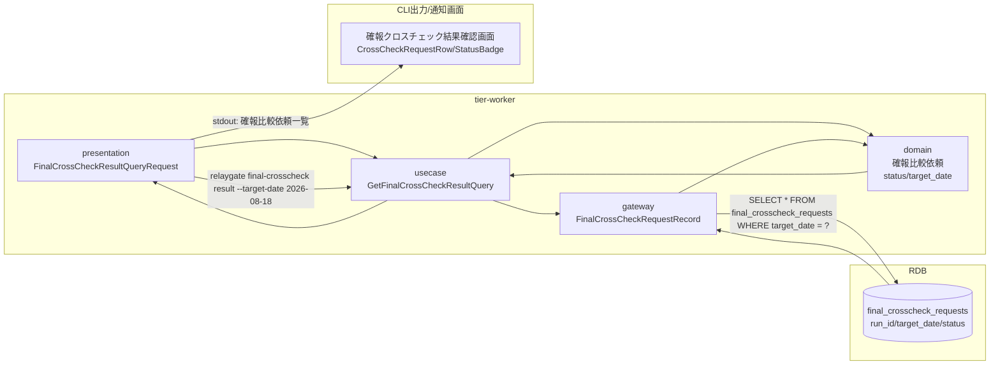
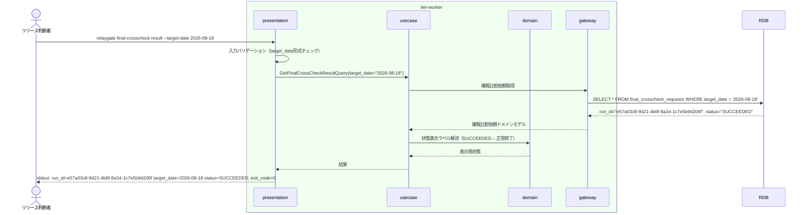

# 確報クロスチェック結果を確認する

## 概要

リリース判断者が日次で実行される確報比較依頼（対象日単位・全テーブル・全ファイル対象）の状態（SUCCEEDED/FAILED）をRDBから照会し、リリース判断の唯一の正本として確認するUC。比較結果・差分件数・レポートURIなどの詳細は保持・応答しない（確報比較依頼の応答契約はstdout/stderr/exitcodeの3項目に限定される）ため、本UCで確認できるのは確報比較依頼の状態（SUCCEEDED/FAILED/RUNNING等）・対象日・lease情報に限られる。

## データフロー



| レイヤー | データモデル | 変換内容 |
|---------|------------|---------|
| WK presentation | FinalCrossCheckResultQueryRequest(target_date) | CLI引数解析 → Query変換 |
| WK usecase | GetFinalCrossCheckResultQuery | 対象日の確報比較依頼を取得するクエリフロー制御 |
| WK gateway | SELECT run_id, target_date, status, lease_expires_at, worker_id FROM final_crosscheck_requests | 確報比較依頼レコードの取得 |
| CLI出力 | 確報比較依頼一覧（run_id/target_date/status/更新時刻） | リリース判断者向けの整形出力 |

## 処理フロー



## バリエーション一覧

| バリエーション名 | 値 | 処理内容 | 適用 tier | 適用箇所 |
|----------------|---|---------|----------|---------|
| クロスチェック種別 | 確報クロスチェック | 速報クロスチェックとは独立したfinal_crosscheck_requestsテーブルを参照する | tier-worker | GetFinalCrossCheckResultQuery |

## 分岐条件一覧

| 条件名 | 判定ルール | 適用 tier | 適用箇所 | BDD Scenario |
|--------|----------|----------|---------|-------------|
| 確報比較依頼状態 | statusがSUCCEEDED/FAILEDの場合は完了結果として表示し、REQUESTED/CLAIMED/RUNNINGの場合は未完了として表示する | tier-worker | GetFinalCrossCheckResultQuery | 確報クロスチェック結果を照会する |

## 計算ルール一覧

該当なし（本UCは参照系のみで計算ルールを持たない）

## 状態遷移一覧

| 状態モデル | 遷移元 | 遷移先 | トリガー | 事前条件 | 事後処理 | 適用 tier |
|-----------|--------|--------|---------|---------|---------|----------|
| 確報比較依頼状態 | - | - | 本UCは状態を遷移させない（参照専用） | - | - | tier-worker |

## 関連 RDRA モデル

| モデル種別 | 要素名 | 関連 |
|-----------|--------|------|
| 業務 | クロスチェック業務 | このUCが属する業務 |
| BUC | 確報クロスチェックフロー | このUCを含むBUC |
| アクター | リリース判断者 | 操作するアクター |
| 情報 | 確報比較依頼 | 参照する情報 |
| 状態 | 確報比較依頼状態 | 関連する状態遷移（参照のみ） |
| 条件 | - | 該当なし |
| 外部システム | - | 該当なし |

## E2E 完了条件（BDD）

### 正常系

```gherkin
Feature: 確報クロスチェック結果を確認する

  Scenario: 対象日の確報比較依頼がSUCCEEDEDの場合に結果を確認できる
    Given execution_specs に run_id "e57a03c8-9d21-4b6f-8a34-1c7e5b9d206f"、job_id "daily-settlement"、job_map_version "v1.4.0"、hang_detect_limit_minutes 30 の行が存在する
    And 対象日 "2026-08-18" の確報比較依頼 run_id "e57a03c8-9d21-4b6f-8a34-1c7e5b9d206f" が status "SUCCEEDED" で存在する
    When リリース判断者が `relaygate final-crosscheck result --target-date 2026-08-18` を実行する
    Then 標準出力に run_id "e57a03c8-9d21-4b6f-8a34-1c7e5b9d206f" と status "SUCCEEDED" が表示され、終了コード 0 で終了する

  Scenario: 対象日の確報比較依頼がFAILEDの場合に異常終了として結果を確認できる
    Given execution_specs に run_id "e57a03c8-9d21-4b6f-8a34-1c7e5b9d206f"、job_id "daily-settlement"、job_map_version "v1.4.0"、hang_detect_limit_minutes 30 の行が存在する
    And 対象日 "2026-08-18" の確報比較依頼 run_id "e57a03c8-9d21-4b6f-8a34-1c7e5b9d206f" が status "FAILED" で存在する
    When リリース判断者が `relaygate final-crosscheck result --target-date 2026-08-18` を実行する
    Then 標準出力に run_id "e57a03c8-9d21-4b6f-8a34-1c7e5b9d206f" と status "FAILED" が表示され、終了コード 0 で終了する
```

### 異常系

```gherkin
  Scenario: 対象日の確報比較依頼が未作成の場合はエラーとなる
    Given 対象日 "2026-08-18" の確報比較依頼が存在しない
    When リリース判断者が `relaygate final-crosscheck result --target-date 2026-08-18` を実行する
    Then 標準エラーに "確報比較依頼が見つかりません: target_date=2026-08-18" が出力され、終了コード 1 で終了する

  Scenario: target-dateの形式が不正な場合はバリデーションエラーとなる
    Given リリース判断者がコマンド引数に不正な日付文字列 "20260817" を指定する
    When `relaygate final-crosscheck result --target-date 20260817` を実行する
    Then 標準エラーに "target-dateはYYYY-MM-DD形式で指定してください" が出力され、終了コード 2 で終了する
```

## ティア別仕様

- [tier-worker（バックエンドワーカーティア）](tier-worker.md)

### 統合 API Spec

- [CLI コマンド契約](../../../_cross-cutting/api/cli-command-contract.yaml)（全 UC 統合。HTTP APIは存在しないためOpenAPIは生成しない）
