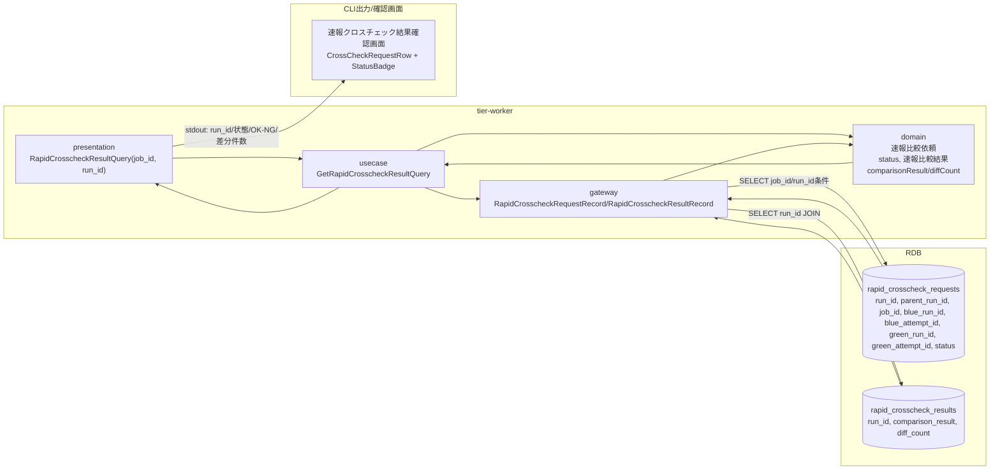
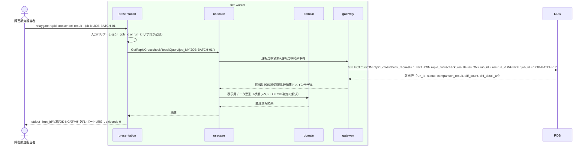

# 速報クロスチェック結果を確認する

## 概要

障害調査担当者が、ジョブ単位で非同期実行された速報クロスチェックの比較結果（OK/NG判定、差分件数、差分詳細レポートURI）を確認し、日次の確報比較を待たずに早期の差分検知に活用するUC。速報比較依頼・速報比較結果を参照専用（SELECT）で取得する。

## データフロー



| レイヤー | データモデル | 変換内容 |
|---------|------------|---------|
| worker presentation | RapidCrosscheckResultQuery(job_id, run_id) | CLI引数（対象job_id or run_id）をクエリDTOへ変換 |
| worker gateway | rapid_crosscheck_requests / rapid_crosscheck_results への SELECT | run_idで両テーブルをJOINしOK/NG判定・差分件数を取得 |
| Response | run_id/状態/comparison_result/diff_count/diff_detail_uri を標準出力へ整形 | 障害調査担当者が差分の有無を即座に把握できる表示用メッセージ |

## 処理フロー



## バリエーション一覧

| バリエーション名 | 値 | 処理内容 | 適用 tier | 適用箇所 |
|----------------|---|---------|----------|---------|
| クロスチェック種別 | 速報クロスチェック | CrossCheckRequestRowのvariantを`rapid`に固定し確報クロスチェック結果とは独立表示する | tier-worker | 速報クロスチェック結果確認画面 |

## 分岐条件一覧

本UCは参照専用（SELECT）であり、状態遷移や比較実行を伴う分岐条件は適用されない。表示切替は速報比較依頼状態（REQUESTED/CLAIMED/RUNNING/SUCCEEDED/FAILED/ABORTED）に応じたStatusBadgeの色分けのみで、条件.tsvに定義された条件（feature flag設定、hang_detect_limit_minutes）は本UCの処理対象外。

| 条件名 | 判定ルール | 適用 tier | 適用箇所 | BDD Scenario |
|--------|----------|----------|---------|-------------|
| 該当なし | - | - | - | - |

## 計算ルール一覧

本UCは既存データの参照・整形表示のみを行い、値の計算・集計は行わない。

| 計算名 | 入力情報 | 計算式/ロジック | 出力情報 | 適用 tier |
|--------|---------|---------------|---------|----------|
| 該当なし | - | - | - | - |

## 状態遷移一覧

本UCは速報比較依頼状態を変更しない（参照専用）。

| 状態モデル | 遷移元 | 遷移先 | トリガー | 事前条件 | 事後処理 | 適用 tier |
|-----------|--------|--------|---------|---------|---------|----------|
| 該当なし（本UCは状態遷移を伴わない） | - | - | - | - | - | - |

## 関連 RDRA モデル

| モデル種別 | 要素名 | 関連 |
|-----------|--------|------|
| 業務 | クロスチェック業務 | このUCが属する業務 |
| BUC | 速報クロスチェックフロー | このUCを含むBUC |
| アクター | 障害調査担当者 | 操作するアクター（社内・受益者） |
| 情報 | 速報比較結果 | 参照する情報（run_id, comparison_result, diff_count, diff_detail_uri, 比較完了日時） |
| 情報 | 速報比較依頼 | 参照する情報（run_id, parent_run_id, JOB_ID, blue_run_id/blue_attempt_id/green_run_id/green_attempt_id, status, lease期限, worker識別子） |
| 状態 | 速報比較依頼状態 | 参照する状態（REQUESTED/CLAIMED/RUNNING/SUCCEEDED/FAILED/ABORTED） |
| 条件 | 該当なし | 本UCは条件を適用しない |
| 外部システム | 該当なし | 本UCは外部システムと直接連携しない |

## E2E 完了条件（BDD）

### 正常系

```gherkin
Feature: 速報クロスチェック結果を確認する

  Scenario: SUCCEEDED状態の速報比較結果をjob_id指定で確認する
    Given execution_specs に run_id="3f8c9d2e-5b41-4a7e-9c13-6d2a8b0f1e57", job_id="daily-settlement" の行が存在する
    And rapid_crosscheck_requests に (run_id="c41d7e08-2b95-4f36-a8d1-5e7c93b204af", parent_run_id=NULL, job_id="daily-settlement", blue_run_id="3f8c9d2e-5b41-4a7e-9c13-6d2a8b0f1e57", blue_attempt_id="att-blue-0001", green_run_id="3f8c9d2e-5b41-4a7e-9c13-6d2a8b0f1e57", green_attempt_id="att-green-0001", status="SUCCEEDED") の行が存在する
    And rapid_crosscheck_results に (run_id="c41d7e08-2b95-4f36-a8d1-5e7c93b204af", comparison_result="OK", diff_count=0) の行が存在する
    When 障害調査担当者が `relaygate rapid-crosscheck result --job-id daily-settlement` を実行する
    Then 標準出力に run_id "c41d7e08-2b95-4f36-a8d1-5e7c93b204af"、状態 "SUCCEEDED"、判定 "OK"、差分件数 0 が表示され、終了コード 0 で終了する

  Scenario: FAILED状態の速報比較結果を差分件数付きで確認する
    Given execution_specs に run_id="3f8c9d2e-5b41-4a7e-9c13-6d2a8b0f1e57", job_id="daily-settlement" の行が存在する
    And rapid_crosscheck_requests に (run_id="c41d7e08-2b95-4f36-a8d1-5e7c93b204af", job_id="daily-settlement", blue_run_id="3f8c9d2e-5b41-4a7e-9c13-6d2a8b0f1e57", blue_attempt_id="att-blue-0001", green_run_id="3f8c9d2e-5b41-4a7e-9c13-6d2a8b0f1e57", green_attempt_id="att-green-0001", status="FAILED") の行が存在する
    And rapid_crosscheck_results に (run_id="c41d7e08-2b95-4f36-a8d1-5e7c93b204af", comparison_result="NG", diff_count=12, diff_detail_uri="file:///var/log/relaygate/diff/c41d7e08-2b95-4f36-a8d1-5e7c93b204af.json") の行が存在する
    When 障害調査担当者が `relaygate rapid-crosscheck result --job-id daily-settlement` を実行する
    Then 標準出力に判定 "NG"、差分件数 12、レポートURI "file:///var/log/relaygate/diff/c41d7e08-2b95-4f36-a8d1-5e7c93b204af.json" が表示され、終了コード 0 で終了する

  Scenario: リランで作成された依頼をparent_run_id付きで確認する
    Given execution_specs に run_id="3f8c9d2e-5b41-4a7e-9c13-6d2a8b0f1e57", job_id="daily-settlement" の行が存在する
    And rapid_crosscheck_requests に元依頼 (run_id="c41d7e08-2b95-4f36-a8d1-5e7c93b204af", parent_run_id=NULL, job_id="daily-settlement", status="FAILED") の行が存在する
    And rapid_crosscheck_requests にリラン依頼 (run_id="d92b6f13-4a08-4c57-91e6-2f8a5d3c7b60", parent_run_id="c41d7e08-2b95-4f36-a8d1-5e7c93b204af", job_id="daily-settlement", blue_run_id="3f8c9d2e-5b41-4a7e-9c13-6d2a8b0f1e57", blue_attempt_id="att-blue-0001", green_run_id="3f8c9d2e-5b41-4a7e-9c13-6d2a8b0f1e57", green_attempt_id="att-green-0001", status="REQUESTED") の行が存在する
    When 障害調査担当者が `relaygate rapid-crosscheck result --run-id d92b6f13-4a08-4c57-91e6-2f8a5d3c7b60` を実行する
    Then 標準出力に run_id "d92b6f13-4a08-4c57-91e6-2f8a5d3c7b60" と parent_run_id "c41d7e08-2b95-4f36-a8d1-5e7c93b204af"、状態 "REQUESTED" が表示され、終了コード 0 で終了する
    And 元依頼 run_id "c41d7e08-2b95-4f36-a8d1-5e7c93b204af" の status は "FAILED" のまま変更されない
```

### 異常系

```gherkin
  Scenario: 存在しないjob_idを指定した場合
    Given rapid_crosscheck_requests に job_id="unknown-job" の行が存在しない
    When 障害調査担当者が `relaygate rapid-crosscheck result --job-id unknown-job` を実行する
    Then 標準エラーに "対象job_idの速報比較依頼が見つかりません: unknown-job" が出力され、終了コード 1 で終了する

  Scenario: job_idもrun_idも指定しなかった場合
    When 障害調査担当者が `relaygate rapid-crosscheck result` を引数なしで実行する
    Then 標準エラーに "job_id または run_id のいずれかを指定してください" が出力され、終了コード 2 で終了する
```

## ティア別仕様

- [バックエンドワーカーティア](tier-worker.md)

### 統合 API Spec

- 本プロジェクトはHTTP APIを持たない。コマンド契約は `_cross-cutting/api/cli-command-contract.yaml`（全UC統合、Contract First開発用）を参照
