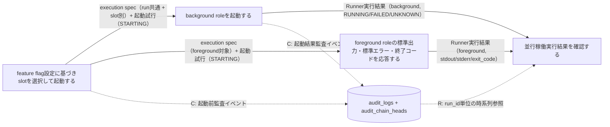
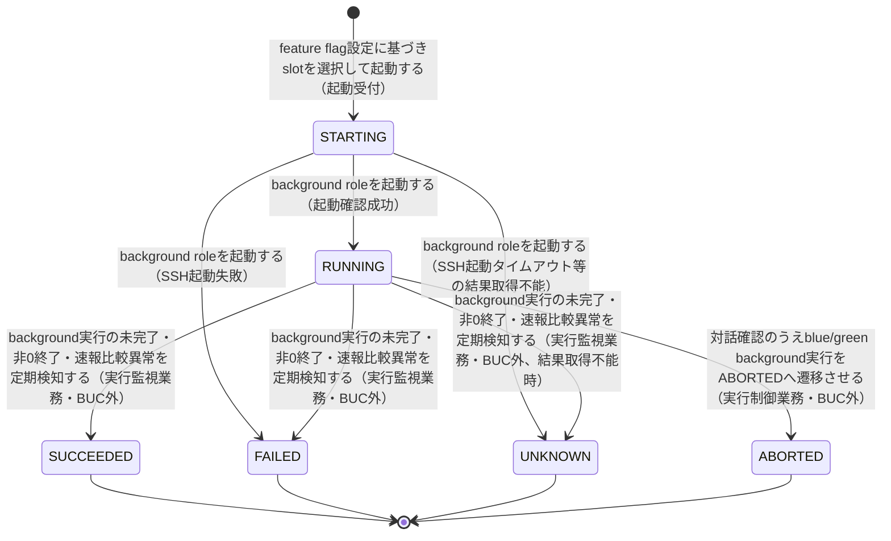

# 並行稼働実行フロー

## 概要

feature flag設定（BLUE_MODE/GREEN_MODE/RAPID_CROSSCHECK_MODE）に基づきblue/green実装のslotを選択して起動し、background roleを非同期実行、foreground roleの標準出力・標準エラー・終了コードのみをジョブスケジューラへ応答する。execution specはrun共通（execution_specs）とslot別（slot_execution_specs）に分離して起動時に一度だけ確定し、起動試行はrunner_result_events（append-only履歴）とrunner_results（snapshot）へ(run_id, slot_type, role_type, attempt_id)のidentityで記録する。実行設定のINSERT・STARTING記録・起動前監査イベント（audit_logs + audit_chain_heads）の追記は同一transactionでcommitし、commitできない場合は外部slotを起動しない（起動前監査ゲート）。移行運用責任者はRunner実行結果を確認し、段階的切替の判断材料とする。

## 所属 UC 一覧

| UC名 | アクター | 主な操作 | 関連情報 |
|------|---------|---------|---------|
| [feature flag設定に基づきslotを選択して起動する](feature flag設定に基づきslotを選択して起動する/spec.md) | 運用者（ジョブスケジューラ起動契機） | feature flag設定を参照しexecution spec（run共通 + slot別）を確定・起動試行をSTARTINGで記録・起動前監査を追記のうえblue/green起動 | execution-spec.json、Runner実行結果、audit_logs |
| [background roleを起動する](background roleを起動する/spec.md) | 運用者 | background対象slotの起動トリガー送出・非同期実行開始（STARTING→RUNNING。起動失敗はFAILED、結果取得不能はUNKNOWN） | execution-spec.json、Runner実行結果、audit_logs |
| [foreground roleの標準出力・標準エラー・終了コードを応答する](foreground roleの標準出力・標準エラー・終了コードを応答する/spec.md) | 運用者（ジョブスケジューラ） | foreground役割の最新試行（attempt_no最大）の実行結果を3項目に限定してジョブスケジューラへ中継 | Runner実行結果 |
| [並行稼働実行結果を確認する](並行稼働実行結果を確認する/spec.md) | 移行運用責任者 | blue/green双方の起動試行（attempt_id/attempt_no）と実行状態をslot別に横並び確認。必要に応じて履歴・監査イベントをrun_id単位で時系列参照 | Runner実行結果、audit_logs |

## UC 横断データフロー

feature flag設定に基づく起動UCがrun共通execution spec（execution_specs）とslot別実行設定（slot_execution_specs）を確定し、起動試行をSTARTINGで記録する。それを起点にbackground起動UCが起動試行をRUNNING（失敗時FAILED、結果取得不能時UNKNOWN）へ遷移させ、foreground応答UCがforeground試行の結果を参照する。各状態遷移はrunner_result_eventsへの履歴INSERTとrunner_resultsのsnapshot UPSERTを同一transactionで行い、監査イベントはaudit_chain_headsのrun_id行を排他ロックして直列化のうえaudit_logsへ追記する。移行運用責任者向けの確認UCは両者のRunner実行結果と履歴・監査イベントを横断的に参照する。

### データフロー図

### 情報 CRUD マトリクス

| 情報名 | feature flag設定に基づきslotを選択して起動する | background roleを起動する | foreground roleの標準出力・標準エラー・終了コードを応答する | 並行稼働実行結果を確認する |
|--------|:-------:|:-------:|:-------:|:-------:|
| execution-spec.json（execution_specs + slot_execution_specs） | C | R | R | R |
| Runner実行結果（runner_result_events 履歴 + runner_results snapshot） | C（STARTING記録） | C/U（履歴INSERT + snapshot UPSERT） | R | R |
| audit_logs（+ audit_chain_heads） | C | C | | R |

## 状態遷移全体図

Runner実行状態は6値（STARTING/RUNNING/SUCCEEDED/FAILED/UNKNOWN/ABORTED）をとる。起動UCが起動試行をSTARTINGで受け付け、background起動UCがRUNNING（起動失敗時FAILED、SSH起動タイムアウト等の結果取得不能時UNKNOWN。推測でFAILEDを確定しない）へ遷移させる。RUNNING以降のSUCCEEDED/FAILED/UNKNOWNへの確定（ハング監視業務が担当）とABORTEDへの遷移（実行制御業務のblue/green中止フローが担当。対話確認による明示的操作でのみ発生）は本BUCの範囲外だが、業務全体の状態遷移経路の起点として明示する。

### 状態遷移 UC マッピング

| 状態モデル | 遷移元 | 遷移先 | 担当 UC |
|-----------|--------|--------|--------|
| Runner実行状態 | (未作成) | STARTING | [feature flag設定に基づきslotを選択して起動する](feature flag設定に基づきslotを選択して起動する/spec.md)（未記録の場合の冪等INSERTは[background roleを起動する](background roleを起動する/spec.md)も担う） |
| Runner実行状態 | STARTING | RUNNING | [background roleを起動する](background roleを起動する/spec.md) |
| Runner実行状態 | STARTING | FAILED | [background roleを起動する](background roleを起動する/spec.md)（SSH起動失敗） |
| Runner実行状態 | STARTING | UNKNOWN | [background roleを起動する](background roleを起動する/spec.md)（結果取得不能。推測でFAILEDを確定しない） |
| Runner実行状態 | RUNNING | RUNNING（参照のみ、状態変化なし） | [並行稼働実行結果を確認する](並行稼働実行結果を確認する/spec.md) |

補足: RUNNING→SUCCEEDED/FAILED/UNKNOWNはハング監視業務「background実行の未完了・非0終了・速報比較異常を定期検知する」、RUNNING→ABORTEDは実行制御業務「blue中止フロー」「green中止フロー」（対話確認による明示的操作のみ）がそれぞれ担当し、本BUCの所属UCではない。

## BUC 内共有条件一覧

| 条件名 | 条件の説明 | 適用 UC |
|--------|----------|--------|
| feature flag設定（BLUE_MODE/GREEN_MODE/RAPID_CROSSCHECK_MODE） | BLUE_MODE/GREEN_MODEはforeground/background/offのいずれかを設定し、両方を同時にforegroundにする組み合わせは許可しない。RAPID_CROSSCHECK_MODEはon/offで速報クロスチェックの有効・無効を切り替える | feature flag設定に基づきslotを選択して起動する（判定・分岐条件として適用）、background roleを起動する（判定結果であるslotモードをバリエーションとして参照） |
| 起動前監査ゲート | 起動試行のSTARTING記録（runner_result_events + runner_results）と起動前監査イベントのaudit_logs INSERT・audit_chain_heads更新を同一transactionでcommitできない場合は、外部slotを起動しない | feature flag設定に基づきslotを選択して起動する, background roleを起動する |

## BUC 内共有バリエーション一覧

| バリエーション名 | 値 | 適用 UC |
|----------------|---|--------|
| slotモード（BLUE_MODE/GREEN_MODE） | off、background、foreground | feature flag設定に基づきslotを選択して起動する、background roleを起動する |
| slot種別 | blue、green | 並行稼働実行結果を確認する、background roleを起動する |
| role区分 | foreground、background、rapid-crosscheck | 並行稼働実行結果を確認する、foreground roleの標準出力・標準エラー・終了コードを応答する |
