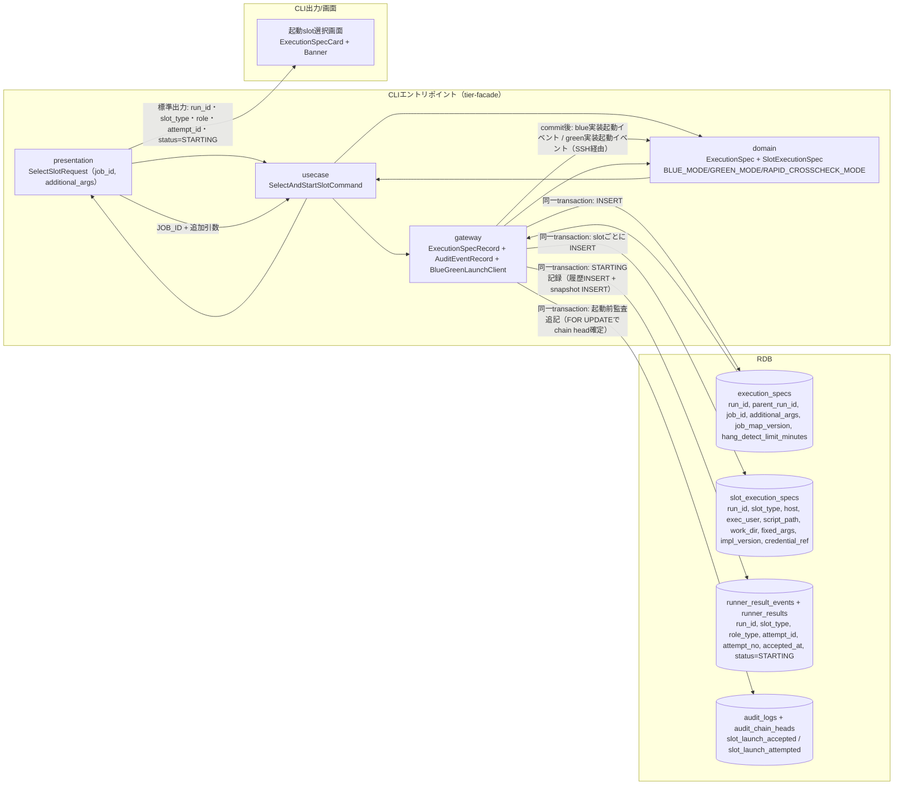
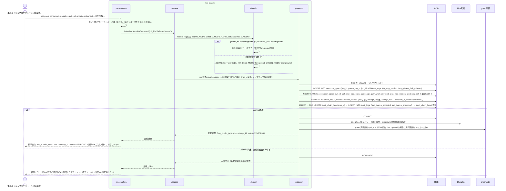

# feature flag設定に基づきslotを選択して起動する

## 概要

運用者（実体はジョブスケジューラからfacadeが起動される契機）が、feature flag設定（BLUE_MODE/GREEN_MODE/RAPID_CROSSCHECK_MODE）を参照し、blue/green実装のうちどちらのslotをどの役割（foreground/background/off）で起動するかを判定し、run共通のexecution spec（execution_specs）とslot別実行設定（slot_execution_specs）を一度だけ確定して保存したうえで起動する。BLUE_MODE/GREEN_MODEを同時にforegroundにする組み合わせは拒否する。実行設定のINSERT・起動試行のSTARTING記録・起動前監査イベントの追記は同一transactionでcommitし、commitできない場合は外部slotを起動しない（起動前監査ゲート）。

## データフロー



| レイヤー | データモデル | 変換内容 |
|---------|------------|---------|
| CLI presentation | SelectSlotRequest(job_id, additional_args) | ジョブスケジューラ由来のJOB_ID・追加引数のCLI解析 → Command変換 |
| CLI usecase | SelectAndStartSlotCommand | ジョブマップ解決 → feature flag判定 → run共通execution spec + slot別実行設定の確定 → 起動前監査ゲート → 起動 |
| CLI gateway | execution_specs + slot_execution_specs のINSERT、runner_result_events + runner_results のSTARTING記録、audit_logs + audit_chain_heads の追記（同一transaction）+ SSH経由起動 | run共通/slot別実行設定レコード作成、起動前監査イベント追記、blue/green実装への起動イベント送出 |
| Response | run_id・slot_type・role・attempt_id・status=STARTING（選択slotごとに1行） | 移行運用責任者の並行稼働実行結果確認への入力となる |

## 処理フロー



## バリエーション一覧

| バリエーション名 | 値 | 処理内容 | 適用 tier | 適用箇所 |
|----------------|---|---------|----------|---------|
| slotモード（BLUE_MODE/GREEN_MODE） | off、background、foreground | 各slotをどの役割で起動するかを決定する | tier-facade | `relaygate concurrent-run select-slot` のslot選択ロジック |
| RAPID_CROSSCHECK_MODE | on、off | offの場合は完了通知送信・速報管理DB接続/書込みを行わない起動フラグをexecution specに記録する | tier-facade | run共通execution spec確定処理 |
| 運用モード | 並行稼働、新実装単独本番、次世代実装との並行稼働 | ジョブ定義を変更せずBLUE_MODE/GREEN_MODEの組み合わせのみで表現される運用フェーズの区分。BLUE_MODE=foreground・GREEN_MODE=background（またはその逆）は「並行稼働」、BLUE_MODE=off・GREEN_MODE=foregroundは「新実装単独本番」、GREEN_MODE=foregroundかつ将来追加される次世代実装slotがbackground稼働する構成は「次世代実装との並行稼働」に対応する。本UCはこの区分そのものを判定・記録するものではなく、BLUE_MODE/GREEN_MODEの値を確定させることで運用モードを間接的に表現する | tier-facade | run共通execution spec確定処理（BLUE_MODE/GREEN_MODEの値の組み合わせとして表現） |

## 分岐条件一覧

| 条件名 | 判定ルール | 適用 tier | 適用箇所 | BDD Scenario |
|--------|----------|----------|---------|-------------|
| feature flag設定（BLUE_MODE/GREEN_MODE/RAPID_CROSSCHECK_MODE） | BLUE_MODE/GREEN_MODEはforeground/background/offのいずれかを設定する。両方を同時にforegroundにする組み合わせは許可しない。RAPID_CROSSCHECK_MODEはon/offを設定し、offの場合は完了通知送信・速報管理DB接続/書込みを行わない | tier-facade | `relaygate concurrent-run select-slot` のslot選択・起動ロジック | BLUE_MODE/GREEN_MODE同時foregroundを拒否する |
| 起動前監査ゲート | execution_specs / slot_execution_specs のINSERT、runner_result_events + runner_results のSTARTING記録、起動前監査イベント（slot_launch_accepted / slot_launch_attempted）のaudit_logs INSERTとaudit_chain_heads更新を同一transactionでcommitできない場合は、外部slotを起動しない | tier-facade | `relaygate concurrent-run select-slot` の起動処理 | 起動前監査の追記に失敗した場合は外部slotを起動しない |

## 計算ルール一覧

該当なし（本UCはfeature flag設定値の参照とexecution spec確定処理が中心であり、数値計算は発生しない）。

## 状態遷移一覧

| 状態モデル | 遷移 | トリガー | 適用 tier |
|-----------|------|---------|----------|
| Runner実行状態（STARTING/RUNNING/SUCCEEDED/FAILED/UNKNOWN/ABORTED） | (未作成) → STARTING | 選択slotごとの起動受付（runner_result_eventsへのattempt_started INSERTとrunner_resultsのsnapshot INSERTを同一transactionで実行） | tier-facade |

STARTING以降の遷移（STARTING→RUNNING等）は後続UC「background roleを起動する」が担う。

## 関連 RDRA モデル

| モデル種別 | 要素名 | 関連 |
|-----------|--------|------|
| 業務 | 並行稼働実行業務 | このUCが属する業務 |
| BUC | 並行稼働実行フロー | このUCを含むBUC |
| アクター | 運用者 | 操作するアクター |
| 情報 | execution-spec.json | 作成・確定する情報（run共通のexecution_specsとslot別のslot_execution_specsに分離して保存する） |
| 状態 | Runner実行状態 | 選択slotごとの起動受付でSTARTINGを記録する（STARTING以降の遷移は「background roleを起動する」UCの責務） |
| 条件 | feature flag設定（BLUE_MODE/GREEN_MODE/RAPID_CROSSCHECK_MODE） | 適用される条件 |
| 外部システム | blue実装、green実装 | 連携する外部システム（起動イベント送出先） |

## E2E 完了条件（BDD）

### 正常系

```gherkin
Feature: feature flag設定に基づきslotを選択して起動する

  Scenario: BLUE_MODE=foreground, GREEN_MODE=backgroundでblue/green両slotを起動する
    Given 環境変数に BLUE_MODE=foreground, GREEN_MODE=background, RAPID_CROSSCHECK_MODE=on, RELAYGATE_OPERATOR=ops-tanaka が設定されている
    And ジョブマップ v1.4.0 で job_id "daily-settlement" が blue（host=blue-host-01, exec_user=batchuser, work_dir=/opt/relaygate/work, impl_version=blue-2.3.1）と green（host=green-host-01, exec_user=batchuser, work_dir=/opt/relaygate/work, impl_version=green-0.9.0）に解決できる
    And ジョブマップの hang_detect_limit_minutes が 30 である
    And run_id発番が "3f8c9d2e-5b41-4a7e-9c13-6d2a8b0f1e57" を、attempt_id発番が blue="att-blue-0001" / green="att-green-0001" を返すよう固定されている
    When 運用者が `relaygate concurrent-run select-slot --job-id daily-settlement` を実行する
    Then 終了コード 0 で終了する
    And execution_specs に run_id="3f8c9d2e-5b41-4a7e-9c13-6d2a8b0f1e57", parent_run_id=NULL, job_id="daily-settlement", job_map_version="v1.4.0", hang_detect_limit_minutes=30 の1行がINSERTされる
    And slot_execution_specs に (run_id="3f8c9d2e-5b41-4a7e-9c13-6d2a8b0f1e57", slot_type="blue", host="blue-host-01", impl_version="blue-2.3.1") と (run_id="3f8c9d2e-5b41-4a7e-9c13-6d2a8b0f1e57", slot_type="green", host="green-host-01", impl_version="green-0.9.0") の2行がINSERTされる
    And runner_results に (run_id="3f8c9d2e-5b41-4a7e-9c13-6d2a8b0f1e57", slot_type="blue", role_type="foreground", attempt_id="att-blue-0001", attempt_no=1, status="STARTING") と (run_id="3f8c9d2e-5b41-4a7e-9c13-6d2a8b0f1e57", slot_type="green", role_type="background", attempt_id="att-green-0001", attempt_no=1, status="STARTING") の2行が accepted_at 付きでINSERTされる
    And runner_result_events に対応する event_name="attempt_started", status="STARTING" の履歴が同一transactionでINSERTされる
    And audit_logs に (run_id="3f8c9d2e-5b41-4a7e-9c13-6d2a8b0f1e57", event_name="slot_launch_accepted", slot="-", attempt_id="-", actor="ops-tanaka", operation="slot_launch", outcome="accepted", schema_version="1.0") の起動前監査イベントがINSERTされ、audit_chain_heads の run_id 行が更新される
    And 標準出力に run_id="3f8c9d2e-5b41-4a7e-9c13-6d2a8b0f1e57" の blue/foreground/att-blue-0001/STARTING 行と green/background/att-green-0001/STARTING 行が出力される

  Scenario: RAPID_CROSSCHECK_MODE=offの場合は速報管理DBへ接続しない
    Given 環境変数に BLUE_MODE=foreground, GREEN_MODE=background, RAPID_CROSSCHECK_MODE=off, RELAYGATE_OPERATOR=ops-tanaka が設定されている
    And ジョブマップ v1.4.0 で job_id "daily-settlement" が解決できる
    And run_id発番が "3f8c9d2e-5b41-4a7e-9c13-6d2a8b0f1e57" を返すよう固定されている
    When 運用者が `relaygate concurrent-run select-slot --job-id daily-settlement` を実行する
    Then 終了コード 0 で終了する
    And rapid_crosscheck_requests へのINSERTは発生しない

  Scenario: BLUE_MODE=off, GREEN_MODE=foregroundで新実装単独本番の運用モードとして起動する
    Given 環境変数に BLUE_MODE=off, GREEN_MODE=foreground, RAPID_CROSSCHECK_MODE=off, RELAYGATE_OPERATOR=ops-tanaka が設定されている
    And ジョブマップ v1.4.0 で job_id "daily-settlement" が green（host=green-host-01, impl_version=green-0.9.0）に解決できる
    And run_id発番が "3f8c9d2e-5b41-4a7e-9c13-6d2a8b0f1e57" を、attempt_id発番が "att-green-0001" を返すよう固定されている
    When 運用者が `relaygate concurrent-run select-slot --job-id daily-settlement` を実行する
    Then 終了コード 0 で終了する
    And execution_specs に run_id="3f8c9d2e-5b41-4a7e-9c13-6d2a8b0f1e57" の1行が、slot_execution_specs に slot_type="green" の1行のみがINSERTされる
    And runner_results に (run_id="3f8c9d2e-5b41-4a7e-9c13-6d2a8b0f1e57", slot_type="green", role_type="foreground", attempt_id="att-green-0001", attempt_no=1, status="STARTING") の1行がINSERTされる
    And 標準出力に green/foreground/att-green-0001/STARTING の1行のみが出力される（運用モード: 新実装単独本番に相当する組み合わせ）

  Scenario: background roleを先に起動しforeground待機中もbackgroundが並走する
    Given 環境変数に BLUE_MODE=foreground, GREEN_MODE=background, RAPID_CROSSCHECK_MODE=on, RELAYGATE_OPERATOR=ops-tanaka が設定されている
    And ジョブマップ v1.4.0 で job_id "daily-settlement" が blue（host=blue-host-01, impl_version=blue-2.3.1）と green（host=green-host-01, impl_version=green-0.9.0）に解決できる
    And run_id発番が "3f8c9d2e-5b41-4a7e-9c13-6d2a8b0f1e57" を、attempt_id発番が blue="att-blue-0001" / green="att-green-0001" を返すよう固定されている
    And blue実装のforeground実行が完了まで60秒かかる状態である
    When 運用者が `relaygate concurrent-run select-slot --job-id daily-settlement` を実行する
    Then green実装へのbackground起動イベント（非同期起動トリガー）が、blue実装へのforeground起動イベント（同期実行）より先に送出される
    And blue foreground実行の待機中に、runner_results の (run_id="3f8c9d2e-5b41-4a7e-9c13-6d2a8b0f1e57", slot_type="green", role_type="background", attempt_id="att-green-0001") が status="RUNNING" で並走している
    And blue foreground実行の完了を待ってから終了コード 0 で終了し、green background実行の完了は待たない

  Scenario: job mapの固定引数の後ろに追加引数を順序を変えず連結する
    Given 環境変数に BLUE_MODE=foreground, GREEN_MODE=background, RAPID_CROSSCHECK_MODE=on, RELAYGATE_OPERATOR=ops-tanaka が設定されている
    And ジョブマップ v1.4.0 で job_id "daily-settlement" の blue の fixed_args が ["--mode", "batch"] に定義されている
    And run_id発番が "3f8c9d2e-5b41-4a7e-9c13-6d2a8b0f1e57" を返すよう固定されている
    When 運用者が `relaygate concurrent-run select-slot --job-id daily-settlement -- --target-date 2026-08-18 --retry 3` を実行する
    Then execution_specs の run_id="3f8c9d2e-5b41-4a7e-9c13-6d2a8b0f1e57" 行の additional_args に "--target-date 2026-08-18 --retry 3" が保存される
    And slot_execution_specs の (run_id="3f8c9d2e-5b41-4a7e-9c13-6d2a8b0f1e57", slot_type="blue") 行の fixed_args に "--mode batch" が保存される
    And blue実装への起動イベントの引数列が "--mode batch --target-date 2026-08-18 --retry 3"（固定引数→追加引数の順、順序・値とも改変なし）で構成される

  Scenario: runner設定の差し替えのみで新世代実装を起動できる（facade本体は無変更）
    Given 環境変数に BLUE_MODE=off, GREEN_MODE=foreground, RAPID_CROSSCHECK_MODE=off, RELAYGATE_OPERATOR=ops-tanaka が設定されている
    And ジョブマップが v1.5.0 に更新され、job_id "daily-settlement" の green が host=green-host-01, exec_user=batchuser, script_path=/opt/green-next/run.sh, work_dir=/opt/relaygate/work, impl_version=green-1.0.0 に差し替えられている
    And facade本体のコード・設定はジョブマップ以外に一切変更されていない
    And run_id発番が "3f8c9d2e-5b41-4a7e-9c13-6d2a8b0f1e57" を、attempt_id発番が "att-green-0001" を返すよう固定されている
    When 運用者が `relaygate concurrent-run select-slot --job-id daily-settlement` を実行する
    Then 終了コード 0 で終了する
    And slot_execution_specs に (run_id="3f8c9d2e-5b41-4a7e-9c13-6d2a8b0f1e57", slot_type="green", script_path="/opt/green-next/run.sh", impl_version="green-1.0.0") の1行がINSERTされる
    And green実装への起動イベントは slot_execution_specs の host / exec_user / script_path / work_dir / fixed_args / credential_ref の値のみから構成され、facadeは実装固有の起動方式差異（実装名・バージョンによる分岐）を参照しない
```

### 異常系

```gherkin
  Scenario: BLUE_MODEとGREEN_MODEが同時にforegroundに設定されている
    Given 環境変数に BLUE_MODE=foreground, GREEN_MODE=foreground, RAPID_CROSSCHECK_MODE=on, RELAYGATE_OPERATOR=ops-tanaka が設定されている
    When 運用者が `relaygate concurrent-run select-slot --job-id daily-settlement` を実行する
    Then 終了コード 2 で終了する
    And 標準エラーに "BLUE_MODEとGREEN_MODEを同時にforegroundにすることはできません" が出力される
    And execution_specs・slot_execution_specs・runner_results・audit_logs へのINSERTは発生しない

  Scenario: JOB_IDに対応するジョブマップが存在しない
    Given 環境変数に BLUE_MODE=foreground, GREEN_MODE=background, RAPID_CROSSCHECK_MODE=on, RELAYGATE_OPERATOR=ops-tanaka が設定されている
    And job_id "unknown-job" がジョブマップ v1.4.0 に存在しない
    When 運用者が `relaygate concurrent-run select-slot --job-id unknown-job` を実行する
    Then 終了コード 1 で終了する
    And 標準エラーに "JOB_IDに対応するジョブマップが見つかりません: unknown-job" が出力される

  Scenario: 起動前監査の追記に失敗した場合は外部slotを起動しない
    Given 環境変数に BLUE_MODE=foreground, GREEN_MODE=background, RAPID_CROSSCHECK_MODE=on, RELAYGATE_OPERATOR=ops-tanaka が設定されている
    And ジョブマップ v1.4.0 で job_id "daily-settlement" が解決できる
    And audit_logs へのINSERTが失敗する状態になっている
    When 運用者が `relaygate concurrent-run select-slot --job-id daily-settlement` を実行する
    Then 終了コード 1 で終了する
    And 標準エラーに起動前監査の追記失敗の原因と次アクションが出力される
    And execution_specs・slot_execution_specs・runner_results・runner_result_events へのINSERTはrollbackされ残らない
    And blue実装・green実装への起動イベントは送出されない
```

## ティア別仕様

- [tier-facade](tier-facade.md)

### 統合 API Spec

- [CLI コマンド契約](../../_cross-cutting/api/cli-command-contract.yaml)（全 UC 統合、CLI/ファイル/DB契約の正本）
- [監査イベント契約](../../_cross-cutting/api/audit-event-contract.yaml)（監査イベントのフィールド・hash-chain lock契約の正本）
