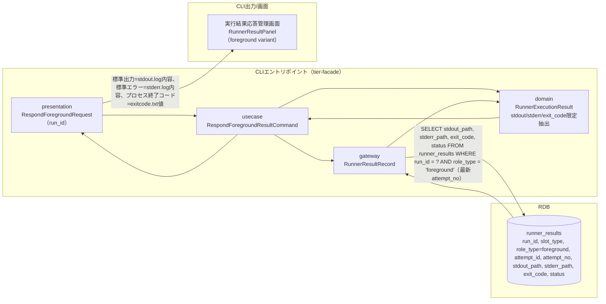
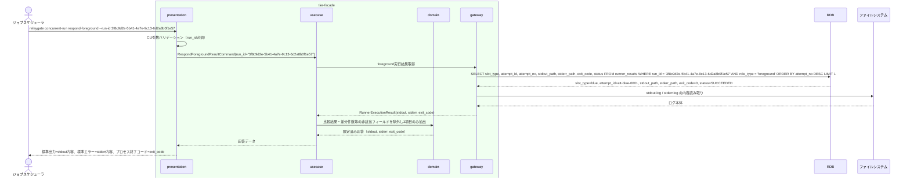

# foreground roleの標準出力・標準エラー・終了コードを応答する

## 概要

facadeが、foreground役割に割り当てられたslot（blue/green）の実行結果（標準出力・標準エラー・終了コード）だけをジョブスケジューラへ中継する。比較結果・差分件数・レポートURIなどの詳細情報は一切含めず、Runner Result Contractに従って標準化された3項目のみを応答する。実行結果は起動試行identity（run_id, slot_type, role_type, attempt_id）で管理されたrunner_results snapshotから、対象run_idのforeground役割の最新試行（attempt_no最大）を参照する。

## データフロー



| レイヤー | データモデル | 変換内容 |
|---------|------------|---------|
| CLI presentation | RespondForegroundRequest(run_id) | foreground実行完了待機・引数解析 |
| CLI usecase | RespondForegroundResultCommand | foreground実行完了検知 → 結果限定抽出フロー制御 |
| CLI gateway | runner_resultsへのSELECT | foreground role実行結果（最新試行のsnapshot）の取得（stdout_path/stderr_path/exit_code/status） |
| Response | 標準出力・標準エラー・終了コードのみ | ジョブスケジューラが受け取る唯一の応答形式 |

## 処理フロー



## バリエーション一覧

| バリエーション名 | 値 | 処理内容 | 適用 tier | 適用箇所 |
|----------------|---|---------|----------|---------|
| role区分 | foreground、background、rapid-crosscheck | role_type='foreground'のレコードのみを応答対象として抽出する | tier-facade | `relaygate concurrent-run respond-foreground` のクエリ条件 |
| 実行状態 | STARTING、RUNNING、SUCCEEDED、FAILED、UNKNOWN、ABORTED | SUCCEEDED/FAILEDのみ応答可能。STARTING/RUNNING/UNKNOWN/ABORTEDは未確定・応答不能として業務エラーとする | tier-facade | 応答可否判定 |

## 分岐条件一覧

| 条件名 | 判定ルール | 適用 tier | 適用箇所 | BDD Scenario |
|--------|----------|----------|---------|-------------|
| 応答可否判定 | 最新試行のstatusがSUCCEEDED/FAILED（exitcode.txt回収済み）の場合のみexit_codeを応答する。STARTING/RUNNINGは未確定、UNKNOWNは結果取得不能、ABORTEDは中止済みとしていずれも業務エラーとする（UNKNOWNを推測でFAILED相当の終了コードに変換しない） | tier-facade | `relaygate concurrent-run respond-foreground` の応答判定 | foreground実行結果がまだ確定していない |

## 計算ルール一覧

該当なし。

## 状態遷移一覧

該当なし（本UCはforeground役割のRunner実行結果を参照・応答するのみであり、RDRA BUC.tsv上も状態モデルとの関連はない）。

## 関連 RDRA モデル

| モデル種別 | 要素名 | 関連 |
|-----------|--------|------|
| 業務 | 並行稼働実行業務 | このUCが属する業務 |
| BUC | 並行稼働実行フロー | このUCを含むBUC |
| アクター | 運用者 | 操作するアクター |
| 情報 | Runner実行結果（started-at.txt/stdout.log/stderr.log/exitcode.txt） | 参照する情報 |
| 状態 | なし | - |
| 条件 | なし | - |
| 外部システム | ジョブスケジューラ | 連携する外部システム（応答先） |

## E2E 完了条件（BDD）

### 正常系

```gherkin
Feature: foreground roleの標準出力・標準エラー・終了コードを応答する

  Scenario: foreground実行結果を標準出力・標準エラー・終了コードのみで応答する
    Given execution_specs に run_id="3f8c9d2e-5b41-4a7e-9c13-6d2a8b0f1e57", job_id="daily-settlement" の行が存在する
    And slot_execution_specs に (run_id="3f8c9d2e-5b41-4a7e-9c13-6d2a8b0f1e57", slot_type="blue", host="blue-host-01") の行が存在する
    And runner_results に (run_id="3f8c9d2e-5b41-4a7e-9c13-6d2a8b0f1e57", slot_type="blue", role_type="foreground", attempt_id="att-blue-0001", attempt_no=1, status="SUCCEEDED", exit_code=0) の行がstdout_path/stderr_path付きで存在する
    When ジョブスケジューラが `relaygate concurrent-run respond-foreground --run-id 3f8c9d2e-5b41-4a7e-9c13-6d2a8b0f1e57` を実行する
    Then プロセス終了コードは 0 である
    And 標準出力にstdout.logの内容がそのまま出力される
    And 標準エラーにstderr.logの内容がそのまま出力される
    And 比較結果・差分件数・レポートURIなどの詳細情報は一切出力されない
```

### 異常系

```gherkin
  Scenario: foreground実行結果がまだ確定していない
    Given execution_specs・slot_execution_specs に run_id="3f8c9d2e-5b41-4a7e-9c13-6d2a8b0f1e57" の blue slot 一式が存在する
    And runner_results に (run_id="3f8c9d2e-5b41-4a7e-9c13-6d2a8b0f1e57", slot_type="blue", role_type="foreground", attempt_id="att-blue-0001", attempt_no=1, status="RUNNING", exit_code=NULL) の行が存在する
    When ジョブスケジューラが `relaygate concurrent-run respond-foreground --run-id 3f8c9d2e-5b41-4a7e-9c13-6d2a8b0f1e57` を実行する
    Then 終了コード 1 で終了する
    And 標準エラーに "foreground実行結果が未確定です: run_id=3f8c9d2e-5b41-4a7e-9c13-6d2a8b0f1e57" が出力される

  Scenario: foreground実行結果がUNKNOWN（結果取得不能）の場合は応答しない
    Given execution_specs・slot_execution_specs に run_id="3f8c9d2e-5b41-4a7e-9c13-6d2a8b0f1e57" の blue slot 一式が存在する
    And runner_results に (run_id="3f8c9d2e-5b41-4a7e-9c13-6d2a8b0f1e57", slot_type="blue", role_type="foreground", attempt_id="att-blue-0001", attempt_no=1, status="UNKNOWN", exit_code=NULL) の行が存在する
    When ジョブスケジューラが `relaygate concurrent-run respond-foreground --run-id 3f8c9d2e-5b41-4a7e-9c13-6d2a8b0f1e57` を実行する
    Then 終了コード 1 で終了する
    And 標準エラーに "foreground実行結果が未確定です: run_id=3f8c9d2e-5b41-4a7e-9c13-6d2a8b0f1e57" が出力される（UNKNOWNを推測でFAILEDとして応答しない）

  Scenario: run_id未指定でバリデーションエラーになる
    When ジョブスケジューラが `relaygate concurrent-run respond-foreground` を引数なしで実行する
    Then 終了コード 2 で終了する
    And 標準エラーに "run_id を指定してください" が出力される
```

## ティア別仕様

- [tier-facade](tier-facade.md)

### 統合 API Spec

- [CLI コマンド契約](../../_cross-cutting/api/cli-command-contract.yaml)（全 UC 統合、CLI/ファイル/DB契約の正本）
