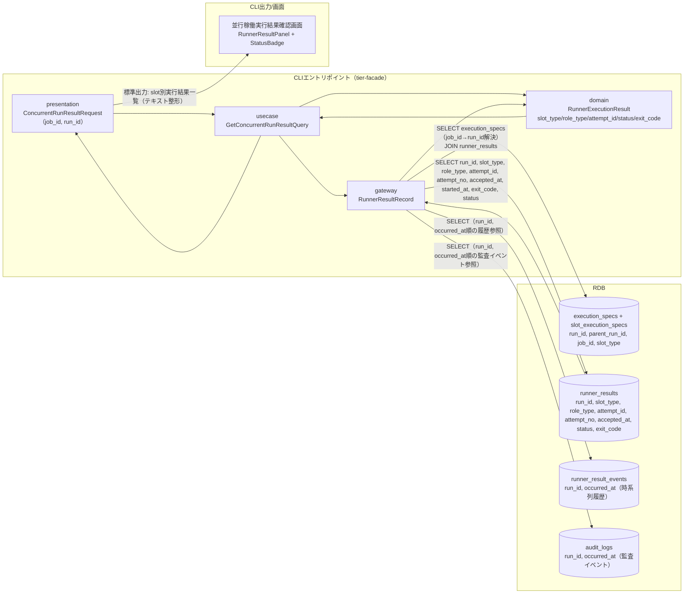
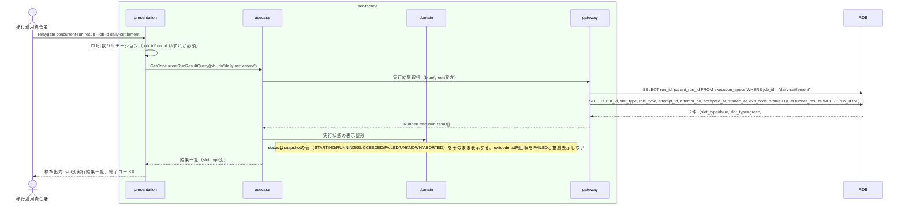

# 並行稼働実行結果を確認する

## 概要

移行運用責任者が、blue/green並行稼働の実行結果（Runner実行結果: started-at.txt/stdout.log/stderr.log/exitcode.txt）を確認し、段階的切替の判断材料とする。CLIコマンドの実行結果として、slot（blue/green）ごとの起動試行（attempt_id/attempt_no）と実行状態（STARTING/RUNNING/SUCCEEDED/FAILED/UNKNOWN/ABORTED）を横並びで参照できる。必要に応じてrunner_result_eventsの履歴とaudit_logsの監査イベントをrun_id単位で時系列に参照できる。

## データフロー



| レイヤー | データモデル | 変換内容 |
|---------|------------|---------|
| CLI presentation | ConcurrentRunResultRequest(job_id, run_id) | CLI引数解析 + バリデーション → Query変換 |
| CLI usecase | GetConcurrentRunResultQuery | job_id→execution_specs解決 → blue/green双方の起動試行snapshot取得フロー制御 |
| CLI gateway | execution_specs / slot_execution_specs / runner_results / runner_result_events / audit_logs への SELECT | run_id/job_idによるRunner実行結果・履歴・監査イベントの取得 |
| CLI出力 | slot別実行結果一覧（stdout整形テキスト） | 移行運用責任者が判読しやすいよう slot_type ごとに区切って表示 |

## 処理フロー



## バリエーション一覧

| バリエーション名 | 値 | 処理内容 | 適用 tier | 適用箇所 |
|----------------|---|---------|----------|---------|
| slot種別 | blue、green | 出力時にslot_typeごとにセクション分割して表示する | tier-facade | `relaygate concurrent-run result` の標準出力整形 |
| role区分 | foreground、background、rapid-crosscheck | role_typeごとに実行結果を区別して表示する | tier-facade | `relaygate concurrent-run result` の標準出力整形 |
| 実行状態 | STARTING、RUNNING、SUCCEEDED、FAILED、UNKNOWN、ABORTED | snapshotのstatus値をそのまま表示する | tier-facade | `relaygate concurrent-run result` の標準出力整形 |

## 分岐条件一覧

該当なし（本UCは参照系のため業務条件による分岐は発生しない。実行状態の確定はUC「background roleを起動する」「background実行の未完了・非0終了・速報比較異常を定期検知する」等の更新系UCの責務であり、本UCはrunner_resultsのstatus値をそのまま表示する）。

## 計算ルール一覧

| 計算名 | 入力情報 | 計算式/ロジック | 出力情報 | 適用 tier |
|--------|---------|---------------|---------|----------|
| 実行状態表示 | runner_results.status, runner_results.exit_code | snapshotのstatus（STARTING/RUNNING/SUCCEEDED/FAILED/UNKNOWN/ABORTED）をそのまま表示用ラベルとする。exit_codeがNULL（未完了・UNKNOWN）の場合は '-' を表示する。UNKNOWNをFAILEDと推測して表示しない | 表示用ラベル | tier-facade |

## 状態遷移一覧

| 状態モデル | 遷移元 | 遷移先 | トリガー | 事前条件 | 事後処理 | 適用 tier |
|-----------|--------|--------|---------|---------|---------|----------|
| Runner実行状態 | - | - | 並行稼働実行結果を確認する | Runner実行結果が存在すること | 状態遷移は発生しない（参照のみ） | tier-facade |

## 関連 RDRA モデル

| モデル種別 | 要素名 | 関連 |
|-----------|--------|------|
| 業務 | 並行稼働実行業務 | このUCが属する業務 |
| BUC | 並行稼働実行フロー | このUCを含むBUC |
| アクター | 移行運用責任者 | 操作するアクター |
| 情報 | Runner実行結果（started-at.txt/stdout.log/stderr.log/exitcode.txt）、execution-spec.json | 参照する情報 |
| 状態 | Runner実行状態 | 関連する状態遷移（参照のみ） |
| 条件 | なし | - |
| 外部システム | なし | - |

## E2E 完了条件（BDD）

### 正常系

```gherkin
Feature: 並行稼働実行結果を確認する

  Scenario: blue/green両slotの実行結果を確認する
    Given execution_specs に run_id="3f8c9d2e-5b41-4a7e-9c13-6d2a8b0f1e57", job_id="daily-settlement", job_map_version="v1.4.0" の行が存在する
    And slot_execution_specs に (run_id="3f8c9d2e-5b41-4a7e-9c13-6d2a8b0f1e57", slot_type="blue", impl_version="blue-2.3.1") と (run_id="3f8c9d2e-5b41-4a7e-9c13-6d2a8b0f1e57", slot_type="green", impl_version="green-0.9.0") の行が存在する
    And runner_results に (run_id="3f8c9d2e-5b41-4a7e-9c13-6d2a8b0f1e57", slot_type="blue", role_type="foreground", attempt_id="att-blue-0001", attempt_no=1, status="SUCCEEDED", exit_code=0) の行が存在する
    And runner_results に (run_id="3f8c9d2e-5b41-4a7e-9c13-6d2a8b0f1e57", slot_type="green", role_type="background", attempt_id="att-green-0001", attempt_no=1, status="RUNNING", exit_code=NULL) の行が存在する
    When 移行運用責任者が `relaygate concurrent-run result --job-id daily-settlement` を実行する
    Then 終了コード 0 で終了する
    And 標準出力に slot_type="blue", attempt_id="att-blue-0001", status="SUCCEEDED", exit_code=0 を含む行が出力される
    And 標準出力に slot_type="green", attempt_id="att-green-0001", status="RUNNING", exit_code="-" を含む行が出力される

  Scenario: run_id指定で単一runの実行結果を確認する
    Given execution_specs に run_id="3f8c9d2e-5b41-4a7e-9c13-6d2a8b0f1e57", job_id="daily-settlement" の行が存在する
    And slot_execution_specs に (run_id="3f8c9d2e-5b41-4a7e-9c13-6d2a8b0f1e57", slot_type="blue") の行が存在する
    And runner_results に (run_id="3f8c9d2e-5b41-4a7e-9c13-6d2a8b0f1e57", slot_type="blue", role_type="background", attempt_id="att-blue-0001", attempt_no=1, status="FAILED", exit_code=1) の行が存在する
    When 移行運用責任者が `relaygate concurrent-run result --run-id 3f8c9d2e-5b41-4a7e-9c13-6d2a8b0f1e57` を実行する
    Then 終了コード 0 で終了する
    And 標準出力に status="FAILED", exit_code=1 を含む行が出力される

  Scenario: UNKNOWN状態の起動試行をUNKNOWNのまま表示する
    Given execution_specs に run_id="3f8c9d2e-5b41-4a7e-9c13-6d2a8b0f1e57", job_id="daily-settlement" の行と slot_execution_specs の green 行が存在する
    And runner_results に (run_id="3f8c9d2e-5b41-4a7e-9c13-6d2a8b0f1e57", slot_type="green", role_type="background", attempt_id="att-green-0001", attempt_no=1, status="UNKNOWN", exit_code=NULL) の行が存在する
    When 移行運用責任者が `relaygate concurrent-run result --run-id 3f8c9d2e-5b41-4a7e-9c13-6d2a8b0f1e57` を実行する
    Then 終了コード 0 で終了する
    And 標準出力に status="UNKNOWN", exit_code="-" を含む行が出力される（FAILEDとして表示しない）
```

### 異常系

```gherkin
  Scenario: job_idにもrun_idにも一致するRunner実行結果が存在しない
    Given execution_specs に job_id="unknown-job" の行が存在しない
    When 移行運用責任者が `relaygate concurrent-run result --job-id unknown-job` を実行する
    Then 終了コード 1 で終了する
    And 標準エラーに "該当するRunner実行結果が見つかりません: job_id=unknown-job" が出力される

  Scenario: job_id・run_idのいずれも指定されない
    When 移行運用責任者が `relaygate concurrent-run result` を引数なしで実行する
    Then 終了コード 2 で終了する
    And 標準エラーに "job_id または run_id のいずれかを指定してください" が出力される
```

## ティア別仕様

- [tier-facade](tier-facade.md)

### 統合 API Spec

- [CLI コマンド契約](../../_cross-cutting/api/cli-command-contract.yaml)（全 UC 統合、CLI/ファイル/DB契約の正本）
