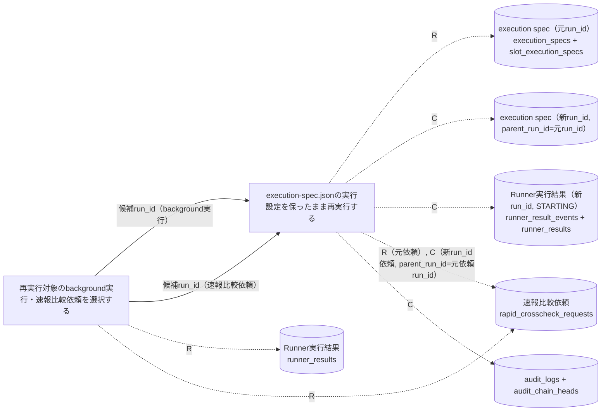
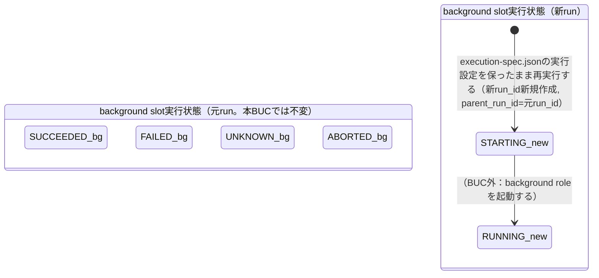
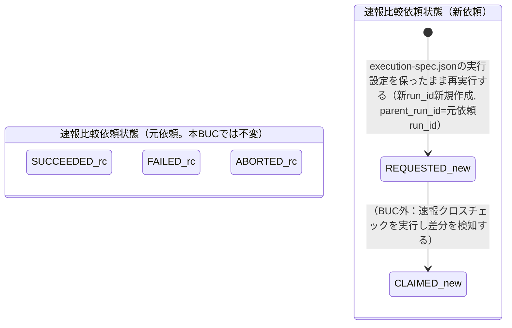

# background側リランフロー

## 概要

終了状態（SUCCEEDED/FAILED/UNKNOWN/ABORTED）のbackground実行（Runner実行結果, E-002）および終了状態（SUCCEEDED/FAILED/ABORTED）の速報比較依頼（E-003）から、運用者が再実行対象を選定し、元のexecution-spec.json（AG-001）の実行設定を保ったまま再実行するBUC。再実行は**新しいrun_idの新規作成 + parent_run_idによる元への関連付け**として行い、元のレコード・状態・履歴は一切変更しない（CTP-004実行系譜トレーサビリティ）。tier-facadeとtier-workerの双方に処理が分岐する。

## 所属 UC 一覧

| UC名 | アクター | 主な操作 | 関連情報 |
|------|---------|---------|---------|
| [再実行対象のbackground実行・速報比較依頼を選択する](再実行対象のbackground実行・速報比較依頼を選択する/spec.md) | 運用者 | 終了状態のbackground実行（tier-facade。SUCCEEDED/FAILED/UNKNOWN/ABORTED）または速報比較依頼（tier-worker。SUCCEEDED/FAILED/ABORTED）を`--target`オプションで切り替えて一覧提示する（状態遷移なし）。STARTING/RUNNING中は候補から除外する | Runner実行結果、速報比較依頼 |
| [execution-spec.jsonの実行設定を保ったまま再実行する](execution-spec.jsonの実行設定を保ったまま再実行する/spec.md) | 運用者 | 選定したrun_idを対象に、background実行は新run_idでexecution spec（run共通 + slot別）を複製して新規runを起動、速報比較依頼は新run_idの依頼をREQUESTEDで新規作成する。いずれもparent_run_idで元へ関連付け、元のレコード・状態・履歴は変更しない | execution-spec.json（AG-001）、Runner実行結果、速報比較依頼、audit_logs |

## UC 横断データフロー

前UCが提示した候補一覧（run_id、slot/target種別、attempt_id/attempt_no、状態、受付日時）を運用者が確認し、後UCの`--run-id`引数へ入力する。tier-facade側は元のexecution_specs / slot_execution_specsを新run_id（parent_run_id=元run_id）で複製し、起動試行（runner_result_events + runner_results、STARTING、attempt_no=1）と起動前監査イベント（rerun_requested / slot_launch_attempted）を同一transactionで新規作成してからcommit後にSSH起動する（起動前監査ゲート）。tier-worker側は元依頼の比較対象4項目（blue_run_id/blue_attempt_id/green_run_id/green_attempt_id）を複製した新run_id（parent_run_id=元依頼run_id）の依頼をREQUESTEDで新規作成する。元run・元依頼のレコードはいずれも変更しない。

### データフロー図

### 情報 CRUD マトリクス

| 情報名 | 再実行対象のbackground実行・速報比較依頼を選択する | execution-spec.jsonの実行設定を保ったまま再実行する |
|--------|:--------------------:|:--------------------------------------------------:|
| execution-spec.json（execution_specs + slot_execution_specs, AG-001） | | R（元設定取得）, C（新run_id・parent_run_id=元run_idで複製） |
| Runner実行結果（runner_result_events 履歴 + runner_results snapshot） | R（候補抽出） | C（新run_idの起動試行をSTARTINGで新規作成。元runは不変） |
| 速報比較依頼 | R（候補抽出） | R（元依頼参照）, C（新run_idの依頼をREQUESTEDで新規作成。元依頼は不変） |
| audit_logs（+ audit_chain_heads） | | C（rerun_requested / slot_launch_attempted / rerun_accepted） |

## 状態遷移全体図

BUC内には2つの独立した状態モデル（background slot実行状態、速報比較依頼状態）が関与する。「再実行対象のbackground実行・速報比較依頼を選択する」は状態遷移を発生させない。「execution-spec.jsonの実行設定を保ったまま再実行する」も**既存レコードの状態は遷移させず**、新run_id（parent_run_id=元run_id）の新規作成遷移のみを発生させる。元の実行・依頼の終了状態はそのまま保たれる。

### 状態遷移 UC マッピング

| 状態モデル | 遷移元 | 遷移先 | 担当 UC |
|-----------|--------|--------|--------|
| background slot実行状態 | - | - | [再実行対象のbackground実行・速報比較依頼を選択する](再実行対象のbackground実行・速報比較依頼を選択する/spec.md)（状態遷移は発生させず、候補一覧提示のみ） |
| 速報比較依頼状態 | - | - | [再実行対象のbackground実行・速報比較依頼を選択する](再実行対象のbackground実行・速報比較依頼を選択する/spec.md)（状態遷移は発生させず、候補一覧提示のみ） |
| background slot実行状態 | -（新規作成） | STARTING | [execution-spec.jsonの実行設定を保ったまま再実行する](execution-spec.jsonの実行設定を保ったまま再実行する/spec.md)（新run_id・parent_run_id=元run_id。元runの終了状態SUCCEEDED/FAILED/UNKNOWN/ABORTEDは変更しない） |
| 速報比較依頼状態 | -（新規作成） | REQUESTED | [execution-spec.jsonの実行設定を保ったまま再実行する](execution-spec.jsonの実行設定を保ったまま再実行する/spec.md)（新run_id・parent_run_id=元依頼run_id。元依頼の終了状態SUCCEEDED/FAILED/ABORTEDは変更しない） |

## BUC 内共有条件一覧

該当なし（「再実行対象のbackground実行・速報比較依頼を選択する」の条件はリラン対象選定可否（background実行）／リラン対象選定可否（速報比較依頼）、「execution-spec.jsonの実行設定を保ったまま再実行する」の条件はbackground実行リラン可否／速報比較依頼リラン可否／起動前監査ゲートであり、名称・適用箇所が異なる別条件のため、2つ以上のUCで共有される条件は無い）

## BUC 内共有バリエーション一覧

| バリエーション名 | 値 | 適用 UC |
|----------------|---|--------|
| slot種別 | blue、green | 再実行対象のbackground実行・速報比較依頼を選択する, execution-spec.jsonの実行設定を保ったまま再実行する |
| role区分 | background | 再実行対象のbackground実行・速報比較依頼を選択する, execution-spec.jsonの実行設定を保ったまま再実行する |
| クロスチェック種別 | 速報クロスチェック | 再実行対象のbackground実行・速報比較依頼を選択する, execution-spec.jsonの実行設定を保ったまま再実行する |
