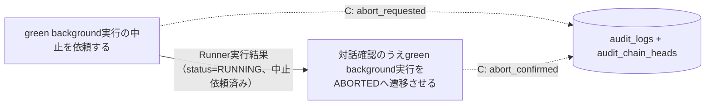
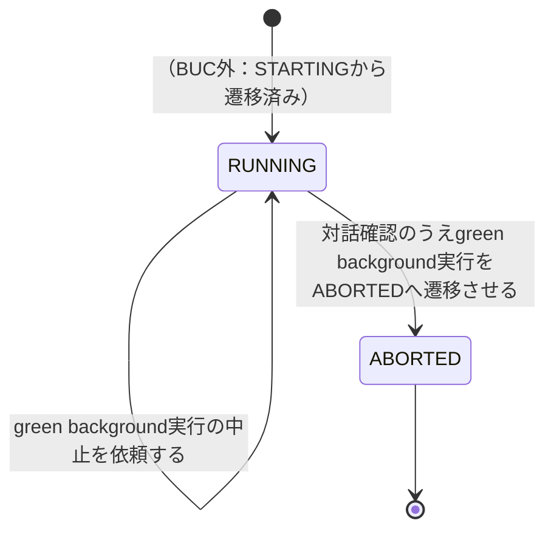

# green中止フロー

## 概要

停止確認済みのgreen background実行について、運用者が中止を発意して中止依頼を発行し、対話確認（y/n二択、取消不可の明示）により実プロセスの停止を確認したうえでgreen background slot実行状態を明示的にABORTEDへ遷移させる。

## 所属 UC 一覧

| UC名 | アクター | 主な操作 | 関連情報 |
|------|---------|---------|---------|
| [green background実行の中止を依頼する](green background実行の中止を依頼する/spec.md) | 運用者 | RUNNING中のgreen background実行に中止依頼を発行し、green実装へ中止依頼イベントを送出。受理・拒否を監査イベント（abort_requested）として記録 | Runner実行結果、audit_logs |
| [対話確認のうえgreen background実行をABORTEDへ遷移させる](対話確認のうえgreen background実行をABORTEDへ遷移させる/spec.md) | 運用者 | 対話確認（y/n）により実プロセス停止を確認し、状態をABORTEDへ更新・監査イベント（abort_confirmed）記録・中止指示イベント送出 | Runner実行結果、audit_logs |

## UC 横断データフロー

中止依頼UCが対象起動試行（identity = run_id, slot_type='green', role_type='background', attempt_id）の妥当性（status=RUNNING）を判定してgreen実装へ中止依頼イベントを送出し、受理・拒否を監査イベントabort_requested（operation=abort、outcome=accepted/rejected）としてaudit_logsへ追記する。後続の対話確認UCがその依頼を前提に対話確認を経て、runner_result_eventsへの履歴INSERT（attempt_aborted）とrunner_resultsのsnapshot UPSERT（status=ABORTED）を同一transactionで実行し、監査イベントabort_confirmed（operation=abort、outcome=succeeded/rejected）をaudit_logsへ追記する。監査イベントの追記はいずれもaudit_chain_headsのrun_id行を排他ロックして直列化する（hash-chain lock契約）。

### データフロー図

### 情報 CRUD マトリクス

| 情報名 | green background実行の中止を依頼する | 対話確認のうえgreen background実行をABORTEDへ遷移させる |
|--------|:-------:|:-------:|
| Runner実行結果（runner_result_events 履歴 + runner_results snapshot） | R | U（履歴INSERT + snapshot UPSERTを同一transaction） |
| audit_logs（+ audit_chain_heads） | C（abort_requested） | C（abort_confirmed） |

## 状態遷移全体図

background slot実行状態は6値（STARTING/RUNNING/SUCCEEDED/FAILED/UNKNOWN/ABORTED）をとる。中止依頼はRUNNING中の起動試行のみ受理し、ABORTEDへの遷移は対話確認による明示的操作でのみ発生する（hang-detector等による自動遷移は行わない）。

### 状態遷移 UC マッピング

| 状態モデル | 遷移元 | 遷移先 | 担当 UC |
|-----------|--------|--------|--------|
| background slot実行状態 | RUNNING | RUNNING（状態は変化しない、中止依頼と監査記録のみ） | [green background実行の中止を依頼する](green background実行の中止を依頼する/spec.md) |
| background slot実行状態 | RUNNING | ABORTED | [対話確認のうえgreen background実行をABORTEDへ遷移させる](対話確認のうえgreen background実行をABORTEDへ遷移させる/spec.md)（対話確認による明示的操作でのみ遷移） |

## BUC 内共有条件一覧

該当なし（両UCとも「分岐条件一覧」はRDRA条件.tsvに定義された業務条件には該当せず、状態モデルの前提条件・CLI操作フロー制御として個別UC Spec側に記載されている）。

## BUC 内共有バリエーション一覧

| バリエーション名 | 値 | 適用 UC |
|----------------|---|--------|
| slot種別 | blue、green | green background実行の中止を依頼する、対話確認のうえgreen background実行をABORTEDへ遷移させる（いずれもslot_type='green'に限定するフィルタ条件として適用） |
